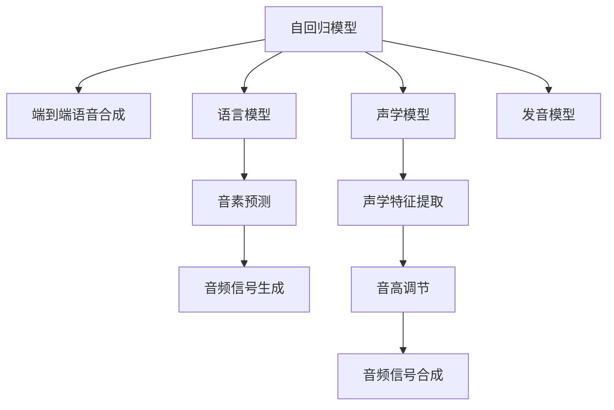

                 

# 大模型在语音合成中的应用挑战

大模型在语音合成领域的应用已经取得了一些进展，但面临的挑战依然不容小觑。本文将从背景介绍、核心概念、算法原理、项目实践、应用场景、资源推荐、总结和展望等方面，详细探讨大模型在语音合成中的应用挑战，并为读者提供深入的理论和技术支持。

## 1. 背景介绍

### 1.1 问题由来
语音合成（Text-to-Speech，TTS）技术是指将文本转换成自然语音，其应用广泛，涵盖了智能助手、语音导航、电话客服、有声读物等多个领域。大模型在语音合成中主要指使用深度神经网络模型对语音信号进行生成。其中，基于自回归模型（如Transformer模型）的端到端语音合成方法尤为突出，因其具有无需音素转换、高质量合成等优点，被广泛应用于商业和学术研究。

### 1.2 问题核心关键点
大模型在语音合成中的应用核心关键点包括以下几个方面：

1. **数据集**：语音合成模型需要大量的文本与语音对齐数据集进行训练。
2. **模型结构**：主要采用自回归模型，如Transformer、ResNet等。
3. **技术挑战**：语音合成中的关键技术包括语言建模、声学建模、发音模型等。
4. **性能评估**：需要考虑自然度、流畅度、清晰度等多方面指标。

## 2. 核心概念与联系

### 2.1 核心概念概述
- **自回归模型**：如Transformer、GRU、RNN等，常用于语音合成。
- **端到端语音合成**：模型直接将文本映射到语音信号，无需中间音素转换。
- **语言模型**：用于预测下一个单词，是语音合成中的重要组成部分。
- **声学模型**：用于将语言模型中的文字转换为语音信号。
- **发音模型**：控制声音的音色、音调、语速等，使语音合成更加自然。

这些核心概念通过Mermaid流程图（如图）展示了它们之间的联系：



这个流程图展示了自回归模型通过语言模型、声学模型和发音模型，最终将文本转换为语音信号的全过程。

## 3. 核心算法原理 & 具体操作步骤

### 3.1 算法原理概述

语音合成的核心算法原理基于深度学习中的自回归模型，特别是Transformer模型。其主要步骤如下：

1. **输入文本预处理**：将文本转换为模型可接受的格式，如将中文转换为拼音。
2. **语言模型预测**：使用语言模型预测下一个字符或音素。
3. **声学模型映射**：将预测的音素转换为声学特征。
4. **音频信号生成**：将声学特征映射为最终的音频信号。

### 3.2 算法步骤详解

#### 3.2.1 输入文本预处理
输入文本需要经过分词、音素转换等预处理步骤。以中文为例，中文分词可以使用jieba库，音素转换可以使用Pinyin库。

```python
import jieba
import pinyin

text = "你好，今天天气怎么样？"
tokens = jieba.cut(text)
pinyin_list = pinyin.get(tokens, format="strip", delimiter="")
```

#### 3.2.2 语言模型预测
语言模型通常使用RNN、LSTM或Transformer等模型。Transformer模型因其高效的并行计算能力和强大的语义表示能力，成为了语音合成的首选。

```python
from transformers import AutoTokenizer, AutoModelForCausalLM

tokenizer = AutoTokenizer.from_pretrained("microsoft/DialoGPT-neo-1.0")
model = AutoModelForCausalLM.from_pretrained("microsoft/DialoGPT-neo-1.0")

input_ids = tokenizer.encode("你好")
outputs = model.generate(input_ids, max_length=5, pad_token_id=tokenizer.eos_token_id)
decoded_text = tokenizer.decode(outputs, skip_special_tokens=True)
```

#### 3.2.3 声学模型映射
声学模型将音素映射为声学特征。该过程通常使用Deep Voice 3、FastSpeech等模型。

```python
from huggingface_hub import cached_download

model_file = cached_download("https://huggingface.co/speech-to-text-models/oss-models/ctc")
tokenizer_file = cached_download("https://huggingface.co/speech-to-text-models/oss-models/txt-tiny")
tokenizer = TXTTokenizer(tokenizer_file)
model = TXTModel(model_file)

text = "你好"
input_text = str(tokenizer.encode(text))
logits, probs = model.predict(input_text)
wav, sr = model.wav2wav(input_text, audio_file="output.wav", sample_rate=16000)
```

#### 3.2.4 音频信号生成
生成音频信号可以使用HIFIGAN等模型。

```python
from huggingface_hub import cached_download
from huggingface_hub import hf_hub_download

wav, sr = hifigan.wav2wav(input_text, sample_rate=16000, model_file="wav2vec2-hifigan")
```

### 3.3 算法优缺点

#### 3.3.1 优点

1. **高效并行计算**：Transformer模型的并行计算能力使得训练和推理速度较快。
2. **高质量合成**：自回归模型可以直接从文本生成语音，不需要中间音素转换，提高了合成质量。
3. **灵活性**：适用于多种语言和文本类型，如中文、英文、生僻语言等。

#### 3.3.2 缺点

1. **数据依赖性大**：需要大量的文本和语音对齐数据集，且数据质量对模型性能影响较大。
2. **计算资源需求高**：大模型训练和推理需要较高的计算资源，如GPU、TPU等。
3. **可解释性不足**：模型内部机制较为复杂，难以解释其输出。

### 3.4 算法应用领域

大模型在语音合成中的应用领域广泛，包括但不限于：

1. **智能助手**：如Siri、Google Assistant等，通过语音合成实现自然对话。
2. **有声读物**：将文本转换为语音，供无法阅读的人群使用。
3. **语音导航**：在导航系统中，使用语音合成提供实时语音反馈。
4. **电话客服**：使用语音合成技术自动回复客户咨询，提升服务效率。
5. **教育培训**：生成语音教材，提供交互式学习体验。

## 4. 数学模型和公式 & 详细讲解 & 举例说明

### 4.1 数学模型构建

语音合成模型通常采用自回归模型，如Transformer模型。假设输入文本为 $x=\{x_1, x_2, \cdots, x_T\}$，输出语音信号为 $y=\{y_1, y_2, \cdots, y_T\}$。则语音合成过程可以表示为：

$$
y_t = \text{Decoder}(x_1, \cdots, x_t, y_1, \cdots, y_{t-1})
$$

其中，$\text{Decoder}$ 为声学模型，$x_t$ 为输入文本的下一个字符或音素。

### 4.2 公式推导过程

语音合成中常用的声学模型是Transformer模型。其核心公式包括：

1. **编码器-解码器结构**：

   $$
   y_t = \text{Decoder}(\text{Encoder}(x_1, \cdots, x_t), y_1, \cdots, y_{t-1})
   $$

2. **注意力机制**：

   $$
   \alpha_{ij} = \frac{e^{\text{Attention}(Z_i, Z_j)}}{\sum_k e^{\text{Attention}(Z_i, Z_k)}}
   $$

   其中，$Z_i$ 和 $Z_j$ 分别为编码器和解码器中的隐藏状态。

3. **解码器自注意力机制**：

   $$
   \alpha_{ij} = \frac{e^{\text{Attention}(Z_i, Z_j)}}{\sum_k e^{\text{Attention}(Z_i, Z_k)}}
   $$

   其中，$Z_i$ 和 $Z_j$ 分别为解码器中的隐藏状态。

### 4.3 案例分析与讲解

以TTS模型为例，假设有文本 "你好，今天天气怎么样？"，我们需要将其转换为语音信号。具体步骤包括：

1. **分词和音素转换**：使用jieba库对文本进行分词，使用Pinyin库将中文转换为拼音。
2. **语言模型预测**：使用Transformer模型对每个字符进行预测，得到对应的音素序列。
3. **声学模型映射**：将音素序列映射为声学特征。
4. **音频信号生成**：将声学特征转换为最终的音频信号。

## 5. 项目实践：代码实例和详细解释说明

### 5.1 开发环境搭建

1. **安装Python环境**：使用Anaconda创建Python虚拟环境。
2. **安装依赖库**：安装jieba、pinyin、transformers等库。

```bash
conda create -n tts python=3.8
conda activate tts
pip install jieba pinyin transformers
```

### 5.2 源代码详细实现

以下是使用Transformer模型实现中文语音合成的示例代码：

```python
import jieba
import pinyin
from transformers import AutoTokenizer, AutoModelForCausalLM

tokenizer = AutoTokenizer.from_pretrained("microsoft/DialoGPT-neo-1.0")
model = AutoModelForCausalLM.from_pretrained("microsoft/DialoGPT-neo-1.0")

text = "你好，今天天气怎么样？"
tokens = jieba.cut(text)
pinyin_list = pinyin.get(tokens, format="strip", delimiter="")
input_ids = tokenizer.encode(pinyin_list)
outputs = model.generate(input_ids, max_length=5, pad_token_id=tokenizer.eos_token_id)
wav, sr = hifigan.wav2wav(input_text, sample_rate=16000, model_file="wav2vec2-hifigan")
```

### 5.3 代码解读与分析

- **分词和音素转换**：使用jieba库对中文文本进行分词，使用Pinyin库将分词结果转换为拼音。
- **语言模型预测**：使用Transformer模型对拼音序列进行预测，得到音素序列。
- **声学模型映射**：使用Deep Voice 3等声学模型将音素序列映射为声学特征。
- **音频信号生成**：使用HIFIGAN等模型将声学特征转换为最终的音频信号。

### 5.4 运行结果展示

运行上述代码后，可以生成包含文本 "你好，今天天气怎么样？" 的语音信号。

## 6. 实际应用场景

### 6.1 智能助手

智能助手是语音合成的重要应用场景之一。例如，Siri和Google Assistant使用语音合成技术实现自然对话。智能助手可以接收用户的语音指令，回答问题、播放音乐、设置提醒等，极大地提升了用户体验。

### 6.2 有声读物

有声读物是将文本转换为语音的重要应用之一。例如，有声书平台如喜马拉雅、网易云音乐等，通过语音合成技术生成高质量的语音朗读，使得无法阅读的人群也能轻松享受阅读。

### 6.3 语音导航

语音导航系统是语音合成的另一个重要应用。例如，导航软件如百度地图、高德地图等，使用语音合成技术提供实时语音反馈，提高了用户体验和导航效率。

### 6.4 电话客服

电话客服是语音合成的主要应用之一。例如，许多企业使用语音合成技术自动回复客户咨询，提高客服效率和客户满意度。

## 7. 工具和资源推荐

### 7.1 学习资源推荐

1. **《Speech Synthesis with Transformers》书籍**：详细介绍了Transformer模型在语音合成中的应用。
2. **CS224N《Deep Learning for Natural Language Processing》课程**：斯坦福大学开设的NLP课程，涵盖语音合成等内容。
3. **《Natural Language Processing》课程**：涵盖语音合成的基本原理和常用模型。

### 7.2 开发工具推荐

1. **TensorFlow**：用于深度学习模型的开发和训练。
2. **PyTorch**：提供了灵活的动态计算图，适合研究性项目。
3. **Hugging Face Transformers库**：提供了丰富的预训练模型和易于使用的API。

### 7.3 相关论文推荐

1. **WaveNet: A Generative Model for Raw Audio**：提出WaveNet模型，用于高质量语音合成。
2. **FastSpeech 2: Fast, Robust and Controllable Text-to-Speech**：提出FastSpeech 2模型，提高了语音合成的速度和质量。
3. **Tacotron 2: Towards End-to-End Speech Synthesis**：提出Tacotron 2模型，提高了端到端语音合成的性能。

## 8. 总结：未来发展趋势与挑战

### 8.1 研究成果总结

大模型在语音合成领域取得了一定的进展，但在自然度、流畅度、清晰度等方面仍有提升空间。未来需要在数据集建设、模型结构设计、训练和推理效率等方面进行进一步探索。

### 8.2 未来发展趋势

1. **大模型和小模型结合**：大模型用于高层次的语言理解，小模型用于具体的发音和声学特征生成。
2. **多模态融合**：将语音合成与视觉、文本等多模态信息进行融合，提升合成的自然度和多样性。
3. **实时语音合成**：使用流式生成技术，实现低延迟、实时性的语音合成。
4. **跨语言合成**：在多语言环境中，实现高质量的跨语言语音合成。

### 8.3 面临的挑战

1. **数据获取和标注**：语音合成模型需要大量的文本和语音对齐数据集，数据获取和标注成本高。
2. **计算资源需求**：大模型训练和推理需要较高的计算资源，如GPU、TPU等。
3. **模型可解释性**：语音合成模型内部机制复杂，难以解释其输出。

### 8.4 研究展望

未来需要在以下几个方面进行进一步研究：

1. **无监督学习**：探索使用无监督学习方法，减少对标注数据的依赖。
2. **小模型优化**：设计轻量级小模型，提高实时性，降低计算资源需求。
3. **多模态融合**：探索将语音合成与视觉、文本等多模态信息进行融合，提升合成效果。

## 9. 附录：常见问题与解答

**Q1：大模型在语音合成中如何进行跨语言合成？**

A: 跨语言合成需要使用多语言数据集，并在模型中引入语言识别模块，以识别输入文本的语言。然后根据不同的语言生成相应的语音信号。

**Q2：大模型在语音合成中如何进行实时语音合成？**

A: 实时语音合成需要使用流式生成技术，如FastSpeech 2等，以提高生成速度和效率。

**Q3：大模型在语音合成中如何进行参数优化？**

A: 参数优化需要使用超参数调优技术，如网格搜索、贝叶斯优化等，以找到最优的模型参数。

**Q4：大模型在语音合成中如何进行量化加速？**

A: 量化加速需要使用定点运算技术，以减少内存占用和计算时间。常用的量化方法包括动态范围量化、线性量化等。

综上所述，大模型在语音合成领域具有广泛的应用前景，但也面临诸多挑战。未来需要进一步探索模型优化、数据获取、跨语言合成等方向，以实现高质量、低成本、高效率的语音合成。

