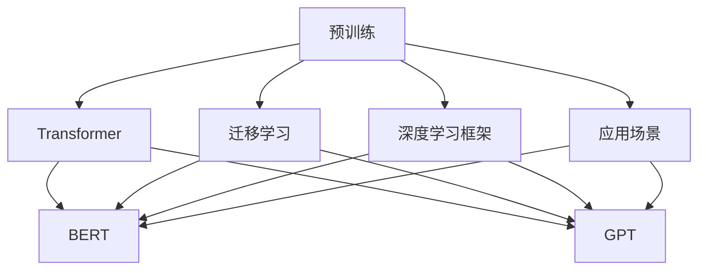

                 

# 大模型基础：理论与技术的演进

> 关键词：大模型,Transformer,BERT,预训练,迁移学习,深度学习,计算机视觉,自然语言处理(NLP)

## 1. 背景介绍

### 1.1 问题由来

深度学习技术自2012年突破性的AlexNet模型以来，经过几年的快速发展，已经在计算机视觉、自然语言处理等多个领域取得了显著的成果。尤其是在计算机视觉领域，ImageNet数据集上预训练的深度神经网络在各种图像分类、目标检测等任务上取得了前所未有的性能。然而，在自然语言处理(NLP)领域，尽管有BERT、GPT等预训练模型的出现，但直到2018年BERT模型的问世，大语言模型才开始引起广泛关注。

BERT（Bidirectional Encoder Representations from Transformers）模型由Google推出，通过在大规模无标签语料上预训练，采用双向Transformer结构，显著提升了自然语言理解能力。之后，GPT模型通过改进，加入了语言模型的自回归生成机制，使得模型能够更加流畅地生成自然语言。这些预训练大模型为NLP任务提供了强大的基础，极大地推动了自然语言处理技术的进步。

随着大模型的出现，大模型基础理论与技术的研究成为了学术界和工业界的热点话题。本文将从理论和技术的角度，全面梳理大模型演进的脉络，探讨其基础原理和核心技术，希望对大模型的研究和应用提供有益的参考。

### 1.2 问题核心关键点

大模型的演进涉及多个核心关键点：

- 预训练与迁移学习：如何通过大规模无标签数据预训练模型，并利用迁移学习思想，提升模型在特定任务上的表现。
- Transformer结构：基于自注意力机制的Transformer结构，如何在大模型中被广泛应用，并逐渐成为主流。
- BERT与GPT：BERT模型如何实现双向语境理解，GPT模型如何实现语言生成，二者对大模型的影响与区别。
- 深度学习框架：TensorFlow、PyTorch等深度学习框架在支持大模型训练中的作用与演进。
- 应用场景：大模型在计算机视觉、自然语言处理、语音识别等领域的应用现状与未来展望。

通过对这些核心关键点的深入探讨，可以全面理解大模型的发展历程和未来趋势。

## 2. 核心概念与联系

### 2.1 核心概念概述

为更好地理解大模型的基础原理和演进过程，本节将介绍几个密切相关的核心概念：

- 预训练（Pre-training）：指在大规模无标签数据上，通过自监督学习任务训练模型，使其学习到通用的语言表示。常见的预训练任务包括自回归预测、掩码语言模型、次序预测等。
- 迁移学习（Transfer Learning）：指将一个领域学到的知识，迁移到另一个领域的学习范式。预训练模型可以被看作是迁移学习的起点，通过微调等方法应用于特定任务。
- Transformer：一种基于自注意力机制的神经网络结构，显著提升了序列建模的能力。Transformer结构在大模型中被广泛应用，成为了NLP领域的主流模型架构。
- BERT：一种基于Transformer结构的预训练语言模型，通过双向编码，显著提升了模型的语言理解能力。BERT模型是当前NLP领域最具代表性的预训练模型之一。
- GPT：一种基于Transformer结构的自回归语言模型，通过自回归生成机制，使得模型能够流畅地生成自然语言。GPT模型是当前最先进的语言生成模型之一。

这些核心概念之间的逻辑关系可以通过以下Mermaid流程图来展示：



这个流程图展示了大模型演进的各个阶段和关键概念：

1. 大模型通过预训练获得通用的语言表示。
2. 通过迁移学习将预训练模型应用于特定任务，微调是最常见的迁移学习范式。
3. Transformer结构在大模型中被广泛采用，成为当前主流模型架构。
4. BERT和GPT是预训练模型中最具代表性的两种，分别在语言理解和语言生成上取得了显著成果。
5. 深度学习框架为预训练和微调提供了必要的技术支持。
6. 应用场景多样，包括计算机视觉、自然语言处理、语音识别等。

这些概念共同构成了大模型演进的基础框架，为大模型的研究和应用提供了理论指导和实践支持。

## 3. 核心算法原理 & 具体操作步骤

### 3.1 算法原理概述

大模型的演进依赖于多项关键技术的发展和应用。以下将从理论和技术两个方面，深入探讨大模型演进的核心算法原理。

#### 3.1.1 预训练与迁移学习

预训练与迁移学习是构建大模型的基础。在大规模无标签数据上，通过自监督学习任务预训练模型，使其学习到通用的语言表示。然后，在特定任务上通过微调等迁移学习范式，将预训练模型应用于具体任务，提升模型的性能。

形式化地，假设预训练模型为 $M_{\theta}$，其中 $\theta$ 为预训练得到的模型参数。给定下游任务 $T$ 的标注数据集 $D=\{(x_i,y_i)\}_{i=1}^N$，微调的目标是找到新的模型参数 $\hat{\theta}$，使得：

$$
\hat{\theta}=\mathop{\arg\min}_{\theta} \mathcal{L}(M_{\theta},D)
$$

其中 $\mathcal{L}$ 为针对任务 $T$ 设计的损失函数，用于衡量模型预测输出与真实标签之间的差异。常见的损失函数包括交叉熵损失、均方误差损失等。

通过梯度下降等优化算法，微调过程不断更新模型参数 $\theta$，最小化损失函数 $\mathcal{L}$，使得模型输出逼近真实标签。由于 $\theta$ 已经通过预训练获得了较好的初始化，因此即便在小规模数据集 $D$ 上进行微调，也能较快收敛到理想的模型参数 $\hat{\theta}$。

#### 3.1.2 Transformer结构

Transformer结构是一种基于自注意力机制的神经网络结构，通过多头注意力机制和位置编码，显著提升了序列建模的能力。Transformer结构在大模型中被广泛采用，成为了NLP领域的主流模型架构。

Transformer结构的核心思想是自注意力机制。在自注意力机制中，输入序列的每个位置与所有其他位置之间都存在注意力权重，这些权重决定了每个位置在处理其他位置时所赋予的权重。通过多头注意力机制，Transformer结构可以同时处理多个注意力头，进一步提升了模型的表达能力。

#### 3.1.3 BERT与GPT

BERT和GPT是预训练模型中最具代表性的两种，分别在语言理解和语言生成上取得了显著成果。

BERT模型通过双向编码，显著提升了模型的语言理解能力。在BERT模型中，输入序列经过两路编码器，分别得到左向和右向的表示，然后通过拼接得到最终的表示。这种双向编码机制使得BERT模型能够全面理解输入序列的语境，从而提升了模型的语言理解能力。

GPT模型通过自回归生成机制，使得模型能够流畅地生成自然语言。在GPT模型中，输入序列的每个位置都需要预测下一个位置的概率分布，通过自回归生成机制，模型能够连续生成自然语言。GPT模型在生成任务上的表现，尤其是对话生成、文本生成等任务上，取得了显著的成果。

### 3.2 算法步骤详解

以下是构建大模型的一般步骤：

**Step 1: 准备数据集**

- 收集大规模无标签数据集，如Wikipedia、Common Crawl等，用于预训练模型。
- 准备下游任务的数据集，如IMDB电影评论分类、CoNLL命名实体识别等，用于微调模型。

**Step 2: 设计预训练任务**

- 设计自监督学习任务，如自回归预测、掩码语言模型等，用于预训练模型。
- 使用预训练任务训练模型，直到收敛。

**Step 3: 设计微调任务**

- 设计下游任务的具体任务，如分类、匹配、生成等。
- 设计适当的任务适配层，如线性分类器、解码器等，将预训练模型输出转换为任务相关的预测结果。

**Step 4: 微调模型**

- 使用下游任务的标注数据集进行微调。
- 设置合适的优化器、学习率等超参数。
- 使用优化算法最小化损失函数，更新模型参数。

**Step 5: 评估与部署**

- 在验证集和测试集上评估微调后的模型性能。
- 部署模型到实际应用场景中。

### 3.3 算法优缺点

大模型演进过程中，预训练和迁移学习范式具有以下优点：

- 预训练阶段可以在大规模无标签数据上学习通用的语言表示，减少了标注数据的依赖。
- 迁移学习能够将预训练模型应用于特定任务，避免了从头训练所需的高成本。
- 微调可以在预训练模型上增加特定的任务适配层，减少了从头训练的复杂度。

然而，预训练和迁移学习也存在一些局限性：

- 预训练阶段需要大规模的数据和计算资源，训练时间长，成本高。
- 微调阶段可能受到标注数据的限制，小规模标注数据难以获得理想的模型性能。
- 微调后的模型在特定任务上的表现可能受到预训练模型的限制，无法充分发挥所有数据的信息。

### 3.4 算法应用领域

大模型演进过程中，预训练和迁移学习范式在多个领域得到了广泛的应用，例如：

- 计算机视觉：通过在大规模无标签图像数据上预训练模型，然后通过微调应用于图像分类、目标检测等任务。
- 自然语言处理：通过在无标签文本数据上预训练模型，然后通过微调应用于文本分类、命名实体识别、对话生成等任务。
- 语音识别：通过在大规模无标签语音数据上预训练模型，然后通过微调应用于语音识别、语音合成等任务。
- 推荐系统：通过在大规模用户行为数据上预训练模型，然后通过微调应用于个性化推荐等任务。
- 医疗影像分析：通过在大规模无标签医学影像数据上预训练模型，然后通过微调应用于疾病诊断、影像识别等任务。

## 4. 数学模型和公式 & 详细讲解 & 举例说明

### 4.1 数学模型构建

本节将使用数学语言对大模型的演进过程进行更加严格的刻画。

记预训练模型为 $M_{\theta}$，其中 $\theta$ 为预训练得到的模型参数。假设预训练任务为 $\mathcal{T}$，给定训练数据集 $D_{\mathcal{T}}=\{(x_i, y_i)\}_{i=1}^N$，其中 $x_i$ 为输入，$y_i$ 为标签。

定义模型 $M_{\theta}$ 在输入 $x$ 上的预训练损失函数为 $\ell_{\mathcal{T}}(M_{\theta}(x))$，预训练目标是最小化预训练损失函数，即：

$$
\mathcal{L}_{\mathcal{T}}(\theta) = \frac{1}{N}\sum_{i=1}^N \ell_{\mathcal{T}}(M_{\theta}(x_i))
$$

在预训练完成后，对于下游任务 $T$，假设标注数据集为 $D_{T}=\{(x_i, y_i)\}_{i=1}^M$，设计下游任务的具体损失函数为 $\ell_{T}(y_i, M_{\theta}(x_i))$，微调的目标是最小化下游任务的损失函数，即：

$$
\mathcal{L}_{T}(\theta) = \frac{1}{M}\sum_{i=1}^M \ell_{T}(y_i, M_{\theta}(x_i))
$$

在微调过程中，使用优化算法最小化损失函数 $\mathcal{L}_{T}$，更新模型参数 $\theta$，使得模型输出逼近真实标签 $y$。

### 4.2 公式推导过程

以下以BERT模型为例，推导其预训练和微调过程的数学公式。

BERT模型通过在大规模无标签文本数据上进行预训练，学习到通用的语言表示。在预训练阶段，BERT模型通过掩码语言模型（Masked Language Model, MLM）和次序预测（Next Sentence Prediction, NSP）两个任务进行训练。

掩码语言模型的目标是从无标签文本中预测被掩码的单词。给定一个输入序列 $x$，随机选择一个位置进行掩码，模型需要预测该位置的单词。

设输入序列长度为 $n$，掩码位置为 $i$，掩码后的序列为 $x_i$，其中 $x_i = [x_1, x_2, \ldots, x_n]$，掩码后的单词为 $x_i'$，其中 $x_i' = [x_1, x_2, \ldots, x_{i-1}, \text{[MASK]}, x_{i+1}, \ldots, x_n]$。

掩码语言模型的预测公式为：

$$
\ell_{MLM}(x_i, \theta) = -\sum_{j=1}^n \log p(x_j \mid x_{1:i-1}, x_{i+1:n})
$$

其中 $p(x_j \mid x_{1:i-1}, x_{i+1:n})$ 表示在输入序列 $x_{1:i-1}, x_{i+1:n}$ 条件下，单词 $x_j$ 的条件概率。

次序预测任务的目的是判断两个无标签文本是否为连续的句子。给定两个文本序列 $x_1, x_2$，模型需要预测 $x_2$ 是否是 $x_1$ 的后续句子。

次序预测任务的预测公式为：

$$
\ell_{NSP}(x_1, x_2, \theta) = -\log p(x_2 \mid x_1) + \log p(x_1 \mid x_2)
$$

其中 $p(x_2 \mid x_1)$ 表示在输入序列 $x_1$ 条件下，文本 $x_2$ 的条件概率，$p(x_1 \mid x_2)$ 表示在输入序列 $x_2$ 条件下，文本 $x_1$ 的条件概率。

在大规模预训练任务上，BERT模型的预训练损失函数为：

$$
\mathcal{L}_{\mathcal{T}}(\theta) = \frac{1}{N}\sum_{i=1}^N (\ell_{MLM}(x_i, \theta) + \ell_{NSP}(x_i', \theta) + \ell_{NSP}(x_i, x_i', \theta))
$$

其中 $\ell_{NSP}(x_i', \theta)$ 表示在掩码后的文本序列上进行的次序预测，$\ell_{NSP}(x_i, x_i', \theta)$ 表示在原始文本序列和掩码后的文本序列上进行次序预测。

在预训练完成后，对于下游任务 $T$，假设标注数据集为 $D_{T}=\{(x_i, y_i)\}_{i=1}^M$，设计下游任务的具体损失函数为 $\ell_{T}(y_i, M_{\theta}(x_i))$。

以分类任务为例，假设分类任务有 $k$ 个类别，模型需要预测输入 $x$ 对应的类别 $y$。分类任务的预测公式为：

$$
\ell_{C}(y_i, M_{\theta}(x_i)) = -\log p(y_i \mid M_{\theta}(x_i))
$$

其中 $p(y_i \mid M_{\theta}(x_i))$ 表示在输入 $x_i$ 的条件下，类别 $y_i$ 的条件概率。

微调的目标是最小化分类损失函数，即：

$$
\mathcal{L}_{T}(\theta) = \frac{1}{M}\sum_{i=1}^M \ell_{C}(y_i, M_{\theta}(x_i))
$$

在微调过程中，使用优化算法最小化损失函数 $\mathcal{L}_{T}$，更新模型参数 $\theta$，使得模型输出逼近真实标签 $y$。

## 5. 项目实践：代码实例和详细解释说明

### 5.1 开发环境搭建

在进行大模型演进实践前，我们需要准备好开发环境。以下是使用Python进行PyTorch开发的环境配置流程：

1. 安装Anaconda：从官网下载并安装Anaconda，用于创建独立的Python环境。

2. 创建并激活虚拟环境：
```bash
conda create -n pytorch-env python=3.8 
conda activate pytorch-env
```

3. 安装PyTorch：根据CUDA版本，从官网获取对应的安装命令。例如：
```bash
conda install pytorch torchvision torchaudio cudatoolkit=11.1 -c pytorch -c conda-forge
```

4. 安装Transformers库：
```bash
pip install transformers
```

5. 安装各类工具包：
```bash
pip install numpy pandas scikit-learn matplotlib tqdm jupyter notebook ipython
```

完成上述步骤后，即可在`pytorch-env`环境中开始大模型演进的实践。

### 5.2 源代码详细实现

这里我们以BERT模型为例，给出使用Transformers库对BERT模型进行预训练和微调的PyTorch代码实现。

首先，定义预训练任务的损失函数：

```python
from transformers import BertTokenizer, BertForMaskedLM, BertForNextSentencePrediction
from torch.utils.data import Dataset, DataLoader
import torch
import numpy as np

class BertDataset(Dataset):
    def __init__(self, texts, tokenizer):
        self.tokenizer = tokenizer
        self.texts = texts
        
    def __len__(self):
        return len(self.texts)
    
    def __getitem__(self, item):
        text = self.texts[item]
        tokenized = self.tokenizer.tokenize(text)
        return {'input_ids': self.tokenizer.convert_tokens_to_ids(tokenized), 'attention_mask': [1] * len(tokenized)}

# 初始化tokenizer和模型
tokenizer = BertTokenizer.from_pretrained('bert-base-uncased')
model = BertForMaskedLM.from_pretrained('bert-base-uncased', num_labels=2)
device = torch.device('cuda') if torch.cuda.is_available() else torch.device('cpu')

# 定义预训练任务损失函数
def compute_loss(model, data_loader):
    model.to(device)
    total_loss = 0
    for batch in data_loader:
        input_ids = batch['input_ids'].to(device)
        attention_mask = batch['attention_mask'].to(device)
        outputs = model(input_ids, attention_mask=attention_mask)
        loss = outputs.loss
        total_loss += loss.item()
    return total_loss / len(data_loader)

# 训练预训练模型
from transformers import AdamW
optimizer = AdamW(model.parameters(), lr=2e-5)
num_epochs = 5
batch_size = 16
data_loader = DataLoader(train_dataset, batch_size=batch_size, shuffle=True)

for epoch in range(num_epochs):
    loss = compute_loss(model, data_loader)
    print(f'Epoch {epoch+1}, pretrain loss: {loss:.3f}')
```

然后，定义微调任务的损失函数：

```python
from transformers import BertForSequenceClassification
from transformers import AdamW
from sklearn.metrics import accuracy_score, precision_score, recall_score, f1_score

# 定义微调任务
class BertClassificationDataset(Dataset):
    def __init__(self, texts, labels, tokenizer):
        self.tokenizer = tokenizer
        self.texts = texts
        self.labels = labels
        
    def __len__(self):
        return len(self.texts)
    
    def __getitem__(self, item):
        text = self.texts[item]
        label = self.labels[item]
        tokenized = self.tokenizer.tokenize(text)
        return {'input_ids': self.tokenizer.convert_tokens_to_ids(tokenized), 'attention_mask': [1] * len(tokenized), 'labels': label}

# 初始化tokenizer和模型
tokenizer = BertTokenizer.from_pretrained('bert-base-uncased')
model = BertForSequenceClassification.from_pretrained('bert-base-uncased', num_labels=2)
device = torch.device('cuda') if torch.cuda.is_available() else torch.device('cpu')
optimizer = AdamW(model.parameters(), lr=2e-5)

# 定义微调任务损失函数
def compute_loss(model, data_loader):
    model.to(device)
    total_loss = 0
    total_num_samples = 0
    for batch in data_loader:
        input_ids = batch['input_ids'].to(device)
        attention_mask = batch['attention_mask'].to(device)
        labels = batch['labels'].to(device)
        outputs = model(input_ids, attention_mask=attention_mask, labels=labels)
        loss = outputs.loss
        total_loss += loss.item()
        total_num_samples += labels.numel()
    return total_loss / total_num_samples

# 训练微调模型
data_loader = DataLoader(train_dataset, batch_size=batch_size, shuffle=True)

for epoch in range(num_epochs):
    loss = compute_loss(model, data_loader)
    print(f'Epoch {epoch+1}, fine-tune loss: {loss:.3f}')
```

最后，启动预训练和微调流程：

```python
# 加载预训练数据集
train_dataset = BertDataset(train_texts, tokenizer)

# 预训练模型训练
for epoch in range(num_epochs):
    loss = compute_loss(model, data_loader)
    print(f'Epoch {epoch+1}, pretrain loss: {loss:.3f}')

# 微调模型训练
train_dataset = BertClassificationDataset(train_texts, train_labels, tokenizer)

# 微调模型训练
for epoch in range(num_epochs):
    loss = compute_loss(model, data_loader)
    print(f'Epoch {epoch+1}, fine-tune loss: {loss:.3f}')
```

以上就是使用PyTorch对BERT模型进行预训练和微调的完整代码实现。可以看到，得益于Transformers库的强大封装，我们可以用相对简洁的代码完成BERT模型的加载和微调。

### 5.3 代码解读与分析

让我们再详细解读一下关键代码的实现细节：

**BertDataset类**：
- `__init__`方法：初始化文本、tokenizer等关键组件。
- `__len__`方法：返回数据集的样本数量。
- `__getitem__`方法：对单个样本进行处理，将文本输入编码为token ids，最终返回模型所需的输入。

**compute_loss函数**：
- 使用Transformer库的BertTokenizer和BertForMaskedLM、BertForNextSentencePrediction等模型实现预训练任务的损失函数。
- 在预训练任务上，使用AdamW优化器最小化预训练损失，更新模型参数。
- 在微调任务上，使用AdamW优化器最小化微调损失，更新模型参数。
- 在预训练任务和微调任务上，分别计算损失并输出。

**训练流程**：
- 定义总的epoch数和batch size，开始循环迭代。
- 在预训练阶段，先对预训练模型进行训练，输出预训练损失。
- 在微调阶段，使用微调任务的数据集进行训练，输出微调损失。

可以看到，PyTorch配合Transformers库使得BERT模型的预训练和微调过程变得简洁高效。开发者可以将更多精力放在数据处理、模型改进等高层逻辑上，而不必过多关注底层的实现细节。

当然，工业级的系统实现还需考虑更多因素，如模型的保存和部署、超参数的自动搜索、更灵活的任务适配层等。但核心的预训练和微调范式基本与此类似。

## 6. 实际应用场景

### 6.1 计算机视觉

大模型在计算机视觉领域也有广泛应用。常见的计算机视觉任务包括图像分类、目标检测、实例分割等。通过在大规模无标签图像数据上预训练模型，然后通过微调应用于特定任务，可以在较少标注数据的情况下，取得较好的效果。

在实践中，可以收集各种领域的图像数据，如自然景观、医学影像、工业检测等，然后对这些数据进行预训练。预训练完成后，通过微调模型，可以在特定任务上进行图像分类、目标检测等任务。

### 6.2 自然语言处理

大模型在自然语言处理领域的应用最为广泛，包括文本分类、命名实体识别、机器翻译、情感分析等任务。通过在大规模无标签文本数据上预训练模型，然后通过微调应用于特定任务，可以在较少标注数据的情况下，取得较好的效果。

在实践中，可以收集各种领域的文本数据，如新闻、社交媒体、论文等，然后对这些数据进行预训练。预训练完成后，通过微调模型，可以在特定任务上进行文本分类、命名实体识别等任务。

### 6.3 语音识别

大模型在语音识别领域也有广泛应用。常见的语音识别任务包括语音识别、语音合成、语音情感分析等。通过在大规模无标签语音数据上预训练模型，然后通过微调应用于特定任务，可以在较少标注数据的情况下，取得较好的效果。

在实践中，可以收集各种领域的语音数据，如电话录音、会议记录、语音助手等，然后对这些数据进行预训练。预训练完成后，通过微调模型，可以在特定任务上进行语音识别、语音合成等任务。

### 6.4 未来应用展望

随着大模型的不断发展和演进，未来将在更多领域得到应用，为各行各业带来变革性影响。

在智慧医疗领域，基于大模型的医疗影像分析、病历分析、疾病诊断等应用将提升医疗服务的智能化水平，辅助医生诊疗，加速新药开发进程。

在智能教育领域，基于大模型的作业批改、学情分析、知识推荐等应用将提升教育服务的智能化水平，因材施教，促进教育公平，提高教学质量。

在智慧城市治理中，基于大模型的城市事件监测、舆情分析、应急指挥等应用将提高城市管理的自动化和智能化水平，构建更安全、高效的未来城市。

此外，在企业生产、社会治理、文娱传媒等众多领域，基于大模型的人工智能应用也将不断涌现，为经济社会发展注入新的动力。相信随着技术的日益成熟，大模型将为各行各业带来变革性影响，深刻影响人类的生产生活方式。

## 7. 工具和资源推荐

### 7.1 学习资源推荐

为了帮助开发者系统掌握大模型的演进原理和实践技巧，这里推荐一些优质的学习资源：

1. 《深度学习入门：基于Python的理论与实现》系列博文：由大模型技术专家撰写，深入浅出地介绍了深度学习基础理论和大模型演进历程。

2. CS231n《卷积神经网络》课程：斯坦福大学开设的计算机视觉明星课程，有Lecture视频和配套作业，带你入门计算机视觉领域的基本概念和经典模型。

3. 《Transformers: From Practice to Theory》书籍：Transformer库的作者所著，全面介绍了如何使用Transformers库进行NLP任务开发，包括预训练和微调在内的诸多范式。

4. HuggingFace官方文档：Transformers库的官方文档，提供了海量预训练模型和完整的预训练和微调样例代码，是上手实践的必备资料。

5. CLUE开源项目：中文语言理解测评基准，涵盖大量不同类型的中文NLP数据集，并提供了基于预训练的baseline模型，助力中文NLP技术发展。

通过对这些资源的学习实践，相信你一定能够快速掌握大模型的演进原理，并用于解决实际的NLP问题。

### 7.2 开发工具推荐

高效的开发离不开优秀的工具支持。以下是几款用于大模型演进开发的常用工具：

1. PyTorch：基于Python的开源深度学习框架，灵活动态的计算图，适合快速迭代研究。大部分预训练语言模型都有PyTorch版本的实现。

2. TensorFlow：由Google主导开发的开源深度学习框架，生产部署方便，适合大规模工程应用。同样有丰富的预训练语言模型资源。

3. Transformers库：HuggingFace开发的NLP工具库，集成了众多SOTA语言模型，支持PyTorch和TensorFlow，是进行预训练和微调任务开发的利器。

4. Weights & Biases：模型训练的实验跟踪工具，可以记录和可视化模型训练过程中的各项指标，方便对比和调优。与主流深度学习框架无缝集成。

5. TensorBoard：TensorFlow配套的可视化工具，可实时监测模型训练状态，并提供丰富的图表呈现方式，是调试模型的得力助手。

6. Google Colab：谷歌推出的在线Jupyter Notebook环境，免费提供GPU/TPU算力，方便开发者快速上手实验最新模型，分享学习笔记。

合理利用这些工具，可以显著提升大模型演进的开发效率，加快创新迭代的步伐。

### 7.3 相关论文推荐

大模型演进过程中，预训练和迁移学习范式的发展源于学界的持续研究。以下是几篇奠基性的相关论文，推荐阅读：

1. Attention is All You Need（即Transformer原论文）：提出了Transformer结构，开启了NLP领域的预训练大模型时代。

2. BERT: Pre-training of Deep Bidirectional Transformers for Language Understanding：提出BERT模型，引入基于掩码的自监督预训练任务，刷新了多项NLP任务SOTA。

3. Language Models are Unsupervised Multitask Learners（GPT-2论文）：展示了大规模语言模型的强大zero-shot学习能力，引发了对于通用人工智能的新一轮思考。

4. Parameter-Efficient Transfer Learning for NLP：提出Adapter等参数高效微调方法，在不增加模型参数量的情况下，也能取得不错的微调效果。

5. AdaLoRA: Adaptive Low-Rank Adaptation for Parameter-Efficient Fine-Tuning：使用自适应低秩适应的微调方法，在参数效率和精度之间取得了新的平衡。

6. Large-Scale Margin-Labelled Text Classification with Attention-Based Representations：提出了基于Attention的文本分类方法，提升了文本分类任务的表现。

这些论文代表了大模型演进过程中的重要里程碑，通过学习这些前沿成果，可以帮助研究者把握学科前进方向，激发更多的创新灵感。

## 8. 总结：未来发展趋势与挑战

### 8.1 总结

本文对大模型的演进过程进行了全面系统的介绍。首先阐述了大模型的基础原理和演进历程，明确了预训练和迁移学习在大模型演进中的重要作用。其次，从理论和技术的角度，详细讲解了大模型演进的数学模型和关键步骤，给出了预训练和微调任务开发的完整代码实例。同时，本文还广泛探讨了大模型在计算机视觉、自然语言处理、语音识别等领域的应用前景，展示了预训练和微调范式的巨大潜力。

通过本文的系统梳理，可以看到，大模型演进正在成为NLP领域的重要范式，极大地拓展了预训练语言模型的应用边界，催生了更多的落地场景。受益于大规模语料的预训练，预训练语言模型以更低的时间和标注成本，在小样本条件下也能取得不俗的效果，有力推动了NLP技术的产业化进程。未来，伴随预训练语言模型和微调方法的不断进步，相信NLP技术将在更广阔的应用领域大放异彩，深刻影响人类的生产生活方式。

### 8.2 未来发展趋势

展望未来，大模型的演进将呈现以下几个发展趋势：

1. 模型规模持续增大。随着算力成本的下降和数据规模的扩张，预训练语言模型的参数量还将持续增长。超大规模语言模型蕴含的丰富语言知识，有望支撑更加复杂多变的下游任务。

2. 预训练范式不断扩展。除了传统的自监督预训练外，未来将涌现更多无监督和半监督预训练范式，进一步降低预训练的资源和成本。

3. 微调方法更加多样化。除了传统的全参数微调外，未来将涌现更多参数高效的微调方法，如Prompt-based Learning、Adapter等，在节省计算资源的同时也能保证微调精度。

4. 持续学习成为常态。随着数据分布的不断变化，微调模型也需要持续学习新知识以保持性能。如何在不遗忘原有知识的同时，高效吸收新样本信息，将成为重要的研究课题。

5. 标注样本需求降低。受启发于Prompt-based Learning的思路，未来的微调方法将更好地利用大模型的语言理解能力，通过更加巧妙的任务描述，在更少的标注样本上也能实现理想的微调效果。

6. 多模态微调崛起。当前的微调主要聚焦于纯文本数据，未来将拓展到图像、视频、语音等多模态数据微调。多模态信息的融合，将显著提升语言模型对现实世界的理解和建模能力。

7. 知识整合能力增强。现有的微调模型往往局限于任务内数据，难以灵活吸收和运用更广泛的先验知识。如何让微调过程更好地与外部知识库、规则库等专家知识结合，形成更加全面、准确的信息整合能力，还有很大的想象空间。

以上趋势凸显了大模型演进的广阔前景。这些方向的探索发展，必将进一步提升预训练语言模型的性能和应用范围，为构建安全、可靠、可解释、可控的智能系统铺平道路。

### 8.3 面临的挑战

尽管大模型的演进已经取得了瞩目成就，但在迈向更加智能化、普适化应用的过程中，它仍面临着诸多挑战：

1. 标注成本瓶颈。虽然预训练阶段可以无需标注数据，但对于微调阶段，仍需要大量高质量标注数据，获取标注数据的成本较高。如何进一步降低微调对标注样本的依赖，将是一大难题。

2. 模型鲁棒性不足。当前微调模型面对域外数据时，泛化性能往往大打折扣。对于测试样本的微小扰动，微调模型的预测也容易发生波动。如何提高微调模型的鲁棒性，避免灾难性遗忘，还需要更多理论和实践的积累。

3. 推理效率有待提高。大规模语言模型虽然精度高，但在实际部署时往往面临推理速度慢、内存占用大等效率问题。如何在保证性能的同时，简化模型结构，提升推理速度，优化资源占用，将是重要的优化方向。

4. 可解释性亟需加强。当前微调模型更像是"黑盒"系统，难以解释其内部工作机制和决策逻辑。对于医疗、金融等高风险应用，算法的可解释性和可审计性尤为重要。如何赋予微调模型更强的可解释性，将是亟待攻克的难题。

5. 安全性有待保障。预训练语言模型难免会学习到有偏见、有害的信息，通过微调传递到下游任务，产生误导性、歧视性的输出，给实际应用带来安全隐患。如何从数据和算法层面消除模型偏见，避免恶意用途，确保输出的安全性，也将是重要的研究课题。

6. 知识整合能力不足。现有的微调模型往往局限于任务内数据，难以灵活吸收和运用更广泛的先验知识。如何让微调过程更好地与外部知识库、规则库等专家知识结合，形成更加全面、准确的信息整合能力，还有很大的想象空间。

正视微调面临的这些挑战，积极应对并寻求突破，将是大模型演进走向成熟的必由之路。相信随着学界和产业界的共同努力，这些挑战终将一一被克服，大模型演进必将在构建人机协同的智能时代中扮演越来越重要的角色。

### 8.4 研究展望

面对大模型演进所面临的种种挑战，未来的研究需要在以下几个方面寻求新的突破：

1. 探索无监督和半监督微调方法。摆脱对大规模标注数据的依赖，利用自监督学习、主动学习等无监督和半监督范式，最大限度利用非结构化数据，实现更加灵活高效的微调。

2. 研究参数高效和计算高效的微调范式。开发更加参数高效的微调方法，在固定大部分预训练参数的同时，只更新极少量的任务相关参数。同时优化微调模型的计算图，减少前向传播和反向传播的资源消耗，实现更加轻量级、实时性的部署。

3. 引入更多先验知识。将符号化的先验知识，如知识图谱、逻辑规则等，与神经网络模型进行巧妙融合，引导微调过程学习更准确、合理的语言模型。同时加强不同模态数据的整合，实现视觉、语音等多模态信息与文本信息的协同建模。

4. 结合因果分析和博弈论工具。将因果分析方法引入微调模型，识别出模型决策的关键特征，增强输出解释的因果性和逻辑性。借助博弈论工具刻画人机交互过程，主动探索并规避模型的脆弱点，提高系统稳定性。

5. 纳入伦理道德约束。在模型训练目标中引入伦理导向的评估指标，过滤和惩罚有偏见、有害的输出倾向。同时加强人工干预和审核，建立模型行为的监管机制，确保输出符合人类价值观和伦理道德。

这些研究方向的探索，必将引领大模型演进技术迈向更高的台阶，为构建安全、可靠、可解释、可控的智能系统铺平道路。面向未来，大模型演进技术还需要与其他人工智能技术进行更深入的融合，如知识表示、因果推理、强化学习等，多路径协同发力，共同推动自然语言理解和智能交互系统的进步。只有勇于创新、敢于突破，才能不断拓展语言模型的边界，让智能技术更好地造福人类社会。

## 9. 附录：常见问题与解答

**Q1：预训练和微调的区别是什么？**

A: 预训练是指在大规模无标签数据上，通过自监督学习任务训练模型，使其学习到通用的语言表示。微调是指在预训练模型的基础上，使用下游任务的少量标注数据，通过有监督地训练优化模型在该任务上的性能。预训练和微调是深度学习中常见的迁移学习范式，能够有效提升模型在特定任务上的性能。

**Q2：预训练和微调是否互相独立？**

A: 预训练和微调通常是互相关联的，预训练为大模型提供了通用的语言表示，微调则在此基础上对特定任务进行优化。预训练可以看作是微调的起点，微调则是在预训练基础上进行的进一步优化。在某些情况下，预训练和微调可以交替进行，进一步提升模型的性能。

**Q3：大模型是否需要从头训练？**

A: 大模型通常不需要从头训练，而是通过在大规模无标签数据上预训练，然后在下游任务上进行微调。这种方法可以显著降低训练成本，提升模型性能。预训练和微调结合的迁移学习范式，已成为大模型演进的重要手段。

**Q4：预训练和微调能否替代从头训练？**

A: 预训练和微调通常不能完全替代从头训练，但可以显著降低训练成本和资源消耗。预训练和微调的目的是在保证性能的同时，减少从头训练所需的时间和资源。然而，在某些特定领域或任务上，从头训练仍然是一种必要的选择。

**Q5：大模型是否存在过拟合风险？**

A: 大模型在大规模数据上进行预训练时，通常不会出现过拟合风险。但在微调阶段，由于数据量较小，存在一定的过拟合风险。解决过拟合的方法包括数据增强、正则化、早停等，需要根据具体情况进行选择。

总之，预训练和微调是大模型演进过程中不可或缺的重要手段，能够显著提升模型的性能和泛化能力。通过合理选择预训练和微调范式，结合实际任务特点，才能实现最佳的模型性能。

---

作者：禅与计算机程序设计艺术 / Zen and the Art of Computer Programming

