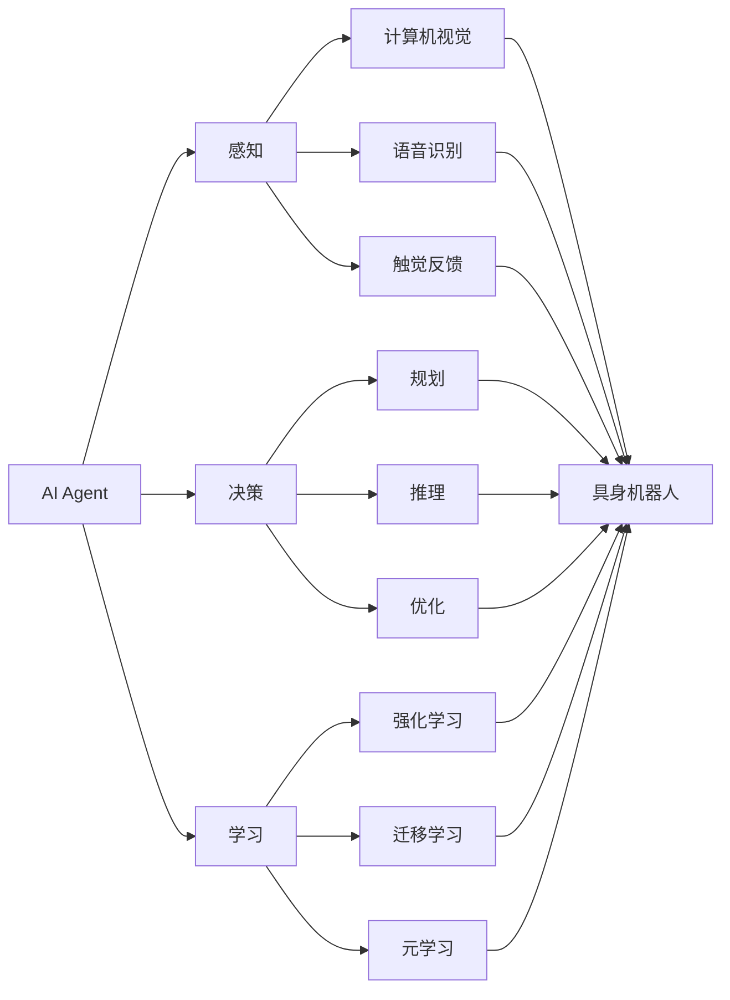

# AI Agent: AI的下一个风口 具身机器人的发展趋势

## 1. 背景介绍
### 1.1 人工智能的发展历程
#### 1.1.1 早期人工智能
#### 1.1.2 机器学习时代
#### 1.1.3 深度学习时代
### 1.2 人工智能的应用现状
#### 1.2.1 语音识别与自然语言处理
#### 1.2.2 计算机视觉与图像识别
#### 1.2.3 自动驾驶与智能交通
### 1.3 人工智能面临的挑战
#### 1.3.1 算法的解释性与可信性
#### 1.3.2 数据的质量与隐私保护
#### 1.3.3 人工智能的伦理与安全问题

## 2. 核心概念与联系
### 2.1 AI Agent的定义与特点
#### 2.1.1 自主性与目标导向
#### 2.1.2 感知、推理与决策能力
#### 2.1.3 学习与适应能力
### 2.2 具身机器人的概念与内涵
#### 2.2.1 具身性：身体与环境的交互
#### 2.2.2 智能性：感知、规划与控制
#### 2.2.3 自主性：无人干预下的独立行为
### 2.3 AI Agent与具身机器人的关系
#### 2.3.1 AI Agent是具身机器人的大脑
#### 2.3.2 具身机器人为AI Agent提供执行载体
#### 2.3.3 二者融合推动人工智能走向实用化

## 3. 核心算法原理具体操作步骤
### 3.1 强化学习算法
#### 3.1.1 马尔可夫决策过程(MDP)
#### 3.1.2 Q-Learning算法
#### 3.1.3 策略梯度算法
### 3.2 深度强化学习算法
#### 3.2.1 Deep Q-Network(DQN)
#### 3.2.2 Deep Deterministic Policy Gradient(DDPG)
#### 3.2.3 Proximal Policy Optimization(PPO)
### 3.3 多智能体强化学习算法
#### 3.3.1 Independent Q-Learning
#### 3.3.2 Centralized Training with Decentralized Execution
#### 3.3.3 Multi-Agent DDPG

## 4. 数学模型和公式详细讲解举例说明
### 4.1 马尔可夫决策过程(MDP)的数学定义
#### 4.1.1 状态空间 $\mathcal{S}$
#### 4.1.2 动作空间 $\mathcal{A}$
#### 4.1.3 状态转移概率 $\mathcal{P}$
#### 4.1.4 奖励函数 $\mathcal{R}$
#### 4.1.5 折扣因子 $\gamma$
### 4.2 Q-Learning的数学模型
$$Q(s_t,a_t) \leftarrow Q(s_t,a_t)+\alpha[r_{t+1}+\gamma \max_{a}Q(s_{t+1},a)-Q(s_t,a_t)]$$
其中，$s_t$表示t时刻的状态，$a_t$表示在状态$s_t$下采取的动作，$r_{t+1}$表示执行动作$a_t$后获得的奖励，$\alpha$是学习率，$\gamma$是折扣因子。

### 4.3 策略梯度算法的数学模型
$$\nabla_\theta J(\theta) = \mathbb{E}_{\tau \sim \pi_\theta}[\sum_{t=0}^{T}\nabla_\theta \log \pi_\theta(a_t|s_t)Q^{\pi_\theta}(s_t,a_t)]$$
其中，$\theta$表示策略网络的参数，$\pi_\theta$表示参数化的策略，$\tau$表示一条轨迹，$Q^{\pi_\theta}(s_t,a_t)$表示在状态$s_t$下采取动作$a_t$的动作值函数。

## 5. 项目实践：代码实例和详细解释说明
### 5.1 基于OpenAI Gym的强化学习代码实例
```python
import gym
import numpy as np

env = gym.make('CartPole-v0')

# Q-table
q_table = np.zeros((env.observation_space.n, env.action_space.n))

# 超参数
learning_rate = 0.8
gamma = 0.95
num_episodes = 2000

# Q-Learning算法
for i in range(num_episodes):
    state = env.reset()
    done = False

    while not done:
        action = np.argmax(q_table[state])
        next_state, reward, done, _ = env.step(action)

        q_table[state, action] += learning_rate * (reward + gamma * np.max(q_table[next_state]) - q_table[state, action])

        state = next_state

print("Training finished.")
```
这段代码使用OpenAI Gym中的CartPole环境，实现了一个基本的Q-Learning算法。通过不断与环境交互，更新Q值表，最终学习到一个最优策略，使得小车能够在保持平衡的同时尽可能长时间地存活。

### 5.2 基于PyTorch的深度强化学习代码实例
```python
import gym
import numpy as np
import torch
import torch.nn as nn
import torch.optim as optim

class DQN(nn.Module):
    def __init__(self, state_size, action_size):
        super(DQN, self).__init__()
        self.fc1 = nn.Linear(state_size, 64)
        self.fc2 = nn.Linear(64, 64)
        self.fc3 = nn.Linear(64, action_size)

    def forward(self, x):
        x = torch.relu(self.fc1(x))
        x = torch.relu(self.fc2(x))
        x = self.fc3(x)
        return x

env = gym.make('CartPole-v0')
state_size = env.observation_space.shape[0]
action_size = env.action_space.n

model = DQN(state_size, action_size)
optimizer = optim.Adam(model.parameters())

# 超参数
num_episodes = 1000
batch_size = 32
gamma = 0.99

for i in range(num_episodes):
    state = env.reset()
    done = False

    while not done:
        state_tensor = torch.FloatTensor(state).unsqueeze(0)
        q_values = model(state_tensor)
        action = torch.argmax(q_values).item()

        next_state, reward, done, _ = env.step(action)

        target = reward + gamma * torch.max(model(torch.FloatTensor(next_state).unsqueeze(0)))
        target_f = model(state_tensor)
        target_f[0][action] = target

        loss = nn.MSELoss()(q_values, target_f)
        optimizer.zero_grad()
        loss.backward()
        optimizer.step()

        state = next_state

print("Training finished.")
```
这段代码使用PyTorch实现了一个基于DQN的深度强化学习算法。通过神经网络近似Q值函数，并使用经验回放(Experience Replay)和目标网络(Target Network)等技巧来提高算法的稳定性和收敛速度。最终训练出一个能够很好地控制CartPole平衡的智能体。

## 6. 实际应用场景
### 6.1 智能家居中的具身机器人
#### 6.1.1 家务机器人：清洁、整理等
#### 6.1.2 陪伴机器人：老人看护、儿童教育等
#### 6.1.3 安防机器人：入侵检测、紧急呼叫等
### 6.2 工业制造中的具身机器人
#### 6.2.1 装配机器人：精密装配、质量检测等
#### 6.2.2 搬运机器人：物料搬运、仓储物流等
#### 6.2.3 巡检机器人：设备巡检、故障诊断等
### 6.3 特种领域中的具身机器人
#### 6.3.1 航天机器人：太空探索、卫星维修等
#### 6.3.2 深海机器人：海底勘探、管线铺设等
#### 6.3.3 救援机器人：灾害搜救、危险环境侦察等

## 7. 工具和资源推荐
### 7.1 强化学习平台
#### 7.1.1 OpenAI Gym
#### 7.1.2 DeepMind Lab
#### 7.1.3 Unity ML-Agents
### 7.2 机器人仿真平台
#### 7.2.1 Gazebo
#### 7.2.2 V-REP
#### 7.2.3 Webots
### 7.3 机器人开发框架
#### 7.3.1 ROS (Robot Operating System)
#### 7.3.2 YARP (Yet Another Robot Platform)
#### 7.3.3 MOOS (Mission Oriented Operating Suite)

## 8. 总结：未来发展趋势与挑战
### 8.1 AI Agent与具身机器人的深度融合
#### 8.1.1 更加智能化的感知、决策与控制
#### 8.1.2 更加自然的人机交互与协作
#### 8.1.3 更加个性化的服务与定制
### 8.2 多智能体协同与群体智能
#### 8.2.1 多机器人系统的分布式决策
#### 8.2.2 机器人集群的涌现行为
#### 8.2.3 人机混合系统的协同优化
### 8.3 安全性、鲁棒性与可解释性
#### 8.3.1 对抗攻击下的模型防御
#### 8.3.2 开放环境中的持续学习
#### 8.3.3 因果推理与可解释机器学习

## 9. 附录：常见问题与解答
### 9.1 如何平衡AI Agent的探索和利用？
探索与利用是强化学习中的核心问题。一方面，智能体需要不断探索环境，发现更优的策略；另一方面，智能体又需要利用已有的知识，执行当前最优策略以获得更多奖励。常见的平衡方法有$\epsilon$-greedy、Upper Confidence Bound (UCB)、Thompson Sampling等。通过合理设置探索率或置信区间，可以在探索和利用之间取得平衡，提高学习效率。

### 9.2 如何解决具身机器人的sim-to-real问题？
sim-to-real问题是指在仿真环境中训练的模型，在迁移到真实机器人系统时性能出现显著下降。主要原因在于仿真环境与真实环境之间存在差异，如物理参数不准确、传感器噪声等。常见的解决方案包括：

- 域随机化：在仿真环境中随机化物理参数、材质、光照等，生成大量不同的环境，提高模型的泛化能力。
- 域适应：通过对抗训练或风格迁移等技术，缩小仿真环境和真实环境的分布差异。
- 迁移学习：在仿真环境中预训练模型，然后在真实环境中进行微调或增量学习。

### 9.3 具身机器人的安全性如何保障？
具身机器人的安全性至关重要，需要从多个层面入手：

- 机械设计：采用柔性材料、力控设计等，避免对人员造成伤害。
- 传感系统：配备冗余传感器，实现全方位环境感知和自身状态监控。
- 运动规划：引入安全约束，规划避障路径，限制速度和加速度。
- 人机交互：设计友好的交互方式，及时检测和响应人员意图。
- 故障诊断：实时监控系统状态，发现异常及时切换到安全模式。

同时，建立完善的安全标准和测试规范，从制度层面保障机器人的安全性。未来，具身机器人将在更多领域发挥重要作用，但也面临诸多挑战。only有坚持不懈的探索和创新，加强产学研用各界合作，才能推动具身机器人技术不断迈上新台阶，造福人类社会。



以上是AI Agent与具身机器人结合的示意图。AI Agent通过感知、决策、学习等模块，赋予具身机器人智能。具身机器人则通过执行器和传感器，实现与物理世界的交互。二者融合，将人工智能从信息空间带到现实世界，大大拓展了AI的应用边界。可以预见，具身AI将成为人工智能发展的重要方向，推动机器人技术从自动化走向自主智能化。让我们拭目以待，具身机器人必将创造无限可能