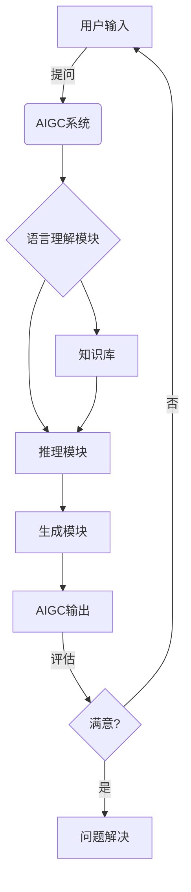
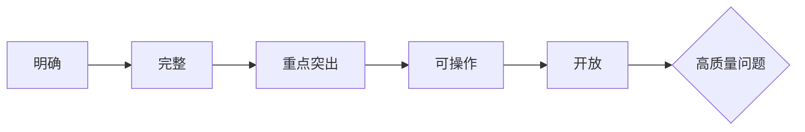
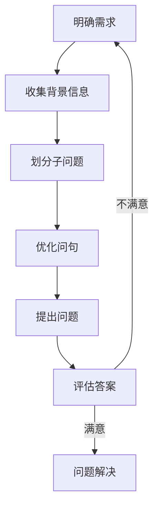

# AIGC从入门到实战：进阶：如何提问以获得高质量答案，解决复杂问题

## 1.背景介绍

### 1.1 AIGC的兴起与重要性

近年来,人工智能生成内容(AIGC)技术的快速发展,为各行业带来了新的机遇和挑战。AIGC可以自动生成文本、图像、音频、视频等多种形式的内容,大大提高了内容生产的效率,降低了成本。在内容创作、客户服务、教育培训等领域,AIGC技术展现出了巨大的应用潜力。

### 1.2 提问的重要性

然而,要充分发挥AIGC的能力,提出高质量的问题是关键。一个好的问题不仅能引导AIGC系统生成相关、有价值的内容,还能帮助用户更好地理解和解决复杂问题。反之,问题设置不当可能导致AIGC输出无关、低质量或者错误的结果,增加用户的理解成本。

### 1.3 本文目的

本文旨在为读者提供提问技巧,帮助他们更高效地利用AIGC系统解决复杂问题,获得高质量的答案和建议。我们将介绍提问的基本原则、常见问题类型、提问的具体步骤,并给出实例分析和最佳实践。

## 2.核心概念与联系

### 2.1 AIGC系统的工作原理

为了有效利用AIGC系统,我们需要了解它的工作原理。现代AIGC系统通常基于大型语言模型(如GPT-3)和深度学习技术,通过对海量文本数据进行训练,学习人类语言的模式和知识。



用户的问题首先被AIGC系统的语言理解模块解析和理解,然后结合知识库和推理模块生成相关的答案。用户可以根据AIGC的输出评估是否满意,如果不满意,可以重新提问或优化问题。

### 2.2 提问的作用

优质的问题对AIGC系统的输出质量有着重要影响。一个清晰、具体、富有启发性的问题,能够:

1. 帮助AIGC系统准确理解用户的需求和意图
2. 引导AIGC关注问题的核心,提供相关和有价值的信息
3. 使AIGC输出的内容更加针对性和实用性

反之,问题表述不当可能导致AIGC系统理解偏差,输出与预期相去甚远。

### 2.3 复杂问题的特点

复杂问题通常具有以下特点:

- 需求多维度,涉及多个领域知识
- 需要多步骤推理和综合分析
- 存在多种可能的解决方案
- 解决方案的效果受多种因素影响

例如,"如何设计一个高效的机器学习模型,用于自动识别和过滤垃圾邮件?"这个问题就是一个典型的复杂问题,需要综合运用机器学习、自然语言处理、垃圾邮件检测等多方面的知识。

## 3.核心算法原理具体操作步骤

### 3.1 提问的基本原则

提出高质量问题需要遵循以下基本原则:

1. **明确:**问题要清晰、具体,避免含糊和模棱两可
2. **完整:**问题应包含足够的背景信息和约束条件
3. **重点突出:**聚焦问题的核心,避免不相关的细节
4. **可操作:**期望获得可行的解决方案或建议
5. **开放:**适度开放,给AIGC一定的发挥空间



### 3.2 常见问题类型

根据需求不同,常见的问题类型包括:

1. **事实性问题:** 针对特定事实或数据,期望获得准确的答案。
2. **概念性问题:** 解释概念、原理,增进对某个领域的理解。
3. **分析性问题:** 对复杂问题进行多角度分析,给出见解。
4. **评估性问题:** 评估和比较多种方案,给出建议。
5. **创新性问题:** 期望获得新颖的解决方案或想法。

### 3.3 提问步骤

针对复杂问题,我们建议采取以下步骤提出高质量的问题:

1. **明确需求:** 确定你想要解决的核心问题是什么?期望获得什么样的答案?
2. **收集背景信息:** 整理相关的背景信息、约束条件等,有助于AIGC更好地理解问题。
3. **划分子问题:** 将复杂问题分解为若干个子问题,逐步求解。
4. **优化问句:** 根据提问原则,优化问句的表述,使其更加清晰、完整。
5. **提出问题:** 向AIGC系统提出优化后的问题。
6. **评估答案:** 评估AIGC的输出是否满足需求,必要时重复以上步骤。



### 3.4 实例分析

现在让我们通过一个实例,了解如何按步骤提出高质量的问题。

**问题:** 如何设计一个高效的机器学习模型,用于自动识别和过滤垃圾邮件?

1. **明确需求:** 我们需要一个能够准确识别和过滤垃圾邮件的机器学习模型,以提高邮件系统的效率和用户体验。
2. **收集背景信息:** 垃圾邮件通常具有一些特征,如发件人可疑、主题夸张、包含广告链接等。我们需要一个可靠的数据集用于模型训练。
3. **划分子问题:**
    - 如何获取和处理垃圾邮件数据集?
    - 哪些特征对于识别垃圾邮件最有效?
    - 应该采用什么机器学习算法和模型架构?
    - 如何评估模型的性能并进行优化?
4. **优化问句:**
    - 请推荐一种高效的方法获取和标注垃圾邮件数据集?
    - 对于垃圾邮件识别任务,哪些电子邮件特征最为关键?如何提取这些特征?
    - 您认为哪种机器学习算法和模型架构最适合解决这个问题?为什么?
    - 如何设计合理的评估指标,并基于评估结果对模型进行优化?

通过这样分步骤提问,AIGC系统能更好地理解问题需求,并给出针对性和实用性的答复。

## 4.数学模型和公式详细讲解举例说明

在垃圾邮件过滤任务中,常用的机器学习算法包括逻辑回归、支持向量机、决策树、朴素贝叶斯等。我们以朴素贝叶斯分类器为例,介绍其核心原理和数学模型。

朴素贝叶斯分类器基于贝叶斯定理,计算一个样本属于每个类别的概率,将其归为概率最大的那一类。设有 $K$ 个类别 $C_k$,特征向量为 $\boldsymbol{x}=(x_1,x_2,...,x_n)$,则贝叶斯公式为:

$$P(C_k|\boldsymbol{x})=\frac{P(C_k)P(\boldsymbol{x}|C_k)}{P(\boldsymbol{x})}$$

其中:
- $P(C_k)$ 为类别 $C_k$ 的先验概率
- $P(\boldsymbol{x}|C_k)$ 为给定类别 $C_k$ 条件下特征向量 $\boldsymbol{x}$ 的条件概率
- $P(\boldsymbol{x})$ 为证据因子,是一个归一化常量

由于直接计算 $P(\boldsymbol{x}|C_k)$ 较为复杂,朴素贝叶斯分类器做出"朴素"的假设:假设特征之间相互独立,则有:

$$P(\boldsymbol{x}|C_k)=\prod_{i=1}^{n}P(x_i|C_k)$$

将其代入贝叶斯公式,得到:

$$P(C_k|\boldsymbol{x})=\frac{P(C_k)\prod_{i=1}^{n}P(x_i|C_k)}{P(\boldsymbol{x})}$$

对于新的电子邮件样本 $\boldsymbol{x}$,我们计算它属于每个类别的概率,选择概率最大的类别作为预测结果:

$$C=\arg\max_{k}P(C_k|\boldsymbol{x})$$

虽然朴素贝叶斯分类器的独立性假设在实际中难以完全满足,但由于其计算简单、对小样本也有良好表现,在垃圾邮件过滤等任务中仍有广泛应用。

## 5.项目实践:代码实例和详细解释说明

以下是一个使用Python和scikit-learn库实现朴素贝叶斯垃圾邮件分类器的示例代码:

```python
from sklearn.datasets import fetch_20newsgroups
from sklearn.feature_extraction.text import CountVectorizer
from sklearn.naive_bayes import MultinomialNB
from sklearn.model_selection import train_test_split
from sklearn.metrics import classification_report

# 加载数据集
newsgroups_train = fetch_20newsgroups(subset='train', categories=['alt.atheism', 'soc.religion.christian'])
newsgroups_test = fetch_20newsgroups(subset='test', categories=['alt.atheism', 'soc.religion.christian'])

# 将文本数据转换为向量
vectorizer = CountVectorizer()
X_train = vectorizer.fit_transform(newsgroups_train.data)
X_test = vectorizer.transform(newsgroups_test.data)
y_train = newsgroups_train.target
y_test = newsgroups_test.target

# 创建朴素贝叶斯分类器
clf = MultinomialNB()

# 训练模型
clf.fit(X_train, y_train)

# 评估模型
y_pred = clf.predict(X_test)
print(classification_report(y_test, y_pred))
```

代码解释:

1. 首先从scikit-learn加载20个新闻组数据集,将其划分为训练集和测试集。这里我们仅使用"alt.atheism"和"soc.religion.christian"两个类别的数据。
2. 使用CountVectorizer将文本数据转换为词频向量,作为模型的输入特征。
3. 创建一个MultinomialNB对象,即朴素贝叶斯分类器的多项式模型。
4. 在训练集上拟合(fit)分类器模型。
5. 在测试集上评估模型的性能,使用classification_report输出精确率、召回率等指标。

运行结果示例:

```
              precision    recall  f1-score   support

           0       0.94      0.90      0.92       319
           1       0.91      0.95      0.93       368

    accuracy                           0.93       687
   macro avg       0.93      0.92      0.92       687
weighted avg       0.92      0.93      0.92       687
```

可以看到,在这个二分类任务上,朴素贝叶斯分类器的准确率达到了93%,说明其在文本分类任务中具有不错的表现。

## 6.实际应用场景

垃圾邮件过滤只是AIGC在自然语言处理领域的一个应用场景。事实上,AIGC技术在以下场景都有广泛的应用前景:

1. **内容创作:** 利用AIGC自动生成文章、新闻、小说、脚本等内容,提高创作效率。
2. **智能客服:** AIGC可以自动回答客户的常见问题,提供7*24小时的服务支持。
3. **教育培训:** AIGC能根据学生的知识水平和学习需求,生成个性化的教学内容和练习。
4. **营销广告:** AIGC可以生成吸引人的广告文案和创意,提高营销转化率。
5. **金融分析:** 利用AIGC分析大量财经数据,发现投资机会