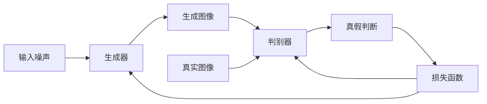
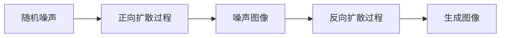

# AIGC的应用：图像生成

## 1.背景介绍

在过去几年中,人工智能生成内容(AIGC)技术取得了长足进步,尤其是在图像生成领域。AIGC图像生成模型能够根据文本描述生成逼真的图像,这在很大程度上改变了人们创作和体验视觉内容的方式。

图像生成的应用场景广泛,包括设计、广告、娱乐等领域。通过输入文本提示,用户可以快速获得所需的图像,极大地提高了工作效率。此外,AIGC图像生成技术还可用于数据增强、虚拟现实等领域,为人工智能的发展开辟了新的可能性。

## 2.核心概念与联系

### 2.1 生成对抗网络(GAN)

生成对抗网络(Generative Adversarial Networks, GAN)是AIGC图像生成的核心技术之一。GAN由两个神经网络组成:生成器(Generator)和判别器(Discriminator)。生成器的目标是生成逼真的图像,而判别器则试图区分生成的图像和真实图像。通过两个网络的对抗训练,生成器不断提高生成图像的质量,最终达到以假乱真的效果。



### 2.2 扩散模型(Diffusion Model)

扩散模型是另一种流行的AIGC图像生成技术。它通过一系列扩散和反扩散步骤,从随机噪声中生成图像。在训练过程中,模型学习如何从噪声中提取图像信息,并最终生成所需的图像。与GAN相比,扩散模型通常能生成更高质量、更多样化的图像。



### 2.3 文本到图像生成(Text-to-Image Generation)

文本到图像生成是AIGC图像生成的核心应用之一。用户输入文本描述,模型根据描述生成相应的图像。这种方式大大简化了图像创作过程,使普通用户也能轻松获得所需的图像。目前,许多知名的AIGC图像生成模型(如DALL-E、Stable Diffusion等)都支持文本到图像生成功能。

## 3.核心算法原理具体操作步骤

### 3.1 GAN的训练过程

1. **初始化生成器和判别器网络**:通常使用卷积神经网络(CNN)作为生成器和判别器的网络结构。

2. **生成器生成图像**:生成器从随机噪声开始,生成一批假图像。

3. **判别器判别真假**:判别器接收生成器生成的假图像和真实图像,并对它们进行真假判别。

4. **计算损失函数**:根据判别器的判别结果,计算生成器和判别器的损失函数。生成器的目标是使判别器无法区分真假图像,而判别器则是正确区分真假图像。

5. **反向传播更新网络参数**:根据损失函数,使用反向传播算法分别更新生成器和判别器的网络参数。

6. **重复训练**:重复执行步骤2-5,直到模型收敛。

### 3.2 扩散模型的训练过程

1. **正向扩散过程**:从真实图像开始,通过添加高斯噪声,逐步扩散图像,直到图像完全变为噪声。

2. **反向扩散过程**:从噪声图像开始,模型学习如何逐步去噪,最终重建原始图像。

3. **损失函数计算**:比较重建图像与原始图像的差异,计算损失函数。

4. **反向传播更新网络参数**:根据损失函数,使用反向传播算法更新模型参数。

5. **重复训练**:重复执行步骤1-4,直到模型收敛。

### 3.3 文本到图像生成过程

1. **文本编码**:将用户输入的文本描述编码为向量表示。

2. **条件图像生成**:将文本向量作为条件输入,结合噪声向量,通过预训练的生成模型(如GAN或扩散模型)生成图像。

3. **反复采样**:由于生成过程存在随机性,可以多次采样,生成多个候选图像。

4. **图像评分**:使用评分模型对生成的图像进行评分,选择分数最高的图像作为最终输出。

## 4.数学模型和公式详细讲解举例说明

### 4.1 GAN损失函数

GAN的损失函数由生成器损失和判别器损失组成,通常使用最小化最大化框架(Minimax Framework)进行优化。

生成器损失:

$$\underset{G}{\mathrm{min}}\,\mathbb{E}_{z\sim p_z(z)}[\log(1-D(G(z)))]$$

判别器损失:

$$\underset{D}{\mathrm{max}}\,\mathbb{E}_{x\sim p_{\mathrm{data}}(x)}[\log D(x)]+\mathbb{E}_{z\sim p_z(z)}[\log(1-D(G(z)))]$$

其中,$G$表示生成器,$D$表示判别器,$z$是随机噪声向量,$x$是真实数据样本。

在训练过程中,生成器试图最小化$\log(1-D(G(z)))$,使生成的图像看起来更真实;判别器则试图最大化$\log D(x)+\log(1-D(G(z)))$,以更好地区分真实和生成的图像。

### 4.2 扩散模型损失函数

扩散模型的损失函数通常采用加性高斯噪声模型。给定一个真实图像$x_0$,正向扩散过程可以表示为:

$$q(x_t|x_{t-1})=\mathcal{N}(x_t;\sqrt{1-\beta_t}x_{t-1},\beta_tI)$$

其中,$\beta_t$是扩散步长,$I$是单位矩阵。

反向扩散过程的目标是从噪声图像$x_T$重建原始图像$x_0$,可以表示为:

$$p_\theta(x_{t-1}|x_t)=\mathcal{N}(x_{t-1};\mu_\theta(x_t,t),\Sigma_\theta(x_t,t))$$

其中,$\mu_\theta$和$\Sigma_\theta$是神经网络参数化的均值和方差函数。

扩散模型的损失函数是重建图像$x_0$与真实图像$x_0$之间的加权均方误差:

$$\mathcal{L}_\theta=\mathbb{E}_{x_0,\epsilon}\Big[\sum_{t=1}^T\lambda(t)||\epsilon_t-\epsilon_\theta(x_t,t)||^2\Big]$$

其中,$\lambda(t)$是加权系数,$\epsilon_\theta$是模型预测的噪声。

### 4.3 文本到图像生成的评分模型

在文本到图像生成过程中,评分模型用于评估生成图像与文本描述的相关性。常用的评分模型包括:

1. **CLIP模型**:通过对比文本和图像的embedding向量,计算它们之间的余弦相似度作为评分。

$$s(I,T)=\frac{I^T\cdot T}{\|I\|\|T\|}$$

其中,$I$和$T$分别表示图像和文本的embedding向量。

2. **BLIP模型**:使用Vision-Language双流Transformer结构,直接预测图像和文本的相关性分数。

$$s(I,T)=\mathrm{MLP}([\mathrm{ViT}(I),\mathrm{Transformer}(T)])$$

其中,$\mathrm{ViT}$和$\mathrm{Transformer}$分别编码图像和文本,$\mathrm{MLP}$是多层感知机头。

## 5.项目实践：代码实例和详细解释说明

### 5.1 使用Stable Diffusion进行文本到图像生成

Stable Diffusion是一个基于扩散模型的AIGC图像生成模型,可以通过简单的Python代码实现文本到图像生成。

```python
# 导入必要的库
from diffusers import StableDiffusionPipeline
import torch

# 加载Stable Diffusion模型
model_id = "runwayml/stable-diffusion-v1-5"
pipe = StableDiffusionPipeline.from_pretrained(model_id, torch_dtype=torch.float16)

# 设置生成参数
prompt = "A photorealistic image of a beautiful sunset over the ocean"
image_guidance_scale = 7.5
num_inference_steps = 50

# 生成图像
image = pipe(prompt, guidance_scale=image_guidance_scale, num_inference_steps=num_inference_steps)["sample"][0]

# 保存图像
image.save("sunset.png")
```

代码解释:

1. 导入必要的库,包括`diffusers`和`torch`。
2. 使用`StableDiffusionPipeline.from_pretrained`加载预训练的Stable Diffusion模型。
3. 设置文本提示`prompt`、图像指导强度`image_guidance_scale`和推理步数`num_inference_steps`。
4. 调用`pipe`函数,传入提示和参数,生成图像。
5. 使用`image.save`函数将生成的图像保存为PNG文件。

### 5.2 使用CLIP评分模型评估生成图像质量

CLIP是一种用于评估图像和文本相关性的模型,可以用于评估生成图像的质量。

```python
from PIL import Image
import torch
import clip

# 加载CLIP模型
device = "cuda" if torch.cuda.is_available() else "cpu"
model, preprocess = clip.load("ViT-B/32", device=device)

# 读取生成的图像
image = preprocess(Image.open("sunset.png")).unsqueeze(0).to(device)

# 编码文本提示
text = clip.tokenize(["A photorealistic image of a beautiful sunset over the ocean"]).to(device)

# 计算图像和文本的相似度分数
with torch.no_grad():
    image_features = model.encode_image(image)
    text_features = model.encode_text(text)
    similarity = (image_features @ text_features.T).softmax(dim=-1)
    print(f"Similarity score: {similarity[0, 0]:.4f}")
```

代码解释:

1. 导入必要的库,包括`PIL`、`torch`和`clip`。
2. 使用`clip.load`加载预训练的CLIP模型。
3. 使用`Image.open`读取生成的图像,并使用`preprocess`函数预处理图像。
4. 使用`clip.tokenize`编码文本提示。
5. 使用`model.encode_image`和`model.encode_text`分别编码图像和文本特征。
6. 计算图像和文本特征的余弦相似度作为相似度分数。

通过运行上述代码,可以获得生成图像与文本提示的相似度分数,用于评估图像质量。

## 6.实际应用场景

AIGC图像生成技术在多个领域都有广泛的应用,包括:

1. **设计和创意**:设计师可以使用AIGC图像生成工具快速创作概念图、插画、海报等视觉内容,提高工作效率。

2. **广告和营销**:企业可以根据产品描述生成吸引人的广告图像,提高营销效果。

3. **娱乐和艺术**:艺术家可以使用AIGC图像生成技术探索新的创作方式,实现更丰富的视觉表现形式。

4. **教育和培训**:教师可以生成相关图像辅助教学,提高学生的理解和记忆效果。

5. **科研和可视化**:研究人员可以使用AIGC图像生成技术可视化复杂的数据和概念,促进科研成果的传播和理解。

6. **虚拟现实和游戏**:AIGC图像生成技术可以用于生成虚拟环境和游戏场景,提高沉浸感和真实感。

7. **辅助视障人士**:通过生成相关图像并配合语音描述,可以帮助视障人士更好地理解和体验视觉内容。

## 7.工具和资源推荐

### 7.1 AIGC图像生成工具

1. **Stable Diffusion**:基于扩散模型的开源AIGC图像生成工具,支持文本到图像生成、图像到图像转换等功能。

2. **DALL-E 2**:由OpenAI开发的AIGC图像生成模型,能够根据自然语言描述生成逼真的图像。

3. **Midjourney**:基于人工智能的图像生成工具,提供友好的