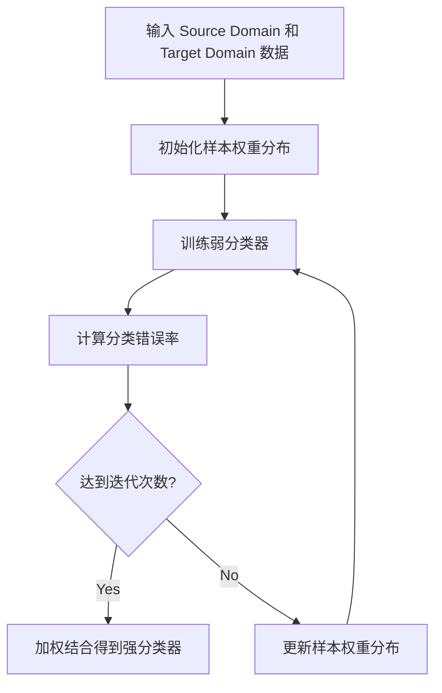

# AI人工智能核心算法原理与代码实例讲解：迁移学习

## 1. 背景介绍
### 1.1 什么是迁移学习
#### 1.1.1 迁移学习的定义
迁移学习(Transfer Learning)是机器学习的一个重要分支，其目标是利用已有的知识来辅助目标问题的学习。传统的机器学习方法通常假设训练数据和测试数据处于同一个特征空间且服从相同分布，然而在很多现实应用中，这个假设往往是不成立的。迁移学习试图解决这一问题，通过从 source domain 学习知识来辅助 target domain 的学习。

#### 1.1.2 迁移学习的类型
迁移学习可分为以下三类:

1. 基于实例的迁移学习(Instance based Transfer Learning)：通过权重重用 source domain 的样本来辅助 target domain 的学习。
2. 基于特征的迁移学习(Feature based Transfer Learning)：将 source domain 和 target domain 的数据映射到一个公共特征空间，利用 source domain 的特征表示来辅助 target domain 的学习。 
3. 基于模型的迁移学习(Model based Transfer Learning)：利用 source domain 学习到的模型参数来初始化 target domain 的模型参数，加速目标模型的学习。

#### 1.1.3 迁移学习的优势
与传统机器学习相比，迁移学习的主要优势在于：

1. 显著降低对目标领域标注数据的需求
2. 加速目标领域模型的学习速度  
3. 提高目标领域模型的性能表现

### 1.2 迁移学习的应用场景
迁移学习在很多领域都有广泛的应用，例如：

1. 计算机视觉：利用 ImageNet 预训练模型进行迁移学习是提高小样本图像分类性能的重要手段。
2. 自然语言处理：利用在大规模语料上预训练的词向量如 word2vec、Glove 等进行迁移学习，可以显著提高下游任务的性能。 
3. 语音识别：利用在大规模语料库训练的声学模型进行迁移学习，可以提高特定场景下语音识别的精度。
4. 推荐系统：利用用户在不同平台、场景下的行为数据进行迁移，可以提高冷启动用户的推荐质量。

## 2. 核心概念与联系
### 2.1 Domain 和 Task
在迁移学习中，Domain 指的是一个数据的特征空间 X 和边缘概率分布 P(X)，其中 X={x1,x2,...,xn} 。Task 则由一个标签空间 Y 和条件概率分布 P(Y|X) 来定义。

### 2.2 Source Domain 和 Target Domain
迁移学习就是利用一个 Source Domain DS 的知识来辅助 Target Domain DT 的学习。其中 DS 和 DT 可能是不同的，但必须相关。DS 通常有大量的标注数据，而 DT 的标注数据非常有限。

### 2.3 Negative Transfer
负迁移(Negative Transfer)指的是利用 Source Domain 的知识反而降低了 Target Domain 的学习性能。产生负迁移的原因通常是 DS 和 DT 的相关性不够，或者迁移学习方法不恰当。因此如何避免负迁移是迁移学习的一个重要问题。

## 3. 核心算法原理具体操作步骤
本节将重点介绍基于实例的迁移学习算法 TrAdaBoost 的原理和实现步骤。

### 3.1 TrAdaBoost 算法原理
TrAdaBoost 的核心思想是利用 AdaBoost 的 Boosting 思想来调整 Source Domain 样本的权重，使得在每轮迭代后被错分的 Target Domain 样本权重增大，同时降低那些与 Target Domain 样本不一致的 Source Domain 样本的权重。

算法的主要步骤如下：

1. 初始化 Source Domain 和 Target Domain 样本的权重分布 
2. 针对当前样本分布，训练出一个弱分类器 
3. 计算该分类器在 Source Domain 和 Target Domain 上的分类错误率
4. 利用错误率来更新 Source Domain 和 Target Domain 样本的权重
5. 重复步骤2-4，直到达到预设的迭代次数
6. 将各个弱分类器加权结合得到最终的强分类器

### 3.2 算法流程图


## 4. 数学模型和公式详细讲解举例说明
### 4.1 记号说明
- DSX, DSY: Source Domain 的样本集和标签集
- DTX, DTY: Target Domain 的样本集和标签集 
- T: 最大迭代次数
- ht: 第 t 轮迭代得到的弱分类器
- $\epsilon_t^S$, $\epsilon_t^T$: ht 在 Source/Target Domain 上的分类错误率

### 4.2 样本权重的初始化
令 Source Domain 有 n 个样本，Target Domain 有 m 个样本，样本的初始权重分别为:

$$
\begin{aligned}
w_{1i}^{S}=& \frac{1}{n}, i=1,2,...,n \
w_{1i}^{T}=& \frac{1}{m}, i=1,2,...,m
\end{aligned}
$$

### 4.3 弱分类器训练
在第 t 轮迭代中，我们根据当前的样本权重分布 $w_t^S$ 和 $w_t^T$ 来训练一个弱分类器 ht。ht 可以是任意的分类算法，如决策树、SVM等。

### 4.4 分类错误率计算
我们用 $\epsilon_t^S$ 和 $\epsilon_t^T$ 分别表示 ht 在 Source Domain 和 Target Domain 上的分类错误率:

$$
\begin{aligned}
\epsilon_t^S =& \sum_{i=1}^{n} w_{ti}^S \cdot \mathbb{I}(h_t(x_i^S) \neq y_i^S) \
\epsilon_t^T =& \sum_{i=1}^{m} w_{ti}^T \cdot \mathbb{I}(h_t(x_i^T) \neq y_i^T)
\end{aligned}
$$

其中 $\mathbb{I}$ 为指示函数。

### 4.5 样本权重更新
TrAdaBoost 的核心在于样本权重 $w_t^S$ 和 $w_t^T$ 的更新。权重更新公式为:

$$
\begin{aligned}
w_{t+1,i}^{S}=& \frac{w_{ti}^{S}}{Z_t^{S}} \cdot \exp (-\alpha_t \cdot \mathbb{I}(h_t(x_i^S)=y_i^S)) \
w_{t+1,i}^{T}=& \frac{w_{ti}^{T}}{Z_t^{T}} \cdot \exp (\alpha_t \cdot \mathbb{I}(h_t(x_i^T) \neq y_i^T))
\end{aligned}
$$

其中 $\alpha_t = \frac{1}{2} \ln (\frac{1-\epsilon_t^S}{\epsilon_t^S})$, $Z_t^S$ 和 $Z_t^T$ 为规范化因子:

$$
\begin{aligned}
Z_t^S =& \sum_{i=1}^{n} w_{ti}^{S} \cdot \exp (-\alpha_t \cdot \mathbb{I}(h_t(x_i^S)=y_i^S))  \
Z_t^T =& \sum_{i=1}^{m} w_{ti}^{T} \cdot \exp (\alpha_t \cdot \mathbb{I}(h_t(x_i^T) \neq y_i^T)) 
\end{aligned}
$$

可以看出，对于 Source Domain，被分对的样本权重降低，分错的权重升高；而对于 Target Domain，被分错的样本权重升高，与源域中分类结果不一致的样本权重降低。

### 4.6 强分类器组合
经过 T 轮迭代后，我们得到 T 个弱分类器 $h_1,h_2,...,h_T$。最终的强分类器 H 为:

$$
H(x)=\text{sign} \left(\sum_{t=1}^{T} \alpha_t \cdot h_t(x)\right)
$$

其中 $\alpha_t = \frac{1}{2} \ln (\frac{1-\epsilon_t^T}{\epsilon_t^T})$。

## 5. 项目实践：代码实例和详细解释说明
下面我们用 Python 来实现 TrAdaBoost 算法。

```python
import numpy as np
from sklearn.tree import DecisionTreeClassifier

class TrAdaBoost:
    def __init__(self, T=10):
        self.T = T
        self.weak_clfs = []
        self.betas = []
        
    def fit(self, Xs, ys, Xt, yt):
        """
        Xs: Source Domain 特征
        ys: Source Domain 标签
        Xt: Target Domain 特征
        yt: Target Domain 标签
        """
        ns, nt = len(Xs), len(Xt)
        ws, wt = np.ones(ns) / ns, np.ones(nt) / nt
        
        for t in range(self.T):
            # 训练弱分类器
            clf = DecisionTreeClassifier(max_depth=3)
            clf.fit(np.concatenate([Xs, Xt]), np.concatenate([ys, yt]), 
                    sample_weight=np.concatenate([ws, wt]))
            
            # 计算错误率
            es = np.sum(ws * (clf.predict(Xs) != ys)) / np.sum(ws)
            et = np.sum(wt * (clf.predict(Xt) != yt)) / np.sum(wt)
            
            # 计算 alpha
            alpha = np.log((1-es) / es) / 2
            
            # 更新权重
            ws *= np.exp(-alpha * (clf.predict(Xs) == ys))
            ws /= np.sum(ws)
            wt *= np.exp(alpha * (clf.predict(Xt) != yt))
            wt /= np.sum(wt)
            
            # 保存弱分类器和 beta
            self.weak_clfs.append(clf)
            self.betas.append(np.log((1-et) / et) / 2)
        
    def predict(self, X):
        preds = np.array([clf.predict(X) for clf in self.weak_clfs])
        return np.sign(np.sum(preds.T * self.betas, axis=1))
```

代码说明：

1. 初始化 Source Domain 和 Target Domain 样本的权重分布 ws 和 wt
2. 进入迭代，每轮迭代：
   - 用当前的权重分布训练一个决策树弱分类器
   - 计算该分类器在源域和目标域上的错误率 es 和 et
   - 计算 alpha 和 beta
   - 更新源域和目标域的样本权重
   - 保存训练好的弱分类器和 beta 值
3. 预测时，将所有弱分类器的预测结果用 beta 加权，然后取 sign

## 6. 实际应用场景
迁移学习在很多领域都有广泛应用，下面列举几个实际的应用场景。

### 6.1 跨域文本分类
我们常常遇到这样的问题：在一个领域有大量标注数据，但在另一个领域的标注数据非常稀少。比如我们有大量的标注新闻，想利用这些数据来辅助诊断报告的分类。这就是一个典型的跨域文本分类问题，可以用迁移学习来解决。

### 6.2 图像识别
ImageNet 是计算机视觉领域一个非常重要的数据集，很多先进的CNN模型如 ResNet, Inception 都是在 ImageNet 上预训练得到的。将这些预训练模型应用到我们自己的图像识别任务上，通常可以大幅提高模型性能，尤其是在小样本的情况下。

### 6.3 语音识别
语音识别领域也有类似的应用。我们可以在大规模语料上训练声学模型，然后用迁移学习的方法将其应用到特定场景如车载语音、医疗语音等。

### 6.4 推荐系统
现在很多公司都有多个业务线和 App，不同业务线积累的用户行为数据可以互相借鉴。比如用户在购物 App 上的浏览、购买记录可以用来辅助新闻 App 的新闻推荐。

## 7. 工具和资源推荐
- [Transfer Learning Toolkit](https://github.com/thuml/Transfer-Learning-Toolkit)：一个基于 PyTorch 的