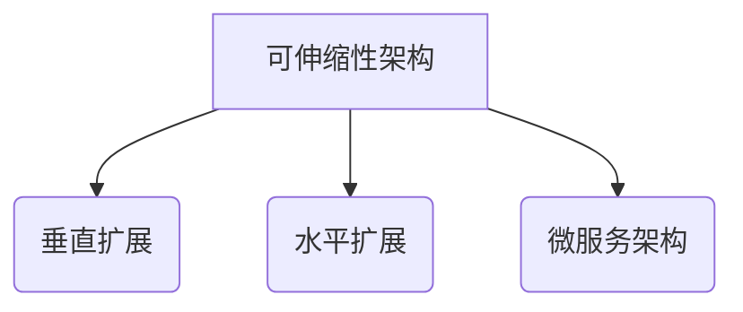
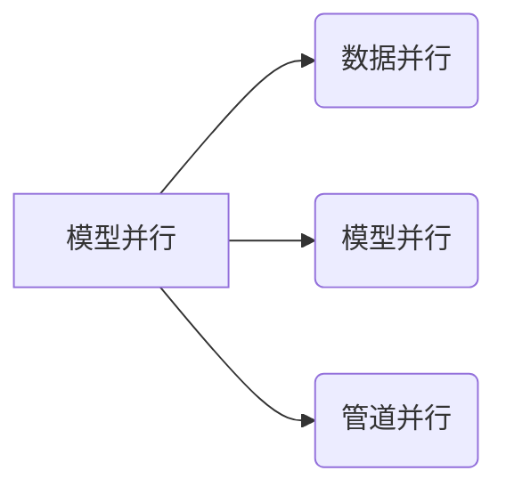
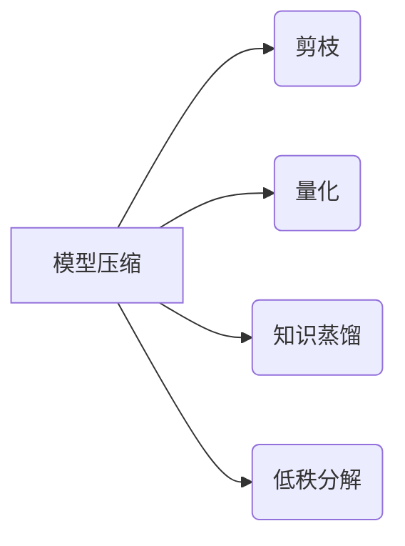
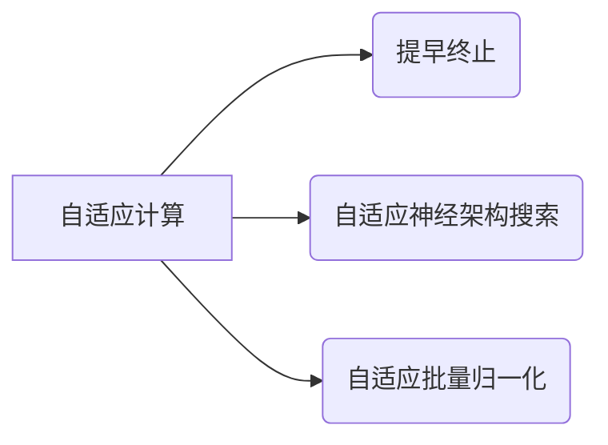
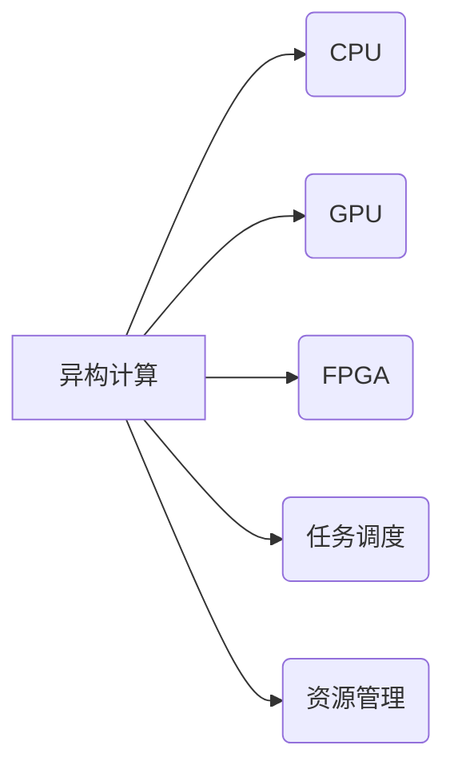

# AI可伸缩性未来趋势：展望与挑战

## 1.背景介绍

### 1.1 人工智能的兴起

人工智能(AI)在过去几十年中取得了长足的进步,从最初的专家系统和机器学习算法,发展到如今的深度学习和强化学习等先进技术。AI系统已经广泛应用于各个领域,如计算机视觉、自然语言处理、推荐系统、机器人等,为人类生活和工作带来了巨大便利。

### 1.2 AI系统规模不断扩大

随着数据量的激增和算力的提高,AI模型变得越来越大型和复杂。以GPT-3为例,其参数量高达1750亿个,训练所需的计算资源是以前最大模型的几百倍。大规模的AI模型在性能上确实取得了突破,但同时也带来了诸多挑战,如训练和推理的高计算开销、内存消耗等,这对系统的可伸缩性提出了更高要求。

### 1.3 可伸缩性的重要性

AI系统的可伸缩性是指在资源受限的情况下,能够有效地处理更大规模的数据和任务负载。良好的可伸缩性对于AI系统的高效运行、成本控制和持续发展至关重要。如何在保证性能的同时,提高AI系统的可伸缩性,是当前面临的一大挑战。

## 2.核心概念与联系

### 2.1 可伸缩性的定义

可伸缩性是指系统能够根据工作负载的变化,自动调整资源的使用,以满足性能需求。对于AI系统,可伸缩性包括以下几个方面:

- **计算资源可伸缩性**:能够根据需求动态调整CPU、GPU等计算资源。
- **存储资源可伸缩性**:能够根据数据量变化动态调整存储空间。
- **网络资源可伸缩性**:能够根据网络流量变化动态调整带宽资源。

### 2.2 可伸缩性与其他概念的关系

可伸缩性与AI系统的其他核心概念密切相关:

- **高性能**:高性能计算是AI系统的基础,可伸缩性使得系统能够在资源有限的情况下实现高性能。
- **高可用性**:可伸缩性有助于提高系统的可靠性和容错能力,从而提高可用性。
- **成本效率**:良好的可伸缩性有助于优化资源利用,降低运营成本。

### 2.3 可伸缩性架构模式

常见的可伸缩性架构模式包括:

- **垂直扩展(Scale Up)**:增加单个节点的资源,如CPU、内存等。
- **水平扩展(Scale Out)**:增加节点的数量,实现负载均衡。
- **微服务架构**:将系统拆分为小型、独立的微服务,实现弹性伸缩。



## 3.核心算法原理具体操作步骤

### 3.1 模型并行

对于大规模AI模型,单机无法满足训练和推理的资源需求,因此需要采用模型并行的方式,将模型分布在多个节点上并行执行。常见的模型并行方法有:

1. **数据并行**:将训练数据划分到多个节点,每个节点独立计算梯度,然后汇总梯度进行模型更新。
2. **模型并行**:将模型的不同层或组件分配到不同节点,通过通信实现前向和反向传播。
3. **管道并行**:将模型划分为多个阶段,不同阶段分配到不同节点,实现流水线并行执行。



### 3.2 模型压缩

由于大规模模型的存储和计算开销很高,因此需要采用模型压缩技术来减小模型的规模,提高效率。常见的模型压缩方法包括:

1. **剪枝**:移除模型中的冗余权重连接,从而减小模型大小。
2. **量化**:将浮点数权重转换为低比特表示,如8比特或更低,减小模型大小和计算量。
3. **知识蒸馏**:使用一个小模型去学习一个大模型的行为,从而获得接近大模型的性能。
4. **低秩分解**:将权重矩阵分解为低秩形式,减少参数数量。



### 3.3 自适应计算

为了提高资源利用效率,AI系统可以采用自适应计算的方式,根据输入数据的特征动态调整计算量。常见的自适应计算方法有:

1. **提早终止**:对于一些简单的输入样本,模型可以在中间层提早输出结果,避免进行完整的前向传播。
2. **自适应神经架构搜索**:自动搜索适合当前任务和资源约束的最佳网络架构。
3. **自适应批量归一化**:根据输入数据的统计特征动态调整批量归一化参数,以适应不同的数据分布。



### 3.4 异构计算

AI系统通常需要同时利用CPU、GPU、FPGA等异构计算资源,以充分发挥不同硬件的优势。异构计算的核心是任务调度和资源管理,需要根据任务特征和资源状况,将不同的计算任务调度到最合适的硬件资源上执行。



## 4.数学模型和公式详细讲解举例说明

### 4.1 模型并行中的梯度汇总

在数据并行中,每个节点独立计算局部梯度,然后需要将这些局部梯度进行汇总,得到全局梯度,再用于模型更新。设有N个节点,第i个节点计算得到的局部梯度为$\nabla_i$,则全局梯度可以通过以下公式计算:

$$\nabla = \frac{1}{N}\sum_{i=1}^N\nabla_i$$

### 4.2 模型压缩中的量化

量化是将浮点数权重转换为低比特表示,以减小模型大小和计算量。常见的量化方法是线性量化,将权重$w$映射到一个有限的离散值集合$Q$:

$$Q(w) = \begin{cases}
\lfloor\frac{w}{s}\rceil, & \text{if } s > 0\\
0, & \text{if } s = 0
\end{cases}$$

其中$s$是一个缩放因子,用于控制量化的精度。

### 4.3 异构计算中的任务调度

异构计算中,需要将不同的计算任务调度到合适的硬件资源上执行。设有M种硬件资源,第j种资源的计算能力为$c_j$,任务i的计算量为$w_i$,则任务i分配到第j种资源的执行时间为:

$$t_{ij} = \frac{w_i}{c_j}$$

任务调度的目标是minimizeminimize最大的执行时间,即:

$$\min\limits_{x_{ij}}\max\limits_{1\leq i\leq n}\sum_{j=1}^Mt_{ij}x_{ij}$$

其中$x_{ij}$是一个0-1变量,表示任务i是否分配到第j种资源。这是一个整数线性规划问题,可以使用各种优化算法求解。

## 5.项目实践:代码实例和详细解释说明

以下是一个使用PyTorch实现的简单模型并行示例:

```python
import torch
import torch.nn as nn
from torch.nn.parallel import DistributedDataParallel as DDP

# 定义模型
class ToyModel(nn.Module):
    def __init__(self):
        super(ToyModel, self).__init__()
        self.linear1 = nn.Linear(10, 20)
        self.linear2 = nn.Linear(20, 5)

    def forward(self, x):
        x = self.linear1(x)
        x = nn.functional.relu(x)
        x = self.linear2(x)
        return x

# 初始化模型和优化器
model = ToyModel()
optimizer = torch.optim.SGD(model.parameters(), lr=0.01)

# 封装为DDP模型
model = DDP(model)

# 训练循环
for epoch in range(10):
    for data in train_loader:
        inputs, labels = data
        optimizer.zero_grad()
        outputs = model(inputs)
        loss = criterion(outputs, labels)
        loss.backward()
        optimizer.step()
```

在这个示例中,我们首先定义了一个简单的前馈神经网络模型`ToyModel`。然后,我们使用PyTorch的`DistributedDataParallel`(DDP)将模型封装为DDP模型,实现数据并行。在训练循环中,每个节点计算局部梯度,然后DDP自动将这些梯度汇总,并使用全局梯度更新模型参数。

DDP还提供了一些高级功能,如梯度压缩、自动梯度累积等,可以进一步提高训练效率。

## 6.实际应用场景

AI系统的可伸缩性在许多实际应用场景中都扮演着重要角色:

### 6.1 大规模语言模型

像GPT-3这样的大规模语言模型需要巨大的计算资源来进行训练和推理。通过模型并行、模型压缩等技术,可以在多个节点上并行训练和推理,从而提高可伸缩性。

### 6.2 推荐系统

推荐系统需要实时处理大量用户请求,并根据用户行为进行个性化推荐。通过水平扩展和负载均衡,可以提高系统的吞吐量和响应能力,满足大规模用户需求。

### 6.3 计算机视觉

在自动驾驶、智能监控等计算机视觉应用中,需要实时处理大量视频流数据。通过异构计算和自适应计算,可以充分利用GPU等加速硬件,提高视频处理的实时性和效率。

### 6.4 科学计算

科学计算领域中,常常需要处理海量数据和进行大规模模拟计算。通过分布式计算和模型并行,可以将计算任务分散到多个节点,提高计算效率和可伸缩性。

## 7.工具和资源推荐

### 7.1 深度学习框架

- **PyTorch**:支持分布式训练、模型并行、自动混合精度等可伸缩性功能。
- **TensorFlow**:提供分布式策略、模型并行、XLA编译器等可伸缩性工具。
- **MindSpore**:华为开源的AI框架,支持自动并行、模型并行等功能。

### 7.2 分布式训练工具

- **Horovod**:以Ring AllReduce为核心的分布式训练工具,支持多种深度学习框架。
- **DeepSpeed**:微软开源的深度学习优化库,提供模型并行、ZeRO优化等功能。
- **Ray**:分布式计算框架,支持分布式训练、服务化部署等。

### 7.3 模型压缩工具

- **TensorRT**:NVIDIA推出的高性能深度学习推理优化器,支持多种模型压缩技术。
- **LPOT**:英特尔开源的模型优化工具,支持量化、剪枝、知识蒸馏等功能。
- **PaddleSlim**:百度开源的模型压缩库,集成了多种压缩策略。

### 7.4 资源管理工具

- **Kubernetes**:广泛使用的容器编排工具,可用于管理AI系统的计算资源。
- **YARN**:Apache开源的资源管理和作业调度框架,常用于大数据和AI领域。
- **Slurm**:常见的工作负载管理器,用于管理HPC和AI集群资源。

## 8.总结:未来发展趋势与挑战

### 8.1 发展趋势

- **异构计算加速**:充分利用CPU、GPU、TPU、FPGA等异构计算资源,提高AI系统的计算能力。
- **分布式训练优化**:进