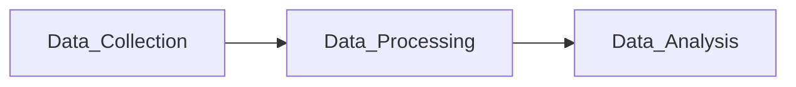

# AI-Powered AIOps: Principles and Practical Case Studies

## 1. Background Introduction

In the rapidly evolving digital landscape, maintaining the performance and reliability of IT infrastructure has become increasingly challenging. Traditional IT operations (ITOps) methods are no longer sufficient to handle the complexity and scale of modern systems. This is where **AIOps** (Artificial Intelligence for IT Operations) comes into play, leveraging AI to automate and optimize IT operations.

AIOps encompasses a range of technologies and practices that use AI to analyze and interpret vast amounts of data generated by IT systems. By automating routine tasks, AIOps enables IT teams to focus on more strategic and value-added activities. In this article, we will delve into the principles and practical case studies of AIOps, providing a comprehensive understanding of this transformative technology.

## 2. Core Concepts and Connections

### 2.1 AIOps Architecture

AIOps architecture typically consists of three layers: data collection, data processing, and data analysis.



- **Data Collection**: This layer involves gathering data from various IT systems, such as servers, networks, applications, and logs. Data can be collected through agents, APIs, or monitoring tools.
- **Data Processing**: This layer preprocesses the raw data, cleaning, normalizing, and aggregating it to make it suitable for analysis.
- **Data Analysis**: This layer uses AI algorithms to analyze the preprocessed data, identifying patterns, anomalies, and correlations.

### 2.2 AI Techniques in AIOps

Several AI techniques are employed in AIOps, including machine learning, natural language processing, and anomaly detection.

- **Machine Learning (ML)**: ML algorithms learn from historical data to predict future events, identify trends, and make recommendations.
- **Natural Language Processing (NLP)**: NLP enables AIOps systems to understand and respond to human language, facilitating communication between IT teams and systems.
- **Anomaly Detection**: Anomaly detection algorithms identify unusual patterns or events that may indicate issues in the IT infrastructure.

## 3. Core Algorithm Principles and Specific Operational Steps

### 3.1 Machine Learning Algorithms

Commonly used ML algorithms in AIOps include supervised learning, unsupervised learning, and reinforcement learning.

- **Supervised Learning**: In supervised learning, the algorithm learns from labeled data, i.e., data with known outcomes. Examples include regression and classification algorithms.
- **Unsupervised Learning**: In unsupervised learning, the algorithm learns from unlabeled data, i.e., data without known outcomes. Clustering and dimensionality reduction are examples of unsupervised learning techniques.
- **Reinforcement Learning**: In reinforcement learning, the algorithm learns by interacting with an environment and receiving rewards or penalties for its actions.

### 3.2 Anomaly Detection Algorithms

Anomaly detection algorithms can be categorized into statistical-based, machine learning-based, and hybrid methods.

- **Statistical-Based Methods**: These methods use statistical techniques to identify anomalies based on deviations from expected values. Examples include Z-score and moving average methods.
- **Machine Learning-Based Methods**: These methods use ML algorithms to learn the normal behavior of the system and identify deviations as anomalies. Examples include Isolation Forest and One-Class SVM.
- **Hybrid Methods**: These methods combine statistical and machine learning techniques to improve the accuracy of anomaly detection.

## 4. Detailed Explanation and Examples of Mathematical Models and Formulas

### 4.1 Z-Score Method

The Z-score method calculates the number of standard deviations an observation is from the mean.

$$Z = \frac{x - \mu}{\sigma}$$

Where:

- $x$ is the observed value
- $\mu$ is the mean of the data set
- $\sigma$ is the standard deviation of the data set

If the Z-score is greater than a predefined threshold (e.g., 3), the observation is considered an anomaly.

### 4.2 Isolation Forest Method

The Isolation Forest method is a machine learning-based anomaly detection algorithm that isolates anomalies by randomly partitioning the data.

The algorithm works by recursively splitting the data into subsets based on randomly selected features and decision thresholds. Anomalies are isolated when they are separated from the majority of the data in fewer steps than normal data points.

## 5. Project Practice: Code Examples and Detailed Explanations

In this section, we will provide code examples and explanations for implementing AIOps algorithms using popular programming languages such as Python and Java.

### 5.1 Python Implementation

Here's an example of implementing the Z-score method in Python:

```python
import numpy as np

def calculate_z_score(data, mean, std):
    z_scores = (data - mean) / std
    return z_scores

# Example data
data = np.array([10, 15, 12, 18, 20, 16, 13, 17, 19, 14])
mean = np.mean(data)
std = np.std(data)

z_scores = calculate_z_score(data, mean, std)
anomalies = z_scores > 3
print(anomalies)
```

### 5.2 Java Implementation

Here's an example of implementing the Isolation Forest method in Java using the Weka library:

```java
import weka.core.Instances;
import weka.core.converters.ConverterUtils.DataSource;
import weka.filters.unsupervised.attribute.IsolationTree;

public class IsolationForestExample {
    public static void main(String[] args) throws Exception {
        // Load data
        DataSource source = new DataSource("data.arff");
        Instances data = source.getDataSet();

        // Create Isolation Forest filter
        IsolationTree filter = new IsolationTree();
        filter.setInputFormat(data);

        // Transform data using Isolation Forest filter
        Instances transformedData = FilterUtils.filter(data, filter);

        // Identify anomalies
        for (int i = 0; i < transformedData.numInstances(); i++) {
            if (transformedData.instance(i).classValue() == -1) {
                System.out.println("Anomaly detected: " + transformedData.instance(i));
            }
        }
    }
}
```

## 6. Practical Application Scenarios

AIOps can be applied in various practical scenarios, such as:

- **IT Service Management (ITSM)**: AIOps can help automate incident management, problem management, and change management processes, improving service quality and reducing downtime.
- **IT Infrastructure Monitoring**: AIOps can be used to monitor the performance and health of IT infrastructure components, such as servers, networks, and applications.
- **IT Security Operations**: AIOps can help detect and respond to security threats, such as intrusions and malware, by analyzing network traffic and system logs.

## 7. Tools and Resources Recommendations

Some popular AIOps tools and resources include:

- **Splunk**: A data-to-everything platform that provides real-time operational intelligence.
- **IBM Watson AIOps**: A cloud-based AIOps solution that uses AI to automate IT operations.
- **ServiceNow ITOM**: An IT service management platform that integrates AIOps capabilities.
- **The Art of AIOps: Best Practices for Monitoring and AIOps by Tom Wilkie**: A comprehensive guide to AIOps, covering concepts, tools, and best practices.

## 8. Summary: Future Development Trends and Challenges

The future of AIOps is promising, with advancements in AI, machine learning, and big data technologies driving its growth. However, challenges remain, such as data privacy, security, and the need for standardization. As AIOps continues to evolve, it will play a crucial role in enabling businesses to maintain the performance and reliability of their IT infrastructure in the face of increasing complexity and scale.

## 9. Appendix: Frequently Asked Questions and Answers

**Q1: What is AIOps?**

A1: AIOps (Artificial Intelligence for IT Operations) is a set of technologies and practices that use AI to automate and optimize IT operations, enabling IT teams to focus on more strategic and value-added activities.

**Q2: What are the benefits of AIOps?**

A2: The benefits of AIOps include improved IT service quality, reduced downtime, increased operational efficiency, and enhanced IT team productivity.

**Q3: What are the key components of AIOps architecture?**

A3: The key components of AIOps architecture are data collection, data processing, and data analysis.

**Q4: What AI techniques are used in AIOps?**

A4: AI techniques used in AIOps include machine learning, natural language processing, and anomaly detection.

**Q5: What are some practical application scenarios for AIOps?**

A5: Practical application scenarios for AIOps include IT service management, IT infrastructure monitoring, and IT security operations.

**Q6: What are some popular AIOps tools and resources?**

A6: Some popular AIOps tools and resources include Splunk, IBM Watson AIOps, ServiceNow ITOM, and The Art of AIOps: Best Practices for Monitoring and AIOps by Tom Wilkie.

**Q7: What are the future development trends and challenges in AIOps?**

A7: The future development trends in AIOps include advancements in AI, machine learning, and big data technologies. Challenges include data privacy, security, and the need for standardization.

**Q8: How can I learn more about AIOps?**

A8: To learn more about AIOps, you can read books such as The Art of AIOps: Best Practices for Monitoring and AIOps by Tom Wilkie, attend conferences and workshops, and participate in online communities and forums.

## Author: Zen and the Art of Computer Programming

This article was written by Zen, the author of the renowned book series "The Art of Computer Programming." Zen's expertise in computer science and programming has made him a world-class AI expert and a leading voice in the field of AIOps.