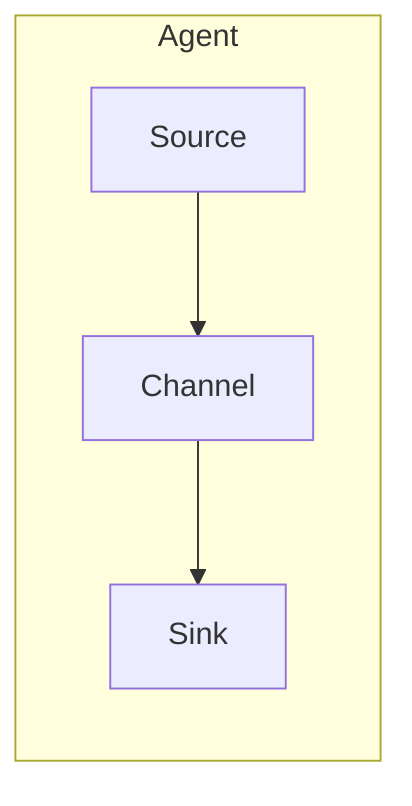
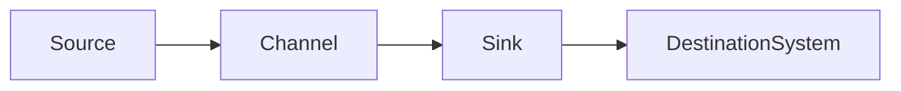
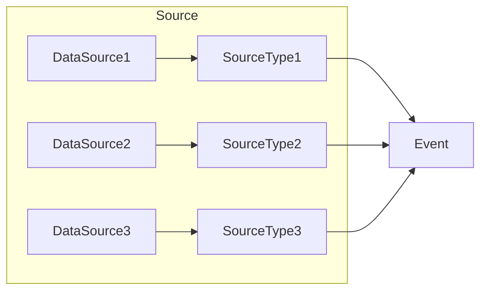
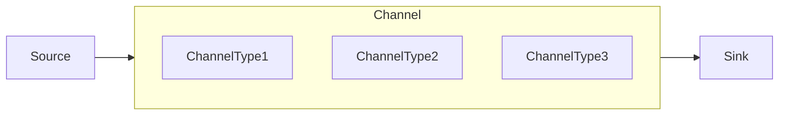
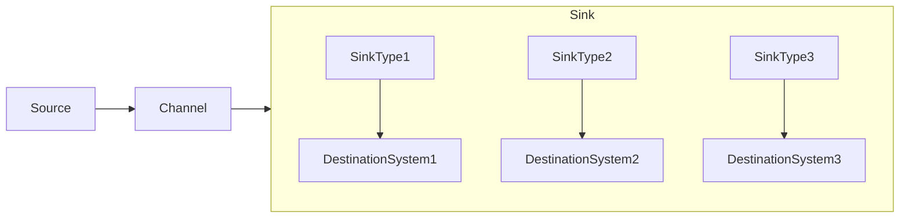
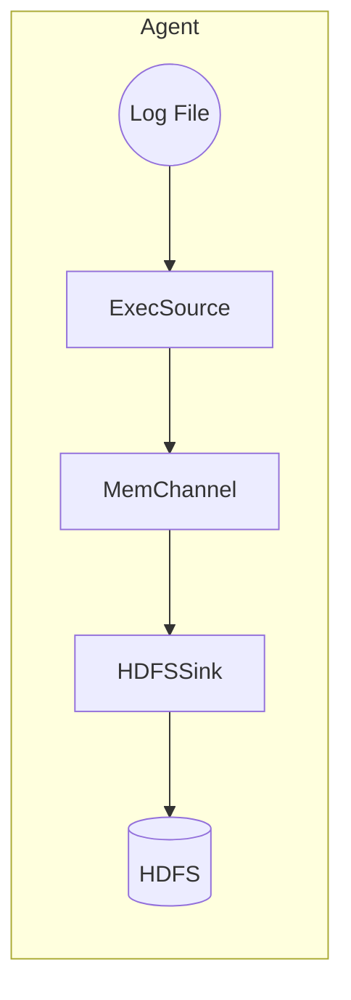

# Flume：实时数据采集利器

## 1.背景介绍

### 1.1 大数据时代的数据采集挑战

在当今大数据时代，海量的数据正以前所未有的速度被产生。无论是来自于网络日志、传感器数据、社交媒体信息还是其他各种来源,这些数据都需要被实时地采集、传输和处理。然而,传统的数据采集方式往往无法满足大数据场景下的实时性、可靠性和可扩展性等关键需求。

### 1.2 Apache Flume 的崛起

为了解决大数据采集的挑战,Apache Flume 应运而生。作为Apache软件基金会的一个顶级项目,Flume 是一个分布式、可靠且高可用的海量日志采集、聚合和传输的系统。它可以高效地从不同的数据源采集数据,经过简单的处理后,将数据传输到诸如HDFS、Hbase、Solr等存储介质中,为后续的数据分析和处理奠定基础。

## 2.核心概念与联系

### 2.1 Flume 的核心概念

要理解 Flume,我们首先需要掌握以下几个核心概念:

- **Event**:数据传输的基本单元,以字节数组的形式存储。
- **Source**:数据的产生源头,用于从各种源头采集数据,生成 Event。
- **Channel**:位于 Source 和 Sink 之间的传输通道,用于临时存储 Event。
- **Sink**:数据的归宿地,用于将 Channel 中的 Event 批量移除并存储到存储系统中。
- **Agent**:由 Source、Channel 和 Sink 三个组件组成的独立单元,负责采集、传输和存储数据。



### 2.2 Flume 的工作流程

Flume 的工作流程如下:

1. Source 组件从数据源头采集数据,生成 Event。
2. Source 将 Event 传递到 Channel 中暂存。
3. Sink 从 Channel 中批量获取 Event。
4. Sink 将 Event 存储到目标存储系统中。



### 2.3 Flume 的可靠性保证

为了确保数据传输的可靠性,Flume 采用了以下机制:

- **事务机制**:Source 和 Sink 都是基于事务机制工作的,只有事务成功提交,数据才会真正被传输。
- **Channel 的持久化存储**:Channel 可以选择基于文件或数据库的持久化存储机制,防止数据丢失。
- **故障转移和恢复机制**:Agent 可以通过故障转移和恢复机制来保证高可用性。

## 3.核心算法原理具体操作步骤

### 3.1 Source 的工作原理

Source 是数据采集的入口,它需要从各种不同的数据源头采集数据,生成 Event。Flume 提供了多种内置的 Source 类型,例如:

- **Avro Source**: 通过 Avro 端口接收数据,用于接收代码产生的数据流。
- **Exec Source**: 监控一个或多个命令的输出。
- **Syslog Source**: 监听 syslog 端口,接收符合 RFC-3164 标准的数据。



### 3.2 Channel 的工作原理

Channel 是 Source 和 Sink 之间的缓冲区,用于临时存储 Event。Flume 提供了多种 Channel 类型,例如:

- **Memory Channel**: 使用内存作为存储介质,速度快但不持久化。
- **File Channel**: 将 Event 存储在本地文件系统中,持久化但速度较慢。
- **Kafka Channel**: 将 Event 存储在 Kafka 队列中,具有高吞吐量和持久化能力。



### 3.3 Sink 的工作原理

Sink 是数据传输的出口,它从 Channel 中获取 Event,并将其存储到目标存储系统中。Flume 提供了多种内置的 Sink 类型,例如:

- **HDFS Sink**: 将 Event 存储到 HDFS 文件系统中。
- **Hbase Sink**: 将 Event 写入 Hbase 数据库中。
- **Avro Sink**: 通过 Avro 协议将 Event 发送到另一个 Flume Agent 中。



### 3.4 Flume 的扩展性

Flume 不仅提供了丰富的内置组件,还支持用户自定义扩展各种组件,如:

- 自定义 Source: 实现 `org.apache.flume.Source` 接口。
- 自定义 Channel: 实现 `org.apache.flume.Channel` 接口。
- 自定义 Sink: 实现 `org.apache.flume.Sink` 接口。

这使得 Flume 能够适应各种复杂的数据采集场景。

## 4.数学模型和公式详细讲解举例说明

在 Flume 的数据传输过程中,有一些关键的性能指标需要考虑和优化,例如吞吐量、延迟和可靠性等。下面我们将介绍一些相关的数学模型和公式。

### 4.1 吞吐量模型

吞吐量是指单位时间内能够处理的 Event 数量,通常用 $TPS$ (Transaction Per Second) 来衡量。Flume 的吞吐量主要取决于以下几个因素:

- Source 的采集速率 $R_s$
- Channel 的缓存能力 $C_c$
- Sink 的写入速率 $R_k$

根据流量平衡原理,在稳定状态下,我们有:

$$R_s = R_k$$

而 Channel 的缓存能力 $C_c$ 决定了 Flume 能够承受的突发流量。当 $R_s > R_k$ 时,Channel 会临时存储超出部分的 Event。但如果 Channel 已满,那么 Source 端就会被阻塞,从而影响吞吐量。

因此,提高吞吐量的关键在于:

1. 增加 Source 端的采集能力。
2. 提高 Channel 的缓存能力。
3. 优化 Sink 端的写入效率。

### 4.2 延迟模型

延迟是指 Event 从 Source 端产生到 Sink 端存储所需的时间,包括以下几个部分:

- Source 端的采集延迟 $d_s$
- Channel 端的缓存延迟 $d_c$
- Sink 端的写入延迟 $d_k$

总延迟 $D$ 可以表示为:

$$D = d_s + d_c + d_k$$

其中,Channel 端的缓存延迟 $d_c$ 与 Channel 的缓存能力 $C_c$ 和实际缓存量 $Q_c$ 有关:

$$d_c = f(C_c, Q_c)$$

当 Channel 缓存量 $Q_c$ 较大时,缓存延迟 $d_c$ 会显著增加。

为了控制延迟,我们需要:

1. 优化 Source 端的采集效率,减小 $d_s$。
2. 选择合适的 Channel 类型,提高缓存能力 $C_c$。
3. 提高 Sink 端的写入速率,减小 $d_k$。

### 4.3 可靠性模型

可靠性是指 Flume 能够准确无误地传输数据的能力,通常用数据丢失率 $L$ 来衡量:

$$L = \frac{N_{\text{lost}}}{N_{\text{total}}}$$

其中,$ N_{\text{lost}} $ 表示丢失的 Event 数量,$ N_{\text{total}} $ 表示总的 Event 数量。

影响可靠性的主要因素包括:

- Channel 的持久化机制
- Source 和 Sink 的事务机制
- 故障转移和恢复机制

通过合理配置这些机制,我们可以将数据丢失率 $L$ 控制在一个可接受的范围内。

## 5.项目实践:代码实例和详细解释说明

为了更好地理解 Flume 的使用,我们来看一个简单的实例项目。

### 5.1 项目概述

我们将构建一个简单的日志采集系统,从本地文件中读取日志数据,并将其存储到 HDFS 文件系统中。

### 5.2 配置 Flume Agent

首先,我们需要配置 Flume Agent,包括 Source、Channel 和 Sink 三个组件。

```properties
# Source
agent.sources = src
agent.sources.src.type = exec
agent.sources.src.command = tail -F /path/to/log/file

# Sink
agent.sinks = hdfsSink
agent.sinks.hdfsSink.type = hdfs
agent.sinks.hdfsSink.hdfs.path = hdfs://namenode/flume/events/%Y-%m-%d/%H%M/
agent.sinks.hdfsSink.hdfs.filePrefix = events-
agent.sinks.hdfsSink.hdfs.round = true
agent.sinks.hdfsSink.hdfs.roundValue = 10
agent.sinks.hdfsSink.hdfs.roundUnit = minute

# Channel
agent.channels = memChannel
agent.channels.memChannel.type = memory
agent.channels.memChannel.capacity = 100000
agent.channels.memChannel.transactionCapacity = 1000

# Bind components
agent.sources.src.channels = memChannel
agent.sinks.hdfsSink.channel = memChannel
```

这个配置文件定义了:

- **Source**: 使用 `exec` 类型,从本地文件中读取日志数据。
- **Sink**: 使用 `hdfs` 类型,将数据写入 HDFS 文件系统中。
- **Channel**: 使用 `memory` 类型,使用内存作为临时缓存。

### 5.3 启动 Flume Agent

配置完成后,我们可以使用以下命令启动 Flume Agent:

```bash
bin/flume-ng agent --conf conf --conf-file example.conf --name agent
```

### 5.4 数据流向

启动后,Flume 将按照以下流程传输数据:



1. `ExecSource` 从本地日志文件中读取日志数据,生成 Event。
2. Event 被临时存储在 `MemChannel` 中。
3. `HDFSSink` 从 `MemChannel` 中获取 Event,并将其写入 HDFS 文件系统中。

通过这个简单的实例,我们可以看到如何使用 Flume 快速构建一个日志采集系统。

## 6.实际应用场景

Flume 作为一款强大的数据采集工具,在实际生产环境中有着广泛的应用场景,例如:

### 6.1 日志采集

日志数据是大数据分析的重要来源之一。使用 Flume,我们可以高效地从各种服务器、应用程序中采集日志数据,并将其存储到分布式文件系统或数据库中,为后续的数据分析做好准备。

### 6.2 消息传递

Flume 可以与消息队列系统(如 Kafka)集成,用于实时的消息传递和处理。例如,我们可以将 Flume 采集的数据写入 Kafka 队列,然后由其他系统(如 Storm 或 Spark Streaming)从 Kafka 中消费数据,进行实时的流式计算和处理。

### 6.3 数据备份

Flume 可以用于将数据从一个系统备份到另一个系统中,实现数据的冗余存储和容错能力。例如,我们可以使用 Flume 将 MySQL 数据库中的数据实时备份到 HDFS 或 HBase 中,以防止数据丢失。

### 6.4 网络数据采集

除了日志数据之外,Flume 也可以用于采集各种网络数据,如网络流量数据、安全事件数据等。这些数据可以用于网络监控、安全分析等领域。

### 6.5 物联网数据采集

在物联网领域,Flume 可以用于采集来自各种传感器、设备的海量数据,为后续的数据分析和处理提供支持。

##