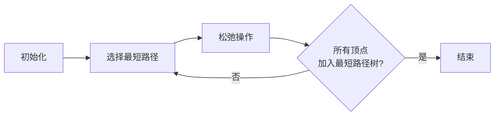
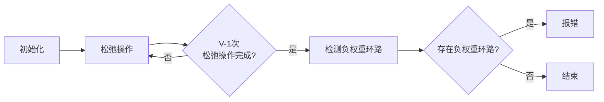
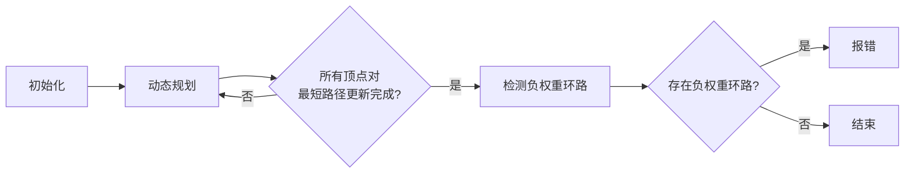
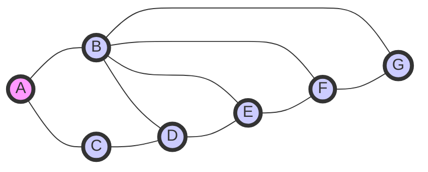

# Graph Shortest Path算法原理与代码实例讲解

## 1.背景介绍

在现实世界中,很多问题都可以抽象为图(Graph)的形式来求解。图是一种非线性数据结构,由一组顶点(Vertex)和连接这些顶点的边(Edge)组成。图广泛应用于网络拓扑、交通路线规划、社交网络分析等领域。其中,求解图中两点之间的最短路径是一个非常重要和经典的问题。

最短路径问题可以概括为:给定一个加权图(Weighted Graph),其中每条边都被赋予一个权重(Weight),找到两个顶点之间的路径,使该路径的总权重最小。这种问题在生活中随处可见,比如规划城市道路、航线或电路布线时,都需要寻找最优路径以节省成本和时间。

## 2.核心概念与联系

解决最短路径问题需要理解以下几个核心概念:

### 2.1 加权图(Weighted Graph)

加权图是一种附加了权重的图,每条边都与一个数值相关联,表示该边的权重或距离。根据边的权重是否为负值,可以将加权图分为:

- 无负权重图(Non-negative Weighted Graph):所有边的权重均大于或等于0。
- 有负权重图(Negative Weighted Graph):存在部分边的权重为负值。

### 2.2 单源最短路径(Single-Source Shortest Path)

单源最短路径问题是指在一个加权图中,找到从一个指定的源顶点(Source Vertex)到其他所有顶点的最短路径。

### 2.3 所有对最短路径(All-Pairs Shortest Path)

所有对最短路径问题是指在一个加权图中,找到任意两个顶点之间的最短路径。它是单源最短路径问题的扩展,需要计算图中所有顶点对之间的最短路径。

### 2.4 负权重环路(Negative Weight Cycle)

负权重环路是指在一个加权图中存在一个环路,该环路的总权重为负值。如果一个图中存在负权重环路,那么从任意顶点出发都无法得到最短路径,因为可以无限循环该环路获得无限小的路径权重。

## 3.核心算法原理具体操作步骤

针对不同情况,求解最短路径问题有多种经典算法,包括:

### 3.1 Dijkstra算法

Dijkstra算法是解决无负权重图中单源最短路径问题的经典算法,由荷兰计算机科学家Edsger Dijkstra在1959年提出。它的核心思想是从源顶点开始,使用贪心策略不断扩展最短路径树,直到覆盖所有顶点。算法步骤如下:

1. 初始化:将源顶点加入最短路径树,其他顶点的最短路径距离设为无穷大。
2. 选择最短路径:从未加入最短路径树的顶点中,选择距离源顶点最近的顶点,加入最短路径树。
3. 松弛操作:检查新加入顶点的所有邻居,更新它们到源顶点的最短路径距离。
4. 重复步骤2和3,直到所有顶点都加入最短路径树。

Dijkstra算法的时间复杂度为O(E*logV),其中E为边的数量,V为顶点的数量。它适用于无负权重图,如果图中存在负权重边,则无法得到正确的最短路径解。



### 3.2 Bellman-Ford算法

Bellman-Ford算法是解决有负权重边的单源最短路径问题的经典算法,由Richard Bellman和Lester Ford Jr.在1958年独立提出。它的核心思想是通过动态规划的方式,不断松弛所有边,直到找到最短路径或检测到负权重环路。算法步骤如下:

1. 初始化:将源顶点的最短路径距离设为0,其他顶点设为无穷大。
2. 松弛操作:对所有边进行V-1次松弛,更新每个顶点到源顶点的最短路径距离。
3. 检测负权重环路:再次遍历所有边,如果发现任何边可以进一步松弛,则图中存在负权重环路。

Bellman-Ford算法的时间复杂度为O(V*E),其中E为边的数量,V为顶点的数量。它可以处理有负权重边的情况,但无法解决存在负权重环路的图。



### 3.3 Floyd-Warshall算法

Floyd-Warshall算法是解决所有对最短路径问题的经典算法,由Robert Floyd和Stephen Warshall在1962年独立提出。它的核心思想是使用动态规划的方式,通过中间顶点来更新任意两个顶点之间的最短路径距离。算法步骤如下:

1. 初始化:构建一个n*n的距离矩阵,对角线元素为0,其他元素为边的权重或无穷大。
2. 动态规划:使用三重循环,通过中间顶点k更新任意两个顶点i和j之间的最短路径距离。
3. 检测负权重环路:如果存在i==j时距离矩阵对角线元素为负值,则图中存在负权重环路。

Floyd-Warshall算法的时间复杂度为O(V^3),其中V为顶点的数量。它可以解决有负权重边的情况,但无法解决存在负权重环路的图。



## 4.数学模型和公式详细讲解举例说明

在最短路径算法中,通常使用以下数学模型和公式来表示和计算最短路径:

### 4.1 加权图的数学表示

加权图可以用邻接矩阵(Adjacency Matrix)或邻接表(Adjacency List)来表示。

- 邻接矩阵:使用一个n*n的矩阵来表示n个顶点之间的连接关系,矩阵元素$a_{ij}$表示从顶点i到顶点j的边的权重,如果不存在边,则为无穷大。
- 邻接表:使用一个链表数组来表示每个顶点的邻居列表,链表中存储着与该顶点相连的其他顶点及边的权重。

### 4.2 最短路径距离的数学表示

设$d_{ij}$表示从顶点i到顶点j的最短路径距离,我们的目标是找到一组$d_{ij}$值,使得它们满足以下条件:

$$
d_{ij} = \begin{cases}
0 & \text{if } i = j \\
\min\limits_{k}\{d_{ik} + w_{kj}\} & \text{if } i \neq j
\end{cases}
$$

其中,$w_{kj}$表示从顶点k到顶点j的边的权重。

### 4.3 动态规划方程

在Bellman-Ford算法和Floyd-Warshall算法中,使用动态规划的方式来计算最短路径距离。动态规划方程如下:

$$
d_{ij}^{(k)} = \begin{cases}
d_{ij}^{(k-1)} & \text{if } d_{ij}^{(k-1)} < d_{ik}^{(k-1)} + d_{kj}^{(k-1)} \\
d_{ik}^{(k-1)} + d_{kj}^{(k-1)} & \text{otherwise}
\end{cases}
$$

其中,$d_{ij}^{(k)}$表示通过中间顶点$\{1, 2, \cdots, k\}$从顶点i到顶点j的最短路径距离。

### 4.4 举例说明

考虑下图,我们计算从顶点A到其他顶点的最短路径距离:



使用Dijkstra算法,我们可以得到从A到其他顶点的最短路径距离如下:

- $d_{AB} = 1$
- $d_{AC} = 1$
- $d_{AD} = 2$
- $d_{AE} = 3$
- $d_{AF} = 4$
- $d_{AG} = 5$

## 5.项目实践:代码实例和详细解释说明

下面给出了使用Python实现Dijkstra算法的代码示例,并对关键部分进行了详细解释:

```python
import heapq

def dijkstra(graph, start):
    distances = {vertex: float('infinity') for vertex in graph}
    distances[start] = 0
    pq = [(0, start)]

    while pq:
        current_dist, current_vertex = heapq.heappop(pq)

        if current_dist > distances[current_vertex]:
            continue

        for neighbor, weight in graph[current_vertex].items():
            distance = current_dist + weight
            if distance < distances[neighbor]:
                distances[neighbor] = distance
                heapq.heappush(pq, (distance, neighbor))

    return distances
```

1. 首先,我们导入Python的`heapq`模块,用于实现优先级队列(Priority Queue)。

2. 定义`dijkstra`函数,接受两个参数:`graph`(邻接表表示的加权图)和`start`(源顶点)。

3. 初始化`distances`字典,将所有顶点的距离设为无穷大,源顶点的距离设为0。

4. 创建一个优先级队列`pq`,初始时只包含源顶点及其距离0。

5. 进入主循环,每次从`pq`中取出距离最小的顶点`current_vertex`。

6. 如果`current_vertex`的距离大于`distances`中记录的距离,说明已经找到了更短的路径,因此跳过该顶点。

7. 对`current_vertex`的每个邻居`neighbor`进行松弛操作:计算从源顶点到`neighbor`的距离`distance`,如果比`distances`中记录的距离小,就更新`distances`并将`neighbor`及其距离加入`pq`。

8. 循环结束后,`distances`字典中存储了从源顶点到所有其他顶点的最短路径距离。

以下是一个使用上述代码的示例:

```python
graph = {
    'A': {'B': 1, 'C': 1},
    'B': {'A': 1, 'C': 2, 'D': 3, 'E': 5, 'F': 6, 'G': 7},
    'C': {'A': 1, 'B': 2, 'D': 1},
    'D': {'B': 3, 'C': 1, 'E': 1, 'F': 2},
    'E': {'B': 5, 'D': 1, 'F': 1, 'G': 2},
    'F': {'B': 6, 'D': 2, 'E': 1, 'G': 1},
    'G': {'B': 7, 'E': 2, 'F': 1}
}

print(dijkstra(graph, 'A'))
```

输出结果:

```
{'A': 0, 'B': 1, 'C': 1, 'D': 2, 'E': 3, 'F': 4, 'G': 5}
```

这个示例中,我们定义了一个加权图`graph`,使用`dijkstra`函数计算从顶点A到其他顶点的最短路径距离。输出结果与我们之前的计算结果一致。

## 6.实际应用场景

最短路径算法在现实生活中有着广泛的应用,包括但不限于:

### 6.1 导航和路径规划

最短路径算法被广泛应用于导航系统