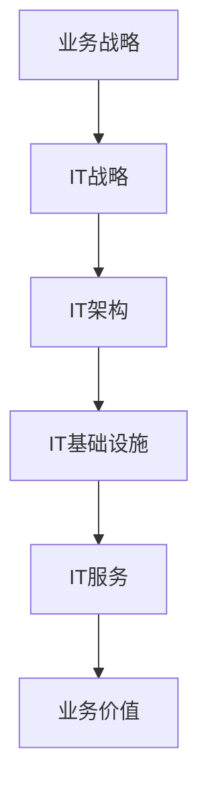
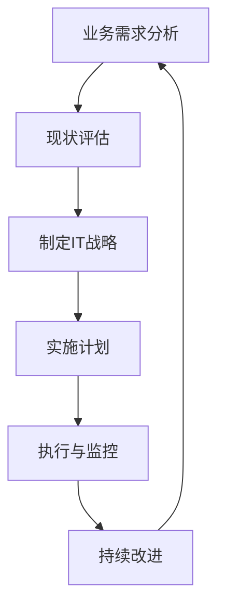

# IT战略规划：制定并执行与公司业务目标相一致的IT战略计划

## 1.背景介绍

在当今瞬息万变的商业环境中，信息技术(IT)已成为推动企业发展和保持竞争优势的关键力量。有效的IT战略规划对于确保IT投资与企业的总体业务目标保持一致至关重要。IT战略规划是一个持续的过程,旨在确定企业的IT需求,制定满足这些需求的计划,并指导IT资源的获取、实施和管理。

### 1.1 IT战略规划的重要性

IT战略规划为企业提供了一个清晰的IT发展路线图,有助于:

- 确保IT投资与业务目标保持一致
- 优化IT资源的利用
- 提高IT服务的效率和质量
- 应对不断变化的技术和业务环境
- 降低IT风险并提高投资回报率

### 1.2 IT战略规划的挑战

尽管IT战略规划具有重要意义,但在实施过程中仍面临诸多挑战:

- 业务需求与IT能力之间的差距
- 技术变革的快速发展
- 有限的IT资源和预算
- 企业文化和组织结构的障碍
- 缺乏高层管理的支持和参与

## 2.核心概念与联系

### 2.1 IT战略与业务战略的关系

IT战略规划应该与企业的总体业务战略保持一致,并为实现业务目标提供必要的IT支持。业务战略确定了企业的发展方向和目标,而IT战略则规划了如何利用信息技术来支持和实现这些目标。

### 2.2 IT战略规划的核心要素

一个完整的IT战略规划通常包括以下几个核心要素:

1. **IT愿景和原则**: 阐明IT在企业中的作用和价值,并制定IT管理和运营的原则。
2. **IT架构**: 定义企业IT系统的总体架构,包括数据架构、应用架构和技术架构。
3. **IT路线图**: 规划IT系统和基础设施的发展路线,确定优先级和实施时间表。
4. **IT治理**: 建立IT决策、投资和运营的管理框架,确保IT与业务目标保持一致。
5. **IT组织和人力资源**: 设计IT组织结构,培养和管理IT人才。
6. **IT风险管理**: 识别和缓解与IT相关的风险,确保IT系统的安全性和可靠性。

## 3.核心算法原理具体操作步骤

IT战略规划是一个循环的过程,通常包括以下几个主要步骤:

### 3.1 业务需求分析

首先需要深入了解企业的业务目标、战略重点、运营模式和关键业务流程,识别对IT的需求和期望。这通常需要与业务部门、高层管理人员和关键利益相关方进行广泛的沟通和讨论。

### 3.2 现状评估

评估现有IT环境的状况,包括IT基础设施、应用系统、数据资产、IT组织和人力资源等,识别其与业务需求之间的差距和不足。可以采用SWOT分析、基准测试等方法进行评估。

### 3.3 制定IT战略

根据业务需求和现状评估的结果,制定IT战略,确定IT的愿景、原则、架构、路线图等,并与业务战略保持一致。需要考虑技术趋势、行业实践和企业的具体情况。

### 3.4 实施计划

将IT战略分解为可执行的项目和任务,制定详细的实施计划,包括时间表、资源分配、里程碑、风险缓解措施等。实施计划需要与业务计划和预算相协调。

### 3.5 执行与监控

按照实施计划执行各项IT项目和任务,并持续监控进度、质量和成本,及时发现和解决问题。建立有效的沟通机制,确保各方利益相关方的参与和支持。

### 3.6 持续改进

定期评估IT战略的执行情况,根据业务环境的变化和新出现的需求,对IT战略进行调整和优化,形成一个持续改进的闭环过程。

## 4.数学模型和公式详细讲解举例说明

在IT战略规划过程中,可以应用一些数学模型和公式来支持决策和优化资源配置。

### 4.1 投资回报率(ROI)模型

投资回报率模型用于评估IT投资的经济效益,帮助企业做出明智的投资决策。ROI可以用下面的公式计算:

$$ROI = \frac{投资收益 - 投资成本}{投资成本} \times 100\%$$

例如,假设一家企业投资100万元实施一个新的ERP系统,预计在未来5年内可以节省运营成本200万元,则该项目的ROI为:

$$ROI = \frac{200万 - 100万}{100万} \times 100\% = 100\%$$

通过计算ROI,企业可以评估不同IT投资方案的经济效益,选择具有最佳投资回报的方案。

### 4.2 总拥有成本(TCO)模型

总拥有成本模型用于估算IT系统或解决方案在整个生命周期内的总体成本,包括采购、实施、运营、维护和最终退役的成本。TCO可以用下面的公式计算:

$$TCO = 采购成本 + 实施成本 + 运营成本 + 维护成本 + 退役成本$$

例如,对于一个新的云计算解决方案,其TCO可能包括:

- 采购成本:云服务订阅费用
- 实施成本:数据迁移、集成和培训费用
- 运营成本:每月使用费、存储费和带宽费用
- 维护成本:升级、补丁和技术支持费用
- 退役成本:数据迁移和系统关闭费用

通过计算TCO,企业可以全面评估IT解决方案的真实成本,并与预期收益进行权衡。

### 4.3 投资组合优化模型

投资组合优化模型用于在有限的IT预算下,确定最佳的IT项目投资组合,以最大化投资回报并控制风险。这可以通过求解以下优化问题来实现:

$$
\begin{aligned}
\max \quad & \sum_{i=1}^{n} r_i x_i \
\text{s.t.} \quad & \sum_{i=1}^{n} c_i x_i \leq B \
& \sum_{i=1}^{n} w_i x_i \leq W \
& x_i \in \{0, 1\}, \quad i = 1, 2, \ldots, n
\end{aligned}
$$

其中:

- $n$是可选IT项目的总数
- $r_i$是第$i$个项目的预期回报
- $c_i$是第$i$个项目的成本
- $w_i$是第$i$个项目的风险权重
- $B$是总预算限制
- $W$是总风险容忍度
- $x_i$是决策变量,表示是否选择第$i$个项目(0或1)

通过求解这个优化问题,企业可以在给定的预算和风险约束下,选择一个最佳的IT项目投资组合,实现最大化的投资回报。

## 5.项目实践:代码实例和详细解释说明

为了更好地理解IT战略规划的实践,我们可以通过一个具体的项目案例来进行说明。假设一家制造企业正在进行数字化转型,需要制定一个IT战略来支持这一转型过程。

### 5.1 业务需求分析

该企业的主要业务目标是:

1. 提高生产效率和产品质量
2. 缩短产品上市时间
3. 改善客户体验和服务质量
4. 降低运营成本

为实现这些目标,企业需要通过数字化转型来优化业务流程、提高数据利用率、实现智能制造等。因此,IT需求包括:

- 建立数字化生产线和智能制造系统
- 实现产品生命周期管理(PLM)
- 构建客户关系管理(CRM)和电子商务平台
- 整合企业资源计划(ERP)和供应链管理(SCM)系统
- 建立大数据分析和商业智能(BI)能力

### 5.2 现状评估

该企业目前的IT环境存在以下问题:

- 许多遗留系统和孤立的数据库
- 缺乏统一的数据标准和集成
- IT基础设施陈旧,无法满足新需求
- IT人员短缺,技能不足以支持新技术
- IT治理机制不完善,缺乏与业务的协调

### 5.3 制定IT战略

根据业务需求和现状评估,该企业制定了以下IT战略:

1. **IT愿景**:成为数字化智能制造的引领者,通过IT创新推动业务转型。
2. **IT原则**:业务驱动、数据集成、开放灵活、安全合规、持续创新。
3. **IT架构**:
   - 数据架构:建立企业数据湖,实现数据标准化和集成
   - 应用架构:采用微服务和云原生架构,支持敏捷开发和弹性扩展
   - 技术架构:基于云计算和边缘计算,利用物联网、大数据、AI等新技术
4. **IT路线图**:分三个阶段实施,包括现代化基础设施、数字化业务系统和智能制造系统。
5. **IT治理**:建立IT steering委员会,加强IT与业务的协作。
6. **IT组织**:成立数字化转型办公室,培养DevOps和数据科学家等新型人才。
7. **IT风险管理**:制定网络安全和数据隐私保护策略,建立风险监控和应急响应机制。

### 5.4 实施计划

IT战略将分三个阶段实施,每个阶段包括以下主要项目:

**第一阶段(1年)**: 现代化IT基础设施
- 云迁移项目:将核心系统迁移到公有云平台
- 网络升级项目:部署软件定义网络(SDN)和边缘计算节点
- 数据湖项目:建立企业数据湖,实现数据集成和治理

**第二阶段(2年)**: 数字化业务系统
- PLM项目:实施产品生命周期管理系统
- CRM项目:构建客户关系管理和电商平台
- ERP升级项目:升级ERP系统,集成SCM模块
- BI项目:建立大数据分析和商业智能能力

**第三阶段(3年)**: 智能制造系统
- 智能工厂项目:建设智能化生产线和制造执行系统(MES)
- 预测性维护项目:利用物联网和AI技术实现设备预测性维护
- 数字孪生项目:构建产品和生产线的数字孪生模型

每个项目都将制定详细的实施计划,包括里程碑、资源需求、风险缓解措施等。

### 5.5 执行与监控

在执行过程中,企业将建立项目管理办公室(PMO)来监控各项目的进度、质量和成本,并定期向IT steering委员会汇报。同时,还将采用敏捷开发方法和DevOps实践,加快交付速度并提高系统质量。

### 5.6 持续改进

企业将定期评估IT战略的执行情况,根据业务环境的变化和新出现的需求,对IT战略进行调整和优化。例如,随着人工智能和边缘计算技术的发展,可能需要更新IT架构和路线图,以充分利用这些新技术。

通过这个案例,我们可以看到IT战略规划是一个系统性的过程,需要与业务目标紧密结合,并持续优化以适应不断变化的环境。

## 6.实际应用场景

IT战略规划在各行各业都有广泛的应用,以下是一些典型的应用场景:

### 6.1 制造业

制造企业通常需要IT来支持智能制造、产品生命周期管理、供应链优化等,以提高效率、质量和响应速度。IT战略规划可以帮助制造企业制定数字化转型路线图,实现智能工厂、预测性维护、