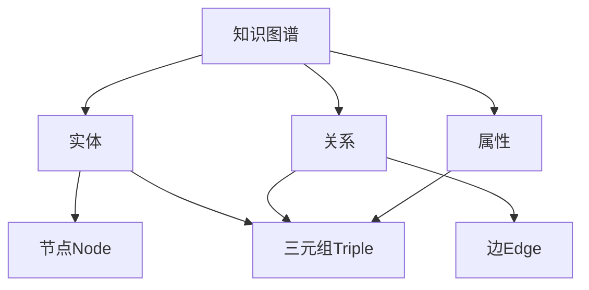

# Knowledge Graphs原理与代码实例讲解

## 1. 背景介绍
### 1.1 知识图谱的起源与发展
#### 1.1.1 知识图谱的起源
#### 1.1.2 知识图谱的发展历程
#### 1.1.3 知识图谱的现状与挑战

### 1.2 知识图谱的应用领域
#### 1.2.1 搜索引擎
#### 1.2.2 问答系统
#### 1.2.3 推荐系统
#### 1.2.4 医疗健康
#### 1.2.5 金融风控

## 2. 核心概念与联系
### 2.1 知识图谱的定义
#### 2.1.1 知识
#### 2.1.2 实体
#### 2.1.3 关系
#### 2.1.4 属性

### 2.2 知识图谱的组成要素
#### 2.2.1 节点(Nodes)
#### 2.2.2 边(Edges)
#### 2.2.3 三元组(Triples)

### 2.3 知识图谱与其他知识表示方式的区别
#### 2.3.1 关系型数据库
#### 2.3.2 本体(Ontology)
#### 2.3.3 语义网络

### 2.4 知识图谱的核心概念关系图


## 3. 核心算法原理具体操作步骤
### 3.1 知识抽取
#### 3.1.1 命名实体识别(NER)
#### 3.1.2 关系抽取
#### 3.1.3 属性抽取

### 3.2 知识融合
#### 3.2.1 实体对齐
#### 3.2.2 知识去重
#### 3.2.3 知识合并

### 3.3 知识推理
#### 3.3.1 基于规则的推理
#### 3.3.2 基于表示学习的推理
##### 3.3.2.1 TransE
##### 3.3.2.2 TransR
##### 3.3.2.3 TransH

### 3.4 知识存储与查询
#### 3.4.1 知识库构建
#### 3.4.2 图数据库
#### 3.4.3 SPARQL查询语言

## 4. 数学模型和公式详细讲解举例说明
### 4.1 TransE模型
TransE将关系看作是从头实体到尾实体的翻译向量,对于一个三元组$(h,r,t)$,TransE的目标是:

$$\mathbf{h} + \mathbf{r} \approx \mathbf{t}$$

其中$\mathbf{h}, \mathbf{r}, \mathbf{t} \in \mathbb{R}^k$分别是头实体、关系和尾实体的k维向量表示。TransE通过最小化能量函数:

$$\mathcal{L} = \sum_{(h,r,t)\in S}\sum_{(h',r,t')\in S'_{(h,r,t)}} [\gamma + d(\mathbf{h}+\mathbf{r},\mathbf{t}) - d(\mathbf{h'}+\mathbf{r},\mathbf{t'})]_+$$

其中$S$是训练集中所有正确三元组的集合,$S'_{(h,r,t)}$是通过替换$(h,r,t)$中的头实体或尾实体得到的错误三元组集合,$\gamma$是超参数,控制正负三元组之间的间隔,$[x]_+ = max(0,x)$是hinge损失函数,$d$是距离度量函数,通常使用L1或L2范数。

### 4.2 TransR模型
TransR认为一个实体在不同关系下的语义表示应该是不一样的,因此引入了关系特定的映射矩阵$\mathbf{M}_r \in \mathbb{R}^{k\times d}$将实体从实体空间映射到关系空间,其中$k$是实体向量维度,$d$是关系向量维度。对于一个三元组$(h,r,t)$,TransR的目标是:

$$\mathbf{h}_r = \mathbf{h}\mathbf{M}_r, \quad \mathbf{t}_r = \mathbf{t}\mathbf{M}_r$$
$$\mathbf{h}_r + \mathbf{r} \approx \mathbf{t}_r$$

其中$\mathbf{h}_r, \mathbf{t}_r \in \mathbb{R}^d$是头尾实体在关系$r$对应空间中的投影向量。TransR的目标函数与TransE类似,只是距离度量在关系特定的空间中进行:

$$\mathcal{L} = \sum_{(h,r,t)\in S}\sum_{(h',r,t')\in S'_{(h,r,t)}} [\gamma + d(\mathbf{h}_r+\mathbf{r},\mathbf{t}_r) - d(\mathbf{h'}_r+\mathbf{r},\mathbf{t'}_r)]_+$$

### 4.3 TransH模型
TransH在TransR的基础上进一步引入了超平面的概念。对于每个关系$r$,TransH定义了一个超平面法向量$\mathbf{w}_r \in \mathbb{R}^k$和一个超平面偏移向量$\mathbf{d}_r \in \mathbb{R}^k$。实体在关系超平面上的投影向量为:

$$\mathbf{h}_{\perp} = \mathbf{h} - \mathbf{w}_r^\top \mathbf{h} \mathbf{w}_r$$
$$\mathbf{t}_{\perp} = \mathbf{t} - \mathbf{w}_r^\top \mathbf{t} \mathbf{w}_r$$

TransH的目标是让投影后的头实体加上关系向量等于投影后的尾实体:

$$\mathbf{h}_{\perp} + \mathbf{d}_r \approx \mathbf{t}_{\perp}$$

损失函数与TransE和TransR类似,只是距离度量在超平面上进行:

$$\mathcal{L} = \sum_{(h,r,t)\in S}\sum_{(h',r,t')\in S'_{(h,r,t)}} [\gamma + d(\mathbf{h}_{\perp}+\mathbf{d}_r,\mathbf{t}_{\perp}) - d(\mathbf{h'}_{\perp}+\mathbf{d}_r,\mathbf{t'}_{\perp})]_+$$

## 5. 项目实践：代码实例和详细解释说明
### 5.1 知识抽取代码实例
以下是使用Stanford CoreNLP进行命名实体识别和关系抽取的Java代码示例:
```java
import edu.stanford.nlp.pipeline.*;
import edu.stanford.nlp.ling.*;
import edu.stanford.nlp.ie.util.*;
import edu.stanford.nlp.naturalli.*;
import edu.stanford.nlp.util.*;

public class KnowledgeExtraction {
    public static void main(String[] args) {
        // 创建StanfordCoreNLP管道
        Properties props = new Properties();
        props.setProperty("annotators", "tokenize,ssplit,pos,lemma,ner,parse,depparse,natlog,openie");
        StanfordCoreNLP pipeline = new StanfordCoreNLP(props);

        // 待处理的文本
        String text = "Barack Obama was born in Hawaii. He was the president of the United States.";

        // 创建文档注释
        CoreDocument document = new CoreDocument(text);

        // 注释文档
        pipeline.annotate(document);

        // 打印命名实体
        for (CoreEntityMention em : document.entityMentions()) {
            System.out.println(em.text() + "\t" + em.entityType());
        }

        // 打印关系三元组
        for (CoreSentence sentence : document.sentences()) {
            for (RelationTriple triple : sentence.openieTriples()) {
                System.out.println(triple.subjectLemmaGloss() + "\t"
                    + triple.relationLemmaGloss() + "\t"
                    + triple.objectLemmaGloss());
            }
        }
    }
}
```

输出结果:
```
Barack Obama    PERSON
Hawaii  LOCATION
United States   LOCATION
Barack Obama    was born in     Hawaii
Barack Obama    was     the president of the United States
```

### 5.2 知识表示学习代码实例
以下是使用PyTorch实现TransE模型的Python代码示例:
```python
import torch
import torch.nn as nn
import torch.optim as optim

class TransE(nn.Module):
    def __init__(self, num_entities, num_relations, embedding_dim):
        super(TransE, self).__init__()
        self.entity_embeddings = nn.Embedding(num_entities, embedding_dim)
        self.relation_embeddings = nn.Embedding(num_relations, embedding_dim)

    def forward(self, head, relation, tail):
        h = self.entity_embeddings(head)
        r = self.relation_embeddings(relation)
        t = self.entity_embeddings(tail)
        score = torch.norm(h + r - t, p=1, dim=-1)
        return score

# 超参数设置
num_entities = 10
num_relations = 5
embedding_dim = 50
learning_rate = 0.01
num_epochs = 100
batch_size = 32

# 创建模型
model = TransE(num_entities, num_relations, embedding_dim)

# 定义损失函数和优化器
criterion = nn.MarginRankingLoss(margin=1.0)
optimizer = optim.SGD(model.parameters(), lr=learning_rate)

for epoch in range(num_epochs):
    # 获取训练数据batch
    heads, relations, tails = get_batch(batch_size)

    # 前向传播
    positive_score = model(heads, relations, tails)
    negative_score = model(heads, relations, corrupt_tails(tails))

    # 计算损失
    target = torch.ones(batch_size)
    loss = criterion(positive_score, negative_score, target)

    # 反向传播和优化
    optimizer.zero_grad()
    loss.backward()
    optimizer.step()

    # 打印损失
    if (epoch + 1) % 10 == 0:
        print(f"Epoch {epoch+1}, Loss: {loss.item():.4f}")
```

### 5.3 知识存储与查询代码实例
以下是使用Neo4j图数据库进行知识存储和查询的Python代码示例:
```python
from py2neo import Graph, Node, Relationship

# 连接Neo4j数据库
graph = Graph("bolt://localhost:7687", auth=("neo4j", "password"))

# 创建节点
alice = Node("Person", name="Alice")
bob = Node("Person", name="Bob")
graph.create(alice)
graph.create(bob)

# 创建关系
relation = Relationship(alice, "KNOWS", bob)
graph.create(relation)

# Cypher查询
query = """
MATCH (p1:Person)-[:KNOWS]->(p2:Person)
RETURN p1.name AS person1, p2.name AS person2
"""

# 执行查询
result = graph.run(query).data()

# 打印结果
for record in result:
    print(f"{record['person1']} knows {record['person2']}")
```

输出结果:
```
Alice knows Bob
```

## 6. 实际应用场景
### 6.1 智能问答系统
知识图谱可以作为智能问答系统的核心知识库,通过对自然语言问题进行语义解析和关系推理,从知识图谱中检索出相关的实体和关系,生成自然语言答案。

### 6.2 个性化推荐系统
利用知识图谱中实体之间的语义关联,可以构建用户-物品-属性的异构图,通过图表示学习得到实体和关系的低维向量表示,用于计算用户和物品之间的相似度和相关性,实现个性化推荐。

### 6.3 金融风险管控
通过构建企业、个人、交易等实体之间的关系知识图谱,挖掘出潜在的风险模式和异常行为,如关联交易、 洗钱、 欺诈等,辅助金融机构进行风险评估和决策。

### 6.4 医疗辅助诊断
整合患者的症状、体征、检验检查结果、用药史等医疗数据,构建医疗知识图谱。利用知识图谱的推理能力,辅助医生进行疾病的早期筛查、鉴别诊断、预后预测等。

## 7. 工具和资源推荐
### 7.1 知识图谱构建工具
- Stanford CoreNLP: 提供了多语言的自然语言处理工具,包括命名实体识别、关系抽取等
- OpenKE: 知识图谱表示学习工具包,实现了多种知识表示学习算法
- DeepDive: 知识抽取系统,从非结构化文本中抽取结构化知识
- Protégé: 本体编辑和知识获取工具,支持OWL、RDF等知识表示语言

### 7.2 知识图谱数据集
- Freebase: 大规模的通用知识库,包含各个领域的实体和关系
- WordNet: 英语词汇语义网络,记录了单词之间的同义、反义、上下位等关系
- YAGO: 高质量的知识库,整合了Wikipedia、WordNet、GeoNames等来源
- NELL: 持续学习的知识库,通过网页抓取