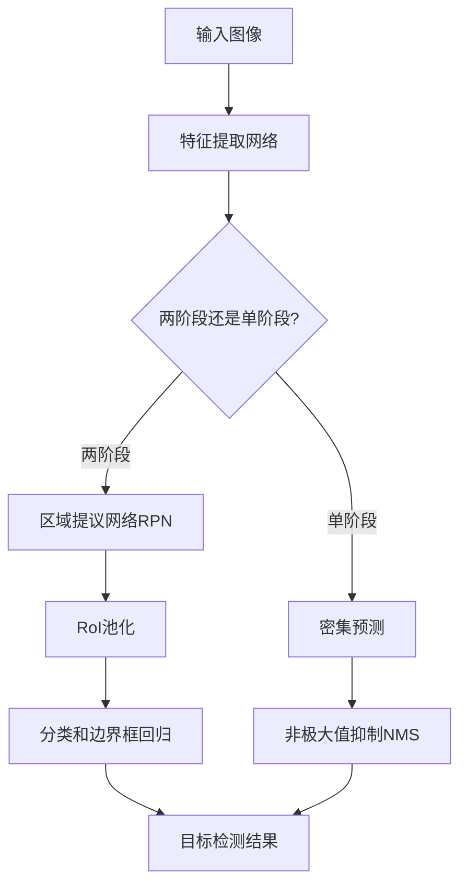

# Object Detection 原理与代码实战案例讲解

## 1. 背景介绍

在当今快速发展的计算机视觉领域中,Object Detection(目标检测)是一项非常重要和具有挑战性的任务。它旨在自动定位和识别图像或视频中的特定对象实例。目标检测广泛应用于安防监控、自动驾驶、机器人视觉、人脸识别等诸多领域,已成为人工智能技术的关键组成部分。

随着深度学习技术的不断发展,基于深度卷积神经网络(CNN)的目标检测算法取得了长足进步,在准确性和实时性方面都有了显著提升。本文将深入探讨目标检测的核心原理、主流算法、代码实现细节以及实际应用场景,为读者提供全面的理解和实践指导。

## 2. 核心概念与联系

### 2.1 目标检测任务定义

目标检测的目标是在给定的图像或视频中,同时定位和识别出所有感兴趣的目标实例。与图像分类任务只需要预测整个图像的类别标签不同,目标检测需要预测每个目标实例的类别标签和精确的边界框坐标。

### 2.2 边界框表示

边界框(Bounding Box)是目标检测中常用的目标定位方式,通常使用一个矩形框来描述目标的位置和大小。边界框通常由四个坐标值(x, y, w, h)表示,分别对应矩形框的左上角坐标(x, y)、宽度w和高度h。

### 2.3 目标检测评估指标

常用的目标检测评估指标包括:

- 平均精度(Average Precision, AP): 综合考虑了精确率和召回率,是目标检测算法性能的主要评价指标。
- 平均每张图像检测时间(Average Time per Image): 反映了算法的实时性能,对于实时应用场景非常重要。

## 3. 核心算法原理具体操作步骤

目标检测算法可以分为基于传统计算机视觉方法和基于深度学习的两大类。本节将重点介绍基于深度学习的主流算法原理和具体操作步骤。

### 3.1 基于区域提议的两阶段算法

#### 3.1.1 R-CNN系列算法

R-CNN(Region-based Convolutional Neural Networks)是两阶段目标检测算法的鼻祖,主要分为以下几个步骤:

1. **选择性搜索(Selective Search)**: 使用传统的计算机视觉算法生成数千个区域提议(Region Proposals)。
2. **特征提取**: 将每个区域提议作为输入,通过预训练的CNN提取特征。
3. **分类和边界框回归**: 将提取的特征输入SVM分类器和边界框回归器,分别预测目标类别和精细化边界框坐标。

R-CNN虽然取得了不错的性能,但存在速度慢、训练复杂等缺陷。后续的Fast R-CNN和Faster R-CNN算法对其进行了改进,提高了速度和整体性能。

#### 3.1.2 Faster R-CNN

Faster R-CNN是两阶段算法的代表作,其核心思想是:

1. **特征提取网络**: 使用卷积神经网络(如VGG、ResNet等)对输入图像进行特征提取,得到特征图(Feature Map)。
2. **区域提议网络(RPN)**: 在特征图上滑动窗口,生成区域提议和对应的置信度分数。
3. **区域of Interest(RoI)池化**: 根据区域提议从特征图中提取对应的特征,并使用RoI池化层对齐到固定大小。
4. **分类和边界框回归**: 将RoI特征输入两个全连接层,分别预测目标类别和精细化边界框坐标。

Faster R-CNN将区域提议的生成和特征提取统一在一个网络中,大大提高了速度和整体性能。

### 3.2 基于密集预测的单阶段算法

#### 3.2.1 YOLO系列算法

YOLO(You Only Look Once)是单阶段目标检测算法的代表,其核心思想是:

1. **特征提取网络**: 使用卷积神经网络(如DarkNet、ResNet等)对输入图像进行特征提取,得到特征图。
2. **密集预测**: 将特征图划分为SxS个网格,每个网格预测B个边界框和对应的置信度分数。
3. **非极大值抑制(NMS)**: 对预测的边界框进行NMS操作,去除重叠较多的冗余框。

YOLO算法的优点是速度快、端到端训练,缺点是对小目标的检测精度较低。后续的YOLOv2、YOLOv3等版本对原始算法进行了多方面的改进和优化。

#### 3.2.2 SSD算法

SSD(Single Shot MultiBox Detector)是另一种流行的单阶段目标检测算法,其核心思想是:

1. **特征金字塔**: 使用不同尺度的特征图构建特征金字塔,以适应不同大小的目标。
2. **密集预测**: 在每个特征图上密集预测一组不同比例的边界框。
3. **非极大值抑制(NMS)**: 对预测的边界框进行NMS操作,去除重叠较多的冗余框。

SSD算法在速度和精度之间取得了较好的平衡,并且可以有效检测不同尺度的目标。

### 3.3 核心算法流程图

以下是Faster R-CNN和YOLO算法的核心流程图:



## 4. 数学模型和公式详细讲解举例说明

目标检测算法中涉及到多个关键的数学模型和公式,本节将详细讲解并给出具体的例子说明。

### 4.1 IoU(Intersection over Union)

IoU是目标检测中常用的评估指标,用于衡量预测边界框与真实边界框之间的重叠程度。IoU的计算公式如下:

$$
\text{IoU} = \frac{\text{Area of Intersection}}{\text{Area of Union}}
$$

其中,交集区域(Area of Intersection)表示预测框和真实框的重叠部分面积,并集区域(Area of Union)表示两个框的总面积。IoU的取值范围为[0, 1],值越大表示重叠度越高。

例如,假设真实边界框的坐标为(10, 10, 50, 50),预测边界框的坐标为(20, 20, 60, 60),则IoU的计算过程如下:

```python
# 计算交集区域
x1 = max(10, 20)  # 30
y1 = max(10, 20)  # 30
x2 = min(60, 60)  # 60
y2 = min(50, 60)  # 50
intersection = max(0, x2 - x1 + 1) * max(0, y2 - y1 + 1)  # (60 - 30 + 1) * (50 - 30 + 1) = 900

# 计算并集区域
area_true = (50 - 10 + 1) * (50 - 10 + 1)  # 1681
area_pred = (60 - 20 + 1) * (60 - 20 + 1)  # 1681
union = area_true + area_pred - intersection  # 1681 + 1681 - 900 = 2462

# 计算IoU
iou = intersection / union  # 900 / 2462 = 0.3655
```

### 4.2 损失函数

目标检测算法通常使用多任务损失函数,同时优化分类损失和边界框回归损失。常见的损失函数包括交叉熵损失(Cross Entropy Loss)和平滑L1损失(Smooth L1 Loss)。

#### 4.2.1 交叉熵损失

交叉熵损失用于优化分类任务,公式如下:

$$
\text{Loss}_\text{cls} = -\sum_{i=1}^{N} y_i \log(p_i)
$$

其中,$N$表示类别数量,$y_i$是真实标签(0或1),$p_i$是预测的概率值。

#### 4.2.2 平滑L1损失

平滑L1损失用于优化边界框回归任务,公式如下:

$$
\text{Loss}_\text{reg} = \sum_{i=1}^{4} \text{SmoothL1}(t_i - t_i^*)
$$

$$
\text{SmoothL1}(x) = \begin{cases}
0.5x^2, & \text{if } |x| < 1 \\
|x| - 0.5, & \text{otherwise}
\end{cases}
$$

其中,$t_i$是预测的边界框坐标值,$t_i^*$是真实的边界框坐标值。平滑L1损失在小值范围内使用平方项,在大值范围内使用绝对值项,从而在一定程度上减轻了异常值的影响。

### 4.3 非极大值抑制(NMS)

非极大值抑制(Non-Maximum Suppression, NMS)是目标检测算法中常用的后处理步骤,用于去除重叠较多的冗余边界框。NMS的基本思路是:

1. 根据置信度分数对所有预测框进行排序。
2. 从置信度最高的框开始,移除与其IoU值超过阈值的其他框。
3. 重复上述过程,直到所有框都被处理完毕。

NMS算法的伪代码如下:

```python
def nms(boxes, scores, iou_threshold):
    # 根据置信度分数排序
    sorted_indices = np.argsort(scores)[::-1]

    keep = []
    while sorted_indices.size > 0:
        # 取置信度最高的框
        idx = sorted_indices[0]
        keep.append(idx)

        # 计算其他框与当前框的IoU
        iou = compute_iou(boxes[idx], boxes[sorted_indices[1:]])

        # 移除IoU超过阈值的框
        sorted_indices = sorted_indices[np.where(iou <= iou_threshold)[0] + 1]

    return keep
```

通过NMS操作,可以有效地去除大量重叠的冗余框,从而提高目标检测的准确性。

## 5. 项目实践:代码实例和详细解释说明

本节将提供一个基于PyTorch实现的YOLO目标检测项目代码,并详细解释每个模块的功能和实现细节。

### 5.1 项目结构

```
yolo-object-detection/
├── data/
│   ├── coco/
│   │   ├── images/
│   │   ├── annotations/
│   │   └── ...
│   └── ...
├── models/
│   ├── yolo.py
│   └── ...
├── utils/
│   ├── data_utils.py
│   ├── box_utils.py
│   └── ...
├── train.py
├── eval.py
└── ...
```

- `data/`: 存放数据集,如COCO、VOC等。
- `models/`: 定义YOLO网络模型。
- `utils/`: 实用工具函数,如数据预处理、边界框操作等。
- `train.py`: 训练脚本。
- `eval.py`: 评估脚本。

### 5.2 模型实现

`models/yolo.py`定义了YOLO网络模型,包括特征提取网络(如DarkNet)和密集预测头。

```python
import torch
import torch.nn as nn

class YOLODetector(nn.Module):
    def __init__(self, num_classes, anchors):
        super(YOLODetector, self).__init__()
        # 特征提取网络
        self.backbone = DarkNet()

        # 密集预测头
        self.head = YOLOHead(num_classes, anchors)

    def forward(self, x):
        features = self.backbone(x)
        outputs = self.head(features)
        return outputs
```

`YOLOHead`模块实现了密集预测,预测边界框坐标、置信度分数和类别概率。

```python
class YOLOHead(nn.Module):
    def __init__(self, num_classes, anchors):
        super(YOLOHead, self).__init__()
        self.num_anchors = len(anchors)
        self.num_classes = num_classes

        # 预测边界框坐标和置信度
        self.box_pred = nn.Conv2d(...)

        # 预测类别概率
        self.cls_pred = nn.Conv2d(...)

    def forward(self, x):
        box_pred = self.box_pred(x)
        cls_pred = self.cls_pred(x)
        return box_pred, cls_pred
```