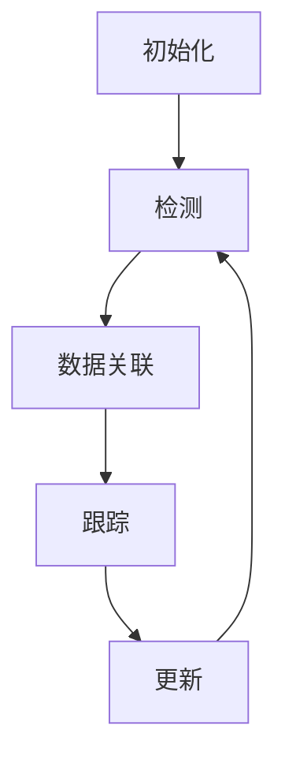

# Object Tracking 原理与代码实战案例讲解

## 1. 背景介绍

### 1.1 什么是目标跟踪?

目标跟踪(Object Tracking)是计算机视觉和模式识别领域的一个核心问题,旨在实时检测、识别和跟踪运动视频序列中的目标对象。它在许多领域有着广泛的应用,例如安防监控、人机交互、交通管理、机器人导航等。

### 1.2 目标跟踪的挑战

尽管目标跟踪技术取得了长足的进步,但仍然面临诸多挑战:

- 遮挡:目标被其他物体遮挡时,难以准确跟踪
- 形变:目标形状或尺寸发生变化时,跟踪器难以适应
- 光照变化:光照条件的变化会影响目标的外观
- 背景杂乱:复杂多变的背景会干扰目标检测
- 运动模糊:快速运动会导致目标在图像中变形或模糊

### 1.3 目标跟踪的重要性

目标跟踪技术的持续改进对于实现智能视觉系统至关重要。准确的目标跟踪能够支持高级视觉任务,如行为分析、轨迹预测和场景理解,为无人驾驶、智能监控等应用提供有力支持。

## 2. 核心概念与联系  

### 2.1 目标表示

在目标跟踪中,需要选择一种合适的目标表示方式,常用的有:

- 点表示:使用目标的质心坐标表示
- 矩形框表示:使用包围盒来表示目标区域  
- 形状匹配:使用目标的实际轮廓或边缘特征表示
- 核相关滤波器:使用目标的特征模板表示

不同表示方式在计算效率、鲁棒性和准确性方面有所权衡。

### 2.2 运动模型

运动模型描述了目标在时间上的运动状态,常用模型有:

- 恒速模型:假设目标以恒定速度运动
- 恒加速模型:考虑目标加速运动
- 运动学模型:利用目标的运动学方程描述运动轨迹

合理的运动模型能够提高预测精度,应对目标的形变和遮挡。

### 2.3 观测模型

观测模型描述了目标在图像上的观测特征,常用特征有:

- 颜色直方图:目标区域像素颜色分布的统计特征
- 梯度方向直方图:目标边缘梯度方向分布的统计特征
- Haar-like特征:目标区域的矩形波特征
- 深度特征:利用深度神经网络提取的高级语义特征

合适的观测模型能够有效区分目标和背景,提高鲁棒性。

### 2.4 数据关联

数据关联是将检测结果与已有的轨迹相关联的过程,常用方法有:

- 最近邻匹配:将检测结果与最近的轨迹匹配
- 全局最优匹配:在所有可能的匹配组合中寻找全局最优解
- 多目标跟踪:同时关联和更新多个目标的轨迹

有效的数据关联能够解决目标遮挡、出现和消失等问题。

## 3. 核心算法原理具体操作步骤

目标跟踪算法通常由以下几个核心步骤组成:



### 3.1 初始化

在第一帧,需要手动或自动初始化目标的状态,包括位置、大小和其他特征。这是整个跟踪过程的起点。

### 3.2 检测

利用目标检测算法(如Faster R-CNN、YOLO等)在每一帧图像中检测感兴趣的目标,获得目标的位置和其他特征。

### 3.3 数据关联

将当前帧的检测结果与已有的轨迹进行关联,确定哪些检测结果属于已有目标,哪些是新出现的目标。这是一个数据关联问题。

### 3.4 跟踪

对于已关联的目标,利用运动模型和观测模型预测并更新目标的状态,生成新的轨迹。

### 3.5 更新

根据新的观测值,使用递推滤波器(如卡尔曼滤波器)或深度模型更新目标的状态估计,为下一帧做好准备。

该过程在视频序列的每一帧重复进行,直到完成整个视频的目标跟踪任务。

## 4. 数学模型和公式详细讲解举例说明

### 4.1 卡尔曼滤波器

卡尔曼滤波器是目标跟踪中常用的递推滤波器,用于估计目标的动态状态。它由两个步骤组成:

**预测步骤**:

$$
\begin{aligned}
\hat{x}_{k|k-1} &= A\hat{x}_{k-1|k-1} + Bu_{k-1}\
P_{k|k-1} &= AP_{k-1|k-1}A^T + Q
\end{aligned}
$$

其中:
- $\hat{x}_{k|k-1}$是时刻k的状态预测值
- A是状态转移矩阵,描述目标运动模型
- $\hat{x}_{k-1|k-1}$是时刻k-1的状态估计值
- B是控制矩阵,u是控制向量(可选)
- $P_{k|k-1}$是预测协方差矩阵
- Q是过程噪声协方差矩阵

**更新步骤**:

$$
\begin{aligned}
K_k &= P_{k|k-1}H^T(HP_{k|k-1}H^T + R)^{-1}\
\hat{x}_{k|k} &= \hat{x}_{k|k-1} + K_k(z_k - H\hat{x}_{k|k-1})\
P_{k|k} &= (I - K_kH)P_{k|k-1}
\end{aligned}
$$

其中:
- $K_k$是卡尔曼增益
- H是观测矩阵,将状态映射到观测值
- $z_k$是时刻k的观测值
- $\hat{x}_{k|k}$是时刻k的状态估计值
- $P_{k|k}$是更新后的协方差矩阵
- R是观测噪声协方差矩阵

通过预测和更新的交替进行,卡尔曼滤波器能够有效融合运动模型和观测值,获得目标状态的最优估计。

### 4.2 核相关滤波器

核相关滤波器(Kernel Correlation Filter,KCF)是一种基于判别相关滤波器(MOSSE)的高效目标跟踪算法。它的核心思想是将目标跟踪问题转化为求解一个线性回归问题,通过密集采样的方式在目标周围搜索最佳候选区域。

KCF算法的主要步骤如下:

1. 利用高斯核将目标区域映射到非线性核空间
2. 在核空间中计算目标模板与所有平移样本的相关值
3. 通过线性回归得到相关滤波器
4. 在新帧上应用相关滤波器,寻找最大响应值对应的区域作为新目标位置

KCF算法的目标函数可表示为:

$$
\min_{\alpha}\frac{1}{2}||\alpha||^2 + C\sum_{i=1}^{n}(f(z_i) - \alpha^Tφ(x_i))^2
$$

其中:
- $\alpha$是相关滤波器的系数向量
- $φ(x_i)$是样本$x_i$在核空间中的非线性映射
- $f(z_i)$是样本$x_i$对应的理想相关输出(目标区域为1,其他为0)
- C是正则化系数,控制拟合程度

通过有效求解该优化问题,KCF能够快速获得目标的新位置,并通过核技巧避免了显式计算高维核空间映射,大大提高了计算效率。

### 4.3 深度神经网络

近年来,基于深度神经网络的目标跟踪方法取得了卓越的性能。这些方法通常包含以下几个关键组件:

**特征提取网络**:

利用卷积神经网络(如VGG、ResNet等)从输入图像中提取高级语义特征,作为目标表示的基础。

**目标分类网络**:

将提取的特征输入全连接网络,判断当前区域是否为目标。通过离线训练或在线细化获得分类器。

**目标回归网络**:

除了分类,还可以回归目标的边界框位置,进一步提高定位精度。

**样本选择策略**:

从目标周围区域中选择正负样本,用于模型的训练和更新。常用的有固定采样、环形采样等。

**模型更新机制**:

在线更新模型参数,使其能够适应目标的形变和环境变化。常用的有基于梯度下降的参数更新、记忆库更新等。

深度神经网络能够从大量数据中学习出有效的目标表示和分类器,显著提高了目标跟踪的性能和鲁棒性。

## 5. 项目实践:代码实例和详细解释说明

为了更好地理解目标跟踪算法的实现细节,我们将基于Python和OpenCV库,实现一个简单的基于核相关滤波器(KCF)的目标跟踪器。完整代码如下:

```python
import cv2
import numpy as np

# 核相关滤波器类
class KCFTracker:
    def __init__(self, bbox, frame):
        # 初始化目标边界框
        self.bbox = np.array(bbox)
        
        # 从第一帧提取目标patch
        self.obj = self.get_object(frame)
        
        # 计算高斯核相关滤波器
        self.filter = self.gaussian_correlation(self.obj, self.obj)
        
    def gaussian_correlation(self, x, y):
        # 计算高斯核相关滤波器
        # 实现细节略
        return filter
        
    def get_object(self, frame):
        # 从当前帧提取目标patch
        # 实现细节略
        return obj_patch
        
    def track(self, frame):
        # 在新帧上应用核相关滤波器
        new_obj = self.get_object(frame)
        response = self.gaussian_correlation(new_obj, self.filter)
        
        # 找到响应最大的位置作为新目标位置
        row, col = np.unravel_index(np.argmax(response), response.shape)
        dy, dx = row - response.shape[0]//2, col - response.shape[1]//2
        new_bbox = self.bbox + np.array([dy, dx, dy, dx])
        
        # 返回新的边界框
        return new_bbox

# 创建跟踪器实例
tracker = KCFTracker([100, 200, 300, 400], first_frame)

# 在视频序列中进行跟踪
for frame in video:
    new_bbox = tracker.track(frame)
    # 可视化新的边界框
    ...
```

上述代码实现了KCF算法的核心逻辑,包括初始化、高斯核相关滤波器计算、目标patch提取和响应最大值搜索等步骤。

需要注意的是,为了简化说明,我们省略了一些实现细节,如高斯核计算、补丁提取、边界框处理等。在实际应用中,还需要处理目标遮挡、形变等情况,并结合其他技术(如检测、关联等)以提高鲁棒性。

## 6. 实际应用场景

目标跟踪技术在现实世界中有着广泛的应用,包括但不限于:

### 6.1 视频监控

在安防监控系统中,目标跟踪能够自动检测和跟踪可疑目标的移动轨迹,为犯罪分析和预防提供重要线索。

### 6.2 人机交互

通过跟踪人体关键点的运动,可以实现自然的人机交互,如手势控制、虚拟现实等。

### 6.3 交通管理

在智能交通系统中,目标跟踪可用于车辆流量统计、违章车辆捕捉、行人安全保护等应用。

### 6.4 无人驾驶

准确的目标跟踪是实现自动驾驶的关键技术之一,能够检测和跟踪周围的车辆、行人和障碍物,为决策规划提供重要输入。

### 6.5 运动分析

在体育赛事分析中,目标跟踪可用于自动统计运动员的位置和动作,为战