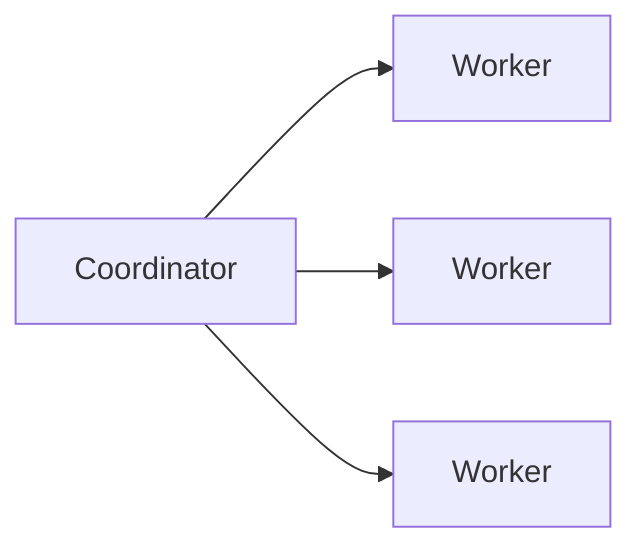
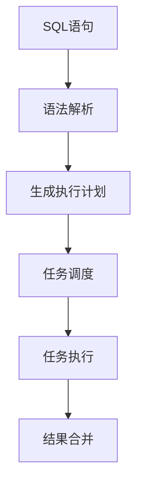

# Presto代码实例：自定义函数，扩展查询能力

## 1. 背景介绍
### 1.1 Presto简介
Presto是由Facebook开源的一个分布式SQL查询引擎，适用于交互式分析查询，数据量支持GB到PB字节。Presto的设计和编写完全是为了解决像Facebook这样规模的商业数据仓库的交互式分析和处理速度的问题。

### 1.2 Presto的优势
- 多数据源支持：Presto可以查询多个数据源，包括Hive、Cassandra、关系数据库以及专门数据存储。
- 高并发低延迟：Presto是为交互式分析而设计，可在秒级查询TB级数据，在100ms内完成GB级别的查询。
- 扩展性强：可以轻松的通过添加节点来扩展集群，进而提高查询的吞吐率。
- 部署简单：Presto不需要依赖Hadoop，可独立部署，部署简单。

### 1.3 Presto自定义函数的意义
虽然Presto内置了200多个函数，但是在实际的业务场景中，内置函数并不一定能满足所有需求。Presto提供了自定义函数的功能，允许用户根据自己的业务需求，自定义函数来扩展Presto的SQL查询能力，这极大的提高了Presto的灵活性和适用性。

## 2. 核心概念与联系
### 2.1 Presto的架构
Presto采用了简单的主从架构，由一个Coordinator节点和多个Worker节点组成。


- Coordinator负责解析SQL语句，生成执行计划，分发任务给Worker节点执行。
- Worker节点负责实际执行查询任务。Worker节点启动后向Coordinator节点进行注册，Coordinator就知道集群中有哪些Worker可以执行任务了。

### 2.2 Presto查询执行流程


- 语法解析：Presto的Coordinator节点负责将SQL语句解析成抽象语法树。 
- 生成执行计划：Coordinator根据语法树生成执行计划，优化器也会对执行计划进行优化。
- 任务调度：Coordinator将执行计划转换成一系列的Stage，每个Stage包含若干任务，这些任务会被分发给Worker节点执行。
- 任务执行：Worker节点执行Coordinator分发的任务，从数据源获取数据并进行计算。
- 结果合并：所有Worker执行完任务后，将结果返回给Coordinator，Coordinator对结果进行合并，返回给用户。

### 2.3 自定义函数的原理
Presto自定义函数的原理是通过实现一个自定义的函数接口，将这个接口打包成一个Plugin插件，部署到Presto集群中。当Presto的SQL语句中使用到自定义函数时，Presto会加载对应的Plugin插件，执行自定义函数的逻辑。

## 3. 核心算法原理具体操作步骤
实现一个Presto自定义函数的步骤如下：

### 3.1 定义函数接口
自定义函数需要实现Presto的函数接口，常用的接口有：
- `ScalarFunction`：一对一函数，输入一行输出一行。
- `AggregationFunction`：聚合函数，输入多行输出一行。
- `WindowFunction`：窗口函数，输入多行输出多行。

这里以`ScalarFunction`为例，定义一个字符串反转函数：
```java
public class ReverseFunction {

    @ScalarFunction("reverse")
    @SqlType(StandardTypes.VARCHAR)
    public static Slice reverse(@SqlType(StandardTypes.VARCHAR) Slice slice) {
        return Slices.utf8Slice(new StringBuilder(slice.toStringUtf8()).reverse());
    }
}
```

### 3.2 打包部署
将自定义函数打包成一个jar包，放到Presto的plugin目录下，重启Presto集群即可。

### 3.3 使用自定义函数
在Presto的SQL语句中，就可以像内置函数一样使用自定义函数了：
```sql
SELECT reverse('Hello, World!');
```

## 4. 数学模型和公式详细讲解举例说明
这里以一个简单的数学函数为例，实现一个计算平方根的函数：
```java
public class SquareRootFunction {
    
    @ScalarFunction("sqrt")
    @SqlType(StandardTypes.DOUBLE)
    public static double squareRoot(@SqlType(StandardTypes.DOUBLE) double input) {
        return Math.sqrt(input);
    }
}
```

这个函数使用了Java的`Math.sqrt()`方法来计算平方根，数学公式为：
$$\sqrt{x} = y \Leftrightarrow y^2 = x$$

使用这个自定义函数：
```sql
SELECT sqrt(4);
```
结果为2。

## 5. 项目实践：代码实例和详细解释说明
下面是一个更复杂一点的自定义函数例子，实现一个IP地址转整数的函数：
```java
public class IpAddressToLongFunction {
    
    @ScalarFunction("ip2long")
    @SqlType(StandardTypes.BIGINT)
    public static long ipAddressToLong(@SqlType(StandardTypes.VARCHAR) Slice slice) {
        String ip = slice.toStringUtf8();
        String[] octets = ip.split("\.");
        long result = 0;
        for (String octet : octets) {
            result = result * 256 + Long.parseLong(octet);
        }
        return result;
    }
}
```

这个函数的逻辑是：
1. 将IP地址按`.`分割成4个部分。
2. 将每个部分解析成整数，然后按照`result = result * 256 + octet`的方式累加。

例如，IP地址`192.168.1.1`转换的过程如下：
```
result = 0
result = 0 * 256 + 192 = 192 
result = 192 * 256 + 168 = 49320
result = 49320 * 256 + 1 = 12625921 
result = 12625921 * 256 + 1 = 3232235777
```

使用这个自定义函数：
```sql
SELECT ip2long('192.168.1.1');
```
结果为3232235777。

## 6. 实际应用场景
Presto自定义函数在实际的业务场景中有非常广泛的应用，举几个例子：

### 6.1 数据脱敏
在金融、医疗等行业，经常需要对一些敏感数据进行脱敏处理，可以通过自定义函数来实现：
```java
public class MaskFunction {
    
    @ScalarFunction("mask")
    @SqlType(StandardTypes.VARCHAR)
    public static Slice mask(@SqlType(StandardTypes.VARCHAR) Slice slice) {
        String str = slice.toStringUtf8();
        if (str.length() <= 3) {
            return Slices.utf8Slice(str.replaceAll(".", "*"));
        } else {
            return Slices.utf8Slice(str.substring(0, 3) + str.substring(3).replaceAll(".", "*"));
        }
    }
}
```
这个函数会将字符串的前3个字符保留，后面的字符替换成`*`。

### 6.2 数据格式转换
在数据分析过程中，经常需要对数据进行格式转换，比如将JSON字符串解析成对象，可以通过自定义函数来实现：
```java
public class JsonFunction {
    
    @ScalarFunction("json_parse")
    @SqlType(StandardTypes.JSON)
    public static Slice jsonParse(@SqlType(StandardTypes.VARCHAR) Slice slice) {
        try {
            String json = slice.toStringUtf8();
            return Slices.utf8Slice(JsonParser.parseString(json).toString());
        } catch (Exception e) {
            return null;
        }
    }
}
```

### 6.3 复杂计算
一些复杂的计算逻辑，也可以通过自定义函数来实现，比如计算两个日期之间的天数：
```java
public class DateDiffFunction {

    @ScalarFunction("date_diff")
    @SqlType(StandardTypes.INTEGER)
    public static long dateDiff(@SqlType(StandardTypes.DATE) long startDate, @SqlType(StandardTypes.DATE) long endDate) {
        LocalDate start = LocalDate.ofEpochDay(startDate);
        LocalDate end = LocalDate.ofEpochDay(endDate);
        return ChronoUnit.DAYS.between(start, end);
    }
}
```

## 7. 工具和资源推荐
- Presto官方文档：https://prestodb.io/docs/current/
- Presto Github：https://github.com/prestodb/presto
- Presto示例代码：https://github.com/prestodb/presto/tree/master/presto-example-http
- Presto自定义函数示例：https://github.com/prestodb/presto/tree/master/presto-example-udf

## 8. 总结：未来发展趋势与挑战
Presto作为一个高性能的分布式SQL查询引擎，在交互式数据分析领域有着广阔的应用前景。Presto的插件化架构，尤其是自定义函数的支持，极大的扩展了它的功能。

未来Presto的发展趋势主要体现在以下几个方面：
- 更多数据源的支持：Presto目前已经支持多种数据源，未来会支持更多的数据源，如ES、MongoDB等。
- SQL语义的完善：Presto会进一步完善SQL语义，提供更加完整的SQL支持。
- 性能的优化：Presto会在查询优化、执行引擎等方面进行优化，以提供更高的查询性能。
- 生态系统的建设：Presto将加强与Hadoop、Kubernetes等大数据生态系统的集成。

当然，Presto的发展也面临着一些挑战：
- 与成熟的商业数据仓库的竞争：Presto要想在企业级市场取得更大的发展，需要在功能、性能、稳定性等方面进一步提升，以应对来自商业数据仓库的竞争。
- 社区的活跃度：Presto是一个开源项目，需要维护一个活跃的社区，以推动项目的持续发展。
- 学习曲线：Presto的一些高级功能，如自定义函数，对用户的编程能力有一定要求，存在一定的学习曲线。

## 9. 附录：常见问题与解答

### 9.1 Presto支持哪些数据源？
Presto支持多种数据源，包括Hive、Cassandra、Kafka、MySQL、PostgreSQL、Elasticsearch等。

### 9.2 Presto的查询性能如何？
Presto的查询性能非常优异，特别是在交互式查询方面。Presto在秒级别可以处理TB级别的数据，在100ms内可以完成GB级别的查询。

### 9.3 Presto与Hive有什么区别？
Hive是一个基于Hadoop的数据仓库工具，主要用于海量结构化日志的数据分析。而Presto是一个分布式的查询引擎，主要用于交互式查询。在查询性能上，Presto远超Hive。

### 9.4 Presto是否支持事务？
不支持。Presto是为分析型查询设计的，不支持事务。

### 9.5 Presto的容错性如何？
Presto通过重试、数据冗余等机制来保证容错性。当某个Worker节点失败时，Coordinator会将任务重新调度到其他Worker节点执行。

作者：禅与计算机程序设计艺术 / Zen and the Art of Computer Programming