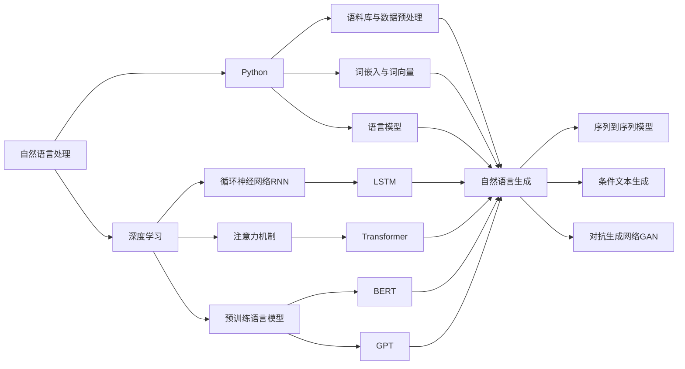

# Python深度学习实践：运用自然语言生成编写故事

## 1. 背景介绍
### 1.1 人工智能与自然语言处理
#### 1.1.1 人工智能的发展历程
#### 1.1.2 自然语言处理的兴起
#### 1.1.3 深度学习在自然语言处理中的应用

### 1.2 自然语言生成技术
#### 1.2.1 自然语言生成的定义和目标
#### 1.2.2 自然语言生成的发展历程
#### 1.2.3 自然语言生成的应用场景

### 1.3 Python在自然语言处理中的优势
#### 1.3.1 Python的简洁性和易用性
#### 1.3.2 Python丰富的自然语言处理库
#### 1.3.3 Python在深度学习领域的广泛应用

## 2. 核心概念与联系
### 2.1 自然语言处理的基本概念
#### 2.1.1 语料库与数据预处理
#### 2.1.2 词嵌入与词向量表示
#### 2.1.3 语言模型与文本生成

### 2.2 深度学习在自然语言处理中的应用
#### 2.2.1 循环神经网络(RNN)与长短期记忆网络(LSTM)
#### 2.2.2 注意力机制与Transformer模型
#### 2.2.3 预训练语言模型(如BERT、GPT)

### 2.3 自然语言生成的关键技术
#### 2.3.1 序列到序列模型(Seq2Seq)
#### 2.3.2 条件文本生成
#### 2.3.3 对抗生成网络(GAN)在文本生成中的应用



## 3. 核心算法原理具体操作步骤
### 3.1 基于LSTM的文本生成
#### 3.1.1 LSTM的基本原理
#### 3.1.2 基于字符级别的LSTM文本生成
#### 3.1.3 基于单词级别的LSTM文本生成

### 3.2 基于Transformer的文本生成
#### 3.2.1 Transformer的基本原理
#### 3.2.2 基于Transformer的编码器-解码器模型
#### 3.2.3 使用预训练的Transformer模型进行文本生成

### 3.3 基于GAN的文本生成
#### 3.3.1 GAN的基本原理
#### 3.3.2 SeqGAN：基于序列的GAN文本生成
#### 3.3.3 LeakGAN：长文本生成的GAN模型

## 4. 数学模型和公式详细讲解举例说明
### 4.1 LSTM的数学模型
#### 4.1.1 LSTM的门控机制
$$ f_t = \sigma(W_f \cdot [h_{t-1}, x_t] + b_f) $$
$$ i_t = \sigma(W_i \cdot [h_{t-1}, x_t] + b_i) $$
$$ \tilde{C}_t = \tanh(W_C \cdot [h_{t-1}, x_t] + b_C) $$
$$ C_t = f_t * C_{t-1} + i_t * \tilde{C}_t $$
$$ o_t = \sigma(W_o \cdot [h_{t-1}, x_t] + b_o) $$
$$ h_t = o_t * \tanh(C_t) $$

#### 4.1.2 LSTM的前向传播与反向传播
#### 4.1.3 LSTM在文本生成中的应用举例

### 4.2 Transformer的数学模型
#### 4.2.1 自注意力机制
$$ Attention(Q, K, V) = softmax(\frac{QK^T}{\sqrt{d_k}})V $$

#### 4.2.2 多头注意力机制
$$ MultiHead(Q, K, V) = Concat(head_1, ..., head_h)W^O $$
$$ head_i = Attention(QW_i^Q, KW_i^K, VW_i^V) $$

#### 4.2.3 Transformer在文本生成中的应用举例

### 4.3 GAN的数学模型
#### 4.3.1 生成器与判别器的博弈
$$ \min_G \max_D V(D, G) = \mathbb{E}_{x \sim p_{data}(x)}[\log D(x)] + \mathbb{E}_{z \sim p_z(z)}[\log(1 - D(G(z)))] $$

#### 4.3.2 策略梯度在GAN文本生成中的应用
#### 4.3.3 GAN在文本生成中的应用举例

## 5. 项目实践：代码实例和详细解释说明
### 5.1 基于LSTM的文本生成实践
#### 5.1.1 数据预处理与词嵌入
```python
import numpy as np
from keras.preprocessing.text import Tokenizer
from keras.preprocessing.sequence import pad_sequences

# 加载文本数据
with open('data.txt', 'r', encoding='utf-8') as f:
    text = f.read()

# 分词与词嵌入
tokenizer = Tokenizer(char_level=True)
tokenizer.fit_on_texts(text)
vocab_size = len(tokenizer.word_index) + 1
sequences = tokenizer.texts_to_sequences([text])[0]
```

#### 5.1.2 构建LSTM模型
```python
from keras.models import Sequential
from keras.layers import LSTM, Dense, Embedding

# 构建LSTM模型
model = Sequential()
model.add(Embedding(vocab_size, 256, input_length=max_length))
model.add(LSTM(512, return_sequences=True))
model.add(LSTM(512))
model.add(Dense(vocab_size, activation='softmax'))

model.compile(loss='categorical_crossentropy', optimizer='adam')
```

#### 5.1.3 训练模型与生成文本
```python
from keras.utils import to_categorical

# 准备训练数据
X = []
y = []
for i in range(0, len(sequences) - max_length, step):
    X.append(sequences[i:i+max_length])
    y.append(sequences[i+max_length])
X = np.array(X)
y = to_categorical(y, num_classes=vocab_size)

# 训练模型
model.fit(X, y, batch_size=128, epochs=50)

# 生成文本
seed_text = "Once upon a time"
generated_text = seed_text

for i in range(500):
    encoded = tokenizer.texts_to_sequences([seed_text])[0]
    encoded = pad_sequences([encoded], maxlen=max_length, truncating='pre')

    y_pred = model.predict_classes(encoded, verbose=0)
    predicted_word = ""
    for word, index in tokenizer.word_index.items():
        if index == y_pred:
            predicted_word = word
            break
    seed_text += predicted_word
    generated_text += predicted_word

print(generated_text)
```

### 5.2 基于Transformer的文本生成实践
#### 5.2.1 数据预处理与词嵌入
```python
import tensorflow as tf
from transformers import GPT2Tokenizer, TFGPT2LMHeadModel

# 加载GPT-2分词器和模型
tokenizer = GPT2Tokenizer.from_pretrained('gpt2')
model = TFGPT2LMHeadModel.from_pretrained('gpt2')
```

#### 5.2.2 使用预训练的GPT-2模型生成文本
```python
# 生成文本
seed_text = "Once upon a time"
input_ids = tokenizer.encode(seed_text, return_tensors='tf')

output = model.generate(
    input_ids,
    max_length=100,
    num_return_sequences=1,
    no_repeat_ngram_size=2,
    early_stopping=True
)

generated_text = tokenizer.decode(output[0], skip_special_tokens=True)
print(generated_text)
```

### 5.3 基于GAN的文本生成实践
#### 5.3.1 SeqGAN的实现
```python
import tensorflow as tf
from keras.models import Sequential
from keras.layers import LSTM, Dense, Embedding

# 生成器模型
generator = Sequential()
generator.add(Embedding(vocab_size, 256, input_length=max_length))
generator.add(LSTM(512, return_sequences=True))
generator.add(LSTM(512))
generator.add(Dense(vocab_size, activation='softmax'))

# 判别器模型
discriminator = Sequential()
discriminator.add(Embedding(vocab_size, 256, input_length=max_length))
discriminator.add(LSTM(512))
discriminator.add(Dense(1, activation='sigmoid'))

# 定义损失函数和优化器
cross_entropy = tf.keras.losses.BinaryCrossentropy()
generator_optimizer = tf.keras.optimizers.Adam(learning_rate=0.01)
discriminator_optimizer = tf.keras.optimizers.Adam(learning_rate=0.01)

# 训练SeqGAN
for epoch in range(num_epochs):
    for i in range(num_batches):
        # 生成器生成文本
        noise = tf.random.normal((batch_size, max_length, latent_dim))
        generated_sequences = generator(noise)

        # 判别器训练
        real_sequences = get_real_sequences(batch_size)
        discriminator_loss = train_discriminator(real_sequences, generated_sequences)

        # 生成器训练
        rewards = get_rewards(generated_sequences)
        generator_loss = train_generator(noise, rewards)

    print(f"Epoch {epoch+1}, Discriminator Loss: {discriminator_loss}, Generator Loss: {generator_loss}")
```

#### 5.3.2 LeakGAN的实现
```python
# LeakGAN的生成器
class LeakGANGenerator(tf.keras.Model):
    def __init__(self, vocab_size, embedding_dim, hidden_dim, max_length):
        super(LeakGANGenerator, self).__init__()
        self.embedding = tf.keras.layers.Embedding(vocab_size, embedding_dim)
        self.lstm = tf.keras.layers.LSTM(hidden_dim, return_sequences=True)
        self.dense = tf.keras.layers.Dense(vocab_size)
        self.max_length = max_length

    def call(self, x, hidden):
        x = self.embedding(x)
        output, hidden = self.lstm(x, initial_state=hidden)
        output = self.dense(output)
        return output, hidden

    def initialize_hidden_state(self, batch_size):
        return [tf.zeros((batch_size, self.lstm.units)) for _ in range(2)]

# LeakGAN的判别器
class LeakGANDiscriminator(tf.keras.Model):
    def __init__(self, vocab_size, embedding_dim, hidden_dim):
        super(LeakGANDiscriminator, self).__init__()
        self.embedding = tf.keras.layers.Embedding(vocab_size, embedding_dim)
        self.lstm = tf.keras.layers.LSTM(hidden_dim)
        self.dense = tf.keras.layers.Dense(1, activation='sigmoid')

    def call(self, x):
        x = self.embedding(x)
        x = self.lstm(x)
        x = self.dense(x)
        return x

# 训练LeakGAN
generator = LeakGANGenerator(vocab_size, embedding_dim, hidden_dim, max_length)
discriminator = LeakGANDiscriminator(vocab_size, embedding_dim, hidden_dim)

for epoch in range(num_epochs):
    for i in range(num_batches):
        # 生成器生成文本
        noise = tf.random.normal((batch_size, max_length, latent_dim))
        hidden = generator.initialize_hidden_state(batch_size)
        generated_sequences, _ = generator(noise, hidden)

        # 判别器训练
        real_sequences = get_real_sequences(batch_size)
        discriminator_loss = train_discriminator(real_sequences, generated_sequences)

        # 生成器训练
        rewards = get_rewards(generated_sequences)
        generator_loss = train_generator(noise, rewards)

    print(f"Epoch {epoch+1}, Discriminator Loss: {discriminator_loss}, Generator Loss: {generator_loss}")
```

## 6. 实际应用场景
### 6.1 故事生成
#### 6.1.1 童话故事生成
#### 6.1.2 科幻小说生成
#### 6.1.3 恐怖故事生成

### 6.2 诗歌生成
#### 6.2.1 古诗生成
#### 6.2.2 现代诗生成
#### 6.2.3 歌词生成

### 6.3 对话生成
#### 6.3.1 聊天机器人
#### 6.3.2 客服自动回复
#### 6.3.3 虚拟助手

## 7. 工具和资源推荐
### 7.1 Python自然语言处理库
#### 7.1.1 NLTK
#### 7.1.2 spaCy
#### 7.1.3 Gensim

### 7.2 深度学习框架
#### 7.2.1 TensorFlow
#### 7.2.2 PyTorch
#### 7.2.3 Keras

### 7.3 预训练语言模型
#### 7.3.1 BERT
#### 7.3.2 GPT-2
#### 7.3.3 XLNet

## 8. 总结：未来发展趋势与挑