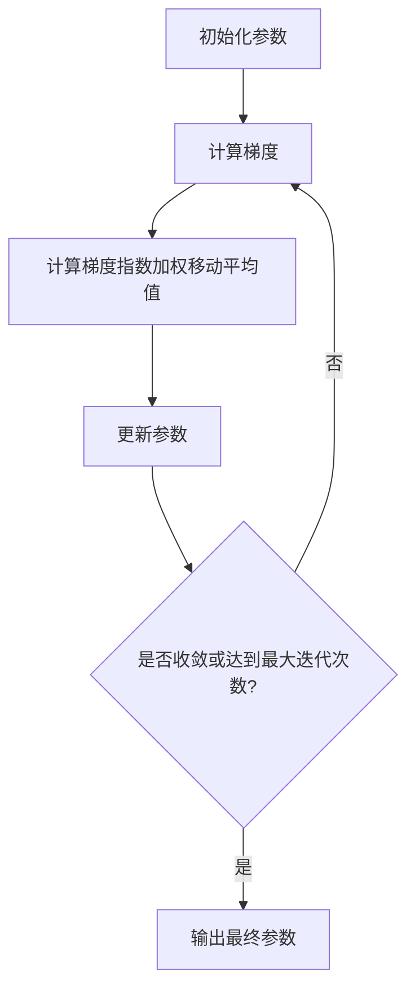

# RMSProp:超参数选择策略

## 1.背景介绍

在深度学习和机器学习领域,优化算法扮演着至关重要的角色。它们用于调整模型的参数,以最小化损失函数并提高模型的性能。然而,选择合适的优化算法及其超参数对于获得良好的训练效果至关重要。RMSProp(Root Mean Square Propagation)是一种自适应学习率优化算法,它通过根据梯度的指数加权移动平均值来调整每个参数的学习率,从而加快收敛速度并提高模型的性能。

## 2.核心概念与联系

### 2.1 梯度下降算法

梯度下降算法是机器学习中最常用的优化算法之一。它通过计算损失函数相对于模型参数的梯度,并沿着梯度的反方向更新参数,从而最小化损失函数。然而,传统的梯度下降算法存在一些缺陷,例如:

1. 固定学习率:传统梯度下降算法使用固定的学习率,这可能会导致收敛速度较慢或者无法收敛。
2. 鞍点问题:在高维空间中,梯度下降算法容易陷入鞍点或平坦区域,从而无法有效地更新参数。

### 2.2 动量优化算法

为了解决传统梯度下降算法的缺陷,动量优化算法被提出。动量优化算法通过引入动量项来加速收敛过程,并帮助算法摆脱局部最小值或鞍点的影响。然而,动量优化算法仍然使用固定的学习率,这可能会导致收敛速度较慢或者无法收敛。

### 2.3 自适应学习率优化算法

为了解决固定学习率的问题,自适应学习率优化算法被提出。这些算法通过根据梯度的历史信息动态调整每个参数的学习率,从而加快收敛速度并提高模型的性能。RMSProp就是一种自适应学习率优化算法。

## 3.核心算法原理具体操作步骤

RMSProp算法的核心思想是通过根据梯度的指数加权移动平均值来调整每个参数的学习率。具体操作步骤如下:

1. 初始化参数 $\theta$、学习率 $\alpha$、衰减率 $\rho$、平滑项 $\epsilon$。
2. 计算损失函数 $J(\theta)$ 相对于参数 $\theta$ 的梯度 $g_t = \nabla_\theta J(\theta)$。
3. 计算梯度的指数加权移动平均值 $v_t$:

$$v_t = \rho v_{t-1} + (1 - \rho) g_t^2$$

其中 $\rho$ 是衰减率,控制着历史梯度的贡献程度。较大的 $\rho$ 值会给予较大的权重。

4. 更新参数 $\theta$:

$$\theta_{t+1} = \theta_t - \frac{\alpha}{\sqrt{v_t + \epsilon}} g_t$$

其中 $\epsilon$ 是一个平滑项,用于避免分母为零的情况。

5. 重复步骤2-4,直到收敛或达到最大迭代次数。

RMSProp算法的核心思想是通过根据梯度的指数加权移动平均值来调整每个参数的学习率。对于那些梯度较大的参数,学习率会变小,从而避免了参数的剧烈波动;对于那些梯度较小的参数,学习率会变大,从而加快了收敛速度。这种自适应学习率的机制使得RMSProp算法能够在不同的参数空间中表现出良好的收敛性能。

RMSProp算法的流程图如下所示:



## 4.数学模型和公式详细讲解举例说明

RMSProp算法的核心公式是:

$$v_t = \rho v_{t-1} + (1 - \rho) g_t^2$$
$$\theta_{t+1} = \theta_t - \frac{\alpha}{\sqrt{v_t + \epsilon}} g_t$$

其中:

- $v_t$ 是梯度的指数加权移动平均值。
- $g_t$ 是损失函数相对于参数的梯度。
- $\rho$ 是衰减率,控制着历史梯度的贡献程度。
- $\alpha$ 是学习率。
- $\epsilon$ 是一个平滑项,用于避免分母为零的情况。

让我们通过一个简单的例子来理解这些公式。假设我们有一个损失函数 $J(\theta) = \theta^2$,初始参数 $\theta_0 = 10$,学习率 $\alpha = 0.1$,衰减率 $\rho = 0.9$,平滑项 $\epsilon = 10^{-8}$。

第一次迭代:
$$g_0 = \nabla_\theta J(\theta_0) = 2 \theta_0 = 20$$
$$v_0 = 0$$
$$\theta_1 = \theta_0 - \frac{\alpha}{\sqrt{v_0 + \epsilon}} g_0 = 10 - \frac{0.1}{\sqrt{10^{-8}}} \cdot 20 = 8$$

第二次迭代:
$$g_1 = \nabla_\theta J(\theta_1) = 2 \theta_1 = 16$$
$$v_1 = \rho v_0 + (1 - \rho) g_1^2 = 0.9 \cdot 0 + 0.1 \cdot 16^2 = 25.6$$
$$\theta_2 = \theta_1 - \frac{\alpha}{\sqrt{v_1 + \epsilon}} g_1 = 8 - \frac{0.1}{\sqrt{25.6 + 10^{-8}}} \cdot 16 = 6.25$$

我们可以看到,在第二次迭代时,由于梯度的指数加权移动平均值 $v_1$ 变大,导致学习率 $\frac{\alpha}{\sqrt{v_1 + \epsilon}}$ 变小,从而使得参数更新幅度减小。这种自适应学习率的机制可以帮助算法在陡峭区域时小步前进,在平坦区域时大步前进,从而加快收敛速度。

## 5.项目实践:代码实例和详细解释说明

下面是一个使用PyTorch实现RMSProp算法的示例代码:

```python
import torch

# 定义RMSProp优化器
def RMSProp(params, lr=0.01, rho=0.9, eps=1e-8):
    for param in params:
        param_state = getattr(param, 'rms_prop', None)
        if param_state is None:
            param_state = torch.zeros_like(param.data)
            setattr(param, 'rms_prop', param_state)

        grad = param.grad.data
        param_state.mul_(rho).addcmul_(1 - rho, grad, grad)
        param.data.addcdiv_(-lr, grad, param_state.sqrt().add_(eps))

# 示例用法
model = torch.nn.Linear(10, 1)
optimizer = RMSProp(model.parameters(), lr=0.01, rho=0.9, eps=1e-8)

for epoch in range(100):
    # 前向传播
    outputs = model(inputs)
    loss = criterion(outputs, targets)

    # 反向传播
    optimizer.zero_grad()
    loss.backward()

    # 更新参数
    optimizer.step()
```

在这个示例中,我们定义了一个 `RMSProp` 函数,用于实现RMSProp优化算法。该函数接受四个参数:

- `params`: 需要优化的模型参数。
- `lr`: 学习率。
- `rho`: 衰减率。
- `eps`: 平滑项。

在函数内部,我们遍历每个参数,并计算梯度的指数加权移动平均值 `param_state`。如果 `param_state` 不存在,我们就用全零张量初始化它。然后,我们根据RMSProp算法的公式更新 `param_state` 和参数 `param.data`。

在示例用法部分,我们创建了一个线性模型 `model`,并使用 `RMSProp` 优化器对其进行优化。在每个epoch中,我们进行前向传播计算损失,然后进行反向传播计算梯度,最后调用 `optimizer.step()` 函数更新参数。

需要注意的是,PyTorch已经内置了 `torch.optim.RMSprop` 优化器,我们可以直接使用它,而不必自己实现。但是,了解RMSProp算法的实现细节对于深入理解该算法的原理非常有帮助。

## 6.实际应用场景

RMSProp算法在许多实际应用场景中都表现出了良好的性能,例如:

1. **计算机视觉任务**:在图像分类、目标检测、语义分割等计算机视觉任务中,RMSProp算法被广泛应用于训练深度神经网络模型。

2. **自然语言处理任务**:在机器翻译、文本生成、情感分析等自然语言处理任务中,RMSProp算法也被用于优化基于深度学习的模型。

3. **强化学习任务**:在游戏AI、机器人控制等强化学习任务中,RMSProp算法可以用于优化策略网络和值函数网络。

4. **推荐系统**:在电商推荐、个性化推荐等场景中,RMSProp算法可以用于优化协同过滤模型和深度学习推荐模型。

5. **金融预测**:在股票预测、风险管理等金融领域,RMSProp算法可以用于优化时间序列预测模型。

总的来说,RMSProp算法由于其自适应学习率的优势,在各种需要训练深度神经网络的任务中都表现出了良好的性能,成为了深度学习优化算法的重要选择之一。

## 7.工具和资源推荐

如果您想进一步了解和使用RMSProp算法,以下是一些推荐的工具和资源:

1. **PyTorch**:PyTorch是一个流行的深度学习框架,内置了 `torch.optim.RMSprop` 优化器,可以方便地使用RMSProp算法。PyTorch的官方文档提供了详细的使用说明和示例代码。

2. **TensorFlow**:TensorFlow也是一个广泛使用的深度学习框架,内置了 `tf.keras.optimizers.RMSprop` 优化器,可以方便地使用RMSProp算法。TensorFlow的官方文档也提供了相关资源。

3. **Keras**:Keras是一个高级的深度学习库,可以在TensorFlow或Theano之上运行。Keras内置了 `keras.optimizers.RMSprop` 优化器,使用起来非常方便。

4. **论文和教程**:关于RMSProp算法的原理和应用,有许多优秀的论文和教程资源,例如:
   - 原始论文:"Lecture 6.5 - RmsProp: Divide the gradient by a running average of its recent magnitude"
   - "An overview of gradient descent optimization algorithms"
   - "深度学习优化器综述"

5. **在线课程**:一些优质的在线课程也涉及了RMSProp算法,例如吴恩达的"深度学习专项课程"和斯坦福大学的"深度学习课程"。

6. **开源实现**:GitHub上有许多开源的RMSProp算法实现,您可以查看源代码以深入理解该算法的细节。

通过利用这些工具和资源,您可以更好地掌握RMSProp算法的原理和应用,并将其应用到您的深度学习项目中。

## 8.总结:未来发展趋势与挑战

RMSProp算法作为一种自适应学习率优化算法,在深度学习领域取得了广泛的应用和成功。它通过根据梯度的指数加权移动平均值来调整每个参数的学习率,从而加快收敛速度并提高模型的性能。

然而,RMSProp算法也存在一些局限性和挑战:

1. **参数初始化敏感性**:RMSProp算法对参数的初始化比较敏感,不同的初始化方式可能会导致收敛性能的差异。

2. **超参数选择困难**:RMSProp算法需要手动设置学习率、衰减率和平滑项等超参数,这些超参数的选择对算法的性能有很大影响,但缺乏理论指导。

3. **梯度爆炸和消失问题**:虽然RMSProp算法可以缓解梯度爆