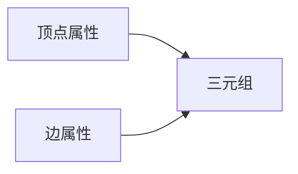
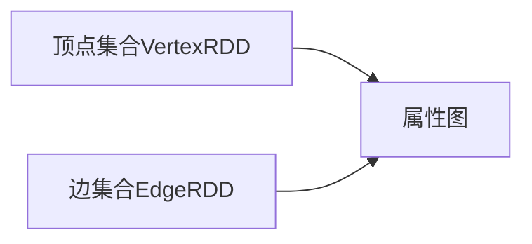
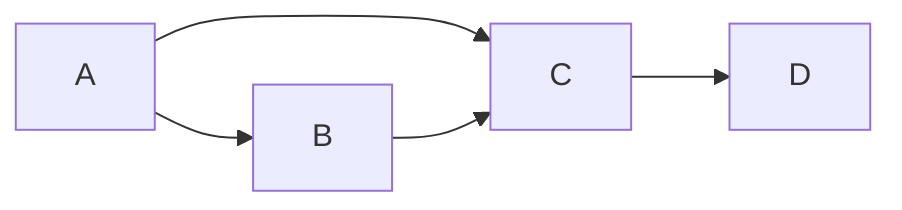

# Spark GraphX图计算引擎原理与代码实例讲解

## 1.背景介绍

### 1.1 图计算的重要性

在当今大数据时代,图计算已经成为了数据处理和分析的重要组成部分。许多现实世界的问题都可以用图结构表示,例如社交网络、Web链接、交通网络等。图计算可以帮助我们发现隐藏在海量数据中的复杂关系和模式,从而为决策提供有价值的洞见。

### 1.2 Spark GraphX简介

Apache Spark是一个开源的大数据处理框架,GraphX是Spark的一个图计算模块。GraphX将低级的图并行计算抽象为一个易于使用的集合运算,并提供了多种图算法的实现。GraphX可以高效地在大规模集群上执行图计算任务,为分析大规模图数据提供了强大的工具。

## 2.核心概念与联系

### 2.1 属性图(Property Graph)

GraphX中的核心数据结构是属性图(Property Graph),它由以下三个部分组成:

- 顶点(Vertex):表示图中的节点,每个顶点都有一个唯一的ID和属性值。
- 边(Edge):表示顶点之间的连接关系,每条边都有一个源顶点ID、目标顶点ID和属性值。
- 三元组(Triplet):由一个边和它的源顶点属性、目标顶点属性组成。



### 2.2 图运算符

GraphX提供了一系列图运算符,用于对属性图进行转换和操作,主要包括:

- `mapVertices`、`mapTriplets`:对顶点/三元组应用转换函数
- `subgraph`、`mask`:从原图中提取子图
- `joinVertices`、`outerJoinVertices`:将顶点与其他数据集关联

这些运算符可以组合使用,构建出复杂的图计算管道。

### 2.3 图算法

GraphX内置了多种常用的图算法,如:

- PageRank:用于计算网页重要性
- 连通分量:识别图中的连通子图
- 三角形计数:统计图中三角形的数量
- 最短路径:计算顶点对之间的最短路径

这些算法封装了分布式图计算的复杂性,使得开发人员可以专注于算法本身的实现。

## 3.核心算法原理具体操作步骤

### 3.1 属性图的并行表示

GraphX将属性图表示为两个并行的分布式集合:

- 顶点集合(VertexRDD):存储所有顶点及其属性
- 边集合(EdgeRDD):存储所有边及其属性

这种表示方式使得图数据可以高效地分区和并行处理。



### 3.2 图运算符的实现

以`joinVertices`为例,它将顶点与另一个数据集关联:

1. 将数据集与顶点集合进行`cogroup`操作,根据顶点ID对数据进行分组。
2. 对每个组应用`mapValues`转换函数,将顶点属性与数据集中的值关联。

```scala
def joinVertices[U, V](
      vertices: RDD[(VertexId, U)],
      mapFunc: (VertexId, VD, Iterable[U]) => V): Graph[V, ED] = {
  ...
  val newVerts = vpred.cogroup(vertices).mapValues {
    case (vd, msgs) => mapFunc(id, vd.get, msgs)
  }
  ...
}
```

### 3.3 图算法的实现

以PageRank算法为例,它通过迭代计算每个顶点的重要性分数:

1. 初始化每个顶点的分数为1/N(N为顶点总数)。
2. 在每次迭代中,将当前顶点的分数按比例传播给所有出边的目标顶点。
3. 重复步骤2直到收敛或达到最大迭代次数。

```scala
def staticrank(graph: Graph[...], tol: Double, maxIter: Int): Graph[...] = {
  var g = graph.mapVertices((vid, vd) => 1.0 / graph.numVertices)
  var prevRanks = g.vertices.cache()
  for (iter <- 1 to maxIter) {
    val newRanks = g.joinVertices(g.outDegrees) {
      (vid, vd, degreeSum, outDegrees) =>
        0.15 + 0.85 * outDegrees.iterator.map(pair => prevRanks.lookup(pair._1).get * (pair._2 / degreeSum)).sum
    }.vertices
    val diff = prevRanks.join(newRanks).mapValues((pair) => math.abs(pair._1 - pair._2))
    if (diff.rdd.map(_._2).sum() < tol * graph.numVertices) return g
    prevRanks.unpersist()
    prevRanks = newRanks.cache()
  }
  g
}
```

该实现利用了GraphX提供的图运算符,如`mapVertices`、`joinVertices`等,大大简化了分布式图计算的复杂性。

## 4.数学模型和公式详细讲解举例说明

### 4.1 PageRank算法数学模型

PageRank算法基于以下数学模型:

$$PR(u) = \frac{1-d}{N} + d \sum_{v \in B_u} \frac{PR(v)}{L(v)}$$

其中:

- $PR(u)$表示页面u的PageRank值
- $B_u$是链接到u的页面集合
- $L(v)$是页面v的出链接数
- $d$是一个阻尼系数,通常取值0.85
- $N$是网络中的总页面数

该公式表示,一个页面的PageRank值由两部分组成:

1. 全局重要性贡献 $\frac{1-d}{N}$
2. 其他页面传递过来的重要性 $d \sum_{v \in B_u} \frac{PR(v)}{L(v)}$

通过迭代计算,PageRank值会收敛到一个稳定的状态。

### 4.2 PageRank算法示例

假设有一个小型网络,包含4个页面A、B、C、D,链接关系如下:



初始时,每个页面的PageRank值为0.25。在第一次迭代后,各页面的PageRank值为:

$$\begin{aligned}
PR(A) &= \frac{1-0.85}{4} + 0.85 \times 0 = 0.0375\\
PR(B) &= \frac{1-0.85}{4} + 0.85 \times \frac{0.25}{2} = 0.15375\\
PR(C) &= \frac{1-0.85}{4} + 0.85 \times \left(\frac{0.25}{2} + \frac{0.25}{1}\right) = 0.34875\\
PR(D) &= \frac{1-0.85}{4} + 0.85 \times \frac{0.25}{1} = 0.21375
\end{aligned}$$

经过多次迭代,PageRank值会逐渐收敛,最终C的PageRank值最高,说明它是这个小网络中最重要的页面。

## 5.项目实践:代码实例和详细解释说明

### 5.1 创建属性图

```scala
import org.apache.spark.graphx._

// 创建顶点集合
val verts = sc.parallelize(Array((1L, ("Node1", 10)), (2L, ("Node2", 20)), (3L, ("Node3", 30))))
val vertexRDD: RDD[(VertexId, (String, Int))] = verts

// 创建边集合
val edges = sc.parallelize(Array(Edge(1L, 2L, 1), Edge(1L, 3L, 2), Edge(2L, 3L, 3)))
val edgeRDD = edges

// 构建属性图
val graph: Graph[(String, Int), Int] = Graph(vertexRDD, edgeRDD)
```

这段代码首先创建了顶点集合`vertexRDD`和边集合`edgeRDD`,然后使用`Graph`构造函数将它们组合成一个属性图`graph`。每个顶点包含一个字符串标识符和一个整数属性,每条边包含一个整数权重。

### 5.2 图运算符示例

```scala
// 投影操作,只保留顶点属性中的字符串标识符
val projectedGraph = graph.mapVertices((vid, vdata) => vdata._1)

// 子图提取,只保留边权重大于1的边
val filteredGraph = graph.subgraph(triplet => triplet.attr > 1)

// 关联顶点属性与其他数据集
val newVertexRDD = projectedGraph.vertices.join(someOtherRDD)
val withNewVertexData = graph.joinVertices(newVertexRDD)((_, _, newData) => newData)
```

这些代码展示了如何使用`mapVertices`、`subgraph`和`joinVertices`等运算符对图进行转换和操作。

### 5.3 图算法示例

```scala
// 计算PageRank
val rankedGraph = graph.staticrank(0.0001, 20)

// 找到最大的PageRank值及其对应的顶点
val maxRankWithNode = rankedGraph.vertices.innerJoin(graph.vertices) {
  (id, rank, node) => (node, rank)
}.reduce((x, y) => if (x._2 > y._2) x else y)

// 输出结果
println(s"The node with highest PageRank value is: ${maxRankWithNode._1._1}, rank = ${maxRankWithNode._2}")
```

这段代码首先使用`staticrank`算法计算图中每个顶点的PageRank值,然后通过`innerJoin`和`reduce`操作找到具有最大PageRank值的顶点及其值。

## 6.实际应用场景

GraphX可以应用于各种领域,解决现实世界中的图计算问题:

- **社交网络分析**: 分析用户之间的关系网络,发现影响力大户、社区结构等。
- **网页排名**: 使用PageRank等算法评估网页重要性,为搜索引擎优化提供依据。
- **推荐系统**: 基于用户之间的相似性网络,为用户推荐感兴趣的商品或内容。
- **交通规划**: 对城市交通网络进行分析,优化路线、缓解拥堵等。
- **金融风险分析**: 分析公司之间的投资关系网络,评估系统性风险。

## 7.工具和资源推荐

- **Spark GraphX官方文档**: https://spark.apache.org/docs/latest/graphx-programming-guide.html
- **Coursera图算法课程**: https://www.coursera.org/learn/algorithms-on-graphs
- **Stanford Network Analysis Project**: http://snap.stanford.edu/
- **NetworkX**: 一个用Python实现的图计算库,提供了丰富的算法和工具。
- **Graph Tool**: 一个高效的图计算库,支持大规模图分析。

## 8.总结:未来发展趋势与挑战

图计算是大数据处理和分析的重要组成部分,在未来仍将扮演关键角色。GraphX作为Spark生态系统中的图计算模块,将继续得到优化和增强。同时,一些新兴趋势和挑战也值得关注:

- **图嵌入技术**: 将图结构映射到低维向量空间,为图数据挖掘提供新的机遇。
- **动态图分析**: 现有的大多数图算法都假设图是静态的,但现实世界中的图通常是动态变化的,需要新的算法来处理动态图。
- **图数据可视化**: 如何高效地可视化大规模图数据,帮助人类直观理解其中的模式和结构。
- **图计算的硬件加速**: 利用GPU等专用硬件,进一步提升图计算的性能。

## 9.附录:常见问题与解答

1. **GraphX与其他图计算框架(如Giraph、GraphLab)相比有何优缺点?**

GraphX作为Spark生态系统的一部分,可以很好地与Spark的其他模块(如Spark SQL、Spark Streaming等)集成,形成强大的大数据处理管道。同时,GraphX也继承了Spark的优点,如内存计算、容错性等。但是,GraphX目前在图算法库方面仍然相对有限,无法满足所有需求。

2. **如何在GraphX中实现自定义的图算法?**

GraphX提供了`graph.pregel`和`graph.mapReduceTriplets`等底层API,用户可以基于这些API实现自定义的图算法。但是,这需要对GraphX的内部实现有较深入的理解,编程难度较高。

3. **GraphX是否支持流式图计算?**

目前GraphX还不支持流式图计算,只能处理静态图数据。但是,由于GraphX紧密集成在Spark生态系统中,因此可以与Spark Streaming等模块结合,实现准实时的图数据处理。

4. **GraphX在处理超大规模图数据时会