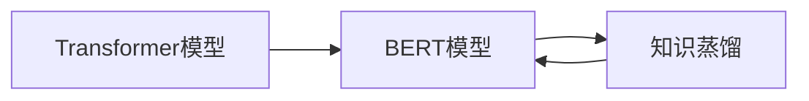

# Transformer大模型实战 BERT 变体（下）：基于知识蒸馏

## 1.背景介绍
### 1.1 Transformer模型的发展历程
#### 1.1.1 Transformer模型的起源
#### 1.1.2 Transformer模型的发展
#### 1.1.3 Transformer模型的应用现状
### 1.2 BERT模型的诞生
#### 1.2.1 BERT模型的创新点
#### 1.2.2 BERT模型的架构
#### 1.2.3 BERT模型的预训练方法
### 1.3 知识蒸馏技术概述
#### 1.3.1 知识蒸馏的基本原理
#### 1.3.2 知识蒸馏的优势
#### 1.3.3 知识蒸馏在NLP领域的应用

## 2.核心概念与联系
### 2.1 Transformer模型的核心概念
#### 2.1.1 自注意力机制
#### 2.1.2 多头注意力
#### 2.1.3 位置编码
### 2.2 BERT模型的核心概念
#### 2.2.1 Masked Language Model(MLM)
#### 2.2.2 Next Sentence Prediction(NSP)
#### 2.2.3 WordPiece Embedding
### 2.3 知识蒸馏的核心概念
#### 2.3.1 教师模型与学生模型
#### 2.3.2 软目标与硬目标
#### 2.3.3 温度超参数
### 2.4 三者之间的关系


## 3.核心算法原理具体操作步骤
### 3.1 BERT模型的预训练
#### 3.1.1 数据准备与预处理
#### 3.1.2 MLM任务的训练
#### 3.1.3 NSP任务的训练
### 3.2 BERT模型的微调
#### 3.2.1 下游任务的数据准备
#### 3.2.2 微调的具体步骤
#### 3.2.3 微调的优化策略
### 3.3 基于知识蒸馏的BERT模型压缩
#### 3.3.1 教师模型的选择与训练
#### 3.3.2 学生模型的构建
#### 3.3.3 蒸馏损失函数的设计
#### 3.3.4 蒸馏训练的具体步骤

## 4.数学模型和公式详细讲解举例说明
### 4.1 Transformer模型的数学表示
#### 4.1.1 自注意力机制的数学公式
$Attention(Q,K,V) = softmax(\frac{QK^T}{\sqrt{d_k}})V$
其中，$Q$,$K$,$V$分别表示查询向量、键向量和值向量，$d_k$表示向量的维度。
#### 4.1.2 多头注意力的数学公式
$$MultiHead(Q,K,V) = Concat(head_1,...,head_h)W^O$$
$$head_i = Attention(QW_i^Q, KW_i^K, VW_i^V)$$
其中，$W_i^Q$,$W_i^K$,$W_i^V$,$W^O$为可学习的权重矩阵。
#### 4.1.3 位置编码的数学公式
$$PE_{(pos,2i)} = sin(pos/10000^{2i/d_{model}})$$
$$PE_{(pos,2i+1)} = cos(pos/10000^{2i/d_{model}})$$
其中，$pos$表示位置，$i$表示维度，$d_{model}$表示词嵌入的维度。
### 4.2 BERT模型的数学表示
#### 4.2.1 MLM任务的数学公式
$$L_{MLM} = -\sum_{i=1}^nm_i\log p(w_i|w_{\backslash i})$$
其中，$m_i$表示第$i$个token是否被mask，$w_i$表示第$i$个token，$w_{\backslash i}$表示除第$i$个token之外的其他token。
#### 4.2.2 NSP任务的数学公式
$$L_{NSP} = -y\log p(y=1|s_1,s_2) - (1-y)\log p(y=0|s_1,s_2)$$
其中，$y$表示两个句子是否相邻，$s_1$和$s_2$分别表示两个句子。
### 4.3 知识蒸馏的数学表示
#### 4.3.1 蒸馏损失函数的数学公式
$$L_{KD} = \alpha T^2 \cdot KL(\frac{z_t}{T} || \frac{z_s}{T}) + (1-\alpha)H(y,\sigma(z_s))$$
其中，$z_t$和$z_s$分别表示教师模型和学生模型的logits，$T$表示温度超参数，$\alpha$表示软目标损失的权重，$y$表示真实标签，$\sigma$表示softmax函数，$H$表示交叉熵损失函数，$KL$表示KL散度。

## 5.项目实践：代码实例和详细解释说明
### 5.1 BERT模型的预训练代码实例
```python
import torch
from transformers import BertForPreTraining, BertTokenizer

# 加载预训练模型和tokenizer
model = BertForPreTraining.from_pretrained('bert-base-uncased')
tokenizer = BertTokenizer.from_pretrained('bert-base-uncased')

# 准备训练数据
texts = [...]
inputs = tokenizer(texts, return_tensors='pt', max_length=512, truncation=True, padding='max_length')

# 训练模型
outputs = model(**inputs, labels=inputs['input_ids'], next_sentence_label=torch.LongTensor([1]*len(texts)))
loss = outputs.loss
loss.backward()
```
上述代码首先加载了预训练的BERT模型和对应的tokenizer，然后准备了训练数据，最后通过前向传播和反向传播来训练模型。其中，`labels`参数用于MLM任务，`next_sentence_label`参数用于NSP任务。
### 5.2 BERT模型的微调代码实例
```python
import torch
from transformers import BertForSequenceClassification, BertTokenizer

# 加载预训练模型和tokenizer
model = BertForSequenceClassification.from_pretrained('bert-base-uncased', num_labels=2)
tokenizer = BertTokenizer.from_pretrained('bert-base-uncased')

# 准备训练数据
texts = [...]
labels = [...]
inputs = tokenizer(texts, return_tensors='pt', max_length=512, truncation=True, padding='max_length')
inputs['labels'] = torch.LongTensor(labels)

# 微调模型
outputs = model(**inputs)
loss = outputs.loss
loss.backward()
```
上述代码首先加载了预训练的BERT模型和对应的tokenizer，然后准备了下游任务的训练数据，最后通过前向传播和反向传播来微调模型。其中，`num_labels`参数表示下游任务的类别数。
### 5.3 基于知识蒸馏的BERT模型压缩代码实例
```python
import torch
import torch.nn as nn
import torch.nn.functional as F
from transformers import BertForSequenceClassification, BertTokenizer

# 定义学生模型
class StudentModel(nn.Module):
    def __init__(self):
        super().__init__()
        self.bert = BertForSequenceClassification.from_pretrained('bert-base-uncased', num_labels=2)
        self.bert.bert.encoder.layer = self.bert.bert.encoder.layer[:3]  # 只保留前3层transformer block

    def forward(self, input_ids, attention_mask, labels=None):
        outputs = self.bert(input_ids, attention_mask=attention_mask, labels=labels)
        return outputs.logits, outputs.loss

# 加载教师模型和tokenizer
teacher_model = BertForSequenceClassification.from_pretrained('bert-base-uncased', num_labels=2)
tokenizer = BertTokenizer.from_pretrained('bert-base-uncased')

# 初始化学生模型
student_model = StudentModel()

# 准备蒸馏数据
texts = [...]
inputs = tokenizer(texts, return_tensors='pt', max_length=512, truncation=True, padding='max_length')

# 计算教师模型的logits
with torch.no_grad():
    teacher_logits = teacher_model(**inputs).logits

# 蒸馏训练
T = 3  # 温度超参数
alpha = 0.5  # 软目标损失权重
student_logits, student_loss = student_model(**inputs)
soft_loss = F.kl_div(F.log_softmax(student_logits/T, dim=-1), F.softmax(teacher_logits/T, dim=-1), reduction='batchmean') * T**2
hard_loss = F.cross_entropy(student_logits, inputs['labels'])
loss = alpha * soft_loss + (1-alpha) * hard_loss
loss.backward()
```
上述代码首先定义了学生模型，它继承了`BertForSequenceClassification`类，并且只保留了前3层transformer block。然后加载了教师模型和tokenizer，并初始化了学生模型。接着准备了蒸馏数据，并计算了教师模型的logits。最后，通过蒸馏损失函数来训练学生模型，其中`soft_loss`表示软目标损失，`hard_loss`表示硬目标损失。

## 6.实际应用场景
### 6.1 智能客服
BERT模型可以用于构建智能客服系统，通过对用户问题进行理解和分类，自动给出相应的回答，提高客服效率和用户满意度。
### 6.2 情感分析
BERT模型可以用于对文本进行情感分析，判断文本的情感倾向（如正面、负面、中性等），应用于舆情监测、产品评论分析等场景。
### 6.3 文本摘要
BERT模型可以用于自动生成文本摘要，通过对文本进行理解和提炼，生成简洁、准确的摘要，应用于新闻摘要、论文摘要等场景。
### 6.4 机器翻译
BERT模型可以用于构建神经机器翻译系统，通过对源语言和目标语言进行联合建模，提高翻译质量和效果。
### 6.5 知识图谱构建
BERT模型可以用于从文本中抽取实体和关系，构建知识图谱，应用于智能问答、推荐系统等场景。

## 7.工具和资源推荐
### 7.1 预训练模型
- [BERT-base](https://huggingface.co/bert-base-uncased)：基础版BERT模型，包含12层transformer block，110M参数。
- [BERT-large](https://huggingface.co/bert-large-uncased)：大型版BERT模型，包含24层transformer block，340M参数。
- [RoBERTa](https://huggingface.co/roberta-base)：基于BERT改进的预训练模型，在多个NLP任务上取得了更好的效果。
- [ALBERT](https://huggingface.co/albert-base-v2)：基于BERT改进的轻量级预训练模型，通过参数共享和嵌入分解来减小模型尺寸。
### 7.2 数据集
- [GLUE](https://gluebenchmark.com/)：通用语言理解评估基准，包含9个自然语言理解任务。
- [SQuAD](https://rajpurkar.github.io/SQuAD-explorer/)：斯坦福问答数据集，包含10万个问题和对应的维基百科文章。
- [MNLI](https://cims.nyu.edu/~sbowman/multinli/)：多语言自然语言推理数据集，包含43万个句子对和对应的蕴含关系标签。
### 7.3 开源框架
- [Transformers](https://github.com/huggingface/transformers)：基于PyTorch和TensorFlow的自然语言处理库，包含了多个预训练模型和下游任务的实现。
- [FairSeq](https://github.com/pytorch/fairseq)：基于PyTorch的序列建模工具包，支持多种预训练模型和下游任务。
- [Flair](https://github.com/flairNLP/flair)：基于PyTorch的自然语言处理库，支持多种预训练模型和下游任务，并提供了方便的训练和评估接口。

## 8.总结：未来发展趋势与挑战
### 8.1 模型的轻量化
随着预训练模型的参数量越来越大，如何在保证性能的同时减小模型尺寸，是未来的一个重要研究方向。知识蒸馏、模型剪枝、量化等技术将会得到更多的关注和应用。
### 8.2 模型的多语言化
如何构建一个通用的多语言预训练模型，使其能够同时处理多种语言，是另一个值得关注的研究方向。目前已经有一些工作，如XLM、mBERT等，但还有很大的提升空间。
### 8.3 模型的可解释性
预训练模型通常被视为"黑盒"，其内部工作机制难以解释。如何提高模型的可解释性，让用户能够理解模型的决策过程，是一个亟待解决的挑战。
### 8.4 模型的鲁棒性
预训练模型在面