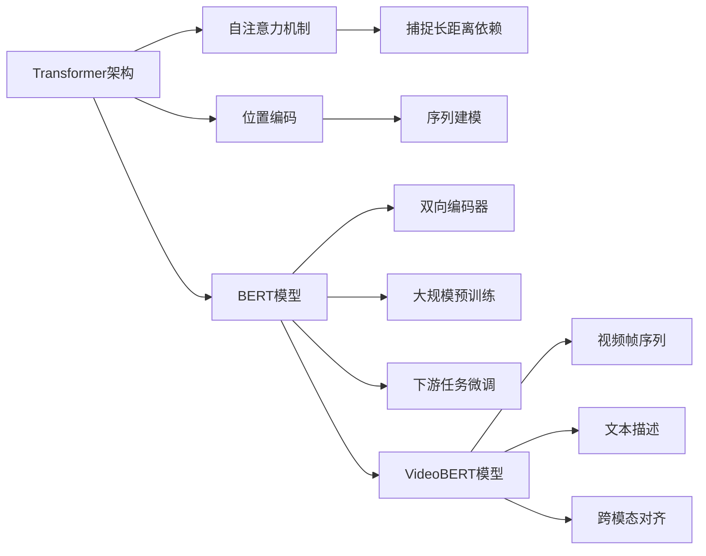

# Transformer大模型实战 VideoBERT模型的应用

## 1. 背景介绍
### 1.1 视频理解的重要性
在当今信息爆炸的时代,视频已成为人们获取信息和娱乐的主要来源之一。随着视频数据的急剧增长,如何高效、准确地理解和分析视频内容,成为了一个亟待解决的问题。视频理解在智能监控、自动驾驶、内容推荐等众多领域都有着广泛的应用前景。

### 1.2 Transformer模型的突破
近年来,以Transformer为代表的大规模预训练语言模型在自然语言处理领域取得了突破性的进展。Transformer通过自注意力机制和位置编码,能够有效地捕捉文本序列中的长距离依赖关系,在机器翻译、文本分类、问答系统等任务上都取得了显著的性能提升。这启发了研究者将Transformer架构引入到视频理解领域。

### 1.3 VideoBERT的提出
VideoBERT是谷歌在2019年提出的一种视频预训练模型,它将BERT(Bidirectional Encoder Representations from Transformers)模型扩展到了视频领域。VideoBERT通过对视频帧序列和相应的文本描述进行联合建模,学习视频的多模态表示,可用于视频分类、视频问答、视频字幕生成等下游任务。VideoBERT的出现为视频理解开辟了一条新的道路。

## 2. 核心概念与联系
### 2.1 Transformer架构
- Transformer是一种基于自注意力机制的序列建模架构。
- 它摒弃了传统的循环神经网络(RNN)和卷积神经网络(CNN),通过自注意力层和前馈神经网络的堆叠来处理序列数据。
- Transformer中的自注意力机制允许模型在计算某个位置的表示时,参考序列中的所有其他位置,从而能够捕捉长距离的依赖关系。

### 2.2 BERT模型
- BERT是基于Transformer架构的预训练语言模型。
- 它采用了双向编码器结构,通过Masked Language Model和Next Sentence Prediction两个预训练任务来学习文本的上下文表示。
- BERT在大规模文本语料上预训练后,可以通过微调应用于各种自然语言处理任务,取得了显著的性能提升。

### 2.3 VideoBERT模型
- VideoBERT是BERT在视频领域的扩展,用于学习视频的多模态表示。
- 它将视频看作一个由帧序列和相应文本描述组成的多模态序列,通过Transformer编码器对其进行建模。
- VideoBERT在大规模视频数据集上进行预训练,学习视频帧和文本之间的跨模态对齐关系,可用于各种视频理解任务。

### 2.4 核心概念关系图


## 3. 核心算法原理具体操作步骤
### 3.1 VideoBERT的输入表示
- 将视频划分为固定数量的帧,每个帧提取视觉特征(如ResNet特征)。
- 对视频的文本描述进行分词,得到词序列。
- 将视频帧特征和文本词特征拼接,构成多模态输入序列。
- 在输入序列中添加特殊标记,如[CLS]和[SEP],分别表示序列的开始和分隔。
- 对输入序列进行位置编码,引入位置信息。

### 3.2 VideoBERT的预训练任务
- Masked Language Modeling(MLM):随机遮挡一部分文本词,让模型预测被遮挡的词。
- Masked Frame Modeling(MFM):随机遮挡一部分视频帧,让模型预测被遮挡的帧特征。
- Video-Text Matching(VTM):给定视频和文本描述,让模型预测它们是否匹配。

### 3.3 VideoBERT的微调与推理
- 在下游任务的训练集上对VideoBERT进行微调,调整模型参数以适应具体任务。
- 对于视频分类任务,在[CLS]位置的输出上添加分类器,进行类别预测。
- 对于视频问答任务,将问题和视频拼接作为输入,在答案位置上添加分类器,预测答案范围。
- 对于视频字幕生成任务,使用VideoBERT编码器-解码器架构,生成自然语言描述。

## 4. 数学模型和公式详细讲解举例说明
### 4.1 自注意力机制
自注意力机制是Transformer的核心组件,用于计算序列中元素之间的依赖关系。对于输入序列$X \in \mathbb{R}^{n \times d}$,自注意力的计算过程如下:

$$
\begin{aligned}
Q &= XW_Q \\
K &= XW_K \\
V &= XW_V \\
Attention(Q,K,V) &= softmax(\frac{QK^T}{\sqrt{d_k}})V
\end{aligned}
$$

其中,$Q$,$K$,$V$分别表示查询、键、值矩阵,$W_Q$,$W_K$,$W_V$为可学习的权重矩阵。$\sqrt{d_k}$为缩放因子,用于控制点积的量级。softmax函数用于归一化注意力权重。

举例说明:假设有一个由4个单词组成的句子"I love playing football",通过自注意力机制,可以计算出每个单词与其他单词的依赖关系。例如,"playing"这个单词可能与"love"和"football"有较强的依赖,而与"I"的依赖较弱。自注意力机制可以学习到这种依赖关系,从而更好地理解句子的语义。

### 4.2 位置编码
由于Transformer不包含循环和卷积操作,为了引入位置信息,需要对输入序列进行位置编码。位置编码通过三角函数将位置映射为实数向量:

$$
\begin{aligned}
PE_{(pos,2i)} &= sin(pos/10000^{2i/d_{model}}) \\
PE_{(pos,2i+1)} &= cos(pos/10000^{2i/d_{model}})
\end{aligned}
$$

其中,$pos$表示位置索引,$i$表示维度索引,$d_{model}$为模型的维度。位置编码向量与输入向量相加,得到最终的输入表示。

举例说明:对于一个长度为10的序列,位置编码可以生成一个10×512的矩阵(假设模型维度为512)。第一个位置的编码向量可能是[0.84, 0.72, ..., 0.29],第二个位置的编码向量可能是[0.91, 0.39, ..., 0.65],以此类推。这样,模型就可以区分不同位置的输入,捕捉序列的顺序信息。

### 4.3 VideoBERT的目标函数
VideoBERT的预训练目标函数包括三个部分:MLM、MFM和VTM。

对于MLM和MFM,使用交叉熵损失函数:

$$
\mathcal{L}_{MLM} = -\sum_{i \in M_t} \log P(w_i|X_{\backslash M_t})
$$
$$
\mathcal{L}_{MFM} = -\sum_{i \in M_v} \log P(v_i|X_{\backslash M_v})
$$

其中,$M_t$和$M_v$分别表示被遮挡的文本词和视频帧的索引集合,$w_i$和$v_i$表示真实的词和帧,$X_{\backslash M_t}$和$X_{\backslash M_v}$表示去掉遮挡部分的输入序列。

对于VTM,使用二元交叉熵损失函数:

$$
\mathcal{L}_{VTM} = -y\log P(y|X) - (1-y)\log(1-P(y|X))
$$

其中,$y \in \{0,1\}$表示视频和文本是否匹配,$P(y|X)$表示模型预测的匹配概率。

最终的目标函数为三个损失的加权和:

$$
\mathcal{L} = \lambda_1 \mathcal{L}_{MLM} + \lambda_2 \mathcal{L}_{MFM} + \lambda_3 \mathcal{L}_{VTM}
$$

其中,$\lambda_1$,$\lambda_2$,$\lambda_3$为超参数,控制不同任务的权重。

## 5. 项目实践代码实例和详细解释说明
下面是使用PyTorch实现VideoBERT预训练的简要代码示例:

```python
import torch
import torch.nn as nn
from transformers import BertModel, BertTokenizer

class VideoBERT(nn.Module):
    def __init__(self, vision_model, text_model):
        super().__init__()
        self.vision_model = vision_model
        self.text_model = text_model

    def forward(self, video_frames, text_ids, text_mask):
        video_features = self.vision_model(video_frames)
        text_features = self.text_model(text_ids, attention_mask=text_mask)[0]

        # 将视频特征和文本特征拼接
        features = torch.cat([video_features, text_features], dim=1)

        return features

# 加载预训练的BERT模型和tokenizer
bert_model = BertModel.from_pretrained('bert-base-uncased')
tokenizer = BertTokenizer.from_pretrained('bert-base-uncased')

# 初始化视觉模型(如ResNet)
vision_model = models.resnet50(pretrained=True)
vision_model = nn.Sequential(*list(vision_model.children())[:-1])

# 创建VideoBERT模型
video_bert = VideoBERT(vision_model, bert_model)

# 定义优化器和损失函数
optimizer = torch.optim.Adam(video_bert.parameters(), lr=1e-5)
mlm_loss_fn = nn.CrossEntropyLoss()
mfm_loss_fn = nn.MSELoss()
vtm_loss_fn = nn.BCEWithLogitsLoss()

# 训练循环
for epoch in range(num_epochs):
    for batch in dataloader:
        video_frames, text, labels = batch

        # 对文本进行tokenize
        text_ids = tokenizer(text, return_tensors='pt', padding=True, truncation=True)

        # 前向传播
        features = video_bert(video_frames, text_ids['input_ids'], text_ids['attention_mask'])

        # 计算MLM、MFM和VTM损失
        mlm_loss = mlm_loss_fn(mlm_logits, mlm_labels)
        mfm_loss = mfm_loss_fn(mfm_logits, mfm_labels)
        vtm_loss = vtm_loss_fn(vtm_logits, vtm_labels)

        # 加权求和得到总损失
        loss = lambda_1 * mlm_loss + lambda_2 * mfm_loss + lambda_3 * vtm_loss

        # 反向传播和优化
        optimizer.zero_grad()
        loss.backward()
        optimizer.step()
```

以上代码实现了VideoBERT的基本架构和预训练过程。主要步骤如下:

1. 定义VideoBERT模型,将视觉模型和文本模型(BERT)组合在一起。
2. 加载预训练的BERT模型和tokenizer,以及预训练的视觉模型(如ResNet)。
3. 在训练循环中,对每个批次的数据进行处理:
   - 对视频帧进行特征提取。
   - 对文本进行tokenize,得到输入ID和注意力掩码。
   - 将视频特征和文本特征拼接,得到多模态表示。
   - 计算MLM、MFM和VTM的损失函数。
   - 对损失进行加权求和,得到总损失。
   - 执行反向传播和优化步骤,更新模型参数。

需要注意的是,以上代码仅为简化版,实际实现中还需要考虑更多细节,如数据加载、遮挡策略、超参数设置等。

## 6. 实际应用场景
VideoBERT可以应用于多种视频理解任务,包括:

### 6.1 视频分类
给定一个视频,预测其所属的类别。例如,将视频分为体育、新闻、音乐、电影等类别。VideoBERT可以学习视频的高层语义表示,捕捉视觉和文本信息,从而实现更准确的分类。

### 6.2 视频问答
给定一个视频和一个问题,预测问题的答案。例如,对于一个篮球比赛的视频,可以回答"哪支球队获胜了?"、"比