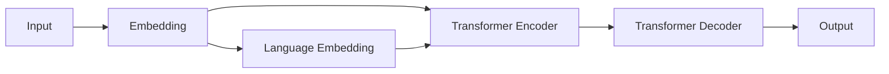

# Transformer大模型实战 使用多语言模型

## 1. 背景介绍
### 1.1 Transformer模型的兴起
自从2017年Google提出Transformer模型以来,其以强大的并行计算能力和优异的性能在自然语言处理领域掀起了一场革命。Transformer抛弃了传统的RNN和CNN等结构,完全依赖注意力机制(Attention)来学习文本的内在联系,并引入了位置编码(Positional Encoding)来捕捉序列的顺序信息。这种新颖的架构使得Transformer模型能够更好地挖掘文本的深层语义信息,在机器翻译、文本摘要、问答系统等任务上取得了state-of-the-art的表现。

### 1.2 多语言模型的需求
随着全球化的发展,跨语言交流和信息获取的需求日益增长。构建高质量的多语言模型成为自然语言处理领域的一个重要课题。多语言模型不仅能够处理单一语种的任务,还能实现不同语言之间的迁移和泛化。这对于低资源语言和小语种的应用具有重要意义。此外,多语言模型还可以作为预训练的基础模型,进一步fine-tune到下游的具体任务中,大大降低了任务的开发成本。

### 1.3 多语言Transformer模型的发展
为了构建多语言模型,研究者们提出了多种基于Transformer的方案。其中比较有代表性的有:
- Multilingual BERT(mBERT):在多语言语料上联合预训练的BERT模型。
- XLM:引入Translation Language Modeling目标,在编码器端实现跨语言表示。
- Unicoder:利用shared-private架构,共享参数学习语言不可知的表示。
- XLM-R:在更大规模多语言语料上预训练的RoBERTa模型。

这些多语言Transformer模型在XNLI、MLQA等跨语言理解任务上取得了优异的成绩,展现了其强大的多语言处理能力。

## 2. 核心概念与联系
### 2.1 Transformer的核心概念
- 注意力机制(Attention Mechanism):通过计算Query和Key的相似度,赋予不同位置的隐状态不同的权重,实现全局建模。
- 自注意力(Self-Attention):序列内部的注意力计算,捕捉词与词之间的依赖关系。
- 多头注意力(Multi-Head Attention):将注意力计算拆分为多个独立的Head,增强模型的表达能力。
- 前馈神经网络(Feed-Forward Network):对注意力的输出进行非线性变换,提取高级特征。
- 层标准化(Layer Normalization):对每一层的输入进行归一化,加速模型收敛。

### 2.2 多语言建模的关键问题
- 语言之间的差异:不同语言在语法、词序、词形变化等方面存在较大差异,如何建立统一的跨语言表示是一大挑战。
- 词表构建:如何在多语言场景下构建合适的词表,平衡词汇覆盖率和模型复杂度。
- 平行语料的缺失:大多数语言之间缺乏大规模高质量的平行语料,需要探索无监督的对齐方法。
- 零样本学习:如何利用多语言模型的迁移能力,在零样本或少样本的条件下进行跨语言的泛化。

### 2.3 Transformer与多语言建模的融合
Transformer凭借其强大的特征提取和建模能力,成为构建多语言模型的首选架构。研究者们通过以下方式将Transformer应用到多语言场景:

- 多语言预训练:在多语言语料上进行联合预训练,学习语言普适的表示。
- 参数共享:在编码器、解码器等部分共享参数,促进跨语言知识的迁移。 
- 语言标识符:在输入中加入语言标识符,显式地指导模型区分不同语言。
- 对抗训练:引入对抗目标,使得编码后的表示语言无关。

下图展示了一个典型的多语言Transformer模型架构:



## 3. 核心算法原理具体操作步骤
下面我们以XLM-R为例,详细介绍多语言Transformer模型的训练流程。

### 3.1 数据准备
- 多语言语料收集:从CommonCrawl、Wikipedia等来源收集100种语言的单语语料。
- 数据清洗:去除低质量和重复的文本,进行规范化处理。
- 分词:使用SentencePiece对文本进行分词,构建多语言词表。

### 3.2 预训练目标
XLM-R采用了Masked Language Modeling(MLM)和Translation Language Modeling(TLM)两个预训练目标。
- MLM:随机Mask掉输入序列中的部分Token,让模型预测被Mask的Token。
- TLM:构造平行句对,让模型根据一个语言的句子预测另一语言对应位置的单词。

两个目标的Loss按照一定比例进行加权求和,作为模型的训练目标。

### 3.3 模型训练
- 初始化:使用RoBERTa的参数初始化Transformer模型。
- 数据喂入:将多语言语料组织成批次数据,送入模型进行训练。
- 前向计算:通过Transformer的编码器对输入进行编码,然后计算MLM和TLM的Loss。
- 反向传播:根据Loss计算梯度,使用Adam优化器更新模型参数。
- 参数存储:定期保存模型的Checkpoint,用于后续的Fine-tuning。

### 3.4 下游任务Fine-tuning
- 任务数据:根据具体任务准备训练集和验证集数据。
- 模型调整:根据任务的输入输出格式,在预训练模型的基础上添加任务特定的层。
- 超参设置:选择合适的学习率、Batch Size、训练轮数等超参数。
- 训练:冻结预训练模型的部分参数,在下游任务数据上进行Fine-tuning。
- 评估:在验证集上评估模型性能,进行超参数调优。

## 4. 数学模型和公式详细讲解举例说明
Transformer的核心是注意力机制,下面我们详细介绍其数学原理。

### 4.1 Scaled Dot-Product Attention
Transformer中采用了Scaled Dot-Product Attention,其计算公式为:

$$
Attention(Q,K,V) = softmax(\frac{QK^T}{\sqrt{d_k}})V
$$

其中,$Q$,$K$,$V$分别表示Query,Key,Value矩阵,$d_k$为Key的维度。具体计算流程如下:
1. 将输入的词向量映射到$Q$,$K$,$V$三个矩阵。
2. 计算$Q$和$K^T$的点积,得到注意力分数矩阵。
3. 将点积结果除以$\sqrt{d_k}$,缩放梯度。
4. 对缩放后的注意力分数进行Softmax归一化。
5. 将归一化的注意力分数与$V$相乘,得到加权求和的结果。

举例说明:假设有一个长度为3的序列,词向量维度为4。
$$
\begin{aligned}
Q &= \begin{bmatrix}
1 & 0 & 1 & 0\ 
0 & 2 & 0 & 2\
1 & 1 & 1 & 1
\end{bmatrix} \
K &= \begin{bmatrix}
1 & 1 & 0 & 1\ 
0 & 1 & 0 & 1\
0 & 1 & 1 & 2
\end{bmatrix} \
V &= \begin{bmatrix}
0 & 1 & 0 & 1\ 
1 & 0 & 0 & 2\
0 & 0 & 1 & 1
\end{bmatrix}
\end{aligned}
$$

计算$QK^T$:
$$
QK^T = \begin{bmatrix}
2 & 1 & 2\ 
2 & 4 & 4\
3 & 4 & 5
\end{bmatrix}
$$

缩放并归一化:
$$
Attention = softmax(\frac{QK^T}{\sqrt{4}}) = \begin{bmatrix}
0.24 & 0.09 & 0.24\ 
0.09 & 0.33 & 0.33\
0.16 & 0.24 & 0.36
\end{bmatrix}
$$

最终结果:
$$
Attention \cdot V = \begin{bmatrix}
0.24 & 0.42 & 0.48 & 1.44\ 
0.42 & 0.33 & 0.33 & 1.66\
0.40 & 0.48 & 0.60 & 1.92
\end{bmatrix}
$$

### 4.2 Multi-Head Attention
Multi-Head Attention将注意力计算拆分为多个独立的Head,每个Head使用不同的参数矩阵进行映射,然后将结果拼接起来。公式表示为:

$$
\begin{aligned}
MultiHead(Q,K,V) &= Concat(head_1,...,head_h)W^O \
head_i &= Attention(QW_i^Q, KW_i^K, VW_i^V)
\end{aligned}
$$

其中,$W_i^Q \in \mathbb{R}^{d_{model} \times d_k}$,$W_i^K \in \mathbb{R}^{d_{model} \times d_k}$,$W_i^V \in \mathbb{R}^{d_{model} \times d_v}$,$W^O \in \mathbb{R}^{hd_v \times d_{model}}$为可学习的参数矩阵。

Multi-Head Attention通过多个Head的并行计算,增强了模型的表达能力,能够捕捉不同子空间的信息。

## 5. 项目实践：代码实例和详细解释说明
下面我们使用PyTorch实现一个基于Transformer的多语言文本分类模型。

### 5.1 数据准备
```python
from datasets import load_dataset

# 加载多语言数据集
dataset = load_dataset("amazon_reviews_multi", "all_languages")

# 数据预处理
def preprocess_function(examples):
    return tokenizer(examples["review_body"], truncation=True)

tokenized_datasets = dataset.map(preprocess_function, batched=True)
```

这里我们使用Hugging Face的datasets库加载Amazon多语言评论数据集,并使用预训练的多语言Tokenizer对文本进行编码。

### 5.2 模型定义
```python
from transformers import XLMRobertaForSequenceClassification

# 加载预训练的多语言模型
model = XLMRobertaForSequenceClassification.from_pretrained("xlm-roberta-base", num_labels=5)
```

我们直接使用预训练的XLM-RoBERTa模型,并在其上添加一个用于分类的线性层,设置类别数为5(对应5星评价)。

### 5.3 模型训练
```python
from transformers import TrainingArguments, Trainer

# 定义训练参数
training_args = TrainingArguments(
    output_dir="./results",
    learning_rate=2e-5,
    per_device_train_batch_size=16,
    per_device_eval_batch_size=16,
    num_train_epochs=3,
)

# 定义评估指标
def compute_metrics(eval_pred):
    predictions, labels = eval_pred
    return {"accuracy": (predictions == labels).mean()}

# 启动训练
trainer = Trainer(
    model=model,
    args=training_args,
    train_dataset=tokenized_datasets["train"],
    eval_dataset=tokenized_datasets["validation"],
    compute_metrics=compute_metrics,
)
trainer.train()
```

我们使用Trainer API进行模型训练,设置训练参数如学习率、Batch Size、训练轮数等,并定义评估指标为准确率。

### 5.4 模型推理
```python
# 模型推理
def predict(text):
    inputs = tokenizer(text, return_tensors="pt", truncation=True)
    outputs = model(**inputs)
    probs = outputs.logits.softmax(dim=-1)
    return probs.argmax().item() + 1

# 测试样例
text = "This product is amazing! I highly recommend it."
print(predict(text))  # 输出: 5
```

最后,我们定义了一个预测函数,可以输入任意语言的文本,模型会输出对应的星级预测结果。

## 6. 实际应用场景
多语言Transformer模型可以应用于以下场景:

- 跨语言文本分类:如多语言情感分析、新闻分类等。
- 跨语言信息检索:根据一种语言的查询,检索另一种语言的相关文档。
- 机器翻译:在没有平行语料的情况下,实现零样本翻译。
- 跨语言问答:根据一种语言的问题,在另