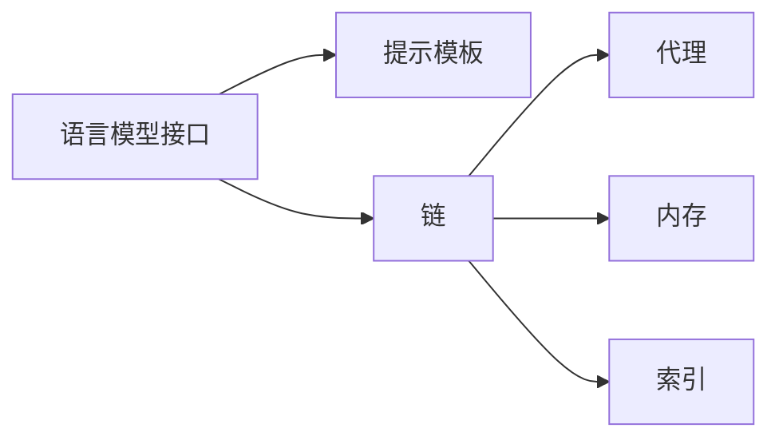

# 【LangChain编程：从入门到实践】社区和资源

## 1. 背景介绍
### 1.1 大语言模型的崛起
近年来,随着大语言模型如GPT-3、PaLM、LaMDA等的出现,人工智能在自然语言处理领域取得了突破性的进展。这些大语言模型展现出了惊人的语言理解和生成能力,为构建更加智能化的对话系统和知识应用开辟了新的可能。

### 1.2 LangChain的诞生
为了充分利用大语言模型的能力,并降低应用开发的门槛,LangChain应运而生。LangChain是一个基于Python的开源框架,旨在帮助开发者更轻松地构建基于语言模型的应用程序。它提供了一系列工具和组件,用于与语言模型进行交互,并将其集成到各种应用场景中。

### 1.3 LangChain的发展现状
自2022年发布以来,LangChain迅速获得了开发者社区的关注和认可。越来越多的开发者开始使用LangChain进行项目实践,LangChain的生态系统也在不断完善。目前,LangChain已经发展成为一个活跃的开源社区,拥有丰富的文档资源、示例项目和插件扩展。

## 2. 核心概念与联系
### 2.1 语言模型接口(Model Interface)
LangChain的核心是语言模型接口,它定义了与语言模型交互的标准方式。通过语言模型接口,开发者可以方便地调用不同的语言模型,如OpenAI的GPT系列、Anthropic的Claude等。语言模型接口屏蔽了底层模型的差异,提供了统一的API。

### 2.2 提示模板(Prompt Template)
提示模板是指在与语言模型交互时,用于生成输入文本的模板。它允许开发者定义固定的提示结构,并在运行时动态填充变量。提示模板可以帮助开发者更好地控制语言模型的行为,引导模型生成期望的输出。

### 2.3 链(Chain)
链是LangChain中的一个重要概念,它将多个组件组合在一起,形成一个完整的处理流程。链可以包含语言模型、提示模板、解析器等组件,通过将它们按照特定的逻辑进行连接,实现复杂的自然语言处理任务。

### 2.4 代理(Agent)
代理是一种特殊的链,它可以根据用户的输入,自主决定执行哪些操作。代理通过分析用户意图,动态选择合适的工具或链来处理请求。这使得开发者可以构建更加智能和灵活的自然语言应用。

### 2.5 内存(Memory)
内存组件用于在多轮对话中存储和管理上下文信息。它可以帮助语言模型在对话过程中保持状态,从而生成更连贯和相关的响应。LangChain提供了多种内存实现,如对话内存、实体内存等。

### 2.6 索引(Index)
索引是一种数据结构,用于高效地存储和检索文本信息。LangChain支持多种索引技术,如向量数据库、嵌入式索引等。通过索引,开发者可以快速检索相关的知识片段,增强语言模型的知识获取能力。

以下是这些核心概念之间的关系图:



## 3. 核心算法原理具体操作步骤
### 3.1 语言模型调用
1. 选择合适的语言模型接口,如OpenAI、Anthropic等
2. 配置模型参数,如温度、top_p等
3. 准备输入文本,可以使用提示模板动态生成
4. 调用语言模型接口,传入输入文本
5. 获取语言模型的生成结果

### 3.2 提示模板渲染
1. 定义提示模板,指定固定的文本和变量占位符
2. 准备变量值,通常来自用户输入或上下文信息
3. 使用提示模板渲染器,将变量值填充到占位符位置
4. 生成最终的提示文本

### 3.3 链的执行
1. 定义链的组件,如语言模型、提示模板、解析器等
2. 指定组件之间的数据流动方式
3. 运行链,按照定义的顺序执行每个组件
4. 在组件之间传递中间结果,直到获得最终输出

### 3.4 代理的决策
1. 根据用户输入,分析其意图和所需的操作
2. 从可用的工具或链中选择最合适的候选项
3. 执行选定的工具或链,获取结果
4. 将结果返回给用户,或用于后续的处理

### 3.5 内存的管理
1. 创建内存实例,如对话内存、实体内存等
2. 在对话或处理过程中,将相关信息存储到内存中
3. 在需要上下文信息时,从内存中检索相关的历史数据
4. 将检索到的上下文信息与当前输入合并,生成更准确的响应

### 3.6 索引的构建和检索
1. 将大量文本数据预处理,提取关键信息
2. 选择合适的索引技术,如向量数据库、嵌入式索引等
3. 将文本数据编码为索引所需的格式,如向量表示
4. 构建索引,将编码后的数据存储到索引结构中
5. 在查询时,将查询文本编码为相同的格式
6. 使用索引的相似度搜索功能,检索与查询最相关的文本片段

## 4. 数学模型和公式详细讲解举例说明
### 4.1 语言模型的概率公式
语言模型的目标是估计一个句子或文本序列的概率。给定一个文本序列 $X=(x_1,x_2,...,x_n)$,语言模型估计其概率的公式为:

$$P(X)=\prod_{i=1}^n P(x_i|x_1,...,x_{i-1})$$

其中,$P(x_i|x_1,...,x_{i-1})$ 表示在给定前 $i-1$ 个词的条件下,第 $i$ 个词 $x_i$ 的条件概率。

例如,对于句子 "I love natural language processing",语言模型估计其概率的过程如下:

$$P(I\ love\ natural\ language\ processing) = P(I) \times P(love|I) \times P(natural|I\ love) \times P(language|I\ love\ natural) \times P(processing|I\ love\ natural\ language)$$

### 4.2 余弦相似度
在构建索引时,常用的相似度度量方法是余弦相似度。它用于衡量两个向量之间的夹角余弦值,表示它们的方向相似程度。

给定两个向量 $\mathbf{a}$ 和 $\mathbf{b}$,它们的余弦相似度计算公式为:

$$\cos(\theta) = \frac{\mathbf{a} \cdot \mathbf{b}}{\|\mathbf{a}\| \|\mathbf{b}\|} = \frac{\sum_{i=1}^n a_i b_i}{\sqrt{\sum_{i=1}^n a_i^2} \sqrt{\sum_{i=1}^n b_i^2}}$$

其中,$a_i$ 和 $b_i$ 分别表示向量 $\mathbf{a}$ 和 $\mathbf{b}$ 的第 $i$ 个元素。

例如,对于两个向量 $\mathbf{a}=(1,2,3)$ 和 $\mathbf{b}=(4,5,6)$,它们的余弦相似度计算如下:

$$\cos(\theta) = \frac{1 \times 4 + 2 \times 5 + 3 \times 6}{\sqrt{1^2 + 2^2 + 3^2} \sqrt{4^2 + 5^2 + 6^2}} \approx 0.9746$$

余弦相似度的取值范围在 $[-1,1]$ 之间,值越接近 1,表示两个向量的方向越相似。

## 5. 项目实践：代码实例和详细解释说明
以下是一个使用LangChain构建问答系统的示例代码:

```python
from langchain.llms import OpenAI
from langchain.chains import LLMChain
from langchain.prompts import PromptTemplate

# 设置OpenAI API密钥
openai_api_key = "YOUR_API_KEY"

# 创建OpenAI语言模型实例
llm = OpenAI(openai_api_key=openai_api_key)

# 定义提示模板
template = """
你是一个智能问答助手,请根据以下背景知识回答问题。

背景知识:
{context}

问题:
{question}

回答:
"""

# 创建提示模板实例
prompt = PromptTemplate(
    input_variables=["context", "question"],
    template=template,
)

# 创建问答链
qa_chain = LLMChain(llm=llm, prompt=prompt)

# 设置背景知识和问题
context = "LangChain是一个基于Python的开源框架,旨在帮助开发者更轻松地构建基于语言模型的应用程序。"
question = "LangChain是用什么语言编写的?"

# 运行问答链,获取答案
answer = qa_chain.run(context=context, question=question)

print(answer)
```

代码解释:
1. 首先,我们导入了必要的LangChain组件,包括OpenAI语言模型、LLMChain和PromptTemplate。
2. 我们设置了OpenAI API密钥,用于调用OpenAI的语言模型服务。
3. 创建了一个OpenAI语言模型实例`llm`,它将作为问答系统的核心组件。
4. 定义了一个提示模板`template`,它包含了背景知识和问题的占位符。
5. 创建了一个提示模板实例`prompt`,指定了输入变量和模板。
6. 创建了一个问答链`qa_chain`,将语言模型`llm`和提示模板`prompt`组合在一起。
7. 设置了背景知识`context`和问题`question`。
8. 运行问答链,将背景知识和问题传入,获取生成的答案`answer`。
9. 最后,打印出答案。

运行该代码,将得到类似以下的输出:

```
LangChain是使用Python编写的开源框架。
```

这个示例展示了如何使用LangChain快速构建一个基于语言模型的问答系统。通过定义提示模板和组合语言模型与提示,我们可以轻松地创建智能问答应用。

## 6. 实际应用场景
LangChain在各种自然语言处理和人工智能应用中都有广泛的应用,以下是一些常见的实际应用场景:

### 6.1 智能客服
利用LangChain构建智能客服系统,通过语言模型理解用户的问题,并根据预定义的知识库生成相应的回答。这可以提高客服效率,减少人工成本。

### 6.2 个性化推荐
通过LangChain分析用户的历史行为和偏好,生成个性化的推荐内容。例如,在电商平台中,根据用户的购买记录和浏览历史,推荐相关的商品。

### 6.3 内容生成
使用LangChain自动生成各种类型的内容,如新闻摘要、产品描述、广告文案等。通过语言模型的强大生成能力,可以提高内容创作的效率和质量。

### 6.4 智能搜索
利用LangChain构建智能搜索引擎,通过语言模型理解用户的搜索意图,并从海量数据中检索最相关的结果。这可以极大地提升搜索的准确性和用户体验。

### 6.5 知识图谱构建
使用LangChain从非结构化文本数据中提取实体和关系,并构建知识图谱。通过知识图谱,可以更好地组织和管理领域知识,支持智能问答和推理。

### 6.6 数据分析与洞察
利用LangChain对大量文本数据进行分析,发现隐藏的模式和洞察。例如,通过对客户评论进行情感分析,了解产品的优缺点和改进方向。

## 7. 工具和资源推荐
以下是一些有助于学习和使用LangChain的工具和资源:

### 7.1 官方文档
LangChain的官方文档提供了全面的API参考和使用指南,是学习LangChain的首选资源。文档地址:https://docs.langchain.com/

### 7.2 示例项目
LangChain的GitHub仓库包含了大量的示例项目,涵盖了