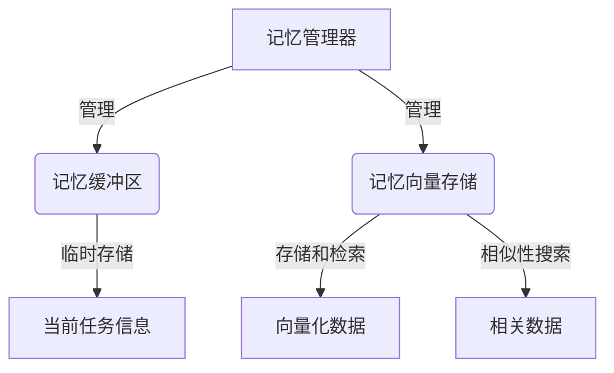

# 【LangChain编程：从入门到实践】记忆模块

## 1. 背景介绍

在当今数据驱动的时代，人工智能(AI)系统需要处理海量数据,并从中提取有价值的信息。然而,传统的AI系统通常将所有数据加载到内存中进行处理,这在面对大规模数据集时会遇到严重的性能瓶颈和资源限制。为了解决这一问题,LangChain引入了记忆(Memory)模块,允许AI系统在处理数据时只保留关键信息,从而大幅提高了效率和可扩展性。

记忆模块是LangChain框架的核心组件之一,它为AI系统提供了一种灵活的方式来存储和检索相关信息。通过记忆模块,AI系统可以跟踪对话历史、上下文信息、检索结果等,从而提高响应的连贯性和相关性。此外,记忆模块还支持各种存储后端,如内存、文件系统、数据库等,使得开发人员可以根据具体需求选择合适的存储方式。

## 2. 核心概念与联系

LangChain的记忆模块涉及以下几个核心概念:

1. **记忆向量存储(Memory Vector Store)**: 用于存储和检索向量化数据的组件,支持各种后端存储方式,如内存、文件系统、数据库等。

2. **记忆缓冲区(Memory Buffer)**: 一种临时存储机制,用于保存当前对话或任务的相关信息,如对话历史、上下文数据等。

3. **记忆管理器(Memory Manager)**: 负责管理和协调记忆向量存储和记忆缓冲区之间的交互,确保数据的有效存储和检索。

4. **相似性搜索(Similarity Search)**: 通过计算向量之间的相似度,从记忆向量存储中检索与当前查询最相关的数据。

这些概念紧密相连,共同构建了LangChain记忆模块的核心功能。记忆向量存储为数据存储和检索提供了基础设施,而记忆缓冲区则负责临时存储当前任务的相关信息。记忆管理器协调这两者的交互,并利用相似性搜索从记忆向量存储中检索相关数据。



## 3. 核心算法原理具体操作步骤

LangChain记忆模块的核心算法原理可以概括为以下几个步骤:

1. **数据向量化**: 将原始数据(如文本、图像等)转换为向量表示,以便进行相似性计算和存储。常用的向量化技术包括Word2Vec、BERT等。

2. **向量存储**: 将向量化后的数据存储到记忆向量存储中,可选择不同的后端存储方式,如内存、文件系统、数据库等。

3. **缓冲区管理**: 在处理新的查询或任务时,将相关信息(如对话历史、上下文数据等)临时存储到记忆缓冲区中。

4. **相似性搜索**: 将当前查询或任务向量化,然后在记忆向量存储中进行相似性搜索,检索与之最相关的数据。

5. **结果合并**: 将相似性搜索得到的相关数据与记忆缓冲区中的信息合并,形成最终的响应或输出。

6. **缓冲区更新**: 根据需要,将当前任务的相关信息存储到记忆缓冲区中,以供后续使用。

这些步骤形成了一个闭环,使得AI系统能够持续学习和记忆,提高响应的连贯性和相关性。

## 4. 数学模型和公式详细讲解举例说明

在LangChain记忆模块中,相似性搜索是一个关键步骤,它通过计算向量之间的相似度来检索与当前查询最相关的数据。常用的相似度度量方法包括余弦相似度、欧几里得距离等。

### 4.1 余弦相似度

余弦相似度是一种常用的向量相似度度量方法,它通过计算两个向量之间夹角的余弦值来衡量它们的相似程度。余弦相似度的取值范围为[-1, 1],值越接近1,表示两个向量越相似。

对于两个向量 $\vec{a}$ 和 $\vec{b}$,它们的余弦相似度可以计算如下:

$$
\text{CosineSimilarity}(\vec{a}, \vec{b}) = \frac{\vec{a} \cdot \vec{b}}{||\vec{a}|| \times ||\vec{b}||}
$$

其中,$ \vec{a} \cdot \vec{b} $表示向量的点积,$ ||\vec{a}|| $和$ ||\vec{b}|| $分别表示向量的L2范数(欧几里得长度)。

例如,对于两个二维向量 $\vec{a} = (3, 4)$ 和 $\vec{b} = (4, 3)$,它们的余弦相似度可以计算如下:

$$
\begin{aligned}
\vec{a} \cdot \vec{b} &= 3 \times 4 + 4 \times 3 = 24 \
||\vec{a}|| &= \sqrt{3^2 + 4^2} = 5 \
||\vec{b}|| &= \sqrt{4^2 + 3^2} = 5 \
\text{CosineSimilarity}(\vec{a}, \vec{b}) &= \frac{24}{5 \times 5} = 0.96
\end{aligned}
$$

可以看出,这两个向量的余弦相似度接近于1,表明它们是非常相似的。

### 4.2 欧几里得距离

欧几里得距离是另一种常用的向量相似度度量方法,它计算两个向量之间的直线距离。欧几里得距离的取值范围为[0, +∞),值越小,表示两个向量越相似。

对于两个向量 $\vec{a}$ 和 $\vec{b}$,它们的欧几里得距离可以计算如下:

$$
\text{EuclideanDistance}(\vec{a}, \vec{b}) = \sqrt{\sum_{i=1}^{n} (a_i - b_i)^2}
$$

其中,n是向量的维度,$ a_i $和$ b_i $分别表示向量 $\vec{a}$ 和 $\vec{b}$ 在第i个维度上的值。

例如,对于两个二维向量 $\vec{a} = (3, 4)$ 和 $\vec{b} = (4, 3)$,它们的欧几里得距离可以计算如下:

$$
\begin{aligned}
\text{EuclideanDistance}(\vec{a}, \vec{b}) &= \sqrt{(3 - 4)^2 + (4 - 3)^2} \
&= \sqrt{1 + 1} \
&= \sqrt{2}
\end{aligned}
$$

可以看出,这两个向量的欧几里得距离较小,表明它们是相似的。

在LangChain记忆模块中,开发人员可以根据具体需求选择合适的相似度度量方法,如余弦相似度或欧几里得距离,从而实现高效的相似性搜索。

## 5. 项目实践: 代码实例和详细解释说明

在本节中,我们将通过一个实际的代码示例,展示如何在LangChain中使用记忆模块。我们将构建一个简单的问答系统,它可以从一组文档中检索相关信息,并利用记忆模块提高响应的连贯性和相关性。

### 5.1 准备工作

首先,我们需要安装LangChain和相关依赖项:

```bash
pip install langchain openai faiss-cpu
```

接下来,我们准备一些示例文档,并将它们加载到LangChain的文本加载器中:

```python
from langchain.document_loaders import TextLoader

loader = TextLoader('../data/state_of_the_union.txt')
documents = loader.load()
```

这里我们使用了一份关于美国总统国情咨文的文本文件。

### 5.2 创建向量存储和记忆缓冲区

接下来,我们创建一个基于内存的向量存储和记忆缓冲区:

```python
from langchain.vectorstores import FAISS
from langchain.memory import ConversationBufferMemory

vector_store = FAISS.from_documents(documents, embedding=embedding)
memory = ConversationBufferMemory()
```

这里我们使用了FAISS作为向量存储的后端,并创建了一个`ConversationBufferMemory`对象作为记忆缓冲区。

### 5.3 创建记忆管理器和链式调用

现在,我们创建一个记忆管理器,并将其与向量存储和记忆缓冲区相关联:

```python
from langchain.chains import ConversationalRetrievalChain
from langchain.llms import OpenAI

llm = OpenAI(temperature=0)
memory_manager = ConversationBufferMemory(memory=memory, return_messages=True)
conversation = ConversationalRetrievalChain.from_llm(
    llm, vector_store.as_retriever(), memory=memory_manager
)
```

这里我们使用了OpenAI的语言模型作为问答系统的基础,并将记忆管理器与`ConversationalRetrievalChain`相关联。`ConversationalRetrievalChain`是LangChain提供的一种链式调用方式,它将检索和生成步骤结合在一起,并利用记忆模块提高响应的连贯性和相关性。

### 5.4 问答交互

现在,我们可以开始与问答系统进行交互了:

```python
query = "What did the president say about Ketanji Brown Jackson's nomination?"
result = conversation({"question": query})
print(result["answer"])
```

这个查询将触发以下步骤:

1. 将查询向量化,并在向量存储中进行相似性搜索,检索与之最相关的文档片段。
2. 将检索到的文档片段与记忆缓冲区中的信息合并,形成最终的问题上下文。
3. 将问题上下文输入到语言模型中,生成回答。
4. 将当前查询和回答存储到记忆缓冲区中,以供后续使用。

通过这种方式,问答系统可以利用记忆模块提高响应的连贯性和相关性,避免重复回答或遗漏重要信息。

## 6. 实际应用场景

LangChain记忆模块的应用场景非常广泛,包括但不限于:

1. **智能助手**: 在构建智能助手系统时,记忆模块可以帮助跟踪对话历史和上下文信息,提高响应的连贯性和相关性。

2. **问答系统**: 如我们在代码示例中所展示的,记忆模块可以用于构建高效的问答系统,从海量数据中检索相关信息,并提供连贯的回答。

3. **任务管理**: 在处理复杂任务时,记忆模块可以帮助跟踪任务进度、中间结果和相关信息,确保任务的顺利完成。

4. **知识图谱构建**: 记忆模块可以用于存储和检索知识图谱中的实体和关系信息,支持知识推理和查询。

5. **个性化推荐系统**: 通过记录用户的浏览历史和偏好,记忆模块可以为用户提供个性化的内容推荐。

6. **医疗诊断辅助**: 在医疗领域,记忆模块可以用于存储和检索患者的病史、检查结果等信息,为医生的诊断和治疗提供支持。

总的来说,只要涉及到需要存储和检索相关信息的场景,LangChain记忆模块都可以发挥重要作用,提高系统的效率和智能化水平。

## 7. 工具和资源推荐

在使用LangChain记忆模块时,以下工具和资源可能会对您有所帮助:

1. **LangChain官方文档**: LangChain的官方文档(https://python.langchain.com/en/latest/index.html)提供了详细的API参考、教程和示例代码,是学习和使用LangChain的重要资源。

2. **LangChain示例存储库**: LangChain维护了一个示例存储库(https://github.com/hwchase17/langchain-examples),包含了各种使用场景的代码示例,可以帮助您快速上手。

3. **Hugging Face Spaces**: Hugging Face Spaces(https://huggingface.co/spaces)是一个在线平台,允许您部署和共享LangChain应用程序,方便进行演示和协作。

4. **FAISS**: FAISS(https://github.com