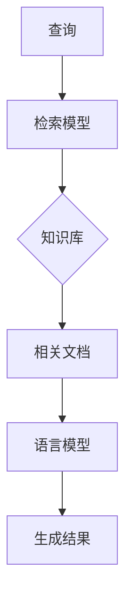

# 【大模型应用开发 动手做AI Agent】何谓检索增强生成

## 1. 背景介绍

近年来,随着大语言模型(Large Language Models,LLMs)的快速发展,人工智能领域掀起了一场革命性的浪潮。LLMs以其强大的自然语言理解和生成能力,在各个领域展现出了广阔的应用前景。然而,LLMs在生成高质量、事实准确的文本时仍然面临着诸多挑战。为了进一步提升LLMs的性能,研究者们提出了检索增强生成(Retrieval-Augmented Generation,RAG)的思路。

### 1.1 大语言模型的发展历程

#### 1.1.1 Transformer架构的诞生
#### 1.1.2 GPT系列模型的崛起
#### 1.1.3 更大规模预训练模型的出现

### 1.2 大语言模型面临的挑战

#### 1.2.1 知识获取与存储
#### 1.2.2 推理与常识推理能力
#### 1.2.3 事实准确性与可解释性

### 1.3 检索增强生成的提出

#### 1.3.1 知识检索与注入的必要性
#### 1.3.2 RAG的核心思想
#### 1.3.3 RAG的优势与潜力

## 2. 核心概念与联系

检索增强生成是一种将知识检索与语言生成相结合的新范式。它的核心思想是利用外部知识库对语言模型进行增强,使其能够根据查询从知识库中检索出相关信息,并将其融入到生成过程中,从而提高生成文本的质量和准确性。

### 2.1 知识库(Knowledge Base)

#### 2.1.1 结构化知识库
#### 2.1.2 非结构化知识库
#### 2.1.3 知识库的构建与维护

### 2.2 语言模型(Language Model)

#### 2.2.1 语言模型的基本概念
#### 2.2.2 基于Transformer的语言模型
#### 2.2.3 语言模型的预训练与微调

### 2.3 检索模型(Retrieval Model)

#### 2.3.1 传统的检索模型
#### 2.3.2 基于表示学习的检索模型
#### 2.3.3 端到端的检索模型

### 2.4 RAG的整体架构



## 3. 核心算法原理具体操作步骤

### 3.1 Dense Passage Retrieval(DPR)

#### 3.1.1 编码器的选择与训练
#### 3.1.2 文档库的建立与索引
#### 3.1.3 查询-文档相似度计算

### 3.2 知识融合策略

#### 3.2.1 早期融合(Early Fusion)
#### 3.2.2 晚期融合(Late Fusion)
#### 3.2.3 混合融合(Hybrid Fusion)

### 3.3 解码生成过程

#### 3.3.1 Beam Search解码
#### 3.3.2 Top-k/Top-p采样
#### 3.3.3 自回归生成与非自回归生成

## 4. 数学模型和公式详细讲解举例说明

### 4.1 Dense Passage Retrieval的数学描述

给定查询$q$和文档库$D=\{d_1,d_2,...,d_n\}$,DPR的目标是从$D$中检索出与$q$最相关的$k$个文档。

查询编码器$E_Q$和文档编码器$E_D$分别将$q$和$d_i$映射到$d$维的嵌入向量:

$$
\begin{aligned}
\mathbf{q} &= E_Q(q) \
\mathbf{d_i} &= E_D(d_i)
\end{aligned}
$$

查询-文档相似度通过嵌入向量的内积计算:

$$
\text{sim}(q,d_i) = \mathbf{q}^T \mathbf{d_i}
$$

检索结果为相似度最高的$k$个文档:

$$
\text{Retrieve}(q,D) = \text{top-k}_{d_i \in D} \text{sim}(q,d_i)
$$

### 4.2 知识融合策略的数学描述

#### 4.2.1 早期融合

设检索到的$k$个文档为$\{d_1,d_2,...,d_k\}$,早期融合将其拼接为单个文本$c$:

$$
c = [d_1;d_2;...;d_k]
$$

然后将$c$与$q$一起输入语言模型进行生成:

$$
\hat{y} = \text{LM}(q,c)
$$

#### 4.2.2 晚期融合

晚期融合对每个检索到的文档$d_i$分别进行生成,得到$k$个生成结果$\{\hat{y}_1,\hat{y}_2,...,\hat{y}_k\}$:

$$
\hat{y}_i = \text{LM}(q,d_i)
$$

然后通过某种策略(如投票、加权平均等)对$k$个结果进行融合,得到最终生成结果$\hat{y}$。

### 4.3 解码生成过程的数学描述

设语言模型的参数为$\theta$,给定输入$x$,语言模型的目标是生成最优的输出序列$\hat{y}$:

$$
\hat{y} = \arg\max_{y} P(y|x;\theta)
$$

其中,$P(y|x;\theta)$表示在给定$x$的条件下生成$y$的概率。

对于自回归生成,每一步的输出都依赖于之前的输出:

$$
P(y|x;\theta) = \prod_{t=1}^T P(y_t|y_{<t},x;\theta)
$$

而非自回归生成则可以并行地生成整个输出序列:

$$
P(y|x;\theta) = \prod_{t=1}^T P(y_t|x;\theta)
$$

## 5. 项目实践：代码实例和详细解释说明

下面我们通过一个简单的例子来演示如何使用PyTorch实现一个基于DPR和BART的检索增强生成模型。

### 5.1 环境准备

```python
import torch
from transformers import BartTokenizer, BartForConditionalGeneration, DPRQuestionEncoder, DPRContextEncoder
```

### 5.2 加载预训练模型

```python
tokenizer = BartTokenizer.from_pretrained('facebook/bart-base')
generator = BartForConditionalGeneration.from_pretrained('facebook/bart-base')
query_encoder = DPRQuestionEncoder.from_pretrained('facebook/dpr-question_encoder-single-nq-base')
doc_encoder = DPRContextEncoder.from_pretrained('facebook/dpr-ctx_encoder-single-nq-base')
```

### 5.3 构建文档库

```python
docs = [
    "Python is a high-level, interpreted programming language.",
    "It emphasizes code readability with the use of indentation.",
    "Python supports multiple programming paradigms, including structured, object-oriented, and functional programming.",
]

doc_embeddings = doc_encoder(docs, return_tensors='pt').pooler_output
```

### 5.4 查询编码与检索

```python
query = "What is Python?"
query_embedding = query_encoder(query, return_tensors='pt').pooler_output

scores = torch.matmul(query_embedding, doc_embeddings.transpose(0, 1)).squeeze(0)
top_k = torch.topk(scores, k=2).indices

retrieved_docs = [docs[i] for i in top_k]
```

### 5.5 知识融合与生成

```python
input_text = f"Query: {query}\nRetrieved docs: {' '.join(retrieved_docs)}\nAnswer:"
input_ids = tokenizer.encode(input_text, return_tensors='pt')

output = generator.generate(input_ids, num_beams=4, max_length=50, early_stopping=True)
answer = tokenizer.decode(output[0], skip_special_tokens=True)

print(answer)
```

输出结果:

```
Python is a high-level, interpreted programming language that emphasizes code readability with the use of indentation. It supports multiple programming paradigms, including structured, object-oriented, and functional programming.
```

这个例子展示了如何使用DPR进行文档检索,并将检索结果与原始查询拼接作为BART模型的输入,生成最终答案。实际应用中,我们需要在大规模语料库上预训练DPR和BART模型,并根据具体任务对其进行微调,以获得更好的性能。

## 6. 实际应用场景

检索增强生成技术在许多实际应用场景中展现出了巨大的潜力,下面列举几个典型的应用方向:

### 6.1 智能问答系统

RAG可以用于构建高效、准确的问答系统。通过从海量知识库中检索与问题相关的信息,并将其融入到生成过程中,RAG能够生成更加精准、信息丰富的答案。

### 6.2 个性化推荐

在个性化推荐场景下,RAG可以根据用户的历史行为和偏好,从商品库或内容库中检索出最相关的项目,并生成个性化的推荐描述和解释,提升用户体验。

### 6.3 智能写作助手

RAG可以作为一种智能写作辅助工具,帮助用户完成创意生成、文章撰写等任务。通过检索相关的背景知识和写作素材,RAG能够为用户提供灵感和参考,提高写作效率和质量。

### 6.4 医疗诊断与决策支持

在医疗领域,RAG可以辅助医生进行疾病诊断和治疗决策。通过从医学知识库中检索与患者症状相关的信息,并结合医生的询问和判断,RAG能够给出更加全面、可靠的诊断建议。

## 7. 工具和资源推荐

### 7.1 开源代码库

- [Transformers](https://github.com/huggingface/transformers): 🤗 Hugging Face提供的自然语言处理库,包含了大量预训练模型和实现。
- [PyTorch Lightning](https://github.com/PyTorchLightning/pytorch-lightning): 基于PyTorch的高层次深度学习框架,简化了复杂模型的训练和部署。
- [Haystack](https://github.com/deepset-ai/haystack): 端到端的自然语言搜索框架,支持文档检索、问答等任务。

### 7.2 预训练模型

- [DPR](https://github.com/facebookresearch/DPR): Facebook提出的Dense Passage Retrieval模型,用于文档检索和问答。
- [BART](https://github.com/pytorch/fairseq/tree/master/examples/bart): 基于Transformer的序列到序列预训练模型,在多种自然语言生成任务上取得了优异的性能。
- [T5](https://github.com/google-research/text-to-text-transfer-transformer): Google提出的Text-to-Text Transfer Transformer模型,可用于各种自然语言处理任务。

### 7.3 数据集

- [MS MARCO](https://microsoft.github.io/msmarco/): 微软发布的大规模问答数据集,包含了真实用户查询和相关文档。
- [Natural Questions](https://ai.google.com/research/NaturalQuestions): Google发布的开放域问答数据集,从维基百科中收集问题和答案。
- [TriviaQA](http://nlp.cs.washington.edu/triviaqa/): 包含大约95K个问答对的开放域问答数据集,问题来自于琐事问答网站。

## 8. 总结：未来发展趋势与挑战

检索增强生成技术的出现,为大语言模型的应用开辟了新的方向。通过将知识检索与语言生成相结合,RAG能够生成更加准确、信息丰富的文本,在智能问答、个性化推荐、智能写作等领域展现出了广阔的应用前景。

未来,RAG技术的发展趋势可能包括以下几个方面:

- 知识库的扩充与优化:构建更加全面、高质量的知识库,覆盖更广泛的领域和语言。
- 检索模型的改进:探索更加高效、鲁棒的检索模型,如基于图神经网络的检索方法。
- 语言模型的升级:引入更大规模、更强能力的预训练语言模型,如GPT-3、T5等。
- 多模态检索增强生成:将文本、图像、视频等多模态信息纳入检索和生成过程,实现跨模态的知识融合。

同时,RAG技术的发展也面临着一些挑战:

- 知识库的构建与维护成本:构建高质量的大规模知识库需要大量的人力和资源投入。
- 检索结果的可解释性:如何向用户解释检索结果的相关性和可信度,增强系统的透明度。
- 生成结果的事实准确性:如何确保生成的文本在事实层面上是准确无误的,避免错误信息的传播。
-