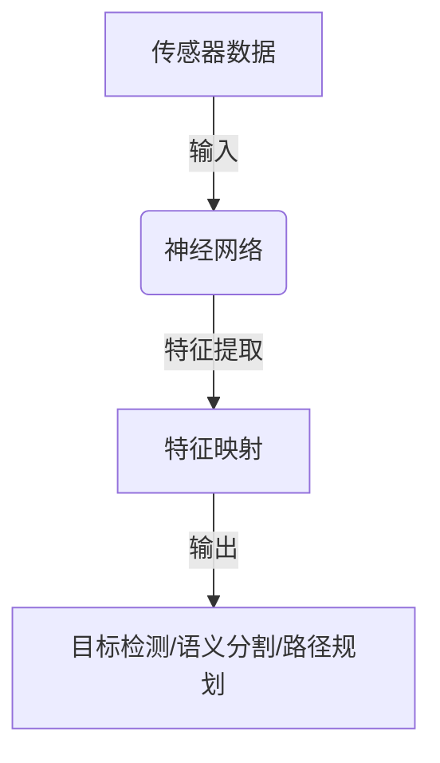

# 一切皆是映射：无人驾驶车辆中的神经网络系统

## 1.背景介绍

### 1.1 无人驾驶汽车的崛起

近年来,无人驾驶汽车技术的快速发展引起了全球关注。无人驾驶汽车被视为未来交通运输的革命性变革,有望显著提高道路安全性、减少拥堵、降低环境污染、提高出行效率。无人驾驶技术的核心是感知、决策和控制,而神经网络在感知和决策中扮演着关键角色。

### 1.2 神经网络在无人驾驶中的应用

神经网络是一种受生物神经系统启发的机器学习模型,具有强大的模式识别和泛化能力。在无人驾驶系统中,神经网络被广泛应用于目标检测、语义分割、路径规划等任务。其中,卷积神经网络(CNN)在计算机视觉领域取得了巨大成功,成为无人驾驶感知系统的核心组件。

## 2.核心概念与联系

### 2.1 神经网络的基本概念

神经网络是一种由节点(神经元)和连接(权重)组成的数学模型,通过学习输入数据的特征来进行预测或决策。神经网络的核心思想是通过调整连接权重,使得模型在训练数据上的误差最小化,从而获得较好的泛化能力。

### 2.2 神经网络与无人驾驶的联系

在无人驾驶系统中,神经网络扮演着至关重要的角色。它们被用于从传感器数据(如相机、激光雷达等)中提取有用的特征,并将这些特征映射到所需的输出(如目标检测、语义分割等)。神经网络的强大学习能力使其能够有效处理复杂的环境和情况,这对于无人驾驶系统的安全性和可靠性至关重要。



## 3.核心算法原理具体操作步骤

### 3.1 前馈神经网络

前馈神经网络是最基本的神经网络结构,信息只在一个方向传播,从输入层经过隐藏层到达输出层。它的核心算法是反向传播算法,用于通过梯度下降法更新网络权重,使得输出与期望值之间的误差最小化。

1. **前向传播**:输入数据经过多层神经元的加权求和和非线性激活函数,计算出输出值。
2. **反向传播**:计算输出值与期望值之间的误差,并沿着网络反向传播,计算每个权重对误差的梯度。
3. **权重更新**:根据梯度下降法,更新每个权重,使得误差最小化。
4. **迭代训练**:重复上述步骤,直到模型收敛或达到预期性能。

### 3.2 卷积神经网络

卷积神经网络(CNN)是一种专门用于处理网格数据(如图像)的神经网络结构。它通过卷积、池化等操作提取局部特征,并通过多层组合形成更高级的特征表示。CNN在计算机视觉任务中表现出色,是无人驾驶感知系统的核心组件。

1. **卷积层**:通过滑动卷积核在输入数据上进行卷积操作,提取局部特征。
2. **池化层**:对卷积结果进行下采样,减小特征图尺寸,提高鲁棒性。
3. **全连接层**:将提取的特征映射到最终输出,如分类或回归任务。
4. **反向传播**:与前馈神经网络类似,通过反向传播算法更新网络权重。

## 4.数学模型和公式详细讲解举例说明

### 4.1 神经网络的数学模型

神经网络可以用一系列数学公式来描述。对于一个具有 $L$ 层的前馈神经网络,第 $l$ 层的输出 $a^{(l)}$ 可以表示为:

$$a^{(l)} = g(z^{(l)})$$

其中 $z^{(l)}$ 是加权输入,定义为:

$$z^{(l)} = W^{(l)}a^{(l-1)} + b^{(l)}$$

$W^{(l)}$ 和 $b^{(l)}$ 分别是第 $l$ 层的权重矩阵和偏置向量, $g(\cdot)$ 是非线性激活函数,如 ReLU、Sigmoid 等。

在训练过程中,我们需要最小化损失函数 $J(W,b)$,通常采用反向传播算法计算梯度,然后使用梯度下降法更新权重和偏置:

$$W^{(l)} \leftarrow W^{(l)} - \alpha \frac{\partial J}{\partial W^{(l)}}$$
$$b^{(l)} \leftarrow b^{(l)} - \alpha \frac{\partial J}{\partial b^{(l)}}$$

其中 $\alpha$ 是学习率,控制更新步长。

### 4.2 卷积神经网络的数学模型

在卷积神经网络中,卷积层的输出特征图可以表示为:

$$x_{j}^{l} = g\left(\sum_{i \in M_j} x_{i}^{l-1} * k_{ij}^{l} + b_j^l\right)$$

其中 $x_j^l$ 是第 $l$ 层第 $j$ 个特征图, $M_j$ 是与第 $j$ 个特征图相连的上一层特征图的集合, $*$ 表示卷积操作, $k_{ij}^l$ 是第 $l$ 层第 $i$ 个特征图到第 $j$ 个特征图的卷积核, $b_j^l$ 是第 $j$ 个特征图的偏置项, $g(\cdot)$ 是非线性激活函数。

池化层通常使用最大池化或平均池化操作,将特征图的尺寸缩小,提取局部的最大值或平均值作为下一层的输入。

### 4.3 实例:卷积神经网络在目标检测中的应用

在无人驾驶系统中,目标检测是一项关键任务,需要从图像或点云数据中准确检测出车辆、行人、障碍物等目标。卷积神经网络在这一任务中表现出色,如 Faster R-CNN、YOLO 等算法。

以 Faster R-CNN 为例,它由两个子网络组成:区域提议网络(RPN)和目标检测网络。RPN 通过在特征图上滑动窗口,生成一系列候选边界框;目标检测网络则对这些候选框进行分类和精细化,输出最终的目标检测结果。

在 RPN 中,对于每个滑动窗口,我们需要预测两个输出:一个是该窗口内是否包含目标的二值分类,另一个是该窗口相对于真实边界框的偏移量。这两个输出可以通过两个并行的全连接层来预测:

$$p = P(object) = \sigma(W_p^Tx + b_p)$$
$$t = G(box) = W_tx + b_t$$

其中 $\sigma$ 是 Sigmoid 函数, $W_p$、$b_p$、$W_t$、$b_t$ 是需要学习的参数。通过反向传播算法,我们可以优化这些参数,使得 RPN 能够生成高质量的候选边界框。

## 5.项目实践:代码实例和详细解释说明

为了更好地理解神经网络在无人驾驶系统中的应用,我们提供了一个基于 PyTorch 的目标检测示例项目。该项目使用 Faster R-CNN 算法在 KITTI 数据集上进行训练和测试,旨在检测车辆和行人目标。

### 5.1 数据准备

KITTI 数据集是一个广为人知的自动驾驶数据集,包含来自真实城市环境的图像和点云数据。我们需要从原始数据中提取图像和标注信息,并进行适当的预处理和增强。

```python
import torch
from torchvision import transforms
from kitti_dataset import KittiDataset

# 定义数据增强和预处理
data_transform = transforms.Compose([
    transforms.Resize((800, 1280)),
    transforms.ToTensor(),
    transforms.Normalize(mean=[0.485, 0.456, 0.406], std=[0.229, 0.224, 0.225])
])

# 加载数据集
train_dataset = KittiDataset('path/to/kitti/train', transform=data_transform)
val_dataset = KittiDataset('path/to/kitti/val', transform=data_transform)

# 创建数据加载器
train_loader = torch.utils.data.DataLoader(train_dataset, batch_size=4, shuffle=True)
val_loader = torch.utils.data.DataLoader(val_dataset, batch_size=4, shuffle=False)
```

### 5.2 模型定义

我们使用 PyTorch 内置的 Faster R-CNN 模型,并对其进行微调以适应我们的任务。

```python
import torchvision
from torchvision.models.detection import FasterRCNN
from torchvision.models.detection.rpn import AnchorGenerator

# 定义模型
model = FasterRCNN(
    backbone=torchvision.models.resnet50(pretrained=True),
    num_classes=2,  # 车辆和行人
    rpn_anchor_generator=AnchorGenerator(sizes=(32, 64, 128, 256, 512), aspect_ratios=(0.5, 1.0, 2.0)),
    box_detections_per_img=300
)

# 移动到GPU
device = torch.device('cuda' if torch.cuda.is_available() else 'cpu')
model.to(device)
```

### 5.3 训练和评估

我们定义了一个训练函数,用于在训练集上训练模型,并在验证集上评估性能。

```python
import torch.optim as optim
from engine import train_one_epoch, evaluate

# 定义优化器和学习率调度器
optimizer = optim.SGD(model.parameters(), lr=0.005, momentum=0.9, weight_decay=0.0005)
lr_scheduler = optim.lr_scheduler.StepLR(optimizer, step_size=3, gamma=0.1)

# 训练和评估
num_epochs = 10
for epoch in range(num_epochs):
    # 训练一个epoch
    train_one_epoch(model, optimizer, train_loader, device, epoch, print_freq=10)

    # 更新学习率
    lr_scheduler.step()

    # 在验证集上评估
    evaluate(model, val_loader, device=device)
```

在训练过程中,我们使用 PyTorch 提供的工具函数来计算损失、更新权重和评估性能。训练完成后,我们可以在测试集上测试模型,并将结果可视化或进一步分析。

```python
from utils import visualize_detection

# 在测试集上测试
test_dataset = KittiDataset('path/to/kitti/test', transform=data_transform)
test_loader = torch.utils.data.DataLoader(test_dataset, batch_size=1, shuffle=False)

# 可视化检测结果
for images, targets in test_loader:
    images = list(image.to(device) for image in images)
    outputs = model(images)
    visualize_detection(images, outputs)
```

通过这个示例项目,您可以更好地理解如何在实践中应用神经网络进行目标检测,并为无人驾驶系统的感知模块做出贡献。

## 6.实际应用场景

神经网络在无人驾驶系统中的应用不仅限于目标检测,还包括以下几个关键场景:

### 6.1 语义分割

语义分割旨在为图像中的每个像素赋予语义标签,如道路、车辆、行人等。这对于无人驾驶车辆理解复杂的环境至关重要。全卷积神经网络(FCN)、SegNet、U-Net 等模型在这一任务中表现出色。

### 6.2 路径规划

在确定车辆的行驶路线时,神经网络可以根据周围环境和交通规则生成安全、高效的路径。这涉及到序列预测、强化学习等技术,如基于 LSTM 的路径规划模型。

### 6.3 决策和控制

除了感知模块,神经网络还可以应用于无人驾驶系统的决策和控制模块。例如,通过强化学习训练的神经网络可以直接从传感器数据中学习最优的驾驶策略,实现端到端的自动驾驶。

### 6.4 模拟环境

为了安全地训练和测试无人驾驶系统,研究人员开发了基于物理引擎和图形渲染的模拟环境,如 CARLA、AirSim 等。在这些环境中,神经网络可以从大量模拟数据中学习,而无需昂贵的真实世界