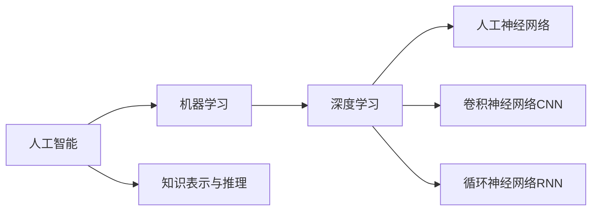

# 人工智能原理与代码实例讲解

## 1. 背景介绍
### 1.1 人工智能的发展历程
#### 1.1.1 人工智能的起源
#### 1.1.2 人工智能的发展阶段
#### 1.1.3 人工智能的现状与未来

### 1.2 人工智能的定义与分类
#### 1.2.1 人工智能的定义
#### 1.2.2 人工智能的分类
##### 1.2.2.1 弱人工智能
##### 1.2.2.2 强人工智能
##### 1.2.2.3 超人工智能

### 1.3 人工智能的应用领域
#### 1.3.1 自然语言处理
#### 1.3.2 计算机视觉
#### 1.3.3 机器人技术
#### 1.3.4 专家系统
#### 1.3.5 智能决策系统

## 2. 核心概念与联系
### 2.1 机器学习
#### 2.1.1 监督学习
#### 2.1.2 无监督学习
#### 2.1.3 强化学习

### 2.2 深度学习
#### 2.2.1 人工神经网络
#### 2.2.2 卷积神经网络（CNN）
#### 2.2.3 循环神经网络（RNN）

### 2.3 知识表示与推理
#### 2.3.1 知识表示方法
##### 2.3.1.1 一阶逻辑
##### 2.3.1.2 产生式规则
##### 2.3.1.3 语义网络
#### 2.3.2 推理方法
##### 2.3.2.1 演绎推理
##### 2.3.2.2 归纳推理
##### 2.3.2.3 类比推理

### 2.4 概念之间的联系


## 3. 核心算法原理具体操作步骤
### 3.1 反向传播算法（Backpropagation）
#### 3.1.1 前向传播
#### 3.1.2 损失函数计算
#### 3.1.3 反向传播
#### 3.1.4 权重更新

### 3.2 梯度下降算法（Gradient Descent）
#### 3.2.1 批量梯度下降（Batch Gradient Descent）
#### 3.2.2 随机梯度下降（Stochastic Gradient Descent）
#### 3.2.3 小批量梯度下降（Mini-Batch Gradient Descent）

### 3.3 支持向量机（Support Vector Machine）
#### 3.3.1 最大间隔超平面
#### 3.3.2 软间隔与松弛变量
#### 3.3.3 核函数

### 3.4 决策树（Decision Tree）
#### 3.4.1 信息熵与信息增益
#### 3.4.2 ID3算法
#### 3.4.3 C4.5算法
#### 3.4.4 CART算法

## 4. 数学模型和公式详细讲解举例说明
### 4.1 感知机模型（Perceptron Model）
感知机是一种二分类的线性分类模型，其数学表达式为：

$$
f(x)=\text{sign}(w \cdot x+b)
$$

其中，$w$是权重向量，$x$是输入向量，$b$是偏置项，$\text{sign}$是符号函数。

### 4.2 支持向量机模型（Support Vector Machine Model）
支持向量机的目标是寻找一个最大间隔超平面，使得两类样本能够被超平面很好地分开。其数学模型可表示为：

$$
\begin{aligned}
\min _{w, b} & \frac{1}{2}\|w\|^2 \
\text { s.t. } & y_i\left(w \cdot x_i+b\right) \geq 1, \quad i=1,2, \ldots, n
\end{aligned}
$$

其中，$w$是超平面的法向量，$b$是偏置项，$x_i$是第$i$个样本，$y_i$是第$i$个样本的类别标签。

### 4.3 卷积神经网络模型（Convolutional Neural Network Model）
卷积神经网络由卷积层、池化层和全连接层组成。卷积层的数学表达式为：

$$
\mathbf{Z}^{(l)}=\mathbf{W}^{(l)} * \mathbf{A}^{(l-1)}+\mathbf{b}^{(l)}
$$

其中，$\mathbf{Z}^{(l)}$是第$l$层的输出，$\mathbf{W}^{(l)}$是第$l$层的卷积核，$\mathbf{A}^{(l-1)}$是第$l-1$层的输出，$\mathbf{b}^{(l)}$是第$l$层的偏置项，$*$表示卷积操作。

## 5. 项目实践：代码实例和详细解释说明
### 5.1 手写数字识别（MNIST数据集）
使用TensorFlow和Keras实现一个简单的卷积神经网络，对MNIST手写数字数据集进行分类：

```python
import tensorflow as tf
from tensorflow import keras

# 加载MNIST数据集
(x_train, y_train), (x_test, y_test) = keras.datasets.mnist.load_data()

# 数据预处理
x_train = x_train.reshape((60000, 28, 28, 1)) / 255.0
x_test = x_test.reshape((10000, 28, 28, 1)) / 255.0
y_train = keras.utils.to_categorical(y_train)
y_test = keras.utils.to_categorical(y_test)

# 构建卷积神经网络模型
model = keras.Sequential([
    keras.layers.Conv2D(32, (3, 3), activation='relu', input_shape=(28, 28, 1)),
    keras.layers.MaxPooling2D((2, 2)),
    keras.layers.Conv2D(64, (3, 3), activation='relu'),
    keras.layers.MaxPooling2D((2, 2)),
    keras.layers.Conv2D(64, (3, 3), activation='relu'),
    keras.layers.Flatten(),
    keras.layers.Dense(64, activation='relu'),
    keras.layers.Dense(10, activation='softmax')
])

# 编译模型
model.compile(optimizer='adam',
              loss='categorical_crossentropy',
              metrics=['accuracy'])

# 训练模型
model.fit(x_train, y_train, epochs=5, batch_size=64, validation_data=(x_test, y_test))

# 评估模型
test_loss, test_acc = model.evaluate(x_test, y_test)
print('Test accuracy:', test_acc)
```

这个代码示例展示了如何使用TensorFlow和Keras构建一个简单的卷积神经网络模型，并在MNIST手写数字数据集上进行训练和评估。主要步骤包括：

1. 加载MNIST数据集，并进行数据预处理，包括归一化和one-hot编码。
2. 构建卷积神经网络模型，包含多个卷积层、池化层和全连接层。
3. 编译模型，指定优化器、损失函数和评估指标。
4. 训练模型，指定训练轮数、批量大小和验证数据。
5. 评估模型，输出测试集上的准确率。

### 5.2 自然语言处理（情感分析）
使用TensorFlow和Keras实现一个基于LSTM的情感分析模型，对电影评论进行情感分类：

```python
import tensorflow as tf
from tensorflow import keras
import numpy as np

# 加载IMDB数据集
(x_train, y_train), (x_test, y_test) = keras.datasets.imdb.load_data(num_words=10000)

# 数据预处理
x_train = keras.preprocessing.sequence.pad_sequences(x_train, maxlen=256)
x_test = keras.preprocessing.sequence.pad_sequences(x_test, maxlen=256)

# 构建LSTM模型
model = keras.Sequential([
    keras.layers.Embedding(10000, 16),
    keras.layers.LSTM(100),
    keras.layers.Dense(1, activation='sigmoid')
])

# 编译模型
model.compile(optimizer='adam',
              loss='binary_crossentropy',
              metrics=['accuracy'])

# 训练模型
model.fit(x_train, y_train, epochs=5, batch_size=64, validation_data=(x_test, y_test))

# 评估模型
test_loss, test_acc = model.evaluate(x_test, y_test)
print('Test accuracy:', test_acc)
```

这个代码示例展示了如何使用TensorFlow和Keras构建一个基于LSTM的情感分析模型，并在IMDB电影评论数据集上进行训练和评估。主要步骤包括：

1. 加载IMDB数据集，并进行数据预处理，包括序列填充。
2. 构建LSTM模型，包含嵌入层、LSTM层和全连接层。
3. 编译模型，指定优化器、损失函数和评估指标。
4. 训练模型，指定训练轮数、批量大小和验证数据。
5. 评估模型，输出测试集上的准确率。

## 6. 实际应用场景
### 6.1 医疗诊断
人工智能在医疗诊断领域有广泛的应用，如利用深度学习算法分析医学影像，辅助医生进行疾病诊断和预测。

### 6.2 自动驾驶
自动驾驶技术依赖于人工智能算法，如计算机视觉用于环境感知，深度强化学习用于决策控制。

### 6.3 个性化推荐
电商平台和内容平台利用机器学习算法，根据用户的历史行为和偏好，提供个性化的商品或内容推荐。

### 6.4 智能客服
企业利用自然语言处理技术，开发智能客服系统，自动回答客户的常见问题，提高客户服务效率。

### 6.5 金融风险控制
金融机构利用机器学习算法，分析海量的交易数据，实时监测和预警金融风险，如欺诈检测和信用评估。

## 7. 工具和资源推荐
### 7.1 机器学习框架
- TensorFlow：由Google开发的开源机器学习框架，支持多种编程语言和硬件平台。
- PyTorch：由Facebook开发的开源机器学习框架，具有动态计算图和易用性的特点。
- Scikit-learn：基于Python的机器学习库，提供了丰富的传统机器学习算法。

### 7.2 深度学习框架
- Keras：基于TensorFlow、Theano和CNTK的高级神经网络API，易于使用和快速原型开发。
- Caffe：由Berkeley Vision and Learning Center开发的深度学习框架，在计算机视觉领域广泛应用。
- MXNet：由Apache Software Foundation孵化的深度学习框架，支持多种编程语言和硬件平台。

### 7.3 数据集资源
- Kaggle：全球最大的数据科学社区，提供了大量的公开数据集和竞赛。
- UCI Machine Learning Repository：加州大学欧文分校维护的机器学习数据集库。
- OpenML：一个开放的机器学习平台，提供了大量的数据集和实验结果。

### 7.4 在线学习资源
- Coursera：提供了大量的人工智能和机器学习在线课程，由知名大学和企业提供。
- edX：由麻省理工学院和哈佛大学创建的在线学习平台，提供了人工智能相关课程。
- fast.ai：由Jeremy Howard创建的深度学习实践课程，注重实践和应用。

## 8. 总结：未来发展趋势与挑战
### 8.1 人工智能的发展趋势
- 人工智能与其他领域的融合，如医疗、金融、制造业等。
- 人工智能的可解释性和可信赖性的提升，增强人工智能系统的透明度和可控性。
- 人工智能的普及和应用，从专业领域向大众化应用拓展。

### 8.2 人工智能面临的挑战
- 数据质量和数据偏差问题，如何获取高质量、无偏差的训练数据。
- 隐私和安全问题，如何在保护用户隐私的同时，实现数据的共享和利用。
- 伦理和法律问题，如何规范人工智能系统的开发和应用，避免滥用和不当使用。

### 8.3 人工智能的未来展望
- 人工智能将成为推动社会发展的重要力量，促进生产力的提升和生活质量的改善。
- 人工智能将与人类智能协同发展，形成人机协作的新模式，共同应对复杂的现实问题。
- 人工智能的发展需要多方合作，包括政府、企业、学术界和公众，共同推进人工智能的健康发展。

## 9. 附录：常见问题与解答
### 9.1 什么是过拟合和欠拟合？如何避免？