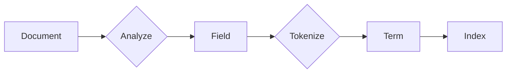

# 从原理到实践:优化Lucene索引性能的12条军规

## 1.背景介绍
### 1.1 搜索引擎的重要性
在当今信息大爆炸的时代,搜索引擎扮演着越来越重要的角色。它们帮助我们从海量的数据中快速准确地找到所需的信息,大大提高了信息检索的效率。无论是在互联网上还是在企业内部,搜索引擎都是不可或缺的工具。

### 1.2 Lucene简介
Lucene是Apache软件基金会的一个开源全文搜索引擎工具包,提供了索引和搜索功能。它是目前最流行的开源搜索引擎库之一,被广泛应用于各种规模的搜索应用中。Lucene使用Java语言编写,具有跨平台、高性能、可扩展等优点。

### 1.3 Lucene索引性能的重要性
在基于Lucene构建的搜索引擎中,索引的性能直接影响到整个系统的效率和用户体验。高效的索引可以加快文档的检索速度,减少资源消耗,提升系统的可扩展性。因此,优化Lucene索引性能对于开发高质量的搜索引擎至关重要。

## 2.核心概念与联系
### 2.1 索引(Index)
索引是Lucene中最核心的概念之一。它是对原始文档进行分析、提取关键信息后得到的一种数据结构,旨在加速文档搜索的过程。Lucene索引由多个独立的Segment组成,每个Segment中包含了一部分文档的索引数据。

### 2.2 文档(Document) 
文档是Lucene中信息的基本单元。一个文档包含了一组域(Field),每个域中存储了文档的一项属性,如标题、作者、内容等。在索引时,Lucene会对文档的各个域进行分析,提取出关键词信息用于创建索引。

### 2.3 词条(Term)
词条是文档域中的最小索引单元。它由两部分组成:词名(Term text)和域名(Field name)。Lucene会对文档的域值进行分词、语言处理,得到一系列词条,然后基于词条创建倒排索引。

### 2.4 概念之间的关系
下面的Mermaid流程图展示了索引、文档、词条三个核心概念之间的关系:


## 3.核心算法原理具体操作步骤
### 3.1 索引创建流程
Lucene索引的创建主要分为以下几个步骤:
1. 采集文档:从数据源获取原始文档数据
2. 建立文档对象:将原始文档数据创建成Lucene的Document对象
3. 分析文档域:对文档的各个域进行分析处理,提取关键词信息
4. 创建索引:将分析得到的词条信息写入索引文件
5. 提交&合并:将新建的索引Segment提交,与已有的索引进行合并

### 3.2 倒排索引
倒排索引是Lucene实现快速全文搜索的核心数据结构。它记录了词条与文档之间的映射关系,由以下两部分组成:
- 词典(Term Dictionary):存储所有文档的词条,记录了词条到倒排列表的关联关系
- 倒排列表(Posting List):记录了包含某个词条的所有文档的信息,如文档ID、词频、位置等

在搜索时,Lucene先在词典中查找关键词对应的词条,然后顺藤摸瓜找到该词条的倒排列表,从而快速定位到包含关键词的文档。

### 3.3 文档分析与分词
文档分析是将域值转换为词条的过程,是创建倒排索引的基础。Lucene采用了灵活的分析器(Analyzer)架构,可以通过组合各种分词器(Tokenizer)和过滤器(TokenFilter)来实现定制化的分析功能,主要步骤包括:
1. 字符过滤:对域值进行预处理,如去除HTML标签、替换特殊字符等
2. 分词:将域值拆分为一个个独立的语汇单元
3. 词元过滤:对分词结果进行过滤,如变小写、去除停用词、提取词干等
4. 词元增强:对分词结果进行增强,如同义词转换、拼音转换等

## 4.数学模型和公式详细讲解举例说明
### 4.1 文档打分模型
Lucene使用向量空间模型(VSM)来计算文档与查询的相关度得分。假设查询Q由词条$q_1, q_2, ..., q_n$组成,文档D包含词条$t_1, t_2, ..., t_m$,则文档D对查询Q的相关度得分可以表示为:

$$
score(Q,D) = \sum_{i=1}^n (tf(q_i,D) \cdot idf(q_i) \cdot norm(q_i,D))
$$

其中,$tf(q_i,D)$表示词条$q_i$在文档D中的词频,$idf(q_i)$表示词条$q_i$的逆文档频率,用于衡量词条的重要性:

$$
idf(q_i) = 1 + log(\frac{numDocs}{docFreq(q_i)+1}) 
$$

$numDocs$为索引中的总文档数,$docFreq(q_i)$为包含词条$q_i$的文档数。$norm(q_i,D)$为文档D的归一化因子,用于平衡不同长度文档的得分:

$$
norm(q_i,D) = \frac{1}{\sqrt{numTerms(D)}}
$$

$numTerms(D)$为文档D的总词条数。

### 4.2 文档长度归一化
文档长度归一化是Lucene打分模型中的重要一环。一般来说,较长的文档往往包含更多的词条,从而有更高的得分。为了平衡不同长度文档的得分,Lucene引入了文档长度归一化因子$norm$:

$$
norm = \frac{1}{\sqrt{numTerms}}
$$

其中,$numTerms$为文档的词条总数。$norm$与文档长度成反比,对较长文档的词频进行了惩罚,使其对最终得分的贡献变小。

举例来说,假设有两个文档A和B,它们对查询词条"Lucene"的词频都为2次,但A的总词条数为100,B的总词条数为1000,则它们的归一化因子分别为:

$$
norm(A) = \frac{1}{\sqrt{100}} = 0.1 \
norm(B) = \frac{1}{\sqrt{1000}} \approx 0.032
$$

可见,对于较长的文档B,其归一化因子较小,从而降低了其词频对最终得分的影响。这种归一化处理使得不同长度的文档有了更加公平的比较基础。

## 5.项目实践：代码实例和详细解释说明
下面通过一个简单的Lucene索引和搜索的例子,来演示如何使用Lucene进行全文检索。

### 5.1 创建索引
```java
//1.采集文档数据
String[] docs = {"Lucene is a Java full-text search engine",
    "Lucene is an open source project"};

//2.创建文档对象  
Document doc1 = new Document();
doc1.add(new TextField("content", docs[0], Field.Store.YES));
Document doc2 = new Document();  
doc2.add(new TextField("content", docs[1], Field.Store.YES));

//3.创建分析器
Analyzer analyzer = new StandardAnalyzer();

//4.创建索引写入器
IndexWriterConfig config = new IndexWriterConfig(analyzer);
IndexWriter indexWriter = new IndexWriter(indexDir, config);

//5.写入文档到索引
indexWriter.addDocument(doc1);  
indexWriter.addDocument(doc2);

//6.提交并关闭索引写入器
indexWriter.commit();
indexWriter.close();
```

说明:
- 第1步,采集两个简单的文本作为原始文档数据
- 第2步,将文本内容添加到Lucene的Document对象中,使用TextField表示该域支持全文搜索
- 第3步,创建标准分析器,对文档内容进行分词处理
- 第4步,创建索引写入器IndexWriter,指定索引目录和使用的分析器
- 第5步,通过IndexWriter将文档对象写入索引
- 第6步,提交索引更改并关闭IndexWriter

### 5.2 执行搜索
```java
//1.创建查询解析器
QueryParser parser = new QueryParser("content", analyzer);

//2.解析查询表达式
Query query = parser.parse("java");

//3.创建索引搜索器
IndexReader indexReader = DirectoryReader.open(indexDir);
IndexSearcher indexSearcher = new IndexSearcher(indexReader);

//4.执行搜索,获取前10个结果
TopDocs topDocs = indexSearcher.search(query, 10);

//5.遍历搜索结果并输出
for (ScoreDoc scoreDoc : topDocs.scoreDocs) {
    Document doc = indexSearcher.doc(scoreDoc.doc);
    System.out.println(doc.get("content"));
}

//6.关闭索引读取器
indexReader.close();
```

说明:
- 第1步,创建查询解析器QueryParser,指定默认搜索域为content和使用的分析器
- 第2步,解析用户输入的查询表达式,生成Query对象
- 第3步,创建索引搜索器IndexSearcher,用于对索引进行搜索
- 第4步,执行查询并获取排名前10的搜索结果
- 第5步,遍历搜索结果,取出文档对象并打印其内容
- 第6步,关闭索引读取器IndexReader

以上代码演示了Lucene创建索引和搜索的基本流程。实际应用中,我们还需要考虑更多的因素,如索引优化、多线程处理、结果高亮等,以进一步提升系统的性能和用户体验。

## 6.实际应用场景
Lucene在各行各业都有广泛的应用,下面列举几个常见的使用场景:

### 6.1 互联网搜索引擎
Lucene是众多互联网搜索引擎的基础,如百度、Elasticsearch等。这些搜索引擎基于Lucene构建了高度可扩展的分布式索引,支持PB级数据的实时搜索。

### 6.2 站内搜索
很多网站都提供站内搜索服务,如论坛、博客、电商网站等。Lucene可以帮助快速搭建灵活的站内搜索引擎,为用户提供高效的信息检索体验。

### 6.3 企业内部搜索
企业内部积累了大量的非结构化数据,如文档、邮件、Wiki等。基于Lucene构建企业内部搜索,可以帮助员工快速查找所需信息,提高工作效率。

### 6.4 日志搜索分析
很多系统会产生大量的日志数据,传统的关系型数据库难以支撑海量日志的实时搜索与分析。将日志数据接入Lucene,可以实现快速的日志检索、统计、告警等功能。

### 6.5 垂直领域搜索
针对某些特定领域,通用的搜索引擎无法提供理想的搜索体验,需要构建垂直领域搜索引擎。例如法律、医疗、专利等领域,Lucene可以帮助快速搭建面向垂直领域的专业搜索引擎。

## 7.工具和资源推荐
### 7.1 Lucene工具包
- Luke:方便查看和调试Lucene索引的工具
- Lucene-Grep:使用Lucene实现的类似Grep的命令行工具
- Lucene Benchmark:Lucene的基准测试工具,用于评估索引和搜索性能

### 7.2 Lucene扩展
- Solr:基于Lucene构建的企业级搜索服务器
- Elasticsearch:基于Lucene的分布式搜索和分析引擎
- Nutch:基于Lucene的开源网络爬虫

### 7.3 社区资源
- Lucene官网:https://lucene.apache.org
- Lucene邮件列表:https://lucene.apache.org/core/discussion.html  
- Lucene Wiki:https://cwiki.apache.org/confluence/display/lucene
- Lucene Javadoc:https://lucene.apache.org/core/8_8_2/core/index.html

这些资源可以帮助开发者更深入地学习和使用Lucene,解决实际项目中遇到的问题,了解Lucene社区的最新动态。

## 8.总结：未来发展趋势与挑战
Lucene经过20多年的发展,已经成为了全文检索领域的标准工具。展望未来,Lucene还有很大的发展潜力和机遇,同时也面临着不少挑战:

### 8.