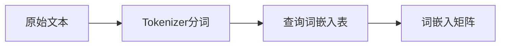
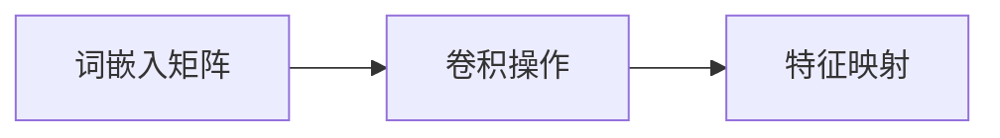
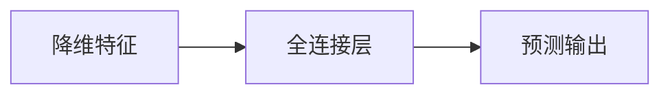

# 从零开始大模型开发与微调：卷积神经网络文本分类模型的实现—Conv1d（一维卷积）

## 1.背景介绍

### 1.1 文本分类任务概述

文本分类是自然语言处理领域的一项基础任务,旨在根据文本内容自动将其归类到预先定义的类别中。它广泛应用于垃圾邮件过滤、新闻分类、情感分析、主题标注等场景。随着深度学习技术的不断发展,基于神经网络的文本分类模型展现出了卓越的性能表现。

### 1.2 卷积神经网络在NLP中的应用

卷积神经网络(Convolutional Neural Networks, CNN)最初被设计用于计算机视觉任务,如图像分类、目标检测等。但是,CNN也可以成功应用于自然语言处理领域。将文本数据表示为嵌入矩阵后,CNN可以在其上执行卷积操作,自动学习局部模式特征,捕捉词语之间的语义关联性。

### 1.3 一维卷积神经网络(Conv1D)

对于序列数据(如文本),我们可以使用一维卷积神经网络(Conv1D)。Conv1D层对输入序列进行卷积操作,提取局部特征,并通过池化层降低特征维度。这种结构可以有效地捕捉局部模式,同时减少模型参数,提高训练效率。

## 2.核心概念与联系

### 2.1 词嵌入(Word Embeddings)

词嵌入是将词语映射到低维连续向量空间的技术,使得语义相似的词语在向量空间中彼此靠近。通过预训练的词向量(如Word2Vec、GloVe等),我们可以获得词语的分布式表示,作为神经网络的输入。



### 2.2 卷积操作(Convolution)

卷积操作是CNN的核心,它通过在输入数据上滑动卷积核(滤波器),提取局部特征。对于文本数据,卷积核可以看作是一个权重矩阵,用于捕捉n-gram特征。



### 2.3 池化操作(Pooling)

池化操作用于降低卷积特征的维度,同时保留重要的特征信息。常用的池化方法包括最大池化(Max Pooling)和平均池化(Average Pooling)。


### 2.4 全连接层(Fully Connected Layer)

全连接层将来自卷积池化层的特征向量映射到样本空间,用于执行分类或回归任务。



## 3.核心算法原理具体操作步骤

### 3.1 文本预处理

1. **分词(Tokenization)**: 将原始文本按照特定规则(如空格、标点符号等)分割成词元(token)序列。
2. **词典构建(Vocabulary)**: 统计语料库中出现的所有词元,构建词典(vocabulary),为每个词元分配一个唯一的索引号。
3. **填充(Padding)**: 由于不同文本长度不同,需要对较短文本进行填充,使所有文本长度统一,以满足神经网络输入要求。

### 3.2 词嵌入层(Embedding Layer)

将每个词元的索引号映射到对应的词向量,构建词嵌入矩阵作为卷积神经网络的输入。词向量可以使用预训练好的词嵌入,如Word2Vec、GloVe等,也可以在训练过程中直接学习。

### 3.3 一维卷积层(Conv1D Layer)

1. **卷积核(Kernel)**: 卷积核是一个权重矩阵,用于捕捉n-gram特征。卷积核的宽度决定了要捕捉的n-gram范围。
2. **卷积操作**: 将卷积核在词嵌入矩阵上进行卷积操作,生成特征映射(feature map)。
3. **激活函数(Activation)**: 通常使用非线性激活函数(如ReLU)来增加模型的表达能力。

### 3.4 池化层(Pooling Layer)

对卷积特征进行池化操作,降低特征维度,同时保留重要的特征信息。常用的池化方法包括最大池化和平均池化。

### 3.5 全连接层(Fully Connected Layer)

将来自池化层的特征向量输入到全连接层,经过非线性变换,最终映射到样本空间,得到分类或回归的预测输出。

### 3.6 模型训练

使用标注好的训练数据,通过反向传播算法和优化器(如Adam)来更新模型参数,最小化损失函数(如交叉熵损失),从而使模型在验证集上达到最佳性能。

## 4.数学模型和公式详细讲解举例说明

### 4.1 词嵌入

设有一个词典$\mathcal{V}$,其中每个词$w$对应一个唯一的索引$index(w)$。我们可以使用一个嵌入矩阵$W_{emb} \in \mathbb{R}^{d \times |\mathcal{V}|}$将每个词映射到一个$d$维的词向量,其中$d$是嵌入维度。对于一个长度为$n$的句子$S = (w_1, w_2, \dots, w_n)$,我们可以通过查找嵌入矩阵$W_{emb}$获得对应的词向量序列:

$$X = (x_1, x_2, \dots, x_n)$$

其中$x_i = W_{emb}[:, index(w_i)]$是第$i$个词$w_i$的词向量。

### 4.2 一维卷积操作

设有一个卷积核$K \in \mathbb{R}^{h \times d}$,其中$h$是卷积核的高度(窗口大小)。对于输入序列$X$,我们可以在序列上应用卷积操作,生成一个新的特征映射序列$C$:

$$c_i = f(K \cdot x_{i:i+h-1} + b)$$

其中$f$是非线性激活函数(如ReLU),$b$是偏置项,$\cdot$表示矩阵点乘。通过在输入序列上滑动卷积核,我们可以获得整个特征映射序列$C = (c_1, c_2, \dots, c_{n-h+1})$。

### 4.3 池化操作

对于特征映射序列$C$,我们可以应用池化操作来降低特征维度。最大池化(Max Pooling)和平均池化(Average Pooling)是两种常用的池化方法。

**最大池化**:
$$\hat{c} = \max\limits_{1 \leq i \leq n-h+1} c_i$$

**平均池化**:
$$\hat{c} = \frac{1}{n-h+1}\sum\limits_{i=1}^{n-h+1} c_i$$

通过池化操作,我们可以获得一个固定长度的特征向量$\hat{c}$,作为模型的高级特征表示。

### 4.4 全连接层和分类

将池化后的特征向量$\hat{c}$输入到全连接层,经过一个或多个非线性变换,最终得到分类或回归的预测输出:

$$\hat{y} = \text{softmax}(W_o \cdot \hat{c} + b_o)$$

其中$W_o$和$b_o$分别是全连接层的权重和偏置,$\text{softmax}$函数用于将输出值映射到概率分布。对于分类任务,我们可以使用交叉熵损失函数来衡量预测值与真实标签之间的差异:

$$\mathcal{L} = -\sum\limits_{i=1}^{N} y_i \log(\hat{y}_i)$$

其中$N$是样本数量,$y_i$是第$i$个样本的真实标签。通过反向传播算法和优化器(如Adam),我们可以最小化损失函数,从而使模型在验证集上达到最佳性能。

## 5.项目实践:代码实例和详细解释说明

以下是使用PyTorch实现一维卷积神经网络进行文本分类的代码示例:

```python
import torch
import torch.nn as nn
import torch.nn.functional as F

# 定义模型
class TextCNNModel(nn.Module):
    def __init__(self, vocab_size, embedding_dim, n_filters, filter_sizes, output_dim,
                 dropout, pad_idx):

        super().__init__()
        self.embedding = nn.Embedding(vocab_size, embedding_dim, padding_idx=pad_idx)

        self.convs = nn.ModuleList([
                      nn.Conv1d(in_channels=1, out_channels=n_filters, kernel_size=fs, padding=(fs-1)//2)
                      for fs in filter_sizes
        ])

        self.fc = nn.Linear(len(filter_sizes) * n_filters, output_dim)
        self.dropout = nn.Dropout(dropout)

    def forward(self, text):

        #text = [batch size, sent len]
        embedded = self.embedding(text)

        #embedded = [batch size, sent len, emb dim]
        embedded = embedded.permute(0, 2, 1)

        #embedded = [batch size, emb dim, sent len]
        conved = [F.relu(conv(embedded.unsqueeze(1))).squeeze(3) for conv in self.convs]

        #conved_n = [batch size, n_filters, sent len - filter_sizes[n] + 1]
        pooled = [F.max_pool1d(conv, conv.shape[2]).squeeze(2) for conv in conved]

        #pooled_n = [batch size, n_filters]
        cat = self.dropout(torch.cat(pooled, dim=1))

        #cat = [batch size, n_filters * len(filter_sizes)]

        return self.fc(cat)
```

代码解释:

1. 定义`TextCNNModel`类,继承自`nn.Module`。
2. 在`__init__`方法中,初始化词嵌入层、卷积层和全连接层。
   - `nn.Embedding`用于构建词嵌入矩阵。
   - `nn.Conv1d`用于实现一维卷积操作,对应不同的卷积核大小。
   - `nn.Linear`用于实现全连接层,将池化后的特征映射到输出空间。
3. 在`forward`方法中,定义模型的前向传播过程:
   - 将输入文本通过词嵌入层获得词嵌入矩阵。
   - 对词嵌入矩阵执行一维卷积操作,获得多个卷积特征映射。
   - 对每个卷积特征映射执行最大池化操作,获得固定长度的特征向量。
   - 将所有池化后的特征向量拼接,经过dropout regularization。
   - 将拼接后的特征向量输入全连接层,获得最终的预测输出。

使用示例:

```python
# 加载数据
train_iter = ...
vocab_size = len(vocab)

# 初始化模型
model = TextCNNModel(vocab_size, embedding_dim=100, n_filters=100,
                     filter_sizes=[3,4,5], output_dim=10,
                     dropout=0.5, pad_idx=vocab.stoi['<pad>'])

# 训练模型
criterion = nn.CrossEntropyLoss()
optimizer = torch.optim.Adam(model.parameters())

for epoch in range(num_epochs):
    for batch in train_iter:
        ...

        optimizer.zero_grad()
        outputs = model(text)
        loss = criterion(outputs, labels)
        loss.backward()
        optimizer.step()
```

在上述代码中,我们首先加载训练数据和词典,然后初始化`TextCNNModel`实例。接下来,我们定义损失函数(交叉熵损失)和优化器(Adam),并在训练循环中执行前向传播、计算损失、反向传播和优化器更新等步骤。

通过这个示例,你可以了解到如何使用PyTorch实现一维卷积神经网络进行文本分类任务。你可以根据实际需求调整模型参数和超参数,以获得更好的性能表现。

## 6.实际应用场景

一维卷积神经网络在文本分类任务中表现出色,可以广泛应用于以下场景:

1. **垃圾邮件过滤**: 根据邮件内容自动判断是否为垃圾邮件,有效过滤垃圾信息。
2. **新闻分类**: 将新闻文章按主题(如政治、体育、科技等)进行自动分类,为用户提供个性化的新闻推荐。
3. **情感分析**: 分析用户在社