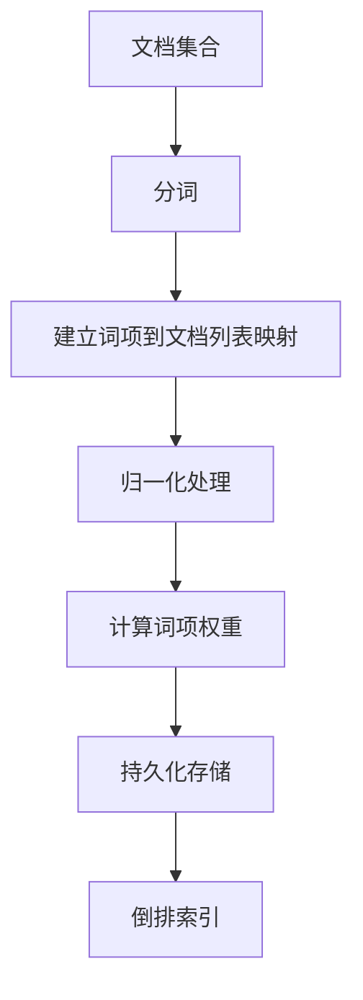
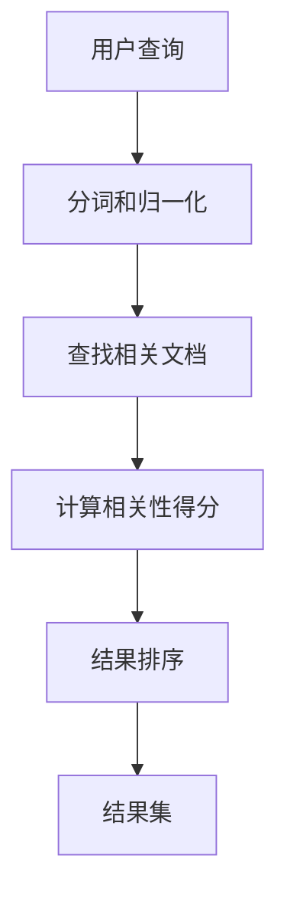

# 全文搜索 原理与代码实例讲解

## 1.背景介绍

### 1.1 什么是全文搜索

全文搜索(Full-Text Search)是一种在文本数据集合中查找特定单词或词组的技术。与传统的数据库查询不同,全文搜索可以在非结构化的文本数据中进行查找,而不仅仅是在结构化的数据库字段中查找。

全文搜索广泛应用于网络搜索引擎、电子邮件系统、文本编辑器、代码编辑器等场景,为用户提供快速、准确的搜索结果。

### 1.2 全文搜索的重要性

随着数据量的快速增长,全文搜索技术变得越来越重要。以下是全文搜索的一些关键优势:

- 提高信息检索效率
- 支持模糊查询和相关性排序
- 支持多语言和自然语言查询
- 提供更好的用户体验

### 1.3 全文搜索的挑战

尽管全文搜索带来了诸多好处,但它也面临一些挑战:

- 大数据量下的索引和查询效率
- 相关性计算的复杂性
- 多语言支持的困难
- 垃圾信息过滤和排序

## 2.核心概念与联系

### 2.1 倒排索引

倒排索引(Inverted Index)是全文搜索系统的核心数据结构。它将文档中的每个单词与其出现的文档列表相关联,从而实现快速查找。


### 2.2 分词

分词(Tokenization)是将文本拆分为单词或词组的过程。它是全文搜索的基础,影响着索引和查询的准确性。

不同语言的分词规则有所不同,需要考虑语言特性和用户习惯。

### 2.3 相关性评分

相关性评分(Relevance Scoring)是根据查询和文档之间的相似度,对搜索结果进行排序的过程。常用的算法包括TF-IDF、BM25等。

### 2.4 查询解析

查询解析(Query Parsing)是将用户输入的查询转换为搜索引擎可理解的格式的过程。它包括查询语法分析、查询重写、查询扩展等步骤。

## 3.核心算法原理具体操作步骤

### 3.1 倒排索引构建

1. **收集文档集合**
2. **对每个文档进行分词**
3. **建立词项到文档列表的映射**
4. **对词项进行归一化处理(如小写、去除标点等)**
5. **计算词项在每个文档中的权重(如TF-IDF)**
6. **将索引持久化存储**



### 3.2 查询处理

1. **接收用户查询**
2. **对查询进行分词和归一化处理**
3. **根据倒排索引查找相关文档**
4. **计算查询与文档的相关性得分**
5. **根据相关性得分对结果排序**
6. **返回排序后的结果集**



## 4.数学模型和公式详细讲解举例说明

### 4.1 TF-IDF

TF-IDF(Term Frequency-Inverse Document Frequency)是一种常用的相关性评分算法,它综合考虑了词项在文档中的频率和在整个文档集合中的稀有程度。

$$
\mathrm{tfidf}(t, d, D) = \mathrm{tf}(t, d) \times \mathrm{idf}(t, D)
$$

其中:

- $\mathrm{tf}(t, d)$ 表示词项 $t$ 在文档 $d$ 中的词频(Term Frequency)
- $\mathrm{idf}(t, D)$ 表示词项 $t$ 在文档集合 $D$ 中的逆向文档频率(Inverse Document Frequency)

词频 $\mathrm{tf}(t, d)$ 可以使用原始计数、对数平滑或其他归一化方式计算。

$$
\mathrm{idf}(t, D) = \log \frac{|D|}{|\{d \in D : t \in d\}|}
$$

$\mathrm{idf}$ 值越高,表示词项越稀有,对相关性的影响越大。

### 4.2 BM25

BM25是一种改进的相关性评分算法,它考虑了文档长度的影响,并引入了调节参数来控制各项的权重。

$$
\mathrm{score}(D, Q) = \sum_{q \in Q} \mathrm{idf}(q) \cdot \frac{f(q, D) \cdot (k_1 + 1)}{f(q, D) + k_1 \cdot \left(1 - b + b \cdot \frac{|D|}{\mathrm{avgdl}}\right)}
$$

其中:

- $f(q, D)$ 表示查询词 $q$ 在文档 $D$ 中的词频
- $|D|$ 表示文档 $D$ 的长度
- $\mathrm{avgdl}$ 表示文档集合的平均文档长度
- $k_1$ 和 $b$ 是调节参数,用于控制词频和文档长度的权重

BM25算法通过引入调节参数,可以更好地适应不同的搜索场景。

## 5.项目实践:代码实例和详细解释说明

### 5.1 Python实现倒排索引

以下是使用Python实现简单倒排索引的示例代码:

```python
import re
from collections import defaultdict

def build_inverted_index(documents):
    inverted_index = defaultdict(list)
    for doc_id, doc in enumerate(documents):
        tokens = tokenize(doc)
        for token in tokens:
            inverted_index[token].append(doc_id)
    return inverted_index

def tokenize(text):
    return re.findall(r'\w+', text.lower())

def search(query, inverted_index):
    query_tokens = tokenize(query)
    relevant_docs = []
    for token in query_tokens:
        if token in inverted_index:
            relevant_docs.extend(inverted_index[token])
    return sorted(set(relevant_docs))

# 示例用法
documents = [
    "The quick brown fox jumps over the lazy dog",
    "The dog is lazy and sleeps all day",
    "The fox is quick and cunning"
]

index = build_inverted_index(documents)
print(index)
# 输出: defaultdict(<class 'list'>, {'the': [0, 1, 2], 'quick': [0, 2], 'brown': [0], 'fox': [0, 2], 'jumps': [0], 'over': [0], 'lazy': [0, 1], 'dog': [0, 1], 'is': [1, 2], 'and': [1, 2], 'sleeps': [1], 'all': [1], 'day': [1], 'cunning': [2]})

query = "quick fox"
results = search(query, index)
print(results)
# 输出: [0, 2]
```

在这个示例中,我们首先定义了 `build_inverted_index` 函数,用于构建倒排索引。它接受一个文档列表作为输入,对每个文档进行分词,然后将每个词项与其出现的文档ID列表相关联,存储在倒排索引中。

`tokenize` 函数用于将文本拆分为单词列表,这里使用了正则表达式来匹配单词。

`search` 函数用于执行搜索操作。它接受一个查询字符串和倒排索引作为输入,对查询进行分词,然后查找每个查询词项对应的文档ID列表,并取它们的并集作为相关文档集合。

最后,我们提供了一个示例文档集合和查询,展示了如何使用这些函数进行索引构建和搜索。

### 5.2 Elasticsearch示例

Elasticsearch是一个流行的开源全文搜索和分析引擎,提供了强大的全文搜索功能。以下是使用Python客户端操作Elasticsearch的示例代码:

```python
from elasticsearch import Elasticsearch

# 连接到Elasticsearch
es = Elasticsearch()

# 创建索引
es.indices.create(index='articles', ignore=400)

# 添加文档
doc1 = {
    'title': 'Introduction to Python',
    'content': 'Python is a popular programming language...'
}
doc2 = {
    'title': 'Python Data Analysis',
    'content': 'NumPy and Pandas are powerful libraries for data analysis...'
}
es.index(index='articles', body=doc1)
es.index(index='articles', body=doc2)

# 执行全文搜索
query = {
    'query': {
        'multi_match': {
            'query': 'python data',
            'fields': ['title', 'content']
        }
    }
}
results = es.search(index='articles', body=query)

# 输出结果
for hit in results['hits']['hits']:
    print(hit['_source']['title'])
```

在这个示例中,我们首先连接到Elasticsearch实例,然后创建一个名为 `articles` 的索引。接下来,我们添加两个文档到索引中。

要执行全文搜索,我们构建一个查询对象,使用 `multi_match` 查询在 `title` 和 `content` 字段中搜索 `"python data"`。Elasticsearch会自动分词并匹配相关文档。

最后,我们遍历搜索结果,输出每个匹配文档的标题。

Elasticsearch提供了更多高级功能,如相关性评分、查询解析、分析器配置等,可以根据具体需求进行定制。

## 6.实际应用场景

全文搜索技术在许多领域都有广泛的应用,以下是一些典型的应用场景:

### 6.1 网络搜索引擎

网络搜索引擎是全文搜索技术的主要应用场景之一。搜索引擎需要对互联网上的海量网页进行索引和搜索,为用户提供准确、相关的搜索结果。

### 6.2 电子商务网站

在电子商务网站中,全文搜索技术可以用于搜索产品信息、评论、问答等内容,提高用户的购物体验。准确的搜索结果有助于用户快速找到所需商品。

### 6.3 企业知识库

企业内部通常会建立知识库,用于存储和检索各种文档、手册、报告等内容。全文搜索技术可以帮助员工快速查找所需信息,提高工作效率。

### 6.4 代码搜索

在软件开发过程中,开发人员经常需要在代码库中搜索特定的函数、类或代码片段。全文搜索技术可以提高代码搜索的效率和准确性。

### 6.5 电子邮件系统

电子邮件系统中通常需要提供搜索功能,以便用户快速查找特定邮件。全文搜索技术可以在邮件主题、正文和附件中进行搜索。

### 6.6 日志分析

在系统运维和故障排查中,需要分析大量的日志文件。全文搜索技术可以帮助快速定位特定的错误信息或关键字,提高问题定位效率。

## 7.工具和资源推荐

### 7.1 开源全文搜索引擎

- Elasticsearch: 一个分布式、RESTful 风格的搜索和分析引擎,提供了全文搜索、结构化搜索、分析和可视化功能。
- Apache Lucene: 一个高性能、全功能的搜索引擎库,提供了索引和搜索功能。
- Apache Solr: 基于 Lucene 构建的企业级搜索服务器,提供了更高级的全文搜索功能。
- Sphinx: 一个高性能的全文搜索引擎,支持多种数据源和多种语言。

### 7.2 开发库和框架

- Whoosh (Python): 一个纯 Python 实现的全文搜索库,易于集成和扩展。
- Searchbox (Java): 一个基于 Lucene 的全文搜索库,提供了简单的 API 和高级功能。
- Haystack (Django): 一个模块化的搜索抽象层,支持多种搜索引擎后端。
- ElasticsearchBundle (Symfony): 一个 Symfony bundle,用于与 Elasticsearch 集成。

### 7.3 在线资源

- Lucene 官方文档: https://lucene.apache.org/
- Elasticsearch 官方文档: https://www.elastic.co/guide/index.html
- Solr 官方文档: https://lucene.apache.org/solr/
-