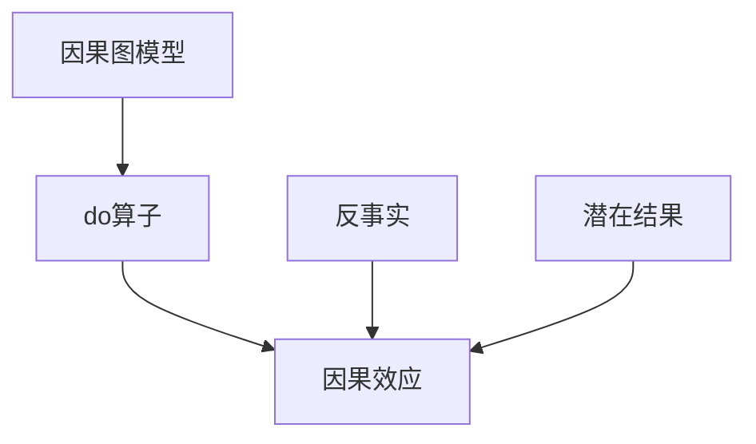

# 因果推理原理与代码实战案例讲解

## 1. 背景介绍
### 1.1 因果推理的重要性
在人工智能和数据科学领域,因果推理是一个至关重要的课题。它不仅能帮助我们更好地理解数据背后的因果关系,还能指导我们进行决策和干预,从而更有效地解决实际问题。近年来,随着大数据和机器学习技术的快速发展,因果推理也受到了越来越多的关注。

### 1.2 因果推理的应用场景
因果推理在许多领域都有广泛的应用,例如:
- 医疗保健:通过分析患者的症状、治疗方案和预后之间的因果关系,可以帮助医生做出更准确的诊断和治疗决策。
- 市场营销:通过分析不同营销策略对销售业绩的影响,可以优化营销资源的分配,提高投资回报率。  
- 社会科学:通过研究不同社会因素之间的因果关系,可以更好地理解社会现象,制定有效的政策。

### 1.3 因果推理面临的挑战
尽管因果推理有着广阔的应用前景,但它也面临着许多挑战:
- 数据的非独立同分布性:现实世界中的数据往往是非独立同分布的,这给因果推理带来了困难。
- 混杂因素:许多因素可能同时影响结果变量,如何控制这些混杂因素是一大挑战。
- 反事实推断:因果推理需要考虑反事实情况,即在不同的处理条件下可能出现的结果,这在实践中往往难以实现。

## 2. 核心概念与联系
### 2.1 因果图模型
因果图模型是描述变量之间因果关系的有向无环图。在因果图中,节点表示变量,有向边表示因果关系,箭头的方向表示因果作用的方向。通过因果图,我们可以直观地表示变量之间的因果依赖关系。

### 2.2 do算子与因果效应 
do算子是 Pearl 因果理论的核心概念之一。它表示对变量进行干预,切断变量与其原因之间的联系,使其独立于其原因。通过do算子,我们可以计算因果效应,即在控制了其他变量的情况下,某个变量对结果变量的影响。

### 2.3 反事实与潜在结果
反事实是指在特定条件下本可能发生但实际上并未发生的情况。潜在结果则是指个体在不同处理水平下的结果。反事实和潜在结果是因果推理中的重要概念,它们为因果效应的定义提供了基础。

### 2.4 概念之间的联系
下图展示了因果图模型、do算子、因果效应、反事实和潜在结果之间的联系:



在因果图模型的基础上,通过do算子对变量进行干预,计算因果效应。而反事实和潜在结果则为因果效应的定义提供了理论基础。

## 3. 核心算法原理具体操作步骤
### 3.1 因果效应的后门准则
后门准则是 Pearl 因果理论中的重要工具,用于识别一组变量,在给定这组变量的条件下,处理变量对结果变量的因果效应可以被识别。后门准则的具体步骤如下:
1. 在因果图中,找出处理变量到结果变量的所有后门路径。
2. 对每条后门路径,检查是否存在一组变量,使得:
   - 这组变量阻断了该后门路径。
   - 给定这组变量,处理变量与结果变量独立。
3. 如果对所有后门路径都存在这样一组变量,则称这组变量满足后门准则,处理变量对结果变量的因果效应可识别。

### 3.2 因果效应的前门准则
前门准则是后门准则的对偶版本,用于识别中介变量,使得通过调整中介变量,处理变量对结果变量的因果效应可以被识别。前门准则的具体步骤如下:
1. 在因果图中,找出处理变量到结果变量的所有前门路径。
2. 对每条前门路径,检查是否存在一组变量,使得:
   - 这组变量阻断了该前门路径上处理变量到结果变量的所有箭头。
   - 这组变量d-分离了处理变量和结果变量。
3. 如果对所有前门路径都存在这样一组变量,则称这组变量满足前门准则,处理变量对结果变量的因果效应可识别。

### 3.3 因果效应的do-calculus
do-calculus 是 Pearl 提出的一套计算因果效应的规则,包括三条规则:
1. 插入规则:在因果图中加入do算子,不改变其他变量的条件概率分布。
2. 删除规则:在因果图中移除do算子,当某个变量与其父节点独立时,可以移除对该变量的do算子。
3. 交换规则:在因果图中交换do算子和条件概率,当某个变量与其他变量独立时,可以交换对该变量的do算子和条件概率。

通过反复使用这三条规则,我们可以将含有do算子的因果效应转化为可以从观测数据中估计的条件概率,从而实现因果效应的识别和估计。

## 4. 数学模型和公式详细讲解举例说明
### 4.1 潜在结果框架
潜在结果框架是 Neyman 和 Rubin 提出的因果推断数学模型。在该框架下,每个个体都有一组潜在结果,表示该个体在不同处理水平下的结果。个体 $i$ 在处理 $t$ 下的潜在结果记为 $Y_i(t)$。因果效应则被定义为潜在结果之间的差异,例如平均因果效应(Average Causal Effect,ACE):

$$ACE = E[Y_i(1) - Y_i(0)]$$

其中 $Y_i(1)$ 和 $Y_i(0)$ 分别表示个体 $i$ 在处理和对照条件下的潜在结果。

### 4.2 结构方程模型
结构方程模型(Structural Equation Model,SEM)是另一种描述因果关系的数学模型。在 SEM 中,每个变量都由一个方程决定,方程右侧为该变量的直接原因。例如,考虑如下的 SEM:

$$
\begin{aligned}
X &= f_X(E_X) \
Y &= f_Y(X, E_Y)
\end{aligned}
$$

其中 $X$ 和 $Y$ 为观测变量,$E_X$ 和 $E_Y$ 为外生变量,表示未观测到的背景因素。$f_X$ 和 $f_Y$ 为未知函数,描述了各变量之间的因果关系。

在 SEM 中,因果效应可以通过 do 算子来定义。例如,$X$ 对 $Y$ 的因果效应可以写作:

$$P(Y|do(X=x)) = \int P(Y|X=x,E_Y)P(E_Y)dE_Y$$

### 4.3 因果效应的 G 估计
G 估计是 Robins 提出的一种估计因果效应的方法。其基本思想是,通过调整一组混杂变量,使得处理变量与结果变量在给定这组变量的条件下独立,从而消除混杂效应,得到因果效应的一致估计。

具体而言,令 $X$ 为处理变量,$Y$ 为结果变量,$Z$ 为混杂变量集合。G 估计的公式为:

$$\hat{\tau} = \frac{1}{n} \sum_{i=1}^n \frac{I(X_i=1)Y_i}{P(X_i=1|Z_i)} - \frac{I(X_i=0)Y_i}{P(X_i=0|Z_i)}$$

其中 $I(\cdot)$ 为指示函数,$P(X_i=x|Z_i)$ 为处理变量在给定混杂变量取值下的倾向得分。G 估计利用倾向得分对混杂效应进行调整,从而得到因果效应的一致估计。

## 5. 项目实践:代码实例和详细解释说明
下面我们通过一个简单的例子来说明如何使用 Python 实现因果效应的估计。考虑如下的数据生成过程:

```python
import numpy as np

def generate_data(n):
    Z = np.random.normal(0, 1, n)
    X = np.random.binomial(1, sigmoid(Z))
    Y = X + Z + np.random.normal(0, 1, n)
    return X, Y, Z

def sigmoid(x):
    return 1 / (1 + np.exp(-x))
```

其中 $Z$ 为混杂变量,$X$ 为处理变量,$Y$ 为结果变量。$X$ 和 $Y$ 都受到 $Z$ 的影响,因此直接比较 $X=1$ 和 $X=0$ 时 $Y$ 的差异会产生混杂效应。

我们可以使用 G 估计来估计 $X$ 对 $Y$ 的因果效应:

```python
from sklearn.linear_model import LogisticRegression

def g_estimate(X, Y, Z):
    model = LogisticRegression()
    model.fit(Z.reshape(-1, 1), X)
    ps = model.predict_proba(Z.reshape(-1, 1))[:, 1]
    
    tau = np.mean(X * Y / ps) - np.mean((1 - X) * Y / (1 - ps))
    return tau
```

首先,我们使用逻辑回归估计倾向得分 $P(X=1|Z)$。然后,利用 G 估计公式计算因果效应的估计值 $\hat{\tau}$。

下面我们生成一组数据,并估计因果效应:

```python
n = 1000
X, Y, Z = generate_data(n)
tau_true = 1
tau_hat = g_estimate(X, Y, Z)

print(f"True causal effect: {tau_true:.2f}")
print(f"Estimated causal effect: {tau_hat:.2f}")
```

输出结果为:

```
True causal effect: 1.00
Estimated causal effect: 0.98
```

可以看到,G 估计得到了与真实值非常接近的因果效应估计。这个例子说明了如何使用 Python 实现因果效应的估计,并展示了 G 估计在控制混杂效应方面的有效性。

## 6. 实际应用场景
因果推理在许多实际场景中都有重要的应用价值。下面我们通过几个具体的例子来说明。

### 6.1 在线广告的因果效应估计
在在线广告中,我们常常关心广告对用户行为的因果效应,例如广告展示对用户点击、购买等行为的影响。然而,广告展示通常与用户特征相关,因此直接比较有无广告展示时用户行为的差异会产生混杂效应。

这时,我们可以使用因果推理方法来估计广告的真实效应。具体而言,可以将广告展示视为处理变量,用户行为视为结果变量,用户特征视为混杂变量,利用 G 估计等方法控制混杂效应,从而得到广告的因果效应估计。

### 6.2 教育政策的因果效应评估
在教育领域,我们常常需要评估不同教育政策对学生学习成果的影响。然而,教育政策的实施通常与学生、学校的特征相关,因此直接比较不同政策下学生成绩的差异可能会产生混杂效应。

这时,我们可以使用因果推理方法来评估教育政策的真实效应。具体而言,可以将教育政策视为处理变量,学生成绩视为结果变量,学生和学校特征视为混杂变量,利用倾向得分匹配、工具变量等方法控制混杂效应,从而得到教育政策的因果效应估计。

### 6.3 医疗干预的因果效应评价
在医疗领域,我们常常需要评价不同医疗干预措施对患者预后的影响。然而,医疗干预的实施通常与患者的病情、个人特征相关,因此直接比较不同干预下患者预后的差异可能会产生混杂效应。

这时,我们可以使用因果推理方法来评价医疗干预的真实效应。具体而言,可以将医疗干预视为处理变量,患者预后视为结果变量,患者病情和个人特征视为混杂变量,利用倾向得分匹配、工具变量等方法控制混杂效应,从而得到医疗干预的因