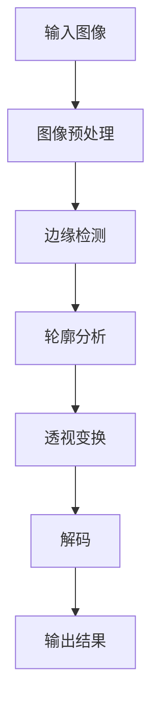

# 基于OpenCV的二维码和条形码识别

## 1.背景介绍

在当今数字化时代,二维码和条形码无处不在,它们作为一种简单有效的信息载体,广泛应用于商品追踪、支付结算、信息传递等多个领域。随着移动设备的普及和计算能力的提高,基于图像处理技术对二维码和条形码进行识别和解码已经成为一种常见的需求。OpenCV(Open Source Computer Vision Library)作为一个跨平台的计算机视觉库,提供了强大的图像处理功能,可以高效地实现二维码和条形码的识别。

## 2.核心概念与联系

### 2.1 二维码

二维码(QR Code)是一种矩阵式的二维条码,由黑白方块组成,能够编码更多的信息。二维码具有纠错能力,可以在一定程度上抵御污损和曲面形变。常见的二维码有QR Code、Data Matrix等。

### 2.2 条形码

条形码(Barcode)是将宽窄不等的多个黑条和空白间隔按照一定编码规则排列而成的机器可识别的字符信息。常见的条形码有EAN-13、UPC、Code 128等。

### 2.3 OpenCV

OpenCV是一个开源的计算机视觉和机器学习软件库,提供了多种编程语言接口,如C++、Python、Java等。它包含了图像处理、视频分析、目标检测与跟踪、机器学习等多种计算机视觉算法。

## 3.核心算法原理具体操作步骤

基于OpenCV实现二维码和条形码识别的核心算法步骤如下:

1. **图像预处理**
   - 读取输入图像
   - 转换为灰度图像
   - 应用高斯滤波等平滑滤波,降噪
   - 应用自适应阈值二值化,获得二值图像

2. **边缘检测**
   - 使用Canny算子进行边缘检测
   - 找到图像中的轮廓

3. **轮廓分析**
   - 对轮廓进行近似,获取矩形边界
   - 根据矩形边界的长宽比,过滤掉不符合条件的轮廓

4. **透视变换**
   - 对符合条件的矩形区域进行透视变换,获得正视图像

5. **解码**
   - 对正视图像使用ZBar、ZXing等解码库进行解码
   - 获取解码结果

6. **输出结果**
   - 在原始图像上绘制识别结果的边界框和解码数据
   - 显示/保存输出图像

该算法流程可以用下面的Mermaid流程图表示:



## 4.数学模型和公式详细讲解举例说明

在二维码和条形码识别算法中,涉及到一些重要的数学模型和公式,下面将对其进行详细讲解。

### 4.1 高斯滤波

高斯滤波是一种线性平滑滤波器,它通过计算图像中每个像素点的加权平均值来消除噪声。其数学表达式为:

$$
G(x,y) = \frac{1}{2\pi\sigma^2}e^{-\frac{x^2+y^2}{2\sigma^2}}
$$

其中,$(x,y)$表示像素坐标,$\sigma$是标准差,决定了高斯核的大小。较大的$\sigma$值会使图像更加模糊。

在OpenCV中,可以使用`cv2.GaussianBlur()`函数应用高斯滤波。

### 4.2 Canny边缘检测

Canny边缘检测算法是一种多步骤算法,用于从图像中提取有用的结构信息。主要步骤包括:

1. 应用高斯滤波去噪
2. 计算图像梯度的幅值和方向
3. 应用非极大值抑制,细化边缘
4. 通过滞后阈值来确定真实/假边缘

在OpenCV中,可以使用`cv2.Canny()`函数进行Canny边缘检测。

### 4.3 透视变换

透视变换是一种将图像投影到一个新的视平面的映射方法。它通过建立源图像和目标图像之间的映射关系,将源图像中的像素点变换到目标图像中的新位置。

设源图像中的一点为$P(x,y)$,目标图像中对应的点为$P'(x',y')$,透视变换可以用下面的方程表示:

$$
\begin{bmatrix}
x'\
y'\
w'
\end{bmatrix}
=
\begin{bmatrix}
p_{11} & p_{12} & p_{13}\
p_{21} & p_{22} & p_{23}\
p_{31} & p_{32} & p_{33}
\end{bmatrix}
\begin{bmatrix}
x\
y\
1
\end{bmatrix}
$$

其中,$p_{ij}$是透视变换矩阵的元素,可以通过源图像和目标图像的四对对应点来计算。$w'$是一个缩放因子。

在OpenCV中,可以使用`cv2.getPerspectiveTransform()`函数获取透视变换矩阵,再使用`cv2.warpPerspective()`函数应用透视变换。

## 5.项目实践:代码实例和详细解释说明

下面是一个使用Python和OpenCV实现二维码和条形码识别的代码示例,并对关键部分进行了详细注释说明。

```python
import cv2
import numpy as np
from pyzbar import pyzbar

# 读取输入图像
img = cv2.imread('qrcode.png')

# 预处理
gray = cv2.cvtColor(img, cv2.COLOR_BGR2GRAY)  # 转换为灰度图像
blur = cv2.GaussianBlur(gray, (5, 5), 0)  # 高斯滤波
thresh = cv2.adaptiveThresholdGaussianC(blur, 255, 1, 1, 31, 2)  # 自适应阈值二值化

# 边缘检测和轮廓查找
cnts = cv2.findContours(thresh, cv2.RETR_TREE, cv2.CHAIN_APPROX_SIMPLE)[-2]

# 遍历轮廓
for c in cnts:
    # 计算轮廓的边界框
    x, y, w, h = cv2.boundingRect(c)
    
    # 根据边界框的长宽比进行过滤
    ar = w / float(h)
    if ar < 0.5 or ar > 0.9:
        continue
        
    # 透视变换
    rect = np.zeros((4, 2), dtype="float32")
    s = np.sum(c, axis=2)
    tl = tuple(c[np.argmin(s)][0])  # 左上角
    br = tuple(c[np.argmax(s)][0])  # 右下角
    
    rect[0] = tl
    rect[2] = br
    (rect[1], rect[3]) = (br, tl)
    
    dst = np.array([[0, 0], [w - 1, 0], [w - 1, h - 1], [0, h - 1]], dtype="float32")
    M = cv2.getPerspectiveTransform(rect, dst)
    warp = cv2.warpPerspective(gray, M, (w, h))
    
    # 解码
    decoded = pyzbar.decode(warp)
    for d in decoded:
        # 在原图上绘制识别结果
        x, y, w, h = [int(v) for v in d.rect]
        cv2.rectangle(img, (x, y), (x + w, y + h), (0, 0, 255), 2)
        text = str(d.data.decode("utf-8"))
        cv2.putText(img, text, (x, y - 10), cv2.FONT_HERSHEY_SIMPLEX, 0.5, (0, 0, 255), 2)

# 显示结果图像        
cv2.imshow("Result", img)
cv2.waitKey(0)
cv2.destroyAllWindows()
```

上述代码的关键步骤说明如下:

1. **读取输入图像**并转换为灰度图像`gray`。
2. 对`gray`进行高斯滤波`blur`和自适应阈值二值化`thresh`。
3. 使用`cv2.findContours()`函数查找二值图像中的轮廓`cnts`。
4. 遍历每个轮廓`c`。
   - 计算轮廓的边界框`x, y, w, h`。
   - 根据边界框的长宽比`ar`进行过滤,排除不符合条件的轮廓。
   - 对符合条件的轮廓进行透视变换:
     - 找到轮廓的四个顶点`tl, br, rect[1], rect[3]`。
     - 计算透视变换矩阵`M`。
     - 应用透视变换,获得正视图像`warp`。
5. 使用`pyzbar.decode()`对正视图像进行解码,获取解码结果`decoded`。
6. 在原始图像`img`上绘制识别结果的边界框和解码数据。
7. 显示结果图像。

该代码示例使用了OpenCV进行图像预处理、边缘检测和透视变换,并使用了pyzbar库进行二维码和条形码的解码。它可以有效地从输入图像中识别出二维码和条形码,并在原始图像上绘制识别结果。

## 6.实际应用场景

二维码和条形码识别技术在现实生活中有着广泛的应用场景,下面列举了一些典型的应用:

1. **商品追踪和库存管理**
   在零售和供应链领域,条形码被广泛用于商品追踪和库存管理。通过扫描条形码,可以快速获取商品信息,实现自动化的库存管理和物流跟踪。

2. **支付和结算系统**
   二维码支付已经成为一种流行的移动支付方式。用户可以通过手机扫描商家的二维码进行付款,实现快捷、安全的支付体验。

3. **信息传递和连接**
   二维码可以编码各种信息,如网址、联系方式、产品介绍等。通过扫描二维码,用户可以快速获取相关信息,实现信息的高效传递和连接。

4. **票务系统**
   在电影院、景点等场所,二维码和条形码被广泛用于电子票务系统。通过扫描门票上的二维码或条形码,可以快速验证票据的真伪和有效性。

5. **物联网设备管理**
   在物联网领域,二维码和条形码可以用于设备识别和管理。通过扫描设备上的二维码或条形码,可以获取设备信息、维护记录等,实现设备的智能化管理。

6. **医疗健康领域**
   在医疗健康领域,二维码和条形码可以用于药品追踪、病历管理等。通过扫描药品包装上的二维码或条形码,可以获取药品信息,防止用药错误。

总之,二维码和条形码识别技术为各个领域带来了高效、便捷的信息获取和管理方式,极大地提高了工作效率和用户体验。

## 7.工具和资源推荐

在实现二维码和条形码识别时,可以利用一些优秀的开源工具和资源,下面列出了一些推荐:

1. **OpenCV**
   OpenCV是一个强大的开源计算机视觉库,提供了丰富的图像处理和计算机视觉算法。它支持多种编程语言,如C++、Python、Java等,是实现二维码和条形码识别的首选工具。

2. **ZBar**
   ZBar是一个开源的条形码扫描库,支持多种条形码和二维码格式。它提供了C、C++、Python等多种语言的接口,可以方便地集成到应用程序中。

3. **ZXing**
   ZXing是一个开源的二维码扫描库,最初由Google开发。它支持Java、C++、C#等多种语言,能够识别各种二维码和条形码格式。

4. **Tesseract OCR**
   Tesseract OCR是一个开源的光学字符识别引擎,可以用于从图像中提取文本信息。在某些情况下,它可以与二维码和条形码识别技术结合使用,提高识别准确性。

5. **OpenPNP**
   OpenPNP是一个开源的二维码和条形码生成库,支持多种编程语言。它可以用于生成各种格式的二维码和条形码图像,方便进行测试和调试。

6. **在线资源和社区**
   除了上述工具之外,还有许多在线资源和社区可供参考,如OpenCV官方文档、Stack Overflow等。这些资源可以提供丰富的示例代码、教程和