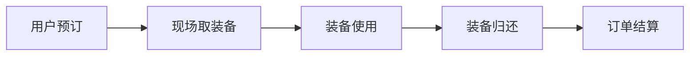

# 基于ssm滑雪场租赁系统

## 1.背景介绍

随着冰雪运动的普及和大众滑雪热情的高涨,越来越多的人选择到滑雪场享受冰雪运动的乐趣。然而,大多数滑雪爱好者并不拥有自己的滑雪装备,需要到滑雪场租赁。传统的滑雪装备租赁流程繁琐,效率低下,无法满足大批量游客的需求。因此,开发一套高效、便捷的滑雪场租赁系统势在必行。

本文将详细介绍一个基于Spring、Spring MVC和MyBatis(SSM)框架的滑雪场租赁系统。该系统采用当前流行的Java Web开发技术,实现了滑雪装备的在线预订、现场租赁、归还管理等功能,有效提升了滑雪场的服务质量和运营效率。

### 1.1 滑雪运动的发展现状

### 1.2 滑雪场租赁业务的痛点

### 1.3 信息化解决方案的必要性

## 2.核心概念与联系

在深入探讨滑雪场租赁系统的技术实现之前,我们有必要了解几个核心概念:

### 2.1 SSM框架
SSM框架是Spring、Spring MVC和MyBatis的缩写,是目前主流的Java Web开发框架。

- Spring: 提供了IoC容器和AOP等基础功能,是整个系统的核心。
- Spring MVC: 基于MVC设计模式的Web框架,负责处理HTTP请求和响应。
- MyBatis: 数据持久化框架,提供了对象关系映射(ORM)和SQL管理功能。

### 2.2 领域模型
滑雪场租赁业务中的核心领域概念包括:

- 滑雪装备: 滑雪板、滑雪鞋、滑雪杖等
- 租赁订单: 记录租赁装备的预订和借出信息
- 库存管理: 装备的入库、出库、盘点等

### 2.3 业务流程
一个典型的滑雪装备租赁业务流程如下:



## 3.核心算法原理具体操作步骤

本节将重点介绍滑雪场租赁系统的几个核心算法和操作步骤。

### 3.1 装备推荐算法
为了提高租赁装备的利用率和用户满意度,系统需要根据用户的身高、体重、滑雪水平等信息,智能推荐合适的装备。

#### 3.1.1 用户画像建模
#### 3.1.2 装备属性标注
#### 3.1.3 协同过滤算法

### 3.2 库存预测算法
滑雪场需要根据历史数据和未来天气预报,提前预测每天的装备租赁需求,合理安排装备的采购和调配。

#### 3.2.1 时间序列分析
#### 3.2.2 回归分析
#### 3.2.3 机器学习模型

### 3.3 调度优化算法
在租赁高峰期,如何有效分配有限的装备资源,最大化满足用户需求,是一个复杂的组合优化问题。

#### 3.3.1 整数规划模型
#### 3.3.2 启发式算法
#### 3.3.3 强化学习方法

## 4.数学模型和公式详细讲解举例说明

接下来,我们用数学语言来刻画上述算法中的关键模型和公式。

### 4.1 装备推荐模型

假设有m个用户和n个装备,我们用矩阵 $R=(r_{ij})_{m \times n}$ 表示用户-装备评分矩阵。其中 $r_{ij}$ 表示用户i对装备j的评分,未评分的位置用0填充。

我们的目标是估计用户i对未评分装备j的评分 $\hat{r}_{ij}$。一个经典的协同过滤模型是基于矩阵分解的潜语义模型。假设:

$$R \approx P^TQ = \hat{R}$$

其中 $P=(p_{ik})_{m \times d}, Q=(q_{kj})_{d \times n}$ 分别是用户和装备的隐语义向量。我们通过优化如下目标函数求解P和Q:

$$\min_{P,Q} \sum_{i,j}I_{ij}(r_{ij} - p_i^Tq_j)^2 + \lambda (||P||^2 + ||Q||^2)$$

其中 $I_{ij}$ 是指示函数,当 $r_{ij}>0$ 时取1,否则取0。$\lambda$ 是正则化系数。

### 4.2 库存预测模型

设滑雪场有n种装备,第i种装备在第t天的租赁量为 $x_i(t)$,我们用一个长度为T的时间序列 $\{x_i(1),\ldots,x_i(T)\}$ 来描述其历史租赁情况。

假设租赁量与过去p个时间点的观测值和q个外部因素(如天气、节假日)相关,我们可以建立如下ARIMAX模型:

$$x_i(t) = \mu_i + \sum_{k=1}^p \alpha_{ik} x_i(t-k) + \sum_{j=1}^q \beta_{ij}z_j(t) + \varepsilon_i(t)$$

其中 $\mu_i$ 是均值, $\alpha_{ik}$ 和 $\beta_{ij}$ 是自回归系数和外生变量系数, $\varepsilon_i(t)$ 是白噪声。

### 4.3 调度优化模型

我们可以用如下的整数规划模型来描述装备调度问题:

$$\max \sum_{i=1}^m \sum_{j=1}^n r_{ij}x_{ij}$$

$$s.t. \sum_{i=1}^m x_{ij} \leq s_j, \forall j=1,\ldots,n$$

$$\sum_{j=1}^n x_{ij} \leq 1, \forall i=1,\ldots,m$$

$$x_{ij} \in \{0,1\}, \forall i,j$$

其中 $x_{ij}$ 是决策变量,表示是否将装备j分配给用户i, $s_j$ 表示装备j的库存量。目标函数是最大化总体用户满意度,约束条件确保分配方案满足库存限制和用户需求。

## 5.项目实践：代码实例和详细解释说明

下面我们给出滑雪场租赁系统的部分核心代码,并进行详细的解释说明。

### 5.1 Spring配置

```xml
<!-- 装备DAO -->
<bean id="equipmentDAO" class="com.ski.dao.EquipmentDAOImpl">
    <property name="sessionFactory" ref="sessionFactory"/>
</bean>

<!-- 装备Service -->
<bean id="equipmentService" class="com.ski.service.EquipmentServiceImpl">
    <property name="equipmentDAO" ref="equipmentDAO"/>
</bean>

<!-- 装备Controller -->
<bean class="com.ski.controller.EquipmentController">
    <property name="equipmentService" ref="equipmentService"/>
</bean>
```

Spring的配置文件定义了装备管理模块的DAO、Service和Controller等组件,并通过依赖注入建立起它们之间的关联。

### 5.2 MyBatis查询

```xml
<select id="selectByCondition" parameterType="map" resultMap="equipmentResult">
    select * from tb_equipment
    <where>
        <if test="name != null">
            and name like concat('%',#{name},'%')
        </if>
        <if test="type != null">
            and type = #{type}
        </if>
    </where>
    order by id
</select>
```

这是一个MyBatis的查询语句,可以根据装备的名称和类型进行条件查询。其中 `<if>` 标签用来动态构建SQL语句。

### 5.3 业务逻辑

```java
@Service
public class EquipmentServiceImpl implements EquipmentService {

    @Autowired
    private EquipmentDAO equipmentDAO;

    @Override
    public List<Equipment> search(String name, String type) {
        Map<String, Object> param = new HashMap<>();
        param.put("name", name);
        param.put("type", type);
        return equipmentDAO.selectByCondition(param);
    }

    @Override
    public void rent(int userId, int equipId, Date startDate, Date endDate) {
        // 1.查询装备信息
        Equipment equip = equipmentDAO.selectById(equipId);

        // 2.检查库存
        if (equip.getInventory() == 0) {
            throw new NoInventoryException();
        }

        // 3.创建订单
        Order order = new Order();
        order.setUserId(userId);
        order.setEquipId(equipId);
        order.setStartDate(startDate);
        order.setEndDate(endDate);
        order.setStatus(OrderStatus.RESERVED);
        orderDAO.insert(order);

        // 4.冻结库存
        equip.setInventory(equip.getInventory() - 1);
        equip.setFrozen(equip.getFrozen() + 1);
        equipmentDAO.update(equip);
    }
}
```

这是装备租赁的核心业务逻辑,主要包括:装备查询、库存检查、订单创建、库存冻结等步骤。其中用到了Spring的声明式事务和MyBatis的数据访问。

## 6.实际应用场景

滑雪场租赁系统在实际中有广泛的应用,可以为滑雪场带来显著的管理提升和经济效益,主要体现在:

### 6.1 游客服务
- 在线预订,避免现场排队
- 装备推荐,提升满意度
- 移动支付,便捷快速

### 6.2 装备管理
- 实时盘点,掌控库存
- 自动调配,提高周转
- 数据分析,优化采购

### 6.3 营销推广
- 精准营销,锁定用户
- 拉新促活,增加复购
- 整合资源,异业联盟

## 7.工具和资源推荐

### 7.1 开发工具
- IDE: IntelliJ IDEA、Eclipse
- 项目管理: Maven、Gradle
- 版本控制: Git、SVN

### 7.2 开发框架
- Spring Boot: 快速构建Spring应用
- Dubbo: 分布式服务框架
- Shiro: 安全权限控制

### 7.3 中间件
- Redis: 分布式缓存
- RocketMQ: 消息队列
- Elasticsearch: 搜索引擎

### 7.4 学习资源
- 官方文档: [Spring](https://spring.io/projects/spring-framework)、[MyBatis](https://mybatis.org/mybatis-3/)
- 经典书籍:《Spring实战》、《MyBatis从入门到精通》、《Java核心技术》
- 视频教程: 尚硅谷SSM框架、慕课网Java开发

## 8.总结：未来发展趋势与挑战

随着人工智能、大数据、云计算、物联网等新一代信息技术的发展,滑雪场租赁系统也面临着新的机遇和挑战。未来的发展趋势主要有:

### 8.1 智能化
利用机器学习算法,实现装备推荐、需求预测、动态定价等智能化应用,提高系统的自适应性和用户体验。

### 8.2 数字化
通过射频识别(RFID)、二维码等数字化标签,实现装备的全生命周期管理和溯源,提高管理效率和安全性。

### 8.3 平台化
打通线上线下渠道,整合社交、支付、营销等服务,建设一站式的冰雪运动服务平台,实现资源共享和生态协同。

但同时,我们也要警惕一些潜在的风险和挑战:
- 数据安全和隐私保护
- 系统的可靠性和高可用性
- 业务模式的创新和可持续性

## 9.附录：常见问题与解答

### 9.1 如何提高装备的周转率?
- 优化调度算法,缩短装备的闲置时间
- 引入动态定价,提高非高峰期的使用率
- 开展装备租赁的促销活动

### 9.2 如何防止装备的丢失和损坏?
- 建立装备的信息化管理系统,动态盘点库存
- 加强用户教育,提高装备的使用意识
- 购买装备保险,降低意外损失的风险

### 9.3 如何选择合适的开发技术和架构?
- 综合考虑系统的性能、可伸缩性、安全性、成本等因素
- 充分评估团队的技术能力和项目经验
- 借鉴同行业的最佳实践和成功案例
- 适当引入新技术,但要谨慎评估其成熟度和风