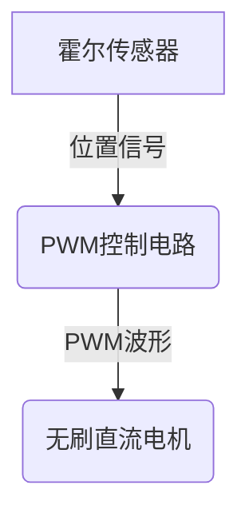
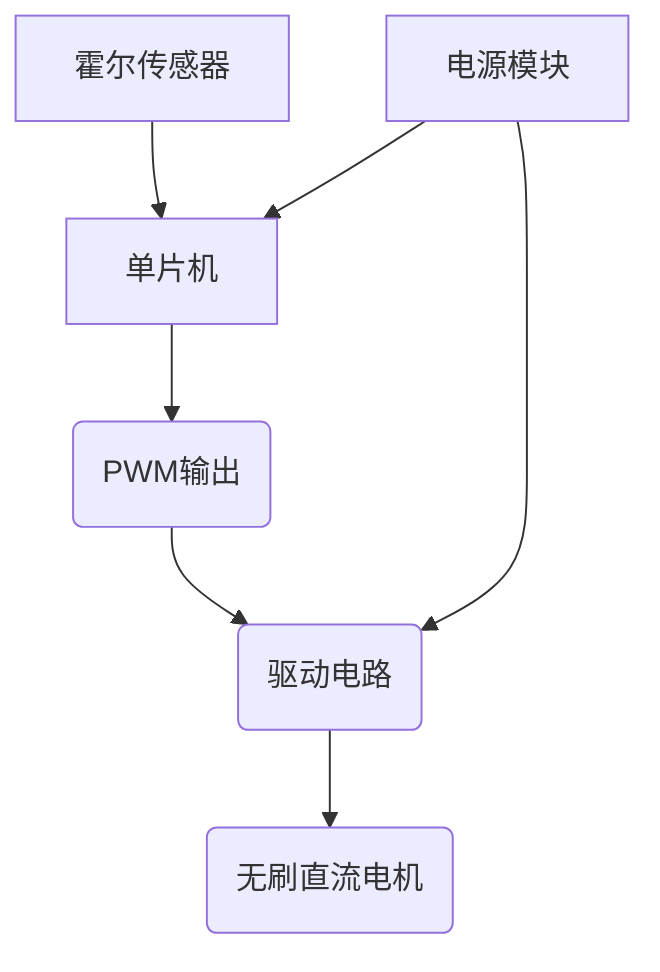

# 基于单片机霍尔PWM调速设计的设计与实现

## 1.背景介绍

在现代工业控制系统中,电机调速技术扮演着非常重要的角色。传统的电机调速方式通常采用变压器或者可控硅技术,但这些方法存在能量损耗大、控制精度低等缺陷。随着半导体技术的不断进步,基于脉冲宽度调制(PWM)的电机调速技术逐渐成为主流。

PWM调速技术的核心思想是通过改变占空比来控制电机的转速。具体来说,就是通过调节通过电机的脉冲宽度,从而改变有效电压值,进而控制电机转速。与传统方式相比,PWM调速具有高效、可控性强、噪音小等优点。

本文将重点介绍基于单片机的霍尔PWM调速设计与实现方案,阐述其工作原理、核心算法、硬件电路以及编程实现细节,为读者提供一种高效、低成本的电机调速解决方案。

## 2.核心概念与联系

### 2.1 PWM调速原理

PWM(Pulse Width Modulation)脉冲宽度调制,是一种通过改变方波的占空比来控制功率的技术。对于电机控制来说,改变通过电机的有效电压就可以控制电机的转速。

假设电源电压为$V_{cc}$,PWM的占空比为$D$,那么通过电机的有效电压为:

$$V_{eff} = D \times V_{cc}$$

因此,只需要改变占空比$D$,就可以改变有效电压$V_{eff}$,进而控制电机转速。

### 2.2 霍尔PWM调速

霍尔PWM调速是一种常用的无刷直流电机(BLDC)调速方式。它利用霍尔传感器检测电机的转子位置,根据位置信号产生对应的PWM控制信号,从而实现对电机的精确控制。



霍尔PWM调速的优点是控制精度高、响应快,适合对转速和扭矩要求较高的应用场景。

## 3.核心算法原理具体操作步骤

霍尔PWM调速的核心算法包括两个主要部分:

1. **位置检测算法**:根据霍尔传感器的输出,判断电机转子的当前位置。
2. **PWM控制算法**:根据目标转速和当前位置,计算合适的PWM占空比,并输出相应的PWM波形。

### 3.1 位置检测算法

假设使用三个霍尔传感器(Hall A/B/C),它们的输出组合可以唯一确定转子的位置,共有6种组合,如下表所示:

| Hall A | Hall B | Hall C | 电机位置 |
|--------|--------|--------|----------|
| 1      | 0      | 1      | 1        |
| 0      | 0      | 1      | 2        |
| 0      | 1      | 0      | 3        |
| 0      | 1      | 1      | 4        |
| 1      | 1      | 0      | 5        |
| 1      | 0      | 0      | 6        |

根据上表,我们可以编写位置检测函数,获取当前的电机位置。

```c
uint8_t getRotorPosition() {
    uint8_t hallState = 0;
    hallState |= (hallA ? 1 : 0) << 2;
    hallState |= (hallB ? 1 : 0) << 1;
    hallState |= (hallC ? 1 : 0);

    switch(hallState) {
        case 0b101: return 1;
        case 0b001: return 2;
        case 0b011: return 3;
        case 0b010: return 4;
        case 0b110: return 5;
        case 0b100: return 6;
        default: return 0; // Error
    }
}
```

### 3.2 PWM控制算法

PWM控制算法的目标是根据目标转速和当前位置,计算合适的PWM占空比。我们可以采用简单的线性函数进行映射:

$$
Duty = k_p \times (N_{target} - N_{current}) + k_i \sum_{i=0}^{n}(N_{target} - N_{current})
$$

其中:
- $Duty$为PWM占空比
- $N_{target}$为目标转速
- $N_{current}$为当前实际转速
- $k_p$和$k_i$分别为比例系数和积分系数,可根据实际情况调整

该算法的核心思路是:如果目标转速大于当前转速,则增大占空比;反之则减小占空比。通过不断调整,可以使实际转速趋近于目标转速。

```c
int32_t targetSpeed = 1000; // 目标转速 1000rpm
int32_t currentSpeed = 0;   // 当前转速
int32_t lastError = 0;
int32_t integral = 0;

// PID参数
float kp = 0.5;
float ki = 0.01;

uint16_t computePWMDuty() {
    int32_t error = targetSpeed - currentSpeed;
    integral += error;

    // 防止积分饱和
    if(integral > 10000) integral = 10000;
    else if(integral < -10000) integral = -10000;

    int32_t duty = kp * error + ki * integral;

    // 限制占空比范围
    if(duty > 1000) duty = 1000;
    else if(duty < 0) duty = 0;

    return (uint16_t)duty;
}
```

该算法的优点是简单、高效,但缺点是参数调节困难,可能需要一些实验调试。读者也可以尝试其他更复杂的控制算法,如卡尔曼滤波等。

## 4.数学模型和公式详细讲解举例说明

在霍尔PWM调速系统中,我们需要建立电机转速与PWM占空比之间的数学模型,以便进行控制。

### 4.1 电机转速模型

对于无刷直流电机,其转速可以近似表示为:

$$
N = \frac{60}{2\pi} \cdot \frac{V_a - I_aR_a}{K_e}
$$

其中:
- $N$为电机转速(rpm)
- $V_a$为电机端电压(V)
- $I_a$为电机电流(A)
- $R_a$为电机绕组电阻($\Omega$)
- $K_e$为电机反电动势常数(V/rad/s)

根据之前的分析,电机端电压$V_a$与PWM占空比$D$和电源电压$V_{cc}$的关系为:

$$
V_a = D \times V_{cc}
$$

将其代入转速公式,我们得到:

$$
N = \frac{60}{2\pi} \cdot \frac{DV_{cc} - I_aR_a}{K_e}
$$

该公式反映了电机转速与PWM占空比、电源电压等参数之间的关系。

### 4.2 PWM占空比控制

为了控制电机达到目标转速$N_{target}$,我们需要求解合适的PWM占空比$D$。将$N_{target}$代入上式,可得:

$$
D = \frac{N_{target}K_e + I_aR_a}{60V_{cc}} \cdot \frac{2\pi}{60}
$$

其中$I_a$和$R_a$是已知的电机参数,$K_e$可以通过实验测量获得。

因此,只要给定目标转速$N_{target}$,我们就可以根据上式计算出所需的PWM占空比$D$,并将其设置到PWM控制电路中,即可实现对电机转速的控制。

需要注意的是,上述公式是理想情况下的近似模型,在实际应用中可能会受到各种干扰因素的影响,因此我们往往需要在模型的基础上引入反馈控制,以提高控制精度和抗干扰能力。

## 5.项目实践:代码实例和详细解释说明

### 5.1 硬件电路



上图是一个典型的基于单片机的霍尔PWM调速系统硬件电路框图。

- 单片机:负责读取霍尔传感器信号,并根据控制算法输出PWM波形。
- 驱动电路:将单片机的PWM信号放大为足够的电流和电压,驱动无刷直流电机。
- 电源模块:为单片机和驱动电路提供所需电压。
- 霍尔传感器:安装在电机上,用于检测转子位置。

### 5.2 软件实现

```c
#include <stdio.h>
#include <stdint.h>

// 霍尔传感器输入引脚
#define HALL_A_PIN  PINx
#define HALL_B_PIN  PINy
#define HALL_C_PIN  PINz

// PWM输出引脚
#define PWM_OUT_PIN PWMx

// 目标转速(rpm)
#define TARGET_SPEED 1000

// PID参数
float kp = 0.5;
float ki = 0.01;

// 全局变量
int32_t currentSpeed = 0;
int32_t lastError = 0;
int32_t integral = 0;

// 读取霍尔传感器状态
uint8_t readHallState() {
    uint8_t state = 0;
    state |= (HALL_A_PIN ? 1 : 0) << 2;
    state |= (HALL_B_PIN ? 1 : 0) << 1;
    state |= (HALL_C_PIN ? 1 : 0);
    return state;
}

// 根据霍尔状态获取转子位置
uint8_t getRotorPosition(uint8_t hallState) {
    switch(hallState) {
        case 0b101: return 1;
        case 0b001: return 2;
        ...
        default: return 0; // Error
    }
}

// 计算PWM占空比
uint16_t computePWMDuty() {
    int32_t error = TARGET_SPEED - currentSpeed;
    integral += error;

    // 防止积分饱和
    if(integral > 10000) integral = 10000;
    else if(integral < -10000) integral = -10000;

    int32_t duty = kp * error + ki * integral;

    // 限制占空比范围
    if(duty > 1000) duty = 1000;
    else if(duty < 0) duty = 0;

    return (uint16_t)duty;
}

// 主循环
int main() {
    uint8_t hallState, rotorPos;
    uint16_t pwmDuty;

    while(1) {
        // 读取霍尔传感器状态
        hallState = readHallState();

        // 获取转子位置
        rotorPos = getRotorPosition(hallState);

        // 根据位置计算PWM占空比
        pwmDuty = computePWMDuty();

        // 设置PWM输出
        setPWM(PWM_OUT_PIN, pwmDuty);

        // 更新当前转速
        currentSpeed = getSpeed();
    }
}
```

上面是一个简化的C语言代码示例,展示了如何在单片机上实现霍尔PWM调速控制。主要步骤包括:

1. 读取霍尔传感器状态,获取转子位置。
2. 根据目标转速和当前转速,计算PWM占空比。
3. 设置PWM输出引脚的占空比。
4. 更新当前实际转速。

代码中使用了PID控制算法来计算PWM占空比,读者也可以根据实际需求替换为其他控制算法。

需要注意的是,上述代码只是一个简化的示例,在实际项目中可能还需要考虑中断处理、错误处理、调试接口等多方面的内容。

## 6.实际应用场景

霍尔PWM调速技术在工业控制、家用电器、新能源汽车等多个领域都有广泛的应用。

### 6.1 数控机床

在数控机床中,需要对主轴电机进行精确的转速控制,以确保加工精度。霍尔PWM调速技术可以满足这一需求,实现高精度、高响应的电机控制。

### 6.2 洗衣机

洗衣机的洗涤和脱水过程需要对电机进行不同速度的控制。基于霍尔PWM的调速系统可以实现平稳的加速、减速,延长电机使用寿命。

### 6.3 新能源汽车

在新能源汽车中,驱动电机的转速控制直接影响到车辆的动力性能。霍尔PWM调速技术可以为电机提供精准的转矩控制,提高能量利用效率。

### 6.4 风力发电机

大型风力