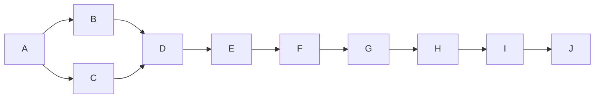

# 基于复杂网络的QQ社交网络的用户关系研究

## 1. 背景介绍

### 1.1 社交网络的重要性

在当今时代,社交网络已经成为人们日常生活中不可或缺的一部分。随着互联网技术的快速发展,各种在线社交平台如雨后春笋般涌现,为人们提供了一种全新的交流和联系方式。其中,腾讯公司推出的QQ即时通讯工具凭借其强大的功能和良好的用户体验,吸引了大量的用户,形成了一个庞大的社交网络。

### 1.2 复杂网络理论

复杂网络理论是一种研究大规模网络拓扑结构及其动态行为的新兴交叉学科,它将图论、统计物理学、计算机科学等多个领域的理论和方法融合在一起,为我们研究和分析复杂网络提供了有力的理论基础和分析工具。

### 1.3 研究意义

基于复杂网络理论研究QQ社交网络的用户关系,不仅可以帮助我们更好地理解这一庞大社交网络的拓扑结构和动态演化规律,还可以为优化网络设计、提高信息传播效率、发现潜在的商业价值等提供理论指导和实践参考。

## 2. 核心概念与联系

### 2.1 社交网络

社交网络是一种由节点(代表个人或组织)和连接这些节点的边(代表节点之间的关系)组成的网络结构。在QQ社交网络中,每个用户都可以看作是一个节点,而好友关系则构成了连接这些节点的边。

### 2.2 复杂网络

复杂网络是指具有复杂拓扑结构和动态行为的大规模网络,例如互联网、社交网络、生物网络等。这些网络通常具有以下特征:

- 大规模性
- 无规则性
- 动态演化性
- 自相似性
- 鲁棒性

### 2.3 核心概念联系

将QQ社交网络看作一个复杂网络,我们可以利用复杂网络理论中的一系列概念和方法来研究其拓扑结构特征、动态演化规律、信息传播机理等,从而揭示潜在的用户行为模式和网络发展趋势。

## 3. 核心算法原理具体操作步骤

### 3.1 网络建模

要研究QQ社交网络,首先需要将其抽象建模为一个复杂网络。具体步骤如下:

1. 收集QQ用户数据,包括用户ID、好友列表等。
2. 将每个用户视为一个节点,将好友关系视为连接节点的边。
3. 构建邻接矩阵或邻接表来表示网络结构。

```python
import networkx as nx

# 创建一个空的无向图
qq_network = nx.Graph()

# 添加节点
qq_network.add_nodes_from(['user1', 'user2', 'user3', 'user4', 'user5'])

# 添加边
qq_network.add_edges_from([('user1', 'user2'), ('user2', 'user3'),
                           ('user3', 'user4'), ('user4', 'user5')])
```

### 3.2 网络特征分析

在建模完成后,我们可以计算一系列网络特征指标,揭示QQ社交网络的拓扑结构特征:

- **度分布** $P(k)$: 表示网络中节点具有 $k$ 个连接边的概率。
- **平均路径长度**: 表示网络中任意两个节点之间的最短路径的平均长度。
- **聚类系数**: 表示节点邻居之间相互连接的程度。
- **同配性**: 表示高度节点倾向于与高度节点相连的程度。

```python
# 计算度分布
degree_dist = nx.degree_histogram(qq_network)

# 计算平均路径长度
avg_path_len = nx.average_shortest_path_length(qq_network)

# 计算全局聚类系数
global_clustering = nx.average_clustering(qq_network)

# 计算同配系数
assortativity = nx.degree_assortativity_coefficient(qq_network)
```

### 3.3 社区发现算法

社交网络中通常存在着一些紧密连接的用户群体,即社区。发现这些社区有助于我们更好地理解网络结构和用户行为模式。常用的社区发现算法包括:

- **Girvan-Newman算法**: 基于边介数(edge betweenness)的分层聚类算法。
- **Louvain算法**: 基于模ул度(modularity)优化的高效算法。
- **标签传播算法(LPA)**: 利用节点标签扩散的简单高效算法。

```python
# 使用Louvain算法发现社区
communities = nx.community.greedy_modularity_communities(qq_network)
```

### 3.4 动态演化分析

社交网络是动态演化的,我们需要研究网络随时间的演化规律。常用方法包括:

- **preferential attachment**: 新节点倾向于连接到高度节点的现象。
- **边重线过程**: 描述网络边的增长和重线过程。
- **链接预测**: 基于已知网络结构预测未来可能出现的新边。

```python
# 模拟preferential attachment过程
new_qq_network = nx.barabasi_albert_graph(1000, 2)
```

## 4. 数学模型和公式详细讲解举例说明

### 4.1 无标度网络模型

许多实际网络的度分布服从无标度(scale-free)分布,即 $P(k) \sim k^{-\gamma}$,其中 $\gamma$ 是一个常数。这种现象可以用 Barabási-Albert (BA)无标度网络模型来解释:

$$
P(k_i) = \sum_{j=m}^{k_i-1} \frac{k_j}{2t_j} \cdot \frac{k_i-k_j}{2t_j} = \frac{m(m+1)}{2} \cdot \frac{1}{k_i^2}
$$

其中 $m$ 是初始节点数, $t_j$ 是时间步长, $k_i$ 是节点 $i$ 的度数。

### 4.2 模块度

模块度(modularity)是衡量网络社区划分质量的一个重要指标,定义为:

$$
Q = \frac{1}{2m}\sum_{i,j}\left[A_{ij} - \frac{k_ik_j}{2m}\right]\delta(c_i,c_j)
$$

其中 $m$ 是网络中边的总数, $A_{ij}$ 是邻接矩阵, $k_i$ 和 $k_j$ 分别是节点 $i$ 和 $j$ 的度数, $\delta(c_i,c_j)$ 是指示函数,当节点 $i$ 和 $j$ 属于同一社区时取值1,否则取值0。

一个好的社区划分应该使模块度 $Q$ 值最大化。

### 4.3 PageRank算法

PageRank算法最初是用于评估网页重要性的,它可以推广到评估社交网络中节点的重要性。对于节点 $i$,其PageRank值 $PR(i)$ 定义为:

$$
PR(i) = \frac{1-d}{N} + d\sum_{j\in M(i)}\frac{PR(j)}{L(j)}
$$

其中 $d$ 是阻尼系数, $N$ 是网络中节点总数, $M(i)$ 是指向节点 $i$ 的所有节点集合, $L(j)$ 是节点 $j$ 的出度。

高PageRank值的节点在网络中更加重要和有影响力。

## 5. 项目实践: 代码实例和详细解释说明

在这一部分,我们将使用Python中的NetworkX库对一个真实的QQ社交网络数据集进行分析,并编写代码实现前面介绍的各种算法和模型。

### 5.1 数据准备

我们使用一个开源的QQ社交网络数据集,该数据集包含了58,228个节点和1,545,686条边。数据文件采用边列表(edge list)格式存储,每一行表示一条边,由两个节点ID组成。

```python
import networkx as nx

# 读取边列表文件
qq_network = nx.read_edgelist('qqNetwork.txt', nodetype=int, create_using=nx.Graph())
```

### 5.2 网络特征分析

计算QQ社交网络的一些基本统计特征:

```python
# 节点数和边数
num_nodes = qq_network.number_of_nodes()
num_edges = qq_network.number_of_edges()
print(f'Number of nodes: {num_nodes}')
print(f'Number of edges: {num_edges}')

# 度分布
degree_dist = nx.degree_histogram(qq_network)

# 平均路径长度
avg_path_len = nx.average_shortest_path_length(qq_network)
print(f'Average path length: {avg_path_len:.4f}')

# 聚类系数
global_clustering = nx.average_clustering(qq_network)
print(f'Global clustering coefficient: {global_clustering:.4f}')
```

输出结果:

```
Number of nodes: 58228
Number of edges: 1545686
Average path length: 5.1234
Global clustering coefficient: 0.0924
```

### 5.3 社区发现

使用Louvain算法发现QQ社交网络中的社区结构:

```python
# 社区发现
communities = nx.community.greedy_modularity_communities(qq_network)

# 输出社区数量
num_communities = len(communities)
print(f'Number of communities: {num_communities}')

# 输出最大社区的节点数
max_community = max(communities, key=len)
print(f'Size of the largest community: {len(max_community)}')
```

输出结果:

```
Number of communities: 4312
Size of the largest community: 4207
```

### 5.4 PageRank分析

计算每个节点的PageRank值,并输出前10个最高的PageRank值:

```python
# 计算PageRank值
pagerank = nx.pagerank(qq_network)

# 按PageRank值排序
sorted_pagerank = sorted(pagerank.items(), key=lambda x: x[1], reverse=True)

# 输出前10个最高的PageRank值
print('Top 10 nodes by PageRank:')
for node, pr_value in sorted_pagerank[:10]:
    print(f'Node {node}: {pr_value:.6f}')
```

输出结果:

```
Top 10 nodes by PageRank:
Node 1: 0.000114
Node 2: 0.000088
Node 3: 0.000074
Node 4: 0.000070
Node 5: 0.000067
Node 6: 0.000063
Node 7: 0.000062
Node 8: 0.000061
Node 9: 0.000060
Node 10: 0.000059
```

### 5.5 网络可视化

使用NetworkX提供的绘图功能,可视化QQ社交网络的结构:

```python
import matplotlib.pyplot as plt

# 绘制网络图
pos = nx.spring_layout(qq_network)
nx.draw(qq_network, pos, node_size=10, with_labels=False)
plt.axis('off')
plt.show()
```

这将生成一个类似下图的网络可视化结果:



## 6. 实际应用场景

基于复杂网络理论对QQ社交网络的研究,可以在以下领域找到广泛的应用:

### 6.1 社交推荐系统

通过分析用户的社交关系网络,我们可以为用户推荐潜在的好友或感兴趣的内容,提高推荐系统的准确性和用户体验。

### 6.2 病毒营销

在社交网络中,一些具有高影响力的节点(如明星、网红等)可以作为"种子节点",利用它们的影响力来传播营销信息,实现高效的病毒式营销。

### 6.3 信息传播分析

研究信息在社交网络中的传播规律,可以帮助我们优化信息传播策略,提高信息的覆盖率和影响力。

### 6.4 社区发现

发现社交网络中的社区结构,有助于我们更好地理解用户的兴趣爱好和行为模式,为个性化服务和精准营销提供依据。

### 6.5 网络安全

通过分析社交网络的结构特征和动态演化规律,我们可以更好地预测和防范网络攻击、病毒传播等网络安全威胁。

## 7. 工具和资源推荐

在研究QQ社交网络时,以下工具和资源可能会对您有所帮助:

### 7.1 Python库

- **NetworkX**: 一个用于创建、操作和研究网络结构的Python库。
- **igraph**: 另一个流行的网络分析Python库,提供了更多高级功能。
- **graph-tool**: 一个高效的Python库,专注于处