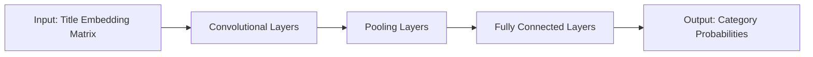

# 基于深度神经网络的标题分类研究

## 1. 背景介绍

### 1.1 标题分类的重要性

在当今信息爆炸的时代,标题分类在各个领域都扮演着至关重要的角色。无论是新闻门户网站、社交媒体平台,还是学术论文数据库,准确高效地对海量标题进行分类,对于提升用户体验、优化信息检索、促进知识发现都有着重大意义。

### 1.2 传统标题分类方法的局限性

传统的标题分类方法主要包括:

- 基于规则的方法:人工定义一系列规则,根据标题中的关键词、句法结构等特征进行分类。这种方法灵活性差,泛化能力有限,难以应对复杂多变的标题。
- 基于机器学习的方法:利用支持向量机(SVM)、朴素贝叶斯等经典机器学习算法,通过人工特征工程提取标题特征,再训练分类器。这类方法对领域知识依赖性强,特征表示能力不足。

### 1.3 深度学习在标题分类中的优势

近年来,深度学习技术的蓬勃发展为标题分类带来了新的突破。相比传统方法,基于深度神经网络的标题分类具有以下优势:

- 自动学习特征表示:深度神经网络能够自动学习标题的多层次、分布式特征表示,无需耗时费力的人工特征工程。
- 强大的建模能力:得益于深度模型的强大拟合能力,深度神经网络能够挖掘标题中蕴含的复杂语义信息和上下文关系。
- 端到端的学习范式:深度学习实现了从原始标题文本到分类标签的端到端学习,简化了流程,提高了效率。

## 2. 核心概念与联系

### 2.1 词嵌入(Word Embedding)

词嵌入是将词语映射为实值稠密向量的技术,能够有效捕捉词语之间的语义关系。常见的词嵌入模型包括Word2Vec、GloVe等。在标题分类任务中,词嵌入作为神经网络的输入,将离散的词语转化为连续的向量表示。

### 2.2 循环神经网络(RNN)

RNN是一类适合处理序列数据的神经网络模型。对于标题这种顺序文本,RNN能够捕捉其中的上下文信息和长距离依赖关系。常见的RNN变体有LSTM和GRU,能够缓解梯度消失问题,实现长期记忆。

### 2.3 卷积神经网络(CNN)

CNN在图像领域取得了巨大成功,其局部感受野和权值共享的特性也被引入到文本分类中。TextCNN使用一维卷积操作,能够自动提取标题中的关键n-gram特征,捕捉局部语义信息。

### 2.4 注意力机制(Attention Mechanism)

注意力机制源于人类视觉注意力机制,能够让模型根据任务目标,自适应地分配不同权重给输入序列的不同部分。在标题分类中,注意力机制可以帮助模型聚焦于标题中的关键词汇和决定性片段,提升分类性能。

### 2.5 模型融合(Model Ensemble)

模型融合是将多个基础模型的预测结果结合起来,提升整体性能的策略。在标题分类任务中,可以训练多个异构的深度模型(如CNN、RNN),再使用投票或加权平均等方式进行融合,从而得到更加鲁棒和准确的分类结果。

## 3. 核心算法原理具体操作步骤

下面以TextCNN为例,详细阐述基于深度神经网络进行标题分类的核心算法原理和操作步骤。

### 3.1 输入表示

1. 将标题中的每个词语映射为预训练的词向量(如Word2Vec),得到标题的词嵌入矩阵。
2. 对词嵌入矩阵进行零填充(padding),使得所有标题的长度统一。

### 3.2 卷积层

1. 使用不同尺寸的一维卷积核在词嵌入矩阵上滑动,提取n-gram特征。
2. 对卷积结果应用ReLU激活函数,引入非线性。

### 3.3 池化层

1. 对卷积层的输出进行最大池化操作,提取最重要的特征。
2. 池化结果拼接成一个固定长度的特征向量。

### 3.4 全连接层

1. 将池化层输出的特征向量输入到全连接层。
2. 使用Dropout正则化技术,随机屏蔽部分神经元,防止过拟合。

### 3.5 输出层

1. 全连接层的输出通过Softmax函数归一化,得到各个类别的概率分布。
2. 选取概率最大的类别作为预测结果。

### 3.6 训练与优化

1. 使用交叉熵损失函数衡量预测概率分布与真实标签分布的差异。
2. 利用反向传播算法计算梯度,并使用优化器(如Adam)更新模型参数。
3. 迭代进行多个epoch,直到模型收敛或达到预设的早停条件。



## 4. 数学模型和公式详细讲解举例说明

### 4.1 词嵌入层

假设标题中有$n$个词语,词嵌入维度为$d$,词嵌入矩阵可表示为:

$$E = [e_1, e_2, ..., e_n] \in \mathbb{R}^{d \times n}$$

其中,$e_i \in \mathbb{R}^d$为第$i$个词语对应的词向量。

### 4.2 卷积层

令卷积核的宽度为$h$,卷积操作可表示为:

$$c_i = f(W \cdot E_{i:i+h-1} + b)$$

其中,$W \in \mathbb{R}^{d \times h}$为卷积核参数,$b \in \mathbb{R}$为偏置项,$f$为ReLU激活函数。

### 4.3 池化层

对卷积结果进行最大池化:

$$\hat{c} = \max_{i} c_i$$

将不同卷积核的池化结果拼接为特征向量:

$$z = [\hat{c}_1, \hat{c}_2, ..., \hat{c}_m]$$

其中,$m$为卷积核的数量。

### 4.4 全连接层与输出层

特征向量$z$通过全连接层和Softmax函数转化为类别概率分布:

$$p(y_j|x) = \frac{\exp(w_j^T z + b_j)}{\sum_{k=1}^K \exp(w_k^T z + b_k)}$$

其中,$y_j$为第$j$个类别,$w_j$和$b_j$为对应的权重和偏置,$K$为总类别数。

### 4.5 损失函数与优化

使用交叉熵损失函数:

$$J(\theta) = -\frac{1}{N} \sum_{i=1}^N \sum_{j=1}^K y_{ij} \log p(y_j|x_i)$$

其中,$\theta$为模型参数,$N$为训练样本数,$y_{ij}$为样本$i$在类别$j$上的真实标签。

利用梯度下降法最小化损失函数:

$$\theta := \theta - \alpha \nabla_\theta J(\theta)$$

其中,$\alpha$为学习率。

## 5. 项目实践：代码实例和详细解释说明

下面使用PyTorch框架实现一个简单的TextCNN模型,对标题进行分类。

```python
import torch
import torch.nn as nn
import torch.nn.functional as F

class TextCNN(nn.Module):
    def __init__(self, vocab_size, embedding_dim, num_classes, filter_sizes, num_filters):
        super(TextCNN, self).__init__()
        self.embedding = nn.Embedding(vocab_size, embedding_dim)
        self.convs = nn.ModuleList([
            nn.Conv2d(1, num_filters, (fs, embedding_dim)) for fs in filter_sizes
        ])
        self.fc = nn.Linear(len(filter_sizes) * num_filters, num_classes)

    def forward(self, x):
        x = self.embedding(x)  # [batch_size, seq_len, embedding_dim]
        x = x.unsqueeze(1)  # [batch_size, 1, seq_len, embedding_dim]
        x = [F.relu(conv(x)).squeeze(3) for conv in self.convs]  # [batch_size, num_filters, seq_len - fs + 1] * len(filter_sizes)
        x = [F.max_pool1d(i, i.size(2)).squeeze(2) for i in x]  # [batch_size, num_filters] * len(filter_sizes)
        x = torch.cat(x, 1)  # [batch_size, num_filters * len(filter_sizes)]
        logits = self.fc(x)  # [batch_size, num_classes]
        return logits
```

- `__init__`方法定义了模型的架构,包括词嵌入层、卷积层、全连接层等。
- `forward`方法定义了前向传播过程:
  - 将输入的词索引序列通过词嵌入层转化为词向量序列。
  - 在词向量序列上应用不同尺寸的卷积核,提取n-gram特征。
  - 对卷积结果进行最大池化,得到各个卷积核的最重要特征。
  - 将不同卷积核的特征拼接起来,通过全连接层得到最终的类别预测。

在训练过程中,将标题输入模型,计算预测结果与真实标签的交叉熵损失,并使用优化器更新模型参数,直到模型收敛。

## 6. 实际应用场景

基于深度神经网络的标题分类技术可应用于以下实际场景:

### 6.1 新闻分类

对新闻网站的海量文章标题进行自动分类,如政治、经济、体育等,方便用户快速定位感兴趣的新闻内容,提升用户体验。

### 6.2 社交媒体话题分类

对社交平台上的帖子标题进行话题分类,如美食、旅游、时尚等,便于话题的聚合、推荐和趋势分析,增强社区互动。

### 6.3 学术论文分类

对学术论文的标题进行学科领域分类,如计算机科学、生物医学、材料科学等,辅助用户快速检索相关研究成果,促进学术交流。

### 6.4 电商产品分类

对电商平台的商品标题进行类目划分,如电子产品、服装、家居等,优化产品组织结构,方便用户查找和比较商品,提高购物效率。

### 6.5 客服问题分类

对客服系统收到的大量问题标题进行自动分类,如账号、支付、物流等,帮助客服人员迅速了解问题类型,提供精准解答,提升服务质量。

## 7. 工具和资源推荐

以下是一些常用的深度学习框架和自然语言处理工具库,可用于标题分类任务:

- PyTorch: 动态建图的深度学习框架,使用简洁灵活,适合研究和实验。
- TensorFlow: 静态建图的深度学习框架,社区生态丰富,产业应用广泛。
- Keras: 高层次的深度学习框架,提供了友好的API,可快速搭建模型。
- spaCy: 先进的自然语言处理库,提供了丰富的预训练模型和语言特征。
- NLTK: 自然语言处理工具包,涵盖了文本预处理、词性标注、句法分析等常用功能。
- Gensim: 专注于主题建模的自然语言处理库,支持Word2Vec、FastText等词嵌入方法。
- 中文预训练词向量:
  - 腾讯AI Lab开源的中文词向量:https://ai.tencent.com/ailab/nlp/zh/embedding.html
  - 中文维基百科训练的Word2Vec词向量:https://github.com/Embedding/Chinese-Word-Vectors
  - 使用海量中文语料训练的FastText词向量:https://github.com/Babylonpartners/fastText_multilingual

## 8. 总结：未来发展趋势与挑战

基于深度神经网络的标题分类技术在准确性和效率上已经取得了显著进步,但仍然存在一些挑战和未来发展方向:

### 8.1 少样本学习

现有方法通常需要大量标注数据进行训练,但在实际应用中,某些类别的样本数量可能非常有限。如何利用少量样本