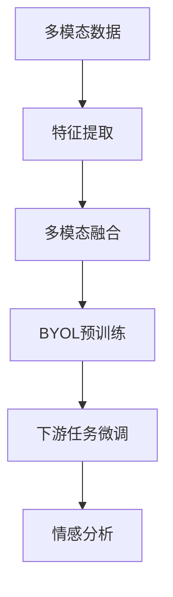

# 多模态BYOL在情感分析中的应用

## 1. 背景介绍
### 1.1 情感分析的重要性
#### 1.1.1 商业应用
#### 1.1.2 社交媒体监测
#### 1.1.3 舆情分析

### 1.2 多模态情感分析的兴起
#### 1.2.1 单模态的局限性
#### 1.2.2 多模态的优势
#### 1.2.3 多模态情感分析的研究进展

### 1.3 BYOL的出现
#### 1.3.1 自监督学习的发展
#### 1.3.2 BYOL的提出
#### 1.3.3 BYOL在计算机视觉领域的应用

## 2. 核心概念与联系
### 2.1 情感分析
#### 2.1.1 情感分析的定义
#### 2.1.2 情感分析的分类
#### 2.1.3 情感分析的评估指标

### 2.2 多模态学习
#### 2.2.1 多模态学习的定义
#### 2.2.2 多模态融合的方法
#### 2.2.3 多模态表示学习

### 2.3 自监督学习
#### 2.3.1 自监督学习的定义
#### 2.3.2 自监督学习的优势
#### 2.3.3 常见的自监督学习方法

### 2.4 BYOL
#### 2.4.1 BYOL的原理
#### 2.4.2 BYOL的网络结构
#### 2.4.3 BYOL的损失函数

### 2.5 多模态BYOL
#### 2.5.1 多模态BYOL的动机
#### 2.5.2 多模态BYOL的框架
#### 2.5.3 多模态BYOL在情感分析中的应用



## 3. 核心算法原理具体操作步骤
### 3.1 多模态特征提取
#### 3.1.1 文本特征提取
#### 3.1.2 视觉特征提取
#### 3.1.3 音频特征提取

### 3.2 多模态融合
#### 3.2.1 特征级融合
#### 3.2.2 决策级融合
#### 3.2.3 注意力机制

### 3.3 BYOL预训练
#### 3.3.1 正负样本对构建
#### 3.3.2 在线网络和目标网络
#### 3.3.3 对比损失函数

### 3.4 下游任务微调
#### 3.4.1 情感分类任务
#### 3.4.2 微调策略
#### 3.4.3 模型评估

## 4. 数学模型和公式详细讲解举例说明
### 4.1 多模态特征表示
#### 4.1.1 文本特征表示
文本特征可以用词向量 $w_i \in \mathbb{R}^d$ 来表示，其中 $d$ 是词向量的维度。给定一个文本序列 $\{w_1, w_2, ..., w_n\}$，可以使用RNN、CNN等模型来提取文本特征 $\mathbf{h}_t \in \mathbb{R}^{d_t}$。

#### 4.1.2 视觉特征表示
对于图像 $\mathbf{I}$，可以使用预训练的CNN模型（如ResNet）提取其视觉特征 $\mathbf{h}_v \in \mathbb{R}^{d_v}$。

#### 4.1.3 音频特征表示
音频信号可以先转化为频谱图 $\mathbf{S}$，然后使用CNN模型提取音频特征 $\mathbf{h}_a \in \mathbb{R}^{d_a}$。

### 4.2 多模态融合
#### 4.2.1 特征级融合
特征级融合是将不同模态的特征拼接或相加得到多模态联合表示。例如：

$$\mathbf{h}_m = [\mathbf{h}_t; \mathbf{h}_v; \mathbf{h}_a]$$

或

$$\mathbf{h}_m = \mathbf{h}_t + \mathbf{h}_v + \mathbf{h}_a$$

其中 $\mathbf{h}_m \in \mathbb{R}^{d_m}$ 是多模态联合表示，$d_m = d_t + d_v + d_a$。

#### 4.2.2 注意力机制
注意力机制可以自适应地为不同模态分配权重。例如，对于第 $i$ 个模态，其注意力权重为：

$$\alpha_i = \frac{\exp(\mathbf{w}_i^\top \mathbf{h}_i)}{\sum_{j=1}^M \exp(\mathbf{w}_j^\top \mathbf{h}_j)}$$

其中 $\mathbf{w}_i$ 是可学习的参数向量，$M$ 是模态数。多模态联合表示为：

$$\mathbf{h}_m = \sum_{i=1}^M \alpha_i \mathbf{h}_i$$

### 4.3 BYOL损失函数
BYOL的损失函数为：

$$\mathcal{L}_{\theta, \xi} = \mathbb{E}_{\mathbf{x} \sim \mathcal{D}} \left[ \left\| \bar{q}_{\theta}(\mathbf{x}) - \bar{z}_{\xi}(\mathbf{x}) \right\|_2^2 \right]$$

其中 $\mathbf{x}$ 是从数据分布 $\mathcal{D}$ 中采样的样本，$\bar{q}_{\theta}(\mathbf{x})$ 是 $l_2$ 归一化的在线网络输出，$\bar{z}_{\xi}(\mathbf{x})$ 是 $l_2$ 归一化的目标网络输出。

目标网络的参数 $\xi$ 通过指数移动平均（EMA）更新：

$$\xi \leftarrow \tau \xi + (1 - \tau) \theta$$

其中 $\tau \in [0, 1]$ 是 EMA 的衰减率。

## 5. 项目实践：代码实例和详细解释说明
下面是使用PyTorch实现多模态BYOL用于情感分析的示例代码：

```python
import torch
import torch.nn as nn
import torch.nn.functional as F

# 文本特征提取器
class TextEncoder(nn.Module):
    def __init__(self, vocab_size, embed_dim, hidden_dim):
        super().__init__()
        self.embedding = nn.Embedding(vocab_size, embed_dim)
        self.lstm = nn.LSTM(embed_dim, hidden_dim, batch_first=True)

    def forward(self, x):
        x = self.embedding(x)
        _, (h, _) = self.lstm(x)
        return h.squeeze(0)

# 视觉特征提取器
class ImageEncoder(nn.Module):
    def __init__(self, pretrained=True):
        super().__init__()
        model = torchvision.models.resnet50(pretrained=pretrained)
        self.features = nn.Sequential(*list(model.children())[:-1])

    def forward(self, x):
        x = self.features(x)
        x = x.view(x.size(0), -1)
        return x

# 音频特征提取器
class AudioEncoder(nn.Module):
    def __init__(self):
        super().__init__()
        self.conv1 = nn.Conv2d(1, 32, 3, stride=1, padding=1)
        self.conv2 = nn.Conv2d(32, 64, 3, stride=1, padding=1)
        self.conv3 = nn.Conv2d(64, 128, 3, stride=1, padding=1)
        self.fc = nn.Linear(128 * 5 * 4, 512)

    def forward(self, x):
        x = F.relu(self.conv1(x))
        x = F.max_pool2d(x, 2)
        x = F.relu(self.conv2(x))
        x = F.max_pool2d(x, 2)
        x = F.relu(self.conv3(x))
        x = F.max_pool2d(x, 2)
        x = x.view(x.size(0), -1)
        x = self.fc(x)
        return x

# 多模态融合
class MultimodalFusion(nn.Module):
    def __init__(self, text_dim, image_dim, audio_dim, hidden_dim):
        super().__init__()
        self.text_layer = nn.Linear(text_dim, hidden_dim)
        self.image_layer = nn.Linear(image_dim, hidden_dim)
        self.audio_layer = nn.Linear(audio_dim, hidden_dim)
        self.attention = nn.Linear(hidden_dim, 1)

    def forward(self, text, image, audio):
        text = self.text_layer(text)
        image = self.image_layer(image)
        audio = self.audio_layer(audio)

        attn_text = self.attention(text)
        attn_image = self.attention(image)
        attn_audio = self.attention(audio)

        attn_weights = F.softmax(torch.cat([attn_text, attn_image, attn_audio], dim=1), dim=1)
        multimodal_embedding = attn_weights[:, 0:1] * text + \
                               attn_weights[:, 1:2] * image + \
                               attn_weights[:, 2:3] * audio
        return multimodal_embedding

# BYOL预训练
class BYOL(nn.Module):
    def __init__(self, multimodal_dim, projection_dim):
        super().__init__()
        self.projector = nn.Sequential(
            nn.Linear(multimodal_dim, projection_dim),
            nn.ReLU(),
            nn.Linear(projection_dim, projection_dim)
        )
        self.predictor = nn.Sequential(
            nn.Linear(projection_dim, projection_dim),
            nn.ReLU(),
            nn.Linear(projection_dim, projection_dim)
        )

    def forward(self, x1, x2):
        z1 = self.projector(x1)
        z2 = self.projector(x2)
        q1 = self.predictor(z1)
        q2 = self.predictor(z2)
        return q1, q2, z1, z2

# 情感分类器
class SentimentClassifier(nn.Module):
    def __init__(self, multimodal_dim, num_classes):
        super().__init__()
        self.fc = nn.Linear(multimodal_dim, num_classes)

    def forward(self, x):
        return self.fc(x)

# 训练
def train(text_encoder, image_encoder, audio_encoder, fusion_model, byol_model, classifier, dataloader, optimizer, device):
    byol_model.train()
    classifier.train()

    for batch in dataloader:
        text, image, audio, _ = batch
        text = text.to(device)
        image = image.to(device)
        audio = audio.to(device)

        with torch.no_grad():
            text_features = text_encoder(text)
            image_features = image_encoder(image)
            audio_features = audio_encoder(audio)

        multimodal_embedding = fusion_model(text_features, image_features, audio_features)
        q1, q2, z1, z2 = byol_model(multimodal_embedding, multimodal_embedding)

        loss = byol_loss(q1, z2) + byol_loss(q2, z1)

        optimizer.zero_grad()
        loss.backward()
        optimizer.step()

        update_target_network(byol_model.parameters(), byol_model.parameters(), tau=0.99)

# 微调
def finetune(fusion_model, classifier, dataloader, criterion, optimizer, device):
    fusion_model.eval()
    classifier.train()

    for batch in dataloader:
        text, image, audio, labels = batch
        text = text.to(device)
        image = image.to(device)
        audio = audio.to(device)
        labels = labels.to(device)

        with torch.no_grad():
            multimodal_embedding = fusion_model(text, image, audio)

        outputs = classifier(multimodal_embedding)
        loss = criterion(outputs, labels)

        optimizer.zero_grad()
        loss.backward()
        optimizer.step()
```

以上代码实现了多模态BYOL在情感分析中的应用。主要步骤如下：

1. 定义文本、视觉、音频的特征提取器 `TextEncoder`、`ImageEncoder`、`AudioEncoder`。
2. 定义多模态融合模块 `MultimodalFusion`，使用注意力机制对不同模态的特征进行融合。
3. 定义BYOL预训练模块 `BYOL`，包括投影器和预测器。
4. 定义情感分类器 `SentimentClassifier`。
5. 在训练阶段，先使用BYOL对多模态融合后的特征进行自监督预训练，然后再微调情感分类器。

通过多模态BYOL的预训练，可以学习到更加通用和鲁棒的多模态表示，从而提升下游情感分析任务的性能。

## 6. 实际应用场景
### 6.1 社交媒体情感分析
#### 6.1.1 舆情监测
#### 6.1.2 用户画像分析
#### 6.1.3 社交网络情感传播

### 6.2 客服系统情感分析
#### 6.2.1 客户满意度评估
#### 6.2.2 客户情绪识别
#### 6.2.3 客服质量评估

### 6.3 多模态情感计算
#### 6.3.1 情感机器人
#### 6.3.2 情感智能音箱
#### 6.3.3 情感驱动的推荐系统

## 7. 工具和资源推荐
### 7.1