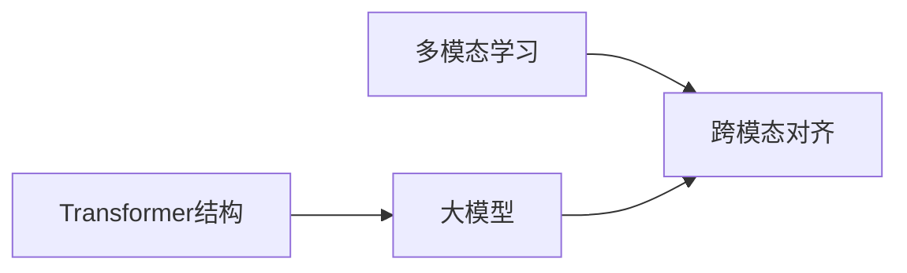

# 多模态大模型：技术原理与实战 多模态大模型的部署

## 1. 背景介绍
### 1.1 多模态大模型的兴起
近年来，随着人工智能技术的飞速发展，多模态大模型(Multimodal Large Models)成为了学术界和工业界的研究热点。多模态大模型能够同时处理文本、图像、语音等多种模态的数据，实现跨模态的信息理解和生成，在智能问答、视觉问答、语音对话等领域展现出了巨大的应用前景。

### 1.2 多模态大模型的挑战
尽管多模态大模型取得了令人瞩目的成就，但其在实际部署和应用中仍面临诸多挑战：
- 模型规模庞大，对计算资源和存储空间要求极高
- 训练和推理的时间开销大，难以满足实时响应的需求
- 不同模态数据的异构性，给模型设计和训练带来困难
- 缺乏统一的评估标准和基准，难以客观衡量模型性能

### 1.3 本文的主要内容
针对上述挑战，本文将系统地介绍多模态大模型的技术原理，并重点探讨其在实际部署中的关键问题和解决方案。主要内容包括：
- 多模态大模型的核心概念和内在联系
- 模型的核心算法原理和操作步骤
- 多模态数据的数学建模和公式推导
- 模型实践：代码实例和详细解读
- 实际应用场景剖析
- 开源工具和学习资源推荐
- 未来发展趋势与面临的挑战
- 常见问题解答

## 2. 核心概念与联系
### 2.1 多模态学习
多模态学习(Multimodal Learning)是指利用多种感官通道获取的信息进行学习的过程。人类感知世界主要依赖视觉、听觉、触觉等多种感官，多模态学习的目标就是赋予机器同时处理多种模态信息的能力，使其更接近人类的感知和认知方式。

### 2.2 大模型
大模型(Large Models)是指参数量极其庞大(通常在亿级以上)的机器学习模型。得益于海量训练数据和强大算力的支持，大模型在 NLP、CV 等领域取得了显著的性能提升，代表模型包括 GPT-3, BERT, CLIP 等。大模型强大的建模能力是构建多模态系统的基础。

### 2.3 跨模态对齐
跨模态对齐(Cross-modal Alignment)指的是在多模态学习中，将不同模态的数据映射到一个共同的语义空间，使得不同模态的表示在语义层面对齐。常见的对齐方法包括对抗学习、度量学习等。语义空间的构建是实现多模态大模型的关键。

### 2.4 Transformer 结构
Transformer 是一种基于自注意力机制的神经网络结构，最初应用于机器翻译领域，后被广泛用于 NLP、CV 等多个领域。Transformer 擅长捕捉长距离依赖，对位置信息不敏感，非常适合处理长文本和图像等高维数据。多模态大模型大都基于 Transformer 结构搭建。

### 2.5 概念之间的内在联系
多模态学习是多模态大模型的理论基础，其核心在于跨模态语义对齐。大模型为多模态学习提供了强大的建模能力，Transformer 结构则是构建大模型的首选范式。三者高度统一，共同推动了多模态大模型的发展。



## 3. 核心算法原理具体操作步骤
### 3.1 多模态预训练
多模态大模型的训练分为两个阶段：预训练和微调。预训练阶段的目标是学习通用的跨模态表示，为下游任务做准备。具体步骤如下：

1. 构建大规模多模态语料库，包括文本、图像、视频等多种模态的数据。
2. 设计针对不同模态的特征提取器，如 CNN 提取图像特征，Transformer 提取文本特征。
3. 将不同模态的特征映射到共同的语义空间，可使用对抗学习、度量学习等方法实现跨模态对齐。
4. 在对齐后的语义空间中，设计自监督学习任务，如掩码语言建模、图文匹配等，促使模型学习到更加通用和鲁棒的表示。
5. 使用梯度下降等优化算法，在大规模语料上训练模型，直至收敛。

### 3.2 任务特定微调
预训练得到的模型具备了一定的跨模态理解能力，但针对具体任务仍需进行微调。步骤如下：

1. 根据任务类型，收集和标注特定领域的多模态数据集。
2. 在预训练模型的基础上，根据任务需求设计输入输出层，搭建完整的端到端系统。
3. 使用标注数据对模型进行微调，通过反向传播更新模型参数，提升模型在目标任务上的表现。
4. 评估模型性能，分析错误样本，必要时进行数据增强、模型结构调整等优化。

### 3.3 推理部署
模型训练完成后，需要将其部署到实际的应用环境中。部署的关键是权衡推理速度、资源占用和预测精度。常见的部署优化手段包括：

1. 模型量化：将模型参数从浮点数量化为低位整数，减小模型尺寸和内存占用。
2. 模型剪枝：去除冗余和不重要的模型参数及连接，降低计算复杂度。
3. 知识蒸馏：使用大模型的输出指导小模型学习，获得参数量更少但性能相当的模型。
4. 推理框架优化：选择适合部署环境的推理框架，并根据硬件特性进行优化，提高并行计算效率。

## 4. 数学模型和公式详细讲解举例说明
### 4.1 多模态表示学习
给定一个多模态数据集 $D=\{(x_i^1,x_i^2,\dots,x_i^m,y_i)\}_{i=1}^N$，其中 $x_i^k$ 表示第 $i$ 个样本的第 $k$ 种模态的特征，$y_i$ 为对应的标签。多模态表示学习的目标是学习一个映射函数 $f_\theta:X^1 \times X^2 \times \dots \times X^m \rightarrow \mathbb{R}^d$，将不同模态的特征映射到同一个 $d$ 维语义空间。

常见的多模态表示学习方法包括：

1. 对抗学习：引入模态判别器 $D_\phi$，判断语义表示来自哪种模态。表示映射器 $f_\theta$ 的目标是最大化判别器的判别错误率，从而消除语义表示中的模态特异性。目标函数如下：

$$\min_\theta \max_\phi \mathbb{E}_{x^k \sim X^k}[\log D_\phi(f_\theta(x^k))] + \mathbb{E}_{x^l \sim X^l}[\log(1-D_\phi(f_\theta(x^l)))]$$

2. 度量学习：定义不同模态特征之间的相似度度量函数，如欧氏距离、余弦相似度等。通过最小化正样本对之间的距离，最大化负样本对之间的距离，实现语义对齐。以对比学习为例，其损失函数为：

$$\mathcal{L}=\sum_{i=1}^N -\log \frac{\exp(f_\theta(x_i^k)^\top f_\theta(x_i^l)/\tau)}{\sum_{j=1}^N \exp(f_\theta(x_i^k)^\top f_\theta(x_j^l)/\tau)}$$

其中 $\tau$ 为温度超参数。

### 4.2 Transformer 结构
Transformer 的核心是自注意力机制(Self-attention)。给定一个由 $n$ 个 $d$ 维向量组成的序列 $X \in \mathbb{R}^{n \times d}$，自注意力的计算过程如下：

1. 计算查询矩阵 $Q$、键矩阵 $K$ 和值矩阵 $V$：

$$Q=XW_Q, K=XW_K, V=XW_V$$

其中 $W_Q, W_K, W_V \in \mathbb{R}^{d \times d_k}$ 为可学习的投影矩阵。

2. 计算注意力权重矩阵 $A$：

$$A=\text{softmax}(\frac{QK^\top}{\sqrt{d_k}})$$

3. 计算注意力输出 $H$：

$$H=AV$$

多头注意力机制在此基础上引入多个并行的注意力头，增强模型的表达能力：

$$\text{MultiHead}(X)=\text{Concat}(\text{head}_1,\dots,\text{head}_h)W_O$$

其中 $\text{head}_i=\text{Attention}(XW_Q^i,XW_K^i,XW_V^i)$，$W_O \in \mathbb{R}^{hd_k \times d}$ 为输出投影矩阵。

Transformer 中的前馈网络(FFN)采用两层全连接网络，对注意力输出进行非线性变换：

$$\text{FFN}(H)=\text{ReLU}(HW_1+b_1)W_2+b_2$$

其中 $W_1 \in \mathbb{R}^{d \times d_{ff}}, b_1 \in \mathbb{R}^{d_{ff}}, W_2 \in \mathbb{R}^{d_{ff} \times d}, b_2 \in \mathbb{R}^d$ 为可学习参数。

通过交替堆叠多头注意力层和前馈网络层，再配以残差连接和层归一化，构成了 Transformer 的基本结构。

## 5. 项目实践：代码实例和详细解释说明
下面以 PyTorch 为例，演示如何实现一个简单的多模态对比学习模型。

```python
import torch
import torch.nn as nn
import torch.nn.functional as F

class MultimodalContrastiveLearning(nn.Module):
    def __init__(self, text_dim, image_dim, hidden_dim):
        super().__init__()
        self.text_encoder = nn.Linear(text_dim, hidden_dim)
        self.image_encoder = nn.Linear(image_dim, hidden_dim)
        self.temperature = 0.1

    def forward(self, text_feat, image_feat):
        # 编码文本和图像特征
        text_embed = self.text_encoder(text_feat)
        image_embed = self.image_encoder(image_feat)

        # 计算特征之间的相似度
        sim_matrix = torch.matmul(text_embed, image_embed.t())
        sim_matrix /= self.temperature

        # 构造对比学习的标签
        labels = torch.arange(sim_matrix.size(0))
        labels = labels.to(sim_matrix.device)

        # 计算对比学习损失
        loss = F.cross_entropy(sim_matrix, labels)

        return loss
```

代码解读：

1. 定义了一个名为 `MultimodalContrastiveLearning` 的 PyTorch 模型类，用于实现多模态对比学习。
2. 在初始化方法中，定义了两个编码器(全连接层)，分别用于编码文本特征和图像特征，将它们映射到同一个隐空间。同时定义了一个温度超参数。
3. 在前向传播方法中，首先对输入的文本特征和图像特征进行编码。
4. 计算编码后的文本特征和图像特征之间的相似度矩阵，即它们的内积，并除以温度系数。
5. 构造对比学习的标签，即每个文本特征对应的图像特征的索引。
6. 使用交叉熵损失函数计算对比学习的损失，即最大化正样本对的相似度，最小化负样本对的相似度。

使用该模型进行训练的示例代码如下：

```python
model = MultimodalContrastiveLearning(text_dim, image_dim, hidden_dim)
optimizer = torch.optim.Adam(model.parameters(), lr=1e-3)

for text_feat, image_feat in data_loader:
    optimizer.zero_grad()
    loss = model(text_feat, image_feat)
    loss.backward()
    optimizer.step()
```

通过不断迭代，优化模型参数，最终得到一个能够将文本和图像映射到同一语义空间的多模态表示模型。

## 6. 实际应用场景
多模态大模型可应用于多个领域，典型的应用场景包括