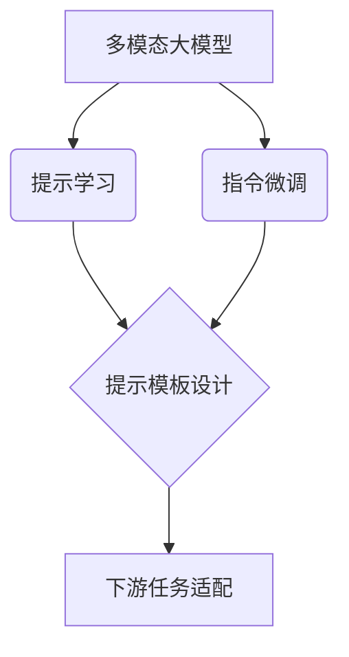

# 多模态大模型：技术原理与实战 提示学习与指令微调

## 1. 背景介绍
### 1.1 人工智能的发展历程
#### 1.1.1 早期的人工智能
#### 1.1.2 机器学习的兴起
#### 1.1.3 深度学习的突破

### 1.2 大模型的出现
#### 1.2.1 大模型的定义
#### 1.2.2 大模型的特点
#### 1.2.3 大模型的应用前景

### 1.3 多模态大模型
#### 1.3.1 多模态的概念
#### 1.3.2 多模态大模型的优势
#### 1.3.3 多模态大模型的挑战

## 2. 核心概念与联系
### 2.1 提示学习(Prompt Learning)
#### 2.1.1 提示学习的定义
#### 2.1.2 提示学习的分类
#### 2.1.3 提示学习的优势

### 2.2 指令微调(Instruction Tuning)
#### 2.2.1 指令微调的定义
#### 2.2.2 指令微调的过程
#### 2.2.3 指令微调的效果

### 2.3 提示学习与指令微调的关系
#### 2.3.1 提示学习是指令微调的基础
#### 2.3.2 指令微调是提示学习的延伸
#### 2.3.3 二者结合的意义



## 3. 核心算法原理具体操作步骤
### 3.1 提示学习算法
#### 3.1.1 基于模板的提示学习
##### 3.1.1.1 手工模板构建
##### 3.1.1.2 自动模板生成
#### 3.1.2 基于前缀的提示学习
##### 3.1.2.1 离散型前缀
##### 3.1.2.2 连续型前缀
#### 3.1.3 基于答案工程的提示学习
##### 3.1.3.1 标准答案映射
##### 3.1.3.2 校准答案映射

### 3.2 指令微调算法
#### 3.2.1 指令数据构建
##### 3.2.1.1 指令格式设计
##### 3.2.1.2 指令数据收集
##### 3.2.1.3 指令数据清洗
#### 3.2.2 指令嵌入
##### 3.2.2.1 指令编码
##### 3.2.2.2 指令融合
#### 3.2.3 指令对齐
##### 3.2.3.1 指令相似度计算
##### 3.2.3.2 指令聚类
##### 3.2.3.3 指令对齐损失

### 3.3 算法流程图


## 4. 数学模型和公式详细讲解举例说明
### 4.1 提示学习的数学建模
#### 4.1.1 基于模板的提示学习
给定样本 $x$，预训练语言模型 $\mathcal{M}$，下游任务 $\mathcal{T}$，模板函数 $\mathcal{F}$，提示学习的目标是学习一个模板 $t=\mathcal{F}(x)$，使得:
$$\arg\max_{y} P_{\mathcal{M}}(y|t)=\arg\max_{y}P(y|x;\mathcal{T}) \tag{1}$$
其中 $y$ 是任务 $\mathcal{T}$ 的标签空间。

#### 4.1.2 基于前缀的提示学习
记预训练模型的参数为 $\theta$，前缀向量为 $\mathbf{p}=\{p_1,\cdots,p_l\}$，基于前缀的提示学习的目标是:
$$\arg\max_{\mathbf{p}} \mathbb{E}_{(x,y)\sim \mathcal{D}} [\log P_{\mathcal{M}}(y|x;\mathbf{p},\theta)] \tag{2}$$
其中 $\mathcal{D}$ 是下游任务的数据集。

### 4.2 指令微调的数学建模
#### 4.2.1 指令嵌入
假设指令 $s$ 的 token 序列为 $\{s_1,\cdots,s_n\}$，指令嵌入旨在学习一个映射函数 $f_{\phi}$:
$$\mathbf{e}=f_{\phi}(s_1,\cdots,s_n) \tag{3}$$
其中 $\mathbf{e}$ 是指令 $s$ 的嵌入向量，$\phi$ 是指令编码器的参数。常见的指令编码器包括 LSTM、Transformer 等。

#### 4.2.2 指令对齐
给定两个指令 $s_i$ 和 $s_j$ 及其嵌入 $\mathbf{e}_i$ 和 $\mathbf{e}_j$，指令对齐的目标是最小化它们在嵌入空间的距离:
$$\mathcal{L}_{align}=\sum_{(i,j)\in \mathcal{P}} \Vert \mathbf{e}_i - \mathbf{e}_j \Vert^2 \tag{4}$$
其中 $\mathcal{P}$ 是语义相似的指令对集合。

### 4.3 提示学习与指令微调的联合优化
记提示学习的参数为 $\mathbf{p}$，指令微调的参数为 $\phi$，联合优化的目标函数为:
$$\mathcal{L}=\mathcal{L}_{prompt}+\lambda \mathcal{L}_{align} \tag{5}$$
$$\mathcal{L}_{prompt}=-\mathbb{E}_{(x,y)\sim \mathcal{D}} [\log P_{\mathcal{M}}(y|x;\mathbf{p},\theta)] \tag{6}$$
其中 $\lambda$ 是平衡两个损失的超参数。联合优化可以同时学习提示和指令表示，提高模型在下游任务上的性能。

## 5. 项目实践：代码实例和详细解释说明
下面以文本分类任务为例，演示如何用 PyTorch 实现提示学习和指令微调。

### 5.1 数据准备
```python
# 定义数据集
class Dataset(torch.utils.data.Dataset):
    def __init__(self, data):
        self.data = data

    def __len__(self):
        return len(self.data)

    def __getitem__(self, idx):
        return self.data[idx]

# 加载数据
train_data = [("The movie is great!", "positive"),
              ("I don't like this film.", "negative"),
              ...]
train_dataset = Dataset(train_data)
train_loader = torch.utils.data.DataLoader(train_dataset, batch_size=16, shuffle=True)
```
我们首先定义了一个 `Dataset` 类来封装数据，然后用 `DataLoader` 来批次化和打乱数据。

### 5.2 提示学习
```python
# 定义模板函数
def prompt_template(text, label=None):
    if label is None:
        return f"Classify the sentiment of the following text:\nText: {text}\nSentiment:"
    else:
        return f"Classify the sentiment of the following text:\nText: {text}\nSentiment: {label}"

# 定义模型
class PromptModel(torch.nn.Module):
    def __init__(self, model, template):
        super().__init__()
        self.model = model
        self.template = template

    def forward(self, texts, labels=None):
        prompts = [self.template(text, label) for text, label in zip(texts, labels)]
        inputs = tokenizer(prompts, return_tensors="pt", padding=True)
        outputs = self.model(**inputs)
        return outputs.logits

# 初始化模型
model = AutoModelForCausalLM.from_pretrained("gpt2")
prompt_model = PromptModel(model, prompt_template)

# 训练模型
optimizer = torch.optim.AdamW(prompt_model.parameters(), lr=1e-5)
for epoch in range(10):
    for texts, labels in train_loader:
        optimizer.zero_grad()
        logits = prompt_model(texts, labels)
        loss = cross_entropy(logits, labels)
        loss.backward()
        optimizer.step()
```
提示学习的关键是设计模板函数 `prompt_template`，将原始文本转化为prompt形式。然后定义 `PromptModel`，在forward时将文本替换为prompt，输入预训练模型得到输出。最后用分类损失函数训练模型，优化的参数是提示模板中的空位嵌入。

### 5.3 指令微调
```python
# 定义指令数据
instructions = [("Classify the sentiment of the following text:", "sentiment"),
                ("What is the sentiment of this sentence?", "sentiment"),
                ("Is this review positive or negative?", "sentiment"),
                ...]

# 定义指令编码器
class InstructionEncoder(torch.nn.Module):
    def __init__(self, hidden_size):
        super().__init__()
        self.embedding = torch.nn.Embedding(len(instructions), hidden_size)

    def forward(self, instruction_ids):
        return self.embedding(instruction_ids)

# 定义指令对齐损失
def align_loss(instruction_embeddings):
    sim_matrix = torch.matmul(instruction_embeddings, instruction_embeddings.T)
    mask = torch.eye(len(instructions)).bool()
    sim_matrix = sim_matrix[~mask].reshape(len(instructions), -1)
    loss = (1 - sim_matrix).pow(2).mean()
    return loss

# 初始化指令编码器
instruction_encoder = InstructionEncoder(hidden_size=768)

# 联合优化
for epoch in range(10):
    for texts, labels in train_loader:
        optimizer.zero_grad()

        # 提示学习损失
        logits = prompt_model(texts, labels)
        prompt_loss = cross_entropy(logits, labels)

        # 指令对齐损失
        instruction_ids = torch.arange(len(instructions))
        instruction_embeddings = instruction_encoder(instruction_ids)
        align_loss = align_loss(instruction_embeddings)

        # 联合损失
        loss = prompt_loss + 0.1 * align_loss
        loss.backward()
        optimizer.step()
```
指令微调需要引入指令数据，比如不同形式的任务描述。然后定义指令编码器 `InstructionEncoder`，用嵌入向量来表示每条指令。指令对齐损失 `align_loss` 使用余弦相似度来计算不同指令之间的距离。最后将提示学习损失和指令对齐损失相加，对两个模块进行联合优化。

## 6. 实际应用场景
### 6.1 智能客服
多模态大模型可以用于构建智能客服系统，根据用户的问题生成准确、流畅的回答。通过提示学习，可以引导模型生成符合客服场景的回复；通过指令微调，可以让模型理解不同形式的客户咨询，提高泛化能力。

### 6.2 内容创作
多模态大模型可以辅助内容创作，例如根据标题、关键词生成文章、诗歌、剧本等。提示学习可以控制生成内容的风格和主题；指令微调可以适应不同的写作需求和规范。

### 6.3 信息抽取
多模态大模型可以用于从非结构化文本中抽取结构化信息，如实体、关系、事件等。通过设计提示模板，可以引导模型抽取特定类型的信息；通过指令微调，可以适应不同领域、不同语言的信息抽取任务。

### 6.4 多模态问答
多模态大模型可以回答涉及文本、图像、视频等多种形式的问题。提示学习可以帮助模型理解复杂的多模态上下文；指令微调可以让模型适应不同类型的问题，如事实型问题、推理型问题等。

## 7. 工具和资源推荐
### 7.1 开源工具包
- Hugging Face Transformers：包含多种预训练语言模型和下游任务的统一接口
- OpenPrompt：提供了丰富的提示学习框架和算法
- AdaPrompt：一个用于自适应提示学习的工具包

### 7.2 数据集
- FLAN：包含60多个自然语言处理任务的指令数据集
- PromptSource：收集了170多个任务的人工标注的提示模板
- P3：一个支持自然语言、图像、表格等多模态的提示数据集

### 7.3 预训练模型
- T5：一个统一的文本到文本的转换模型，支持多种下游任务
- InstructGPT：经过指令微调的GPT模型，可以执行自然语言指令
- CLIP：一个对图像和文本进行对齐的多模态预训练模型

## 8. 总结：未来发展趋势与挑战
### 8.1 发展趋势
- 更大规模的预训练模型：随着计算资源的增长，预训练模型的参数量还会继续增