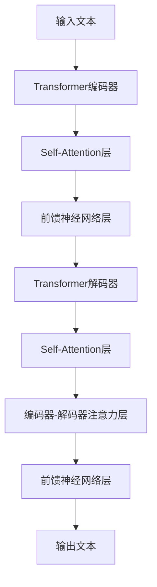

# 大语言模型 (Large Language Models, LLM) 原理与代码实例讲解

## 1. 背景介绍
### 1.1 大语言模型的定义与发展历程
#### 1.1.1 大语言模型的定义
#### 1.1.2 大语言模型的发展历程
#### 1.1.3 大语言模型的研究意义
### 1.2 大语言模型的应用现状
#### 1.2.1 自然语言处理领域的应用
#### 1.2.2 信息检索与问答系统的应用
#### 1.2.3 机器翻译领域的应用
### 1.3 大语言模型面临的挑战与机遇
#### 1.3.1 计算资源与训练效率的挑战
#### 1.3.2 模型泛化能力与鲁棒性的挑战
#### 1.3.3 大语言模型带来的机遇与前景

## 2. 核心概念与联系
### 2.1 语言模型的基本概念
#### 2.1.1 语言模型的定义与作用
#### 2.1.2 n-gram 语言模型
#### 2.1.3 神经网络语言模型
### 2.2 Transformer 架构与 Self-Attention 机制
#### 2.2.1 Transformer 架构的提出与创新
#### 2.2.2 Self-Attention 机制的原理与优势
#### 2.2.3 Transformer 在 NLP 任务中的应用
### 2.3 预训练与微调范式
#### 2.3.1 预训练的概念与目的
#### 2.3.2 微调的概念与方法
#### 2.3.3 预训练与微调范式的优势与局限性

## 3. 核心算法原理具体操作步骤
### 3.1 Transformer 的编码器-解码器结构
#### 3.1.1 编码器的结构与功能
#### 3.1.2 解码器的结构与功能
#### 3.1.3 编码器-解码器的交互过程
### 3.2 Self-Attention 的计算过程
#### 3.2.1 查询(Query)、键(Key)、值(Value)的计算
#### 3.2.2 注意力权重的计算与归一化
#### 3.2.3 注意力输出的计算与残差连接
### 3.3 位置编码的实现方法
#### 3.3.1 绝对位置编码
#### 3.3.2 相对位置编码
#### 3.3.3 位置编码的作用与优缺点比较

## 4. 数学模型和公式详细讲解举例说明
### 4.1 Transformer 的数学表示
#### 4.1.1 编码器的数学表示
#### 4.1.2 解码器的数学表示
#### 4.1.3 编码器-解码器交互的数学表示
### 4.2 Self-Attention 的数学公式推导
#### 4.2.1 查询、键、值的数学表示
#### 4.2.2 注意力权重的数学推导
#### 4.2.3 注意力输出的数学表示
### 4.3 位置编码的数学公式
#### 4.3.1 绝对位置编码的数学公式
#### 4.3.2 相对位置编码的数学公式
#### 4.3.3 位置编码的数学性质分析

## 5. 项目实践：代码实例和详细解释说明
### 5.1 使用 PyTorch 实现 Transformer 模型
#### 5.1.1 编码器的代码实现与解释
#### 5.1.2 解码器的代码实现与解释
#### 5.1.3 Transformer 模型的训练与推理过程
### 5.2 使用 TensorFlow 实现 BERT 模型
#### 5.2.1 BERT 模型的代码实现与解释
#### 5.2.2 BERT 模型的预训练过程
#### 5.2.3 BERT 模型在下游任务中的微调
### 5.3 使用 HuggingFace 库进行预训练模型的微调
#### 5.3.1 HuggingFace 库的安装与使用
#### 5.3.2 加载预训练模型与数据准备
#### 5.3.3 微调过程与结果评估

## 6. 实际应用场景
### 6.1 大语言模型在智能客服中的应用
#### 6.1.1 基于 BERT 的问题理解与意图识别
#### 6.1.2 基于 GPT 的对话生成与回复
#### 6.1.3 智能客服系统的架构与性能评估
### 6.2 大语言模型在文本摘要中的应用
#### 6.2.1 基于 Transformer 的抽取式摘要
#### 6.2.2 基于 BART 的生成式摘要
#### 6.2.3 文本摘要系统的评估指标与优化策略
### 6.3 大语言模型在情感分析中的应用
#### 6.3.1 基于 BERT 的情感分类
#### 6.3.2 基于 XLNet 的情感分析
#### 6.3.3 情感分析系统的实现与应用案例

## 7. 工具和资源推荐
### 7.1 开源工具与框架
#### 7.1.1 PyTorch 与 TensorFlow
#### 7.1.2 HuggingFace Transformers 库
#### 7.1.3 OpenAI GPT 系列模型
### 7.2 预训练模型资源
#### 7.2.1 BERT 系列预训练模型
#### 7.2.2 GPT 系列预训练模型
#### 7.2.3 其他主流预训练模型介绍
### 7.3 数据集与评测基准
#### 7.3.1 自然语言处理常用数据集
#### 7.3.2 机器翻译评测基准
#### 7.3.3 问答系统评测基准

## 8. 总结：未来发展趋势与挑战
### 8.1 大语言模型的发展趋势
#### 8.1.1 模型规模与性能的持续提升
#### 8.1.2 多模态语言模型的探索与应用
#### 8.1.3 语言模型的可解释性与可控性研究
### 8.2 大语言模型面临的挑战
#### 8.2.1 计算资源与训练效率的瓶颈
#### 8.2.2 模型泛化能力与鲁棒性的提升
#### 8.2.3 隐私保护与伦理问题的考量
### 8.3 大语言模型的研究展望
#### 8.3.1 融合知识图谱的语言模型
#### 8.3.2 面向特定领域的语言模型优化
#### 8.3.3 语言模型在认知科学领域的应用探索

## 9. 附录：常见问题与解答
### 9.1 如何选择合适的预训练模型？
### 9.2 如何处理训练过程中的梯度爆炸问题？
### 9.3 如何平衡模型的性能与推理速度？
### 9.4 如何解决语言模型生成的文本中存在的偏见问题？
### 9.5 如何利用大语言模型实现知识蒸馏？

大语言模型（Large Language Models, LLM）是近年来自然语言处理领域的重要突破，其强大的语言理解和生成能力为众多应用场景带来了革命性的变化。本文将深入探讨大语言模型的原理、算法、实践以及未来发展趋势，为读者提供全面而深入的理解。

大语言模型的核心在于其采用了 Transformer 架构和 Self-Attention 机制，能够有效地捕捉文本序列中的长距离依赖关系。Transformer 的编码器-解码器结构使得模型能够同时完成编码和生成任务，而 Self-Attention 则通过计算序列中各个位置之间的注意力权重，实现了对上下文信息的有效利用。

在算法原理方面，本文将详细讲解 Transformer 的数学表示、Self-Attention 的计算过程以及位置编码的实现方法。通过对数学公式的推导和分析，读者将对大语言模型的内部机制有更深入的理解。同时，本文还将提供基于 PyTorch 和 TensorFlow 的代码实例，演示如何实现 Transformer 和 BERT 等经典模型，并进行预训练和微调。

大语言模型在实际应用中已经取得了显著的成果，如智能客服、文本摘要、情感分析等。本文将结合具体的应用场景，讨论如何利用大语言模型解决实际问题，并提供相应的系统架构和评估指标。此外，本文还将推荐一些常用的开源工具、预训练模型资源以及评测基准，为读者提供实践参考。

展望未来，大语言模型的发展趋势包括模型规模与性能的持续提升、多模态语言模型的探索与应用以及可解释性与可控性的研究。同时，大语言模型也面临着计算资源瓶颈、泛化能力提升以及隐私与伦理问题等挑战。本文将对这些趋势和挑战进行分析，并提出潜在的研究方向，如融合知识图谱的语言模型、面向特定领域的优化以及在认知科学领域的应用探索。

最后，本文还将以附录的形式，解答读者在学习和应用大语言模型过程中可能遇到的常见问题，如模型选择、训练优化、性能平衡等，为读者提供实用的指导。

总之，大语言模型是自然语言处理领域的重要里程碑，其在学术研究和工业应用中都展现出了巨大的潜力。本文将从原理到实践，全面而深入地探讨大语言模型的方方面面，帮助读者掌握这一前沿技术，并为相关研究和应用提供参考与启发。



上图展示了 Transformer 模型的整体架构，其中编码器和解码器都由多个 Self-Attention 层和前馈神经网络层组成，通过编码器-解码器注意力层实现两者之间的交互。这一结构使得 Transformer 能够在并行计算的同时，捕捉文本序列中的长距离依赖关系，从而实现强大的语言理解和生成能力。

在 Self-Attention 的计算过程中，首先将输入序列映射为查询（Query）、键（Key）和值（Value）三个矩阵，然后通过计算查询与键之间的点积并归一化，得到注意力权重。这些权重再与值矩阵相乘，得到注意力输出。可以表示为以下数学公式：

$$
\text{Attention}(Q, K, V) = \text{softmax}(\frac{QK^T}{\sqrt{d_k}})V
$$

其中，$Q$、$K$、$V$ 分别表示查询、键、值矩阵，$d_k$ 为键向量的维度，用于缩放点积结果。通过 Self-Attention 机制，模型能够动态地关注输入序列中的不同位置，提取关键信息。

除了 Self-Attention，Transformer 还引入了位置编码（Positional Encoding）来捕捉序列中的位置信息。常见的位置编码方法包括绝对位置编码和相对位置编码。绝对位置编码使用正弦和余弦函数生成位置向量，公式如下：

$$
PE_{(pos,2i)} = sin(pos / 10000^{2i/d_{\text{model}}})
$$
$$
PE_{(pos,2i+1)} = cos(pos / 10000^{2i/d_{\text{model}}})
$$

其中，$pos$ 表示位置，$i$ 为维度索引，$d_{\text{model}}$ 为模型的维度。相对位置编码则通过引入位置偏置项，捕捉序列中元素之间的相对位置关系。

在实践中，可以使用 PyTorch 或 TensorFlow 等深度学习框架实现 Transformer 模型。以下是一个简化版的 PyTorch 代码示例，展示了 Transformer 编码器的关键部分：

```python
import torch
import torch.nn as nn

class TransformerEncoder(nn.Module):
    def __init__(self, d_model, nhead, dim_feedforward, num_layers):
        super(TransformerEncoder, self).__init__()
        encoder_layer = nn.TransformerEncoderLayer(d_model, nhead, dim_feedforward)
        self.encoder = nn.TransformerEncoder(encoder_layer, num_layers)

    def forward(self, src):
        return self.encoder(src)
```

在上述代码中，`nn.TransformerEncoderLayer` 表示 Transformer 编