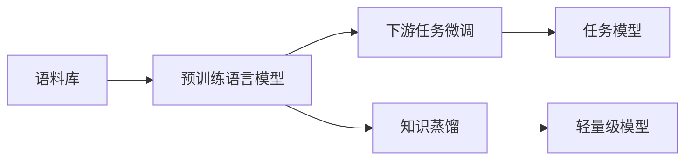

# 大语言模型原理与工程实践：大语言模型推理工程综合实践

## 1. 背景介绍
### 1.1 大语言模型的发展历程
#### 1.1.1 早期的语言模型
#### 1.1.2 Transformer的出现
#### 1.1.3 预训练语言模型的崛起

### 1.2 大语言模型的应用现状
#### 1.2.1 自然语言处理领域的应用
#### 1.2.2 知识图谱构建与问答系统
#### 1.2.3 其他领域的应用拓展

### 1.3 大语言模型面临的挑战
#### 1.3.1 模型训练的计算资源瓶颈
#### 1.3.2 模型推理的效率问题
#### 1.3.3 模型的可解释性和安全性

## 2. 核心概念与联系
### 2.1 语言模型的定义与分类
#### 2.1.1 统计语言模型
#### 2.1.2 神经网络语言模型
#### 2.1.3 预训练语言模型

### 2.2 Transformer架构
#### 2.2.1 Self-Attention机制
#### 2.2.2 Multi-Head Attention
#### 2.2.3 前馈神经网络

### 2.3 预训练与微调
#### 2.3.1 无监督预训练任务
#### 2.3.2 有监督微调任务
#### 2.3.3 预训练-微调范式

### 2.4 知识蒸馏与模型压缩
#### 2.4.1 知识蒸馏的基本原理
#### 2.4.2 不同的知识蒸馏方法
#### 2.4.3 模型量化与剪枝



## 3. 核心算法原理具体操作步骤
### 3.1 Transformer的训练过程
#### 3.1.1 输入表示
#### 3.1.2 Self-Attention计算
#### 3.1.3 前馈神经网络计算
#### 3.1.4 残差连接与Layer Normalization

### 3.2 预训练任务的实现
#### 3.2.1 Masked Language Model (MLM)
#### 3.2.2 Next Sentence Prediction (NSP)
#### 3.2.3 Permutation Language Model (PLM)

### 3.3 微调任务的实现
#### 3.3.1 文本分类任务
#### 3.3.2 命名实体识别任务
#### 3.3.3 问答任务

### 3.4 知识蒸馏的实现
#### 3.4.1 软标签蒸馏
#### 3.4.2 注意力蒸馏
#### 3.4.3 中间层蒸馏

## 4. 数学模型和公式详细讲解举例说明
### 4.1 Transformer的数学表示
#### 4.1.1 Self-Attention的数学公式
$Attention(Q,K,V) = softmax(\frac{QK^T}{\sqrt{d_k}})V$

其中，$Q$, $K$, $V$ 分别表示查询、键、值矩阵，$d_k$ 为键向量的维度。

#### 4.1.2 Multi-Head Attention的数学公式
$$
MultiHead(Q,K,V) = Concat(head_1, ..., head_h)W^O \\
head_i = Attention(QW_i^Q, KW_i^K, VW_i^V)
$$

其中，$W_i^Q$, $W_i^K$, $W_i^V$ 和 $W^O$ 为可学习的权重矩阵。

#### 4.1.3 前馈神经网络的数学公式
$FFN(x) = max(0, xW_1 + b_1)W_2 + b_2$

其中，$W_1$, $W_2$, $b_1$, $b_2$ 为可学习的权重矩阵和偏置向量。

### 4.2 语言模型的数学表示
#### 4.2.1 统计语言模型的数学公式
$P(w_1, w_2, ..., w_n) = \prod_{i=1}^n P(w_i | w_1, ..., w_{i-1})$

其中，$w_1, w_2, ..., w_n$ 为句子中的单词，$P(w_i | w_1, ..., w_{i-1})$ 表示在给定前 $i-1$ 个单词的情况下，第 $i$ 个单词的条件概率。

#### 4.2.2 神经网络语言模型的数学公式
$P(w_t | w_1, ..., w_{t-1}) = softmax(h_t^T W_e + b_e)$

其中，$h_t$ 为 $t$ 时刻的隐藏状态，$W_e$ 和 $b_e$ 为可学习的权重矩阵和偏置向量。

### 4.3 知识蒸馏的数学表示
#### 4.3.1 软标签蒸馏的数学公式
$L_{KD} = \alpha T^2 \sum_{i=1}^N p_i \log \frac{p_i}{q_i} + (1-\alpha) \sum_{i=1}^N y_i \log \hat{y}_i$

其中，$p_i$ 和 $q_i$ 分别表示教师模型和学生模型的软化输出，$y_i$ 和 $\hat{y}_i$ 分别表示真实标签和学生模型的预测输出，$T$ 为温度超参数，$\alpha$ 为平衡因子。

## 5. 项目实践：代码实例和详细解释说明
### 5.1 使用Hugging Face Transformers库进行预训练
```python
from transformers import BertTokenizer, BertForMaskedLM, DataCollatorForLanguageModeling

# 加载预训练模型和分词器
model = BertForMaskedLM.from_pretrained('bert-base-uncased')
tokenizer = BertTokenizer.from_pretrained('bert-base-uncased')

# 准备训练数据
train_dataset = ...  # 自定义训练数据集

# 定义数据收集器
data_collator = DataCollatorForLanguageModeling(
    tokenizer=tokenizer, mlm=True, mlm_probability=0.15
)

# 开始预训练
from transformers import Trainer, TrainingArguments

training_args = TrainingArguments(
    output_dir='./results',
    overwrite_output_dir=True,
    num_train_epochs=3,
    per_device_train_batch_size=32,
    save_steps=10_000,
    save_total_limit=2,
)

trainer = Trainer(
    model=model,
    args=training_args,
    data_collator=data_collator,
    train_dataset=train_dataset,
)

trainer.train()
```

上述代码使用了Hugging Face的Transformers库，加载了预训练的BERT模型和分词器。然后定义了训练数据集和数据收集器，设置了训练参数，最后使用Trainer类进行模型预训练。

### 5.2 使用PyTorch进行下游任务微调
```python
import torch
from transformers import BertTokenizer, BertForSequenceClassification

# 加载预训练模型和分词器
model = BertForSequenceClassification.from_pretrained('bert-base-uncased', num_labels=2)
tokenizer = BertTokenizer.from_pretrained('bert-base-uncased')

# 准备微调数据
train_texts = ...  # 训练文本数据
train_labels = ...  # 训练标签

# 将文本转换为模型输入
train_encodings = tokenizer(train_texts, truncation=True, padding=True)
train_dataset = torch.utils.data.TensorDataset(
    torch.tensor(train_encodings['input_ids']),
    torch.tensor(train_encodings['attention_mask']),
    torch.tensor(train_labels)
)

# 定义优化器和损失函数
optimizer = torch.optim.AdamW(model.parameters(), lr=5e-5)
loss_fn = torch.nn.CrossEntropyLoss()

# 开始微调
model.train()
for epoch in range(3):
    for batch in torch.utils.data.DataLoader(train_dataset, batch_size=32):
        input_ids, attention_mask, labels = batch
        outputs = model(input_ids, attention_mask=attention_mask, labels=labels)
        loss = outputs.loss
        loss.backward()
        optimizer.step()
        optimizer.zero_grad()
```

上述代码使用了PyTorch和Transformers库，加载了预训练的BERT模型和分词器。然后准备了微调数据集，将文本转换为模型输入。定义了优化器和损失函数，最后使用PyTorch的DataLoader和模型的forward方法进行微调训练。

### 5.3 使用TensorFlow进行知识蒸馏
```python
import tensorflow as tf
from transformers import TFBertForSequenceClassification, BertTokenizer

# 加载教师模型和学生模型
teacher_model = TFBertForSequenceClassification.from_pretrained('bert-base-uncased', num_labels=2)
student_model = TFBertForSequenceClassification.from_pretrained('bert-base-uncased', num_labels=2)

# 准备蒸馏数据
train_texts = ...  # 训练文本数据
train_labels = ...  # 训练标签

tokenizer = BertTokenizer.from_pretrained('bert-base-uncased')
train_encodings = tokenizer(train_texts, truncation=True, padding=True)
train_dataset = tf.data.Dataset.from_tensor_slices((
    dict(train_encodings),
    train_labels
))

# 定义蒸馏损失函数
def distillation_loss(student_logits, teacher_logits, temperature):
    student_probs = tf.nn.softmax(student_logits / temperature)
    teacher_probs = tf.nn.softmax(teacher_logits / temperature)
    kl_div = tf.keras.losses.KLDivergence()
    return kl_div(teacher_probs, student_probs)

# 开始蒸馏训练
optimizer = tf.keras.optimizers.Adam(learning_rate=3e-5)
temperature = 2.0

@tf.function
def train_step(inputs):
    with tf.GradientTape() as tape:
        teacher_outputs = teacher_model(inputs, training=False)
        student_outputs = student_model(inputs, training=True)
        loss = distillation_loss(student_outputs.logits, teacher_outputs.logits, temperature)
    gradients = tape.gradient(loss, student_model.trainable_variables)
    optimizer.apply_gradients(zip(gradients, student_model.trainable_variables))
    return loss

for epoch in range(3):
    for batch in train_dataset.batch(32):
        loss = train_step(batch)
```

上述代码使用了TensorFlow和Transformers库，加载了教师模型和学生模型。然后准备了蒸馏数据集，定义了蒸馏损失函数，使用KL散度来衡量学生模型和教师模型输出的差异。最后使用TensorFlow的GradientTape和@tf.function装饰器进行蒸馏训练。

## 6. 实际应用场景
### 6.1 智能客服系统
大语言模型可以应用于智能客服系统，通过预训练和微调，模型可以理解用户的问题并给出相应的回答。这可以大大减轻人工客服的工作量，提高客户服务的效率和质量。

### 6.2 情感分析
大语言模型可以用于情感分析任务，通过微调，模型可以判断文本的情感倾向，如正面、负面或中性。这在舆情监测、产品评论分析等场景中有广泛应用。

### 6.3 文本摘要
大语言模型可以应用于文本摘要任务，通过微调，模型可以自动生成文章的摘要。这对于快速浏览和理解大量文本信息非常有帮助。

### 6.4 机器翻译
大语言模型可以用于机器翻译任务，通过预训练和微调，模型可以在不同语言之间进行翻译。这对于跨语言交流和信息传播具有重要意义。

## 7. 工具和资源推荐
### 7.1 开源库
- Hugging Face Transformers：包含多种预训练语言模型和下游任务的开源库。
- Fairseq：Facebook开源的序列建模工具包，支持多种预训练语言模型。
- Flair：一个基于PyTorch的自然语言处理框架，支持多种预训练语言模型。

### 7.2 预训练模型
- BERT：Google提出的双向Transformer预训练模型，在多个NLP任务上取得了优异的性能。
- RoBERTa：Facebook提出的改进版BERT模型，通过优化训练策略和数据获得了更好的性能。
- XLNet：Google提出的自回归语言模型，在多个任务上超越了BERT。
- ALBERT：Google提出的轻量级BERT模型，通过参数共享和嵌入矩阵分解减小了模型尺寸。

### 7.3 数据集
- GLUE：通用语言理解评估基准，包含多个自然语言理解任务。
- SQuAD：斯坦福问答数据集，用于评估机器阅读理解能力。
- CoNLL 2003：命名实体识别数据集，用于评估模型在实体识别任务上的性能。

## 8. 总结：未