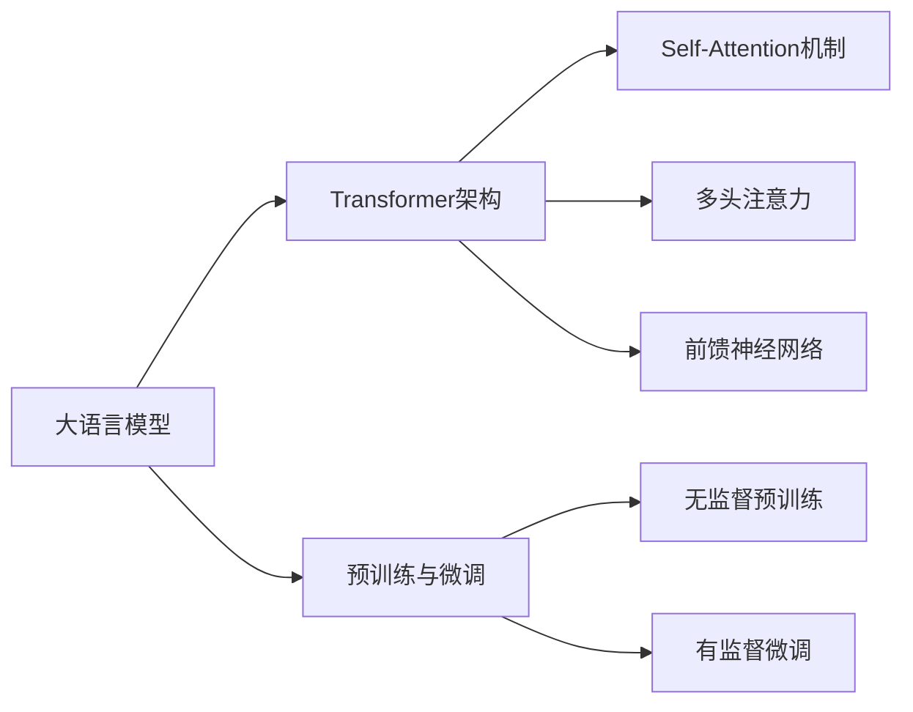

# 大语言模型原理基础与前沿 估算训练模型的排放量

## 1. 背景介绍
随着人工智能技术的飞速发展,大语言模型(Large Language Models,LLMs)在自然语言处理(Natural Language Processing,NLP)领域取得了突破性进展。从GPT、BERT到最新的GPT-4,LLMs展现出了惊人的语言理解和生成能力,在机器翻译、智能问答、文本摘要等方面表现出色。然而,训练这些大型语言模型需要消耗大量的计算资源和电力,由此产生的碳排放问题日益引起关注。本文将深入探讨大语言模型的原理基础,分析其训练过程中的能耗问题,并提出估算模型训练碳排放量的方法。

### 1.1 大语言模型的发展历程
#### 1.1.1 早期语言模型
#### 1.1.2 Transformer架构的提出
#### 1.1.3 预训练语言模型的兴起

### 1.2 大语言模型的环境影响
#### 1.2.1 能源消耗问题
#### 1.2.2 碳排放问题
#### 1.2.3 可持续发展的必要性

## 2. 核心概念与联系
### 2.1 大语言模型的定义与特点
#### 2.1.1 大语言模型的定义
#### 2.1.2 大语言模型的特点
#### 2.1.3 大语言模型与传统语言模型的区别

### 2.2 Transformer架构
#### 2.2.1 Self-Attention机制
#### 2.2.2 多头注意力
#### 2.2.3 前馈神经网络

### 2.3 预训练与微调
#### 2.3.1 无监督预训练
#### 2.3.2 有监督微调
#### 2.3.3 预训练与微调的联系



## 3. 核心算法原理具体操作步骤
### 3.1 Transformer的训练过程
#### 3.1.1 输入编码
#### 3.1.2 位置编码
#### 3.1.3 Self-Attention计算
#### 3.1.4 前馈神经网络计算
#### 3.1.5 残差连接与Layer Normalization

### 3.2 预训练任务
#### 3.2.1 语言模型任务
#### 3.2.2 去噪自编码任务
#### 3.2.3 对比学习任务

### 3.3 微调任务
#### 3.3.1 文本分类
#### 3.3.2 命名实体识别
#### 3.3.3 问答系统

## 4. 数学模型和公式详细讲解举例说明
### 4.1 Self-Attention的数学表示
假设输入序列为 $X=(x_1,x_2,...,x_n)$,其中 $x_i \in \mathbb{R}^d$ 表示第 $i$ 个单词的词向量,维度为 $d$。Self-Attention的计算过程如下:

首先计算 Query、Key、Value 矩阵:
$$
\begin{aligned}
Q &= XW^Q \\
K &= XW^K \\
V &= XW^V
\end{aligned}
$$

其中 $W^Q, W^K, W^V \in \mathbb{R}^{d \times d_k}$ 是可学习的参数矩阵。

然后计算注意力权重:
$$
A = \text{softmax}(\frac{QK^T}{\sqrt{d_k}})
$$

最后计算加权求和得到输出:
$$
\text{Attention}(Q,K,V) = AV
$$

### 4.2 多头注意力的数学表示
多头注意力是将 Self-Attention 计算多次,然后拼接结果。假设有 $h$ 个头,每个头的维度为 $d_k$,则多头注意力的计算过程为:

$$
\begin{aligned}
\text{MultiHead}(Q,K,V) &= \text{Concat}(\text{head}_1,...,\text{head}_h)W^O \\
\text{head}_i &= \text{Attention}(QW_i^Q, KW_i^K, VW_i^V)
\end{aligned}
$$

其中 $W_i^Q \in \mathbb{R}^{d \times d_k}, W_i^K \in \mathbb{R}^{d \times d_k}, W_i^V \in \mathbb{R}^{d \times d_v}, W^O \in \mathbb{R}^{hd_v \times d}$ 是可学习的参数矩阵。

### 4.3 前馈神经网络的数学表示
前馈神经网络由两个线性变换和一个非线性激活函数组成:

$$
\text{FFN}(x) = \max(0, xW_1 + b_1)W_2 + b_2
$$

其中 $W_1 \in \mathbb{R}^{d \times d_{ff}}, b_1 \in \mathbb{R}^{d_{ff}}, W_2 \in \mathbb{R}^{d_{ff} \times d}, b_2 \in \mathbb{R}^d$ 是可学习的参数。$d_{ff}$ 通常取 $4d$。

## 5. 项目实践:代码实例和详细解释说明
下面是使用PyTorch实现Transformer编码器的示例代码:

```python
import torch
import torch.nn as nn

class MultiHeadAttention(nn.Module):
    def __init__(self, d_model, num_heads):
        super().__init__()
        self.d_model = d_model
        self.num_heads = num_heads
        self.head_dim = d_model // num_heads

        self.q_linear = nn.Linear(d_model, d_model)
        self.k_linear = nn.Linear(d_model, d_model)
        self.v_linear = nn.Linear(d_model, d_model)
        self.out_linear = nn.Linear(d_model, d_model)

    def forward(self, query, key, value, mask=None):
        batch_size = query.size(0)

        # 线性变换
        Q = self.q_linear(query)
        K = self.k_linear(key)
        V = self.v_linear(value)

        # 分头
        Q = Q.view(batch_size, -1, self.num_heads, self.head_dim).transpose(1, 2)
        K = K.view(batch_size, -1, self.num_heads, self.head_dim).transpose(1, 2)
        V = V.view(batch_size, -1, self.num_heads, self.head_dim).transpose(1, 2)

        # 计算注意力权重
        attn_weights = torch.matmul(Q, K.transpose(-2, -1)) / torch.sqrt(torch.tensor(self.head_dim, dtype=torch.float32))
        if mask is not None:
            attn_weights = attn_weights.masked_fill(mask == 0, -1e9)
        attn_weights = torch.softmax(attn_weights, dim=-1)

        # 加权求和
        attn_output = torch.matmul(attn_weights, V)
        attn_output = attn_output.transpose(1, 2).contiguous().view(batch_size, -1, self.d_model)

        # 线性变换
        output = self.out_linear(attn_output)
        return output

class PositionwiseFeedForward(nn.Module):
    def __init__(self, d_model, d_ff):
        super().__init__()
        self.linear1 = nn.Linear(d_model, d_ff)
        self.linear2 = nn.Linear(d_ff, d_model)

    def forward(self, x):
        return self.linear2(torch.relu(self.linear1(x)))

class EncoderLayer(nn.Module):
    def __init__(self, d_model, num_heads, d_ff, dropout=0.1):
        super().__init__()
        self.self_attn = MultiHeadAttention(d_model, num_heads)
        self.feed_forward = PositionwiseFeedForward(d_model, d_ff)
        self.norm1 = nn.LayerNorm(d_model)
        self.norm2 = nn.LayerNorm(d_model)
        self.dropout1 = nn.Dropout(dropout)
        self.dropout2 = nn.Dropout(dropout)

    def forward(self, x, mask=None):
        attn_output = self.self_attn(x, x, x, mask)
        x = x + self.dropout1(attn_output)
        x = self.norm1(x)
        ff_output = self.feed_forward(x)
        x = x + self.dropout2(ff_output)
        x = self.norm2(x)
        return x

class Encoder(nn.Module):
    def __init__(self, num_layers, d_model, num_heads, d_ff, dropout=0.1):
        super().__init__()
        self.layers = nn.ModuleList([EncoderLayer(d_model, num_heads, d_ff, dropout) for _ in range(num_layers)])

    def forward(self, x, mask=None):
        for layer in self.layers:
            x = layer(x, mask)
        return x
```

这段代码实现了Transformer编码器的主要组件,包括:

1. MultiHeadAttention:实现多头自注意力机制。首先对输入进行线性变换得到Q、K、V矩阵,然后分头并计算注意力权重,最后加权求和并经过线性变换得到输出。

2. PositionwiseFeedForward:实现前馈神经网络。由两个线性变换和ReLU激活函数组成。

3. EncoderLayer:实现编码器的一个子层。包括多头自注意力、前馈神经网络、残差连接和Layer Normalization。

4. Encoder:实现完整的编码器。由多个EncoderLayer堆叠而成。

使用这些组件,我们可以构建出完整的Transformer模型,用于各种自然语言处理任务。

## 6. 实际应用场景
大语言模型在实际应用中有广泛的用途,下面列举几个典型场景:

### 6.1 机器翻译
大语言模型可以用于构建高质量的神经机器翻译系统。通过预训练获得语言知识,再针对平行语料进行微调,可以显著提高翻译质量。代表模型如BERT、GPT等。

### 6.2 智能问答
大语言模型可以用于构建智能问答系统。通过在海量文本上预训练,模型学习到丰富的知识,再针对问答数据集进行微调,可以回答各种领域的问题。代表模型如GPT-3、T5等。

### 6.3 文本摘要
大语言模型可以用于自动生成文本摘要。通过学习文本的内在结构和语义信息,模型可以提取关键信息并生成简洁的摘要。代表模型如BART、Pegasus等。

### 6.4 情感分析
大语言模型可以用于情感分析任务。通过在标注数据上微调,模型可以判断文本的情感倾向,如正面、负面、中性等。这在舆情监测、客户服务等领域有广泛应用。

## 7. 工具和资源推荐
### 7.1 开源框架
- Transformers:Hugging Face开发的NLP库,提供了多种预训练模型和训练脚本。
- FairSeq:Facebook开源的序列建模工具包,支持多种任务如机器翻译、语言模型等。
- OpenNMT:专门用于神经机器翻译的开源工具包,支持多种模型架构。

### 7.2 预训练模型
- BERT:Google提出的双向Transformer预训练模型,在多个NLP任务上取得了SOTA成绩。
- GPT-3:OpenAI训练的大规模语言模型,具有强大的语言理解和生成能力。
- T5:Google提出的文本到文本的预训练模型,可用于各种NLP任务。
- RoBERTa:FAIR优化BERT训练方式得到的预训练模型,在多个任务上超越BERT。

### 7.3 数据集
- WMT:机器翻译领域的标准数据集,包含多个语言对的平行语料。
- SQuAD:斯坦福问答数据集,包含大量段落和问题答案对。
- GLUE:通用语言理解评估基准,包含多个自然语言理解任务。
- CNN/DailyMail:大规模新闻文本摘要数据集。

## 8. 总结:未来发展趋势与挑战
### 8.1 模型参数量持续增长
随着计算能力的提升,大语言模型的参数量呈指数级增长。从BERT的1亿到GPT-3的1750亿,模型规模不断扩大。未来模型参数量还将持续增长,但也面临训练成本和资源消耗的挑战。

### 8.2 多模态语言模型
当前大语言模型主要处理文本数据,未来将向多模态拓展。通过融合文本、图像、语音等多种模态信息,构建更加通用和强大的语言模型,实现跨模态理解和生成。

### 8.3 低资源语言建模
如何利用高资源语言的知识