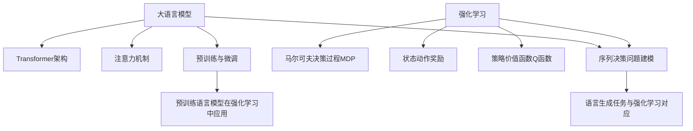

# 大语言模型应用指南：强化学习入门

## 1. 背景介绍

### 1.1 大语言模型概述
#### 1.1.1 大语言模型的定义与特点
#### 1.1.2 大语言模型的发展历程
#### 1.1.3 大语言模型的应用现状

### 1.2 强化学习概述
#### 1.2.1 强化学习的基本概念
#### 1.2.2 强化学习的发展历程
#### 1.2.3 强化学习的应用领域

### 1.3 大语言模型与强化学习的结合
#### 1.3.1 大语言模型在强化学习中的应用价值
#### 1.3.2 强化学习在大语言模型优化中的应用
#### 1.3.3 二者结合的研究现状与挑战

## 2. 核心概念与联系

### 2.1 大语言模型的核心概念
#### 2.1.1 Transformer架构
#### 2.1.2 注意力机制
#### 2.1.3 预训练与微调

### 2.2 强化学习的核心概念
#### 2.2.1 马尔可夫决策过程(MDP)
#### 2.2.2 状态、动作、奖励
#### 2.2.3 策略、价值函数、Q函数

### 2.3 大语言模型与强化学习的联系
#### 2.3.1 序列决策问题的建模
#### 2.3.2 语言生成任务与强化学习的对应关系
#### 2.3.3 预训练语言模型在强化学习中的应用



## 3. 核心算法原理具体操作步骤

### 3.1 基于强化学习的大语言模型微调算法
#### 3.1.1 算法原理
#### 3.1.2 算法流程
#### 3.1.3 算法的优缺点分析

### 3.2 基于强化学习的大语言模型蒸馏算法
#### 3.2.1 知识蒸馏的基本原理
#### 3.2.2 强化学习在知识蒸馏中的应用
#### 3.2.3 算法流程与实现细节

### 3.3 基于强化学习的大语言模型压缩算法
#### 3.3.1 模型压缩的意义
#### 3.3.2 强化学习在模型压缩中的应用
#### 3.3.3 算法流程与效果评估

## 4. 数学模型和公式详细讲解举例说明

### 4.1 马尔可夫决策过程(MDP)的数学定义
- 状态空间 $\mathcal{S}$
- 动作空间 $\mathcal{A}$
- 状态转移概率 $\mathcal{P}(s'|s,a)$
- 奖励函数 $\mathcal{R}(s,a)$
- 折扣因子 $\gamma \in [0,1]$

MDP的最优策略 $\pi^*$ 满足贝尔曼最优方程：

$$V^*(s)=\max_{a \in \mathcal{A}} \left\{ \mathcal{R}(s,a) + \gamma \sum_{s' \in \mathcal{S}} \mathcal{P}(s'|s,a)V^*(s') \right\}$$

### 4.2 策略梯度定理及其在大语言模型中的应用

策略梯度定理给出了期望奖励 $J(\theta)$ 关于策略参数 $\theta$ 的梯度：

$$\nabla_\theta J(\theta) = \mathbb{E}_{\tau \sim p_\theta(\tau)} \left[ \sum_{t=0}^{T} \nabla_\theta \log \pi_\theta(a_t|s_t) Q^{\pi_\theta}(s_t,a_t) \right]$$

其中 $\tau$ 表示轨迹，$Q^{\pi_\theta}(s_t,a_t)$ 表示在状态 $s_t$ 下采取动作 $a_t$ 的价值。

在大语言模型中，状态可以表示为已生成的token序列，动作为下一个要生成的token，奖励可以根据生成序列的质量来设计。

### 4.3 Actor-Critic算法原理

Actor-Critic算法结合了策略梯度和值函数估计，通过Actor网络生成动作，Critic网络评估状态-动作对的价值。

Actor的目标是最大化期望奖励：

$$J(\theta) = \mathbb{E}_{s \sim \rho^\pi, a \sim \pi_\theta} [Q^w(s,a)]$$

Critic的目标是最小化TD误差：

$$L(w) = \mathbb{E}_{s \sim \rho^\pi, a \sim \pi_\theta} [(Q^w(s,a) - y)^2]$$

其中 $y = r + \gamma Q^w(s',a')$ 为TD目标。

在大语言模型中，Actor可以用Transformer编码器-解码器结构实现，Critic可以用另一个Transformer编码器实现。

## 5. 项目实践：代码实例和详细解释说明

下面给出一个基于PyTorch实现的简单的强化学习训练大语言模型的代码示例：

```python
import torch
import torch.nn as nn
import torch.optim as optim

# 定义Actor网络，用于生成文本
class Actor(nn.Module):
    def __init__(self, vocab_size, embed_dim, hidden_dim):
        super(Actor, self).__init__()
        self.embedding = nn.Embedding(vocab_size, embed_dim)
        self.rnn = nn.GRU(embed_dim, hidden_dim, batch_first=True)
        self.fc = nn.Linear(hidden_dim, vocab_size)

    def forward(self, x, hidden):
        x = self.embedding(x)
        out, hidden = self.rnn(x, hidden)
        out = self.fc(out)
        return out, hidden

# 定义Critic网络，用于评估生成文本的质量
class Critic(nn.Module):
    def __init__(self, vocab_size, embed_dim, hidden_dim):
        super(Critic, self).__init__()
        self.embedding = nn.Embedding(vocab_size, embed_dim)
        self.rnn = nn.GRU(embed_dim, hidden_dim, batch_first=True)
        self.fc = nn.Linear(hidden_dim, 1)

    def forward(self, x, hidden):
        x = self.embedding(x)
        _, hidden = self.rnn(x, hidden)
        out = self.fc(hidden.squeeze(0))
        return out

# 定义强化学习训练函数
def train(actor, critic, optimizer, data, gamma):
    actor_hidden = actor.init_hidden(batch_size)
    critic_hidden = critic.init_hidden(batch_size)

    for i in range(max_seq_len):
        # Actor生成单词
        probs, actor_hidden = actor(data[:, i].unsqueeze(1), actor_hidden)
        dist = torch.distributions.Categorical(logits=probs.squeeze(1))
        action = dist.sample()
        log_prob = dist.log_prob(action)

        # Critic评估生成单词的质量
        value = critic(data[:, :i+1], critic_hidden)

        # 计算奖励
        reward = get_reward(action, data[:, i+1])

        # 计算TD误差
        next_value = critic(data[:, :i+2], critic_hidden)
        td_target = reward + gamma * next_value.detach()
        td_error = td_target - value

        # 计算Actor和Critic的损失
        actor_loss = -log_prob * td_error.detach()
        critic_loss = td_error ** 2

        # 反向传播，更新参数
        optimizer.zero_grad()
        (actor_loss + critic_loss).backward()
        optimizer.step()

# 初始化Actor和Critic网络
actor = Actor(vocab_size, embed_dim, hidden_dim)
critic = Critic(vocab_size, embed_dim, hidden_dim)
optimizer = optim.Adam(list(actor.parameters()) + list(critic.parameters()))

# 开始训练
for epoch in range(num_epochs):
    for data in data_loader:
        train(actor, critic, optimizer, data, gamma)
```

这个示例代码展示了如何使用Actor-Critic算法来训练一个基于RNN的语言模型。其中Actor网络用于生成文本，Critic网络用于评估生成文本的质量。在每个时间步，Actor根据当前状态（即之前生成的单词）生成下一个单词的概率分布，然后从这个分布中采样得到动作（即下一个单词）。Critic根据当前状态和动作计算出一个值函数，用于评估这个动作的好坏。然后根据奖励和值函数计算TD误差，并用它来更新Actor和Critic网络的参数。这个过程不断重复，直到模型收敛或达到预设的训练轮数。

通过这种强化学习的方式，语言模型可以学习到生成高质量、连贯、符合特定目标的文本。这种方法结合了大语言模型强大的语言理解和生成能力，以及强化学习在序列决策问题上的优势，有望在自然语言处理领域取得更大的突破。

## 6. 实际应用场景

### 6.1 智能对话系统
#### 6.1.1 基于强化学习优化对话策略
#### 6.1.2 使用大语言模型生成自然流畅的回复
#### 6.1.3 案例分析：微软小冰

### 6.2 内容生成与创作
#### 6.2.1 强化学习驱动的文本生成
#### 6.2.2 结合知识图谱和大语言模型进行创意写作
#### 6.2.3 案例分析：GPT-3在内容创作中的应用

### 6.3 智能教育与知识传授
#### 6.3.1 个性化教学策略的强化学习优化
#### 6.3.2 大语言模型在智能教育中的应用
#### 6.3.3 案例分析：基于大语言模型的智能教育助手

## 7. 工具和资源推荐

### 7.1 开源框架与库
- PyTorch：基于Python的开源深度学习框架
- TensorFlow：由Google开发的开源机器学习框架
- Hugging Face Transformers：自然语言处理领域的开源库，提供了大量预训练模型
- Stable Baselines：基于PyTorch的强化学习算法库

### 7.2 预训练模型资源
- BERT：Google开源的预训练语言模型
- GPT系列：OpenAI开发的生成式预训练模型
- T5：Google提出的文本到文本的转换模型
- RoBERTa：Facebook提出的改进版BERT模型

### 7.3 数据集资源
- WikiText：基于维基百科的大规模语料数据集
- BookCorpus：大量未经处理的书籍文本数据集
- Common Crawl：网络爬虫数据集，包含大量网页文本
- 中文数据集：THUCNews、LCSTS、CAIL等

## 8. 总结：未来发展趋势与挑战

### 8.1 大语言模型的发展趋势
#### 8.1.1 模型规模与性能的持续提升
#### 8.1.2 多模态语言模型的兴起
#### 8.1.3 语言模型的通用智能化

### 8.2 强化学习的发展趋势
#### 8.2.1 样本效率与泛化能力的提升
#### 8.2.2 多智能体强化学习的发展
#### 8.2.3 强化学习与其他领域的交叉融合

### 8.3 大语言模型与强化学习结合面临的挑战
#### 8.3.1 数据质量与多样性不足
#### 8.3.2 奖励设计与评估标准难以确定
#### 8.3.3 算法的可解释性与稳定性有待提高

## 9. 附录：常见问题与解答

### 9.1 大语言模型和传统的语言模型有何区别？
答：大语言模型通常基于Transformer等深度神经网络架构，在大规模语料上进行预训练，具有更强的语言理解和生成能力。传统语言模型如n-gram模型，主要基于统计方法，难以捕捉长距离依赖关系。

### 9.2 强化学习相比监督学习和无监督学习有何特点？
答：强化学习是一种试错式学习，通过智能体与环境的交互来学习最优策略。监督学习需要标注数据，无监督学习主要发现数据内在结构。强化学习更关注序列决策问题，奖励函数的设计至关重要。

### 9.3 如何设计大语言模型在强化学习中的奖励函数？
答：奖励函数的设计需要结合具体任务，可以考虑句子通顺性、信息丰富度、与