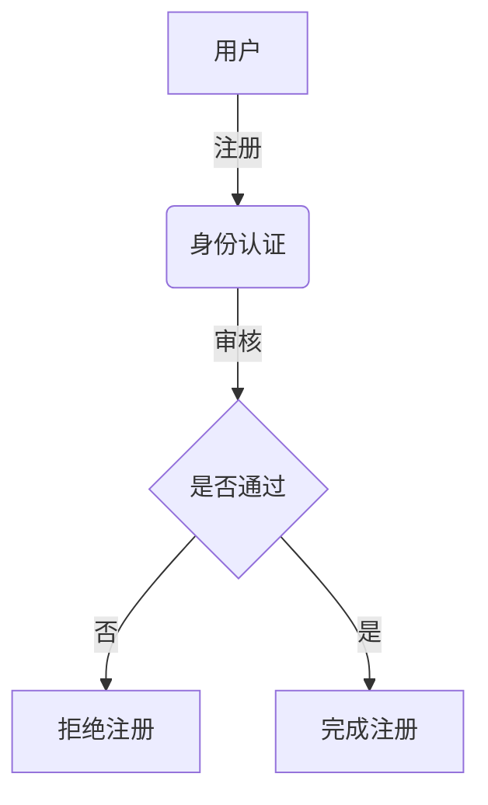
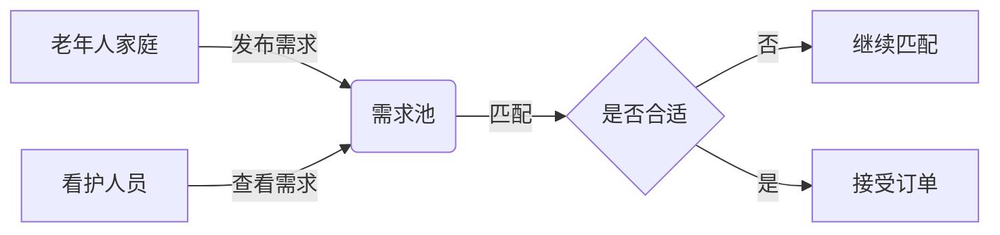
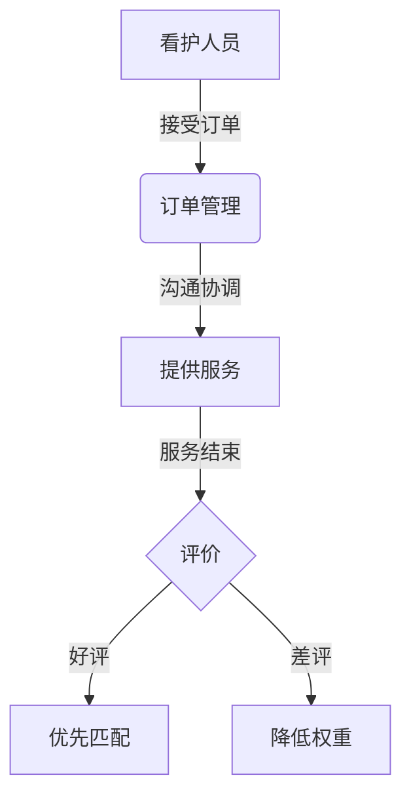
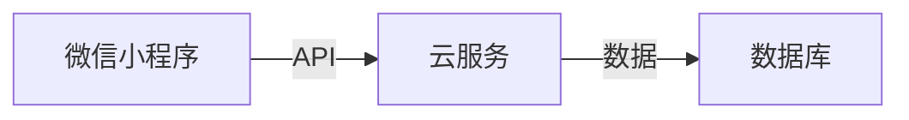

# 微信小程序老年人看护兼职系统

## 1.背景介绍

随着人口老龄化的加剧,老年人的生活照料和看护需求日益增加。然而,传统的养老院和家庭护理服务往往成本高昂,且供给有限。因此,开发一个高效便捷的老年人看护兼职系统迫在眉睫。微信小程序作为一种轻量级的应用程序,具有开发成本低、用户覆盖面广等优势,非常适合构建此类系统。

## 2.核心概念与联系

### 2.1 微信小程序

微信小程序是一种无需下载安装即可使用的小型应用程序,它可以在微信中直接运行。小程序具有体积小、响应快、无需安装等特点,为用户提供了极佳的使用体验。

### 2.2 老年人看护

老年人看护是指为老年人提供日常生活照料、医疗护理等服务,以满足其生理和心理需求。看护工作包括协助老人进食、洗漱、如厕、活动等,并提供情感支持和陪伴。

### 2.3 兼职系统

兼职系统是一种将供需双方连接起来的在线平台,旨在为寻求兼职工作的人和需要临时劳动力的雇主提供高效的匹配服务。

### 2.4 核心关系

本系统将微信小程序、老年人看护和兼职系统有机结合,为老年人家庭提供便捷的看护服务,同时为有意从事看护工作的人提供灵活的就业机会。

## 3.核心算法原理具体操作步骤

### 3.1 用户注册与认证

用户可以通过微信小程序进行注册和身份认证。对于寻求看护服务的老年人家庭,需要提供基本信息、居住地址等;对于意向看护人员,需要提供个人资料、工作经历等。系统将对用户身份进行审核,确保信息真实有效。



### 3.2 需求发布与匹配

老年人家庭可以在小程序中发布看护需求,包括所需服务类型、时间段、薪酬待遇等。系统将根据用户位置、技能要求等条件,为发布的需求匹配合适的看护人员。



### 3.3 订单管理与评价

看护人员接受订单后,双方可以通过小程序进行实时沟通,协调具体的服务安排。看护服务结束后,老年人家庭可以对看护人员的工作进行评价,作为后续匹配的重要参考。



## 4.数学模型和公式详细讲解举例说明

### 4.1 看护人员匹配算法

为了实现高效的看护人员匹配,我们采用基于多属性效用理论的匹配算法。该算法将看护需求和看护人员的各项属性赋予不同的权重,并计算总体效用值,从而找到最佳匹配。

假设有 $n$ 个看护需求 $D = \{d_1, d_2, \ldots, d_n\}$,每个需求 $d_i$ 包含 $m$ 个属性 $A = \{a_1, a_2, \ldots, a_m\}$,如位置、技能要求等。同时有 $k$ 个看护人员 $P = \{p_1, p_2, \ldots, p_k\}$,每个人员 $p_j$ 也具有对应的 $m$ 个属性值。

我们定义一个效用函数 $U(d_i, p_j)$ 来衡量需求 $d_i$ 和人员 $p_j$ 的匹配程度:

$$U(d_i, p_j) = \sum_{l=1}^m w_l \cdot s(d_i^{a_l}, p_j^{a_l})$$

其中 $w_l$ 表示属性 $a_l$ 的权重,满足 $\sum_{l=1}^m w_l = 1$;$s(d_i^{a_l}, p_j^{a_l})$ 是一个相似度函数,用于计算需求和人员在属性 $a_l$ 上的匹配程度,取值范围为 $[0, 1]$。

对于每个需求 $d_i$,我们选择效用值最大的看护人员 $p_j^*$:

$$p_j^* = \arg\max_{p_j \in P} U(d_i, p_j)$$

这样就实现了最优匹配。

### 4.2 举例说明

假设有一个老年人家庭发布了看护需求,需求属性包括:位置(北京)、技能要求(烹饪、家务)、时间段(周一至周五上午)。我们将这些属性的权重分别设为 $w_1 = 0.4, w_2 = 0.3, w_3 = 0.3$。

现有两名看护人员 $p_1$ 和 $p_2$,其属性值如下:

- $p_1$: 位置(北京)、技能(烹饪、家务)、时间段(周一至周五全天)
- $p_2$: 位置(天津)、技能(家务)、时间段(周一至周五上午)

我们定义相似度函数 $s$ 如下:

- 位置相同,则 $s = 1$;否则 $s = 0$
- 技能完全匹配,则 $s = 1$;部分匹配,则 $s = 0.5$;完全不匹配,则 $s = 0$
- 时间段完全包含,则 $s = 1$;部分重叠,则 $s = 0.5$;完全不重叠,则 $s = 0$

根据效用函数计算,我们得到:

$$\begin{aligned}
U(d, p_1) &= 0.4 \times 1 + 0.3 \times 1 + 0.3 \times 0.5 = 0.85 \
U(d, p_2) &= 0.4 \times 0 + 0.3 \times 0.5 + 0.3 \times 1 = 0.45
\end{aligned}$$

因此,系统将优先匹配看护人员 $p_1$,因为其效用值更高。

## 5.项目实践:代码实例和详细解释说明

### 5.1 系统架构

本系统采用前端(微信小程序)和后端(云服务)分离的架构,通过 API 进行数据交互。



### 5.2 前端实现

微信小程序使用小程序框架 Taro 进行开发,基于 React 技术栈。主要页面包括:

- 注册页面:用户注册和身份认证
- 需求发布页面:老年人家庭发布看护需求
- 需求列表页面:看护人员浏览并接受需求
- 订单详情页面:双方沟通协调服务安排
- 评价页面:老年人家庭对看护人员进行评价

以下是一个简单的需求发布页面示例:

```jsx
import Taro, { useState } from '@tarojs/taro'
import { View, Picker, TextArea, Button } from '@tarojs/components'

const DemandPublish = () => {
  const [location, setLocation] = useState('北京市')
  const [skills, setSkills] = useState([])
  const [timeRange, setTimeRange] = useState('上午')
  const [description, setDescription] = useState('')

  const handlePublish = () => {
    // 发送需求数据到后端
    const demand = { location, skills, timeRange, description }
    Taro.request({
      url: '/api/demands',
      method: 'POST',
      data: demand
    })
  }

  return (
    <View>
      <Picker mode='region' onChange={e => setLocation(e.detail.value)}>
        <View>地区: {location}</View>
      </Picker>
      <Picker mode='multiSelector' range={skillOptions} rangeKey='label' onChange={e => setSkills(e.detail.value)}>
        <View>技能要求: {skills.map(skill => skill.label).join(', ')}</View>
      </Picker>
      <Picker mode='selector' range={timeOptions} rangeKey='label' onChange={e => setTimeRange(e.detail.value)}>
        <View>时间段: {timeRange}</View>
      </Picker>
      <TextArea placeholder='其他需求描述' onInput={e => setDescription(e.detail.value)} />
      <Button onClick={handlePublish}>发布需求</Button>
    </View>
  )
}

export default DemandPublish
```

### 5.3 后端实现

后端使用 Node.js 和 Express 框架构建 RESTful API,并使用 MongoDB 作为数据库。以下是处理需求发布的路由示例:

```javascript
const express = require('express')
const router = express.Router()
const Demand = require('../models/demand')

// 发布新需求
router.post('/', async (req, res) => {
  try {
    const demand = new Demand(req.body)
    await demand.save()
    res.status(201).json(demand)
  } catch (err) {
    res.status(400).json({ error: err.message })
  }
})

// 获取所有需求列表
router.get('/', async (req, res) => {
  try {
    const demands = await Demand.find()
    res.json(demands)
  } catch (err) {
    res.status(500).json({ error: err.message })
  }
})

module.exports = router
```

需求数据模型定义如下:

```javascript
const mongoose = require('mongoose')

const demandSchema = new mongoose.Schema({
  location: { type: String, required: true },
  skills: [{ type: String, required: true }],
  timeRange: { type: String, required: true },
  description: String,
  caregiver: { type: mongoose.Schema.Types.ObjectId, ref: 'Caregiver' },
  createdAt: { type: Date, default: Date.now }
})

const Demand = mongoose.model('Demand', demandSchema)

module.exports = Demand
```

## 6.实际应用场景

本系统可以广泛应用于以下场景:

1. **家庭看护服务**:为独居老人或需要特殊照料的老年人提供日常生活协助,如做饭、洗浴、陪护等。

2. **养老院临时用工**:养老机构可以通过本系统快速聘请临时看护人员,应对人手不足的情况。

3. **上门康复护理**:为患有慢性病或刚出院的老年人提供专业的康复护理服务。

4. **老年陪护服务**:为有需求的老年人提供日常陪护、户外活动陪同等服务,增强生活品质。

5. **老年人才再就业**:为退休人员提供灵活的兼职就业机会,发挥其专业经验和技能。

## 7.工具和资源推荐

1. **Taro 框架**:开发微信/百度/支付宝/字节跳动小程序的统一多端解决方案 (https://taro.jd.com/)

2. **微信小程序开发文档**:微信官方提供的小程序开发技术文档 (https://developers.weixin.qq.com/miniprogram/dev/framework/)

3. **Node.js 官网**:Node.js 官方网站,提供文档、教程和资源 (https://nodejs.org/)

4. **Express 框架**:基于 Node.js 平台的 Web 应用程序框架 (https://expressjs.com/)

5. **MongoDB 官网**:MongoDB 官方网站,提供文档、教程和资源 (https://www.mongodb.com/)

6. **Mermaid 流程图**:用于生成流程图、序列图等的标记语言 (https://mermaid.js.org/)

## 8.总结:未来发展趋势与挑战

随着人口老龄化的加剧,老年人看护服务的需求将持续增长。本系统为满足这一需求提供了一种创新的解决方案。未来,该系统还可以进一步优化和拓展:

1. **智能匹配算法**:利用机器学习技术,根据历史数据不断优化看护人员匹配算法,提高匹配精度。

2. **在线视频服务**:提供远程视频看护服务,方便老年人获取专业护理指导。

3. **健康数据监测**:整合可穿