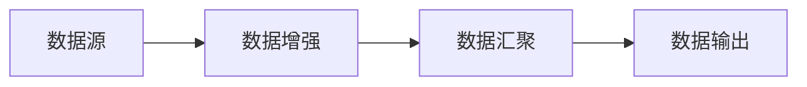

# 数据增强Pipeline搭建:数据流、扩展性与效率优化

## 1. 背景介绍
### 1.1 数据增强的重要性
在机器学习和深度学习领域,数据是模型训练的基石。然而,现实世界中高质量的标注数据往往十分稀缺和昂贵。数据增强技术通过对有限的训练数据进行变换和扩充,可以有效增加训练样本的数量和多样性,从而提升模型的泛化能力和鲁棒性。特别是在数据量不足的情况下,数据增强可以极大改善模型的性能表现。
### 1.2 数据增强面临的挑战
尽管数据增强已被证明是一种行之有效的方法,但在实践中仍面临诸多挑战:
1. 数据流:原始数据的加载、转换和保存涉及复杂的数据流,需要统一高效的数据处理框架。
2. 扩展性:不同任务需要定制化的数据增强方案,单一的数据增强库难以满足多样化的需求。
3. 效率:海量数据的增强处理对计算资源提出了更高的要求,亟需优化数据增强的执行效率。

因此,构建一个灵活、高效、可扩展的数据增强Pipeline至关重要。本文将重点探讨数据增强Pipeline的关键设计理念,并给出具体的实现方案。

## 2. 核心概念与联系
### 2.1 数据增强的分类
按照数据增强的粒度和应用阶段,可分为以下几类:
- 图像:几何变换(旋转、翻转、缩放)、颜色变换(对比度、亮度)、噪声扰动、混合等
- 文本:同义词替换、随机插入、随机交换、回译等
- 音频:变速、变调、噪声、混响等
- 特征:随机组合、旋转、高斯噪声等
### 2.2 数据增强Pipeline的组成
一个完整的数据增强Pipeline由以下几个核心组件构成:
1. 数据源:负责原始数据的输入,支持多种数据格式和来源
2. 数据增强:根据配置参数对输入数据执行一系列的增强变换
3. 数据汇聚:对转换后的数据进行同步汇聚,确保数据一致性
4. 数据输出:将增强后的数据输出到指定目标,如文件系统、数据库等

各组件间的数据流和执行逻辑如下图所示:



## 3. 核心算法原理与操作步骤
### 3.1 数据加载
数据加载是Pipeline的起点,需要支持多种数据源和格式。常见的数据加载方式包括:
1. 文件读取:从本地文件系统或分布式文件系统(如HDFS)中读取数据文件,支持CSV、JSON、Parquet等格式。
2. 数据库查询:通过SQL查询从关系型或NoSQL数据库中读取数据。
3. 消息队列:从Kafka、RabbitMQ等消息队列中实时消费数据。
4. 内存数据:直接从内存中读取数据对象,如NumPy数组等。

加载后的数据通常以DataFrame或Dataset的形式流转到后续的数据增强阶段。
### 3.2 数据增强变换
数据增强的核心在于设计一系列的数据变换操作,常用的变换原语包括:
- 图像:torchvision、Albumentations、imgaug等
- 文本:nlpaug、textattack等
- 音频:audiomentations、spec_augment等
- 特征:skearn、feature-engine等

以图像增强为例,基本的变换步骤如下:
1. 图像读取:将图像文件读入内存,转为NumPy数组
2. 图像变换:按照指定参数对图像执行一系列变换,如旋转、翻转、裁剪等
3. 图像编码:将变换后的图像数组重新编码为字节流,便于保存和传输

变换后的图像数据将发送到数据汇聚阶段进行同步。
### 3.3 数据汇聚与输出
由于数据增强通常采用多进程/多线程并行执行,不同进程/线程的变换结果需要进行同步汇聚,确保数据的一致性和完整性。常见的数据汇聚方式有:
1. 共享内存:利用共享内存原语(如mmap)在进程间共享变换结果。
2. 进程间通信:通过管道、消息队列等IPC机制在进程间传递变换结果。
3. 分布式同步:利用分布式协调服务(如ZooKeeper)在集群节点间同步变换结果。

汇聚后的增强数据将写入指定的输出目标,常见的输出方式包括:
1. 文件写入:将增强数据写入本地文件系统或HDFS等。 
2. 数据库写入:将增强数据写入关系型数据库、NoSQL数据库、数据仓库等。
3. 消息发布:将增强数据发布到Kafka等消息队列,供下游消费。

## 4. 数学模型和公式详解
### 4.1 图像增强
图像增强主要通过对图像矩阵的几何变换和像素值变换实现,涉及线性代数、概率论等数学知识。以图像旋转变换为例,设原图像为矩阵 $A$,旋转角度为 $\theta$,则旋转变换可表示为:

$$
A' = R(\theta)A
$$

其中, $R(\theta)$ 为旋转矩阵:

$$
R(\theta) = 
\begin{bmatrix} 
\cos \theta & -\sin \theta \
\sin \theta & \cos \theta 
\end{bmatrix}
$$

图像平移变换可表示为:

$$
A' = A + \begin{bmatrix} 
t_x \ 
t_y
\end{bmatrix}
$$

其中, $t_x$ 和 $t_y$ 分别为水平和垂直平移量。

### 4.2 文本增强
文本增强主要基于语言模型和词向量技术,通过对文本的词法、句法、语义等层面进行变换实现。以同义词替换为例,设文本序列为 $\mathbf{w} = [w_1, w_2, \dots, w_n]$,词 $w_i$ 的同义词集合为 $S_i$,则替换后的文本序列 $\mathbf{w}'$ 满足:

$$
\mathbf{w}' = [w_1', w_2', \dots, w_n'], \quad w_i' \in S_i \cup \{w_i\}
$$

常用的文本变换还包括:
- 随机插入:在文本序列中随机位置插入词语
- 随机交换:交换文本序列中相邻词语的位置
- 回译:将文本序列翻译为另一种语言,再翻译回原语言

### 4.3 音频增强
音频增强主要针对音频信号的时域和频域特征进行变换,常用的数学方法包括傅里叶变换、短时傅里叶变换(STFT)等。以音频变速为例,设音频信号为 $x(t)$,采样率为 $f_s$,变速比例为 $\alpha$,则变速后的信号 $y(t)$ 满足:

$$
y(t) = x(\alpha t), \quad t \in [0, T/\alpha]
$$

其中, $T$ 为音频信号的总时长。

频域变换可将时域信号 $x(t)$ 映射为频域信号 $X(f)$:

$$
X(f) = \int_{-\infty}^{\infty} x(t) e^{-j 2\pi ft} dt
$$

常用的音频变换还包括:
- 变调:改变音频信号的基频
- 噪声:叠加背景噪声
- 混响:模拟不同的房间混响效果

## 5. 项目实践:代码实例和详解
下面以Python为例,给出数据增强Pipeline的简要实现。
### 5.1 数据加载
使用pandas库从CSV文件中加载图像数据:

```python
import pandas as pd

def load_data(csv_file):
    df = pd.read_csv(csv_file)
    return df
```

### 5.2 图像增强
使用Albumentations库对图像数据进行随机旋转、平移、缩放等变换:

```python
import albumentations as A

def augment_image(image):
    transform = A.Compose([
        A.RandomRotate90(),
        A.Flip(),
        A.Transpose(),
        A.OneOf([
            A.IAAAdditiveGaussianNoise(),
            A.GaussNoise(),
        ], p=0.2),
        A.OneOf([
            A.MotionBlur(p=0.2),
            A.MedianBlur(blur_limit=3, p=0.1),
            A.Blur(blur_limit=3, p=0.1),
        ], p=0.2),
        A.ShiftScaleRotate(shift_limit=0.0625, scale_limit=0.2, rotate_limit=45, p=0.2),
        A.OneOf([
            A.OpticalDistortion(p=0.3),
            A.GridDistortion(p=0.1),
            A.IAAPiecewiseAffine(p=0.3),
        ], p=0.2),
        A.OneOf([
            A.CLAHE(clip_limit=2),
            A.IAASharpen(),
            A.IAAEmboss(),
            A.RandomBrightnessContrast(),
        ], p=0.3),
        A.HueSaturationValue(p=0.3),
    ])
    return transform(image=image)['image']
```

### 5.3 数据汇聚
使用Python内置的multiprocessing库,在多进程间同步数据变换结果:

```python
import multiprocessing as mp

def augment_batch(batch):
    pool = mp.Pool(processes=mp.cpu_count())
    results = pool.map(augment_image, batch)
    pool.close()
    return results
```

### 5.4 数据输出
将增强后的图像数据保存到本地文件:

```python
import cv2

def save_images(images, output_dir):
    for i, image in enumerate(images):
        cv2.imwrite(f"{output_dir}/{i}.jpg", image) 
```

### 5.5 Pipeline整合
将上述组件整合为完整的数据增强Pipeline:

```python
def run_pipeline(csv_file, output_dir, batch_size=32):
    df = load_data(csv_file)
    num_batches = len(df) // batch_size
    for i in range(num_batches):
        start = i * batch_size
        end = (i + 1) * batch_size
        batch = df[start:end]
        augmented = augment_batch(batch)
        save_images(augmented, output_dir)
```

以上代码实现了一个基本的图像数据增强Pipeline,支持从CSV文件加载图像数据,对图像进行随机变换,并将结果保存到本地文件。通过调整变换组合和参数,可以灵活定制不同的增强策略。

## 6. 实际应用场景
数据增强技术在学术研究和工业实践中有广泛应用,典型场景包括:
### 6.1 计算机视觉
- 图像分类:通过对训练图像进行几何变换、颜色变换等增强,提高模型的泛化能力和鲁棒性。
- 目标检测:通过对目标区域进行随机裁剪、平移、缩放等变换,增加目标的尺度和位置变化。
- 语义分割:通过对图像和标注掩码同时进行变换,保持像素级别的对齐。
### 6.2 自然语言处理
- 文本分类:通过同义词替换、随机插入/删除等方法,增加文本的语义多样性。
- 命名实体识别:通过实体替换、大小写转换等方法,提高模型对不同实体形式的适应性。
- 机器翻译:通过回译等方法,构建伪平行语料,缓解平行语料匮乏的问题。
### 6.3 语音识别
- 语音识别:通过变速、变调、加噪等方法,增加语音的音高、韵律、噪声等变化。
- 说话人识别:通过声道长度归一化、声音转换等方法,模拟不同说话人的音色特征。
- 语音合成:通过音素替换、韵律调整等方法,丰富合成语音的表现力。

除了上述领域,数据增强在推荐系统、异常检测、风控反欺诈等场景也有广泛应用。
## 7. 工具和资源推荐
### 7.1 图像增强
- torchvision: PyTorch官方图像增强库,提供常见的图像变换操作。
- Albumentations: 高效灵活的图像增强库,支持200多种变换操作,可与主流机器学习框架集成。
- imgaug: 功能丰富的图像增强库,