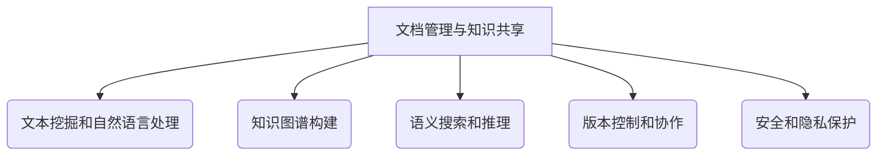

以下是根据您提供的要求和约束条件，为标题《文档管理与知识共享原理与代码实战案例讲解》撰写的技术博客文章正文内容：

# 文档管理与知识共享原理与代码实战案例讲解

## 1. 背景介绍

### 1.1 文档管理与知识共享的重要性

在当今信息时代,知识是企业和个人最宝贵的资产之一。有效地管理和共享知识对于提高工作效率、促进协作、保留组织记忆以及推动创新至关重要。文档作为知识的载体,是知识管理和共享的关键环节。

### 1.2 文档管理与知识共享的挑战

然而,随着数字化转型的加速,企业和个人面临着管理海量文档的巨大挑战。文档存在于多个系统和位置,格式多样,版本更新频繁,导致查找、访问和共享知识变得困难。此外,知识孤岛、重复工作和知识流失等问题也常常发生。

### 1.3 解决方案概述

本文将探讨文档管理与知识共享的核心原理,介绍相关算法和数学模型,并通过代码实例和实战案例,为读者提供一种高效的解决方案,帮助企业和个人更好地管理和共享知识资产。

## 2. 核心概念与联系

### 2.1 文档管理

文档管理是指对文档的整个生命周期进行有效控制和管理,包括创建、存储、检索、分发、归档和销毁等过程。良好的文档管理有助于提高工作效率、降低合规风险、保护知识产权等。

### 2.2 知识共享

知识共享是指在个人、团队或组织内部有效地传播和交流知识,实现知识的充分利用。知识共享有助于促进协作、加速创新、避免重复劳动等。

### 2.3 关键技术

实现高效的文档管理与知识共享需要多种技术的支持,包括:

- 文本挖掘和自然语言处理
- 知识图谱构建
- 语义搜索和推理
- 版本控制和协作
- 安全和隐私保护

这些技术相互关联、环环相扣,构成了解决方案的核心。



## 3. 核心算法原理具体操作步骤

### 3.1 文本挖掘和自然语言处理

#### 3.1.1 文本预处理

1. 分词: 将文本按照一定规则分割成词语序列
2. 去除停用词: 移除语义含量较低的词语
3. 词形还原: 将词语还原到基本形式
4. 词性标注: 识别每个词语的词性

#### 3.1.2 特征提取

1. 词袋模型(Bag of Words): 将文档表示为词语出现频率向量
2. TF-IDF: 根据词语在文档中的频率和在整个语料库中的频率,计算词语的重要性权重
3. Word Embedding: 将词语映射到低维连续向量空间,保留语义信息

#### 3.1.3 主题模型

1. 潜在语义分析(LSA): 将词语-文档矩阵分解为语义概念和概念-文档矩阵
2. 潜在狄利克雷分布(LDA): 基于狄利克雷先验分布,发现文档的主题分布和词语的主题分布

### 3.2 知识图谱构建

#### 3.2.1 实体识别与关系抽取

1. 命名实体识别: 识别文本中的人名、地名、组织机构名等实体
2. 关系抽取: 利用模式匹配、监督学习等方法抽取实体间的语义关系

#### 3.2.2 知识融合与去噪

1. 实体链接: 将识别出的实体链接到知识库中的现有实体
2. 关系去冗余: 合并同义关系,消除冲突和噪声

#### 3.2.3 知识表示与推理

1. 知识图谱存储: 如RDF、本体等
2. 语义推理: 基于规则或embedding的推理方法,发现隐式知识

### 3.3 语义搜索与推理

#### 3.3.1 查询理解

1. 查询分词和词性标注
2. 命名实体识别
3. 查询意图分类

#### 3.3.2 语义匹配

1. 基于词袋模型的相似度计算
2. 基于知识图谱的语义匹配
3. 基于深度学习模型(如BERT)的语义匹配

#### 3.3.3 查询扩展与结果排序

1. 基于同义词、上下位词等的查询扩展
2. 基于语义相关性的结果排序
3. 基于用户反馈的个性化排序

## 4. 数学模型和公式详细讲解举例说明

### 4.1 TF-IDF

TF-IDF(Term Frequency-Inverse Document Frequency)是一种常用的特征加权方法,用于评估词语对文档的重要程度。

$$\mathrm{TF-IDF}(t, d) = \mathrm{TF}(t, d) \times \mathrm{IDF}(t)$$

其中:
- $\mathrm{TF}(t, d)$表示词语$t$在文档$d$中出现的频率
- $\mathrm{IDF}(t) = \log\frac{N}{1 + \mathrm{DF}(t)}$,称为逆文档频率,用于降低常见词语的权重
  - $N$为语料库中文档总数
  - $\mathrm{DF}(t)$为包含词语$t$的文档数量

例如,假设语料库中有1000个文档,单词"算法"出现在600个文档中,在文档$d$中出现了10次,则:

$$\begin{aligned}
\mathrm{TF}(\text{"算法"}, d) &= 10 \
\mathrm{IDF}(\text{"算法"}) &= \log\frac{1000}{1 + 600} \approx 0.22 \
\mathrm{TF\text-IDF}(\text{"算法"}, d) &= 10 \times 0.22 = 2.2
\end{aligned}$$

### 4.2 LDA 主题模型

LDA(Latent Dirichlet Allocation)是一种常用的主题模型,用于发现文档集合中的隐含主题结构。

假设语料库$D$包含$M$个文档,词汇表$V$包含$N$个词语。LDA的基本思想是:
- 每个文档$d$是由$K$个主题$z$的混合而成,主题比例服从狄利克雷分布$\theta_d \sim \mathrm{Dirichlet}(\alpha)$
- 每个主题$z$是由词汇表$V$中的词语组成,词语比例服从狄利克雷分布$\phi_z \sim \mathrm{Dirichlet}(\beta)$

对于文档$d$中的第$i$个词语$w_i$:

$$\begin{aligned}
z_i &\sim \mathrm{Multinomial}(\theta_d) \
w_i &\sim \mathrm{Multinomial}(\phi_{z_i})
\end{aligned}$$

LDA使用吉布斯采样等方法来近似估计模型参数$\theta$和$\phi$,从而发现文档的主题分布和主题的词语分布。

### 4.3 Word Embedding

Word Embedding是一种将词语映射到低维连续向量空间的技术,可以有效地保留词语之间的语义关系。常见的Word Embedding模型包括Word2Vec、GloVe等。

以Word2Vec的CBOW(Continuous Bag-of-Words)模型为例,给定上下文词语序列$C = \{c_1, c_2, \ldots, c_{2m}\}$,目标是最大化生成目标词语$w_t$的条件概率:

$$\max_{\theta} \prod_{i=1}^T p(w_t | C_i; \theta)$$

其中,条件概率由Softmax函数给出:

$$p(w_t | C) = \frac{\exp(v_{w_t}^\top v_C)}{\sum_{w \in V} \exp(v_w^\top v_C)}$$

- $v_w$和$v_C$分别表示词语$w$和上下文$C$的向量表示
- $V$为词汇表

通过梯度下降等优化算法,可以学习到词语的Embedding向量表示。

## 5. 项目实践: 代码实例和详细解释说明

为了帮助读者更好地理解和实践文档管理与知识共享的原理,我们提供了一个基于Python的开源项目示例。该项目包含了文本挖掘、知识图谱构建、语义搜索等核心功能模块,并集成了常用的第三方库,如NLTK、Gensim、Rdflib等。

### 5.1 项目结构

```
knowledge-sharing-demo/
├── data/
│   ├── corpus/
│   └── kg/
├── src/
│   ├── text_mining/
│   ├── knowledge_graph/
│   └── semantic_search/
├── utils/
├── examples/
├── requirements.txt
└── README.md
```

- `data/`目录存放示例数据,包括文本语料和知识图谱数据
- `src/`目录包含核心功能模块的源代码
- `utils/`目录提供通用的工具函数
- `examples/`目录给出了使用示例代码
- `requirements.txt`列出了所需的Python依赖包

### 5.2 文本挖掘模块

文本挖掘模块提供了文本预处理、特征提取、主题模型等功能,示例代码如下:

```python
from src.text_mining import preprocess, bow, tfidf, lda

# 文本预处理
texts = ["This is a sample text.", "Another example sentence."]
processed = preprocess.preprocess_corpus(texts)

# 词袋模型
vectorizer = bow.BoWVectorizer()
bow_matrix = vectorizer.fit_transform(processed)

# TF-IDF
tfidf_transformer = tfidf.TfidfTransformer()
tfidf_matrix = tfidf_transformer.fit_transform(bow_matrix)

# LDA主题模型
lda_model = lda.LdaModel(num_topics=3)
doc_topics = lda_model.fit_transform(tfidf_matrix)
```

### 5.3 知识图谱模块

知识图谱模块实现了实体识别、关系抽取、知识融合等功能,示例代码如下:

```python
from src.knowledge_graph import entity_linking, relation_extraction, kg_construction

# 实体识别与链接
text = "Steve Jobs is the co-founder of Apple Inc."
entities = entity_linking.recognize_entities(text)

# 关系抽取
relations = relation_extraction.extract_relations(text)

# 知识图谱构建
kg = kg_construction.build_knowledge_graph(entities, relations)
kg.serialize("data/kg/example.nt", format="nt")
```

### 5.4 语义搜索模块

语义搜索模块提供了查询理解、语义匹配、结果排序等功能,示例代码如下:

```python
from src.semantic_search import query_understanding, semantic_matching, result_ranking

# 查询理解
query = "Who is the CEO of Microsoft?"
query_intent, query_entities = query_understanding.understand_query(query)

# 语义匹配
docs = semantic_matching.match_documents(query, kg)

# 结果排序
ranked_results = result_ranking.rank_results(query, docs)
```

通过这些示例代码,读者可以快速上手并体验文档管理与知识共享的核心功能。完整的代码实现和使用说明请参考项目的README文件。

## 6. 实际应用场景

文档管理与知识共享技术可以广泛应用于各个领域,为企业和个人带来诸多实际价值。

### 6.1 企业知识管理

- 构建统一的知识库,整合分散的文档和数据
- 促进跨部门、跨地域的知识共享与协作
- 保留组织记忆,防止知识流失
- 提高工作效率,避免重复劳动

### 6.2 智能客服与问答系统

- 快速检索相关知识库内容,提供准确答复
- 基于语义理解用户查询意图,给出个性化回复
- 持续学习新知识,不断完善问答能力

### 6.3 电子病历与医疗决策支持

- 整合患者病史、检查报告等医疗文档
- 自动识别疾病症状、诊断和治疗方案
- 基于知识图谱进行智能辅助决策

### 6.4 法律文书智能分析

- 快速检索相关法律法规和判例文书
- 自动提取核心观点、争议焦点等要素
- 