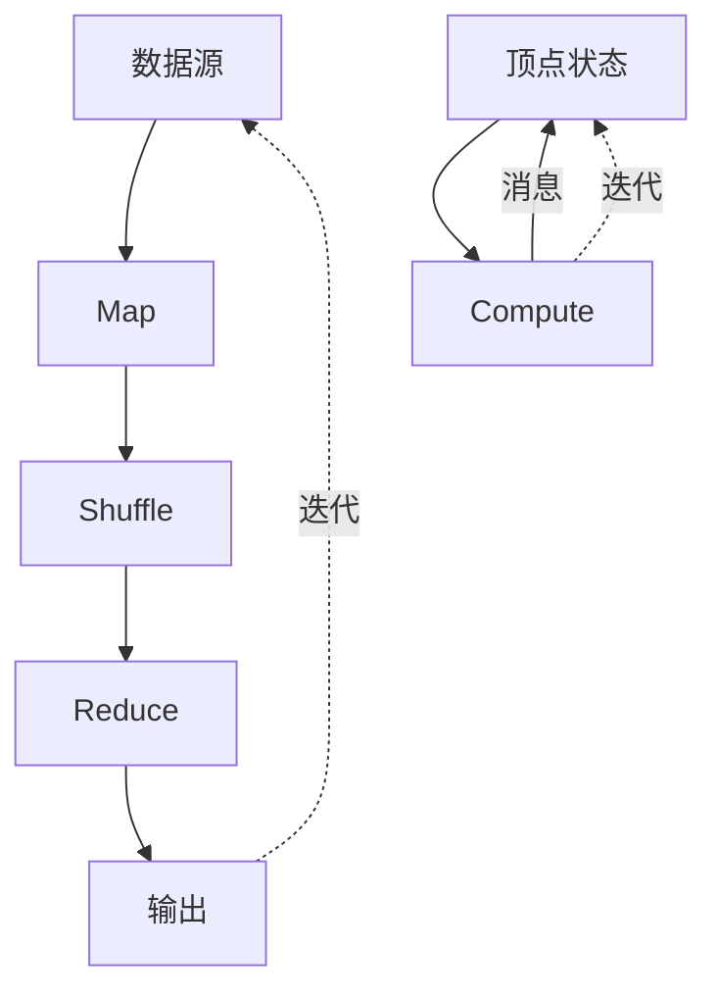

# 消息传递:Pregel图形计算的驱动力

## 1.背景介绍

### 1.1 图计算的重要性
在当今大数据时代,图形结构数据无处不在。从社交网络到金融交易网络,从生物信息网络到物联网,图形数据以其独特的方式描绘着这个世界。高效处理和分析海量图形数据,已经成为了大数据时代的重要课题。

### 1.2 传统图计算方法的局限性
传统的图计算方法,如Dijkstra最短路径算法、PageRank排序算法等,虽然在小规模图上表现良好,但在面对海量图数据时,其性能和扩展性受到了极大限制。这主要有两方面原因:
1. 算法的时间复杂度高。很多经典图算法的时间复杂度在 $O(V^2)$ 及以上,其中 $V$ 为图的顶点数。当顶点数达到亿级别时,计算耗时将变得无法接受。
2. 难以有效并行化。图数据天然的不规则性,使得很多算法难以在分布式环境下高效并行化。不同节点间频繁的数据交互,也限制了系统的扩展性。

### 1.3 Pregel的诞生
在这样的背景下,Google于2010年提出了Pregel模型[1],开创了基于消息传递(Message Passing)的大规模图计算新模式。Pregel以其简洁高效的编程模型和优秀的可扩展性,迅速成为了图计算领域的研究热点,并催生了一系列开源实现,如Apache Giraph、GraphLab等。

## 2.核心概念与联系

### 2.1 Pregel编程模型
Pregel采用了类似于BSP(Bulk Synchronous Parallel)的计算模型。在Pregel中,计算被组织为一系列超步(Superstep),每个超步包含如下三个阶段:
1. 每个顶点并行地执行用户自定义的Compute函数,对收到的消息进行处理,并可能向其他顶点发送消息。 
2. 消息在网络中传递,被发送到目标顶点。
3. 屏障同步,等待所有顶点完成计算。

这个过程不断重复,直到没有更多消息产生,计算自然终止。

### 2.2 消息传递的核心地位
可以看到,Pregel的核心就是消息传递。顶点之间的所有交互,都是通过消息来完成的。这种以消息为中心的计算模式,有几个重要优点:
1. 屏蔽了分布式环境的复杂性。用户只需要专注于单个顶点的计算逻辑,而无需关心底层的通信和同步细节。
2. 易于实现增量计算。基于消息触发计算的方式,很容易实现增量更新,避免不必要的重复计算。
3. 利于系统优化。将计算和通信解耦,为系统的优化提供了更大空间,如消息的批处理、通信的优化等。

### 2.3 Pregel与MapReduce
Pregel与MapReduce有一些相似之处,如都采用了"分治"的思想,都提供了简单的编程接口等。但两者也有明显区别:
1. 计算模型不同。MapReduce采用了Map和Reduce两个阶段,而Pregel采用了多轮迭代的方式。
2. 适用场景不同。MapReduce更适合数据并行的批处理场景,而Pregel更适合图数据的迭代计算。
3. 数据流不同。MapReduce的数据流是DAG,而Pregel的数据流是一般的有向图。

下图展示了Pregel与MapReduce的关系与区别:



## 3.核心算法原理具体操作步骤

下面我们以单源最短路径(SSSP)问题为例,来说明Pregel的具体计算过程。

### 3.1 问题定义
给定一个带权有向图 $G=(V,E)$,其中 $V$ 为顶点集, $E$ 为边集。每条边 $e=(u,v)$ 有一个非负权重 $w(e)$。给定源顶点 $s$,求 $s$ 到其他所有顶点的最短路径。

### 3.2 Pregel实现
1. 初始化:为每个顶点 $v$ 设置距离值 $dist(v)$,初始时 $dist(s)=0$,其他顶点 $dist(v)=\infty$。
2. 迭代:
   - 每个顶点 $u$ 将其当前距离值 $dist(u)$ 发送给所有出边邻居 $v$。
   - 每个顶点 $v$ 接收消息,更新自己的距离值:$dist(v)=min(dist(v), dist(u)+w(u,v))$。
   - 如果顶点 $v$ 的距离值发生变化,则继续发送消息,否则进入休眠状态。
3. 终止:当没有消息产生时,计算终止,每个顶点的 $dist$ 值即为其到源点的最短距离。

可以看到,整个过程非常简洁,顶点只需要关注自己的距离值更新和消息传递,无需关心全局的控制流。

## 4.数学模型和公式详细讲解举例说明

### 4.1 Pregel计算模型
我们可以用一个四元组 $(G, I, C, O)$ 来形式化地描述Pregel计算模型:
- $G=(V,E)$ 是一个有向图,表示计算的输入。
- $I$ 是初始化函数,用于初始化图中每个顶点的状态。
- $C$ 是计算函数,定义了每个顶点在一个超步中的计算逻辑。
- $O$ 是输出函数,用于从顶点的最终状态中提取输出。

一个Pregel程序 $P$ 可以看作是一个映射:

$$P: G \rightarrow G'$$

其中 $G'=(V,E,S)$ 是一个带状态的有向图,$S(v)$ 表示顶点 $v$ 的最终状态。

### 4.2 SSSP的Pregel建模
对于SSSP问题,我们可以按如下方式设计Pregel模型:
- 初始化函数 $I$:
  $$
  I(v) = 
  \begin{cases}
  0 & v = s \
  \infty & v \neq s
  \end{cases}
  $$
- 计算函数 $C$:
  $$
  C(v) = min(S(v), min_{u \in N(v)}(S(u) + w(u,v)))
  $$
  其中 $S(v)$ 表示 $v$ 的当前状态(即距离值), $N(v)$ 表示 $v$ 的入边邻居集合。
- 输出函数 $O$:
  $$O(v) = S(v)$$

根据上述定义,Pregel的计算过程可以用如下公式表示:

$$
S^{(i+1)}(v) = 
\begin{cases}
C(v) & S^{(i)}(v) \neq C(v) \
S^{(i)}(v) & S^{(i)}(v) = C(v)
\end{cases}
$$

其中 $S^{(i)}(v)$ 表示顶点 $v$ 在第 $i$ 个超步的状态。

可以证明,经过若干轮迭代后,对于任意顶点 $v$,都有:

$$S(v) = \delta(s, v)$$

其中 $\delta(s, v)$ 表示 $s$ 到 $v$ 的最短距离。

## 5.项目实践:代码实例和详细解释说明

下面我们用Java语言实现一个简单的Pregel框架,并在其上实现SSSP算法。

### 5.1 Pregel框架实现
首先定义一个`Vertex`接口,表示图中的顶点:

```java
public interface Vertex<V, E, M> {
    V getId();
    void compute(Iterable<M> messages);
    void sendMessage(V targetId, M message);
    void voteToHalt();
}
```

其中`V`表示顶点ID的类型,`E`表示顶点状态的类型,`M`表示消息的类型。`compute`方法定义了顶点的计算逻辑,`sendMessage`方法用于发送消息,`voteToHalt`方法用于标记顶点进入休眠状态。

然后定义一个`Pregel`类,表示整个计算框架:

```java
public class Pregel<V, E, M> {
    private Map<V, Vertex<V, E, M>> vertices;
    private Map<V, List<M>> messages;
    
    public void addVertex(Vertex<V, E, M> vertex) {
        vertices.put(vertex.getId(), vertex);
    }
    
    public void run() {
        while (true) {
            for (Vertex<V, E, M> vertex : vertices.values()) {
                vertex.compute(messages.get(vertex.getId()));
            }
            if (messages.isEmpty()) {
                break;
            }
            messages.clear();
        }
    }
    
    public void sendMessage(V targetId, M message) {
        messages.computeIfAbsent(targetId, k -> new ArrayList<>()).add(message);
    }
}
```

`vertices`存储了图中所有顶点,`messages`存储了当前超步产生的所有消息。`run`方法实现了Pregel的迭代计算过程,`sendMessage`方法用于在顶点之间传递消息。

### 5.2 SSSP算法实现
有了上面的框架,SSSP的实现就非常简单了:

```java
public class SSSPVertex implements Vertex<Long, Double, Double> {
    private long id;
    private double distance;
    private Pregel<Long, Double, Double> pregel;
    
    public SSSPVertex(long id, double distance, Pregel<Long, Double, Double> pregel) {
        this.id = id;
        this.distance = distance;
        this.pregel = pregel;
    }
    
    @Override
    public Long getId() {
        return id;
    }
    
    @Override
    public void compute(Iterable<Double> messages) {
        double minDist = distance;
        for (double msg : messages) {
            minDist = Math.min(minDist, msg);
        }
        if (minDist < distance) {
            distance = minDist;
            for (Edge<Long> edge : edges) {
                pregel.sendMessage(edge.getTargetId(), distance + edge.getWeight());
            }
        } else {
            voteToHalt();
        }
    }
    
    @Override
    public void sendMessage(Long targetId, Double message) {
        pregel.sendMessage(targetId, message);
    }
    
    @Override
    public void voteToHalt() {
        // Do nothing
    }
}
```

`SSSPVertex`实现了`Vertex`接口,表示SSSP问题中的一个顶点。其中`id`表示顶点ID,`distance`表示顶点到源点的距离,`edges`存储了顶点的出边。

`compute`方法实现了SSSP的核心逻辑:每个顶点从收到的消息中选择最小的距离值,如果该值小于当前距离,则更新距离并向邻居发送消息;否则进入休眠状态。

最后,我们可以创建一个`Pregel`对象,并向其中添加`SSSPVertex`,启动计算:

```java
Pregel<Long, Double, Double> pregel = new Pregel<>();
pregel.addVertex(new SSSPVertex(0L, 0.0, pregel));
pregel.addVertex(new SSSPVertex(1L, Double.POSITIVE_INFINITY, pregel));
pregel.addVertex(new SSSPVertex(2L, Double.POSITIVE_INFINITY, pregel));
// Add edges
pregel.run();
```

至此,我们就完成了一个基于Pregel模型的SSSP算法实现。可以看到,借助Pregel提供的抽象,复杂的分布式图计算也能以非常简洁的方式实现出来。

## 6.实际应用场景

Pregel模型可以应用于许多实际的图计算场景,下面列举几个典型的例子:

### 6.1 社交网络分析
在社交网络中,用户可以看作图的顶点,用户之间的关系(如好友关系)可以看作图的边。基于Pregel模型,我们可以实现一些常见的社交网络分析算法,如:
- 社区发现:通过标签传播等算法,发现社交网络中的社区结构。
- 影响力分析:通过PageRank等算法,计算用户的影响力。
- 好友推荐:通过协同过滤等算法,为用户推荐潜在的好友。

### 6.2 网页排序
互联网上的网页可以看作一张巨大的图,网页之间的超链接构成了图的边。Pregel模型可以用于实现经典的网页排序算法,如PageRank、HITS等。通过这些