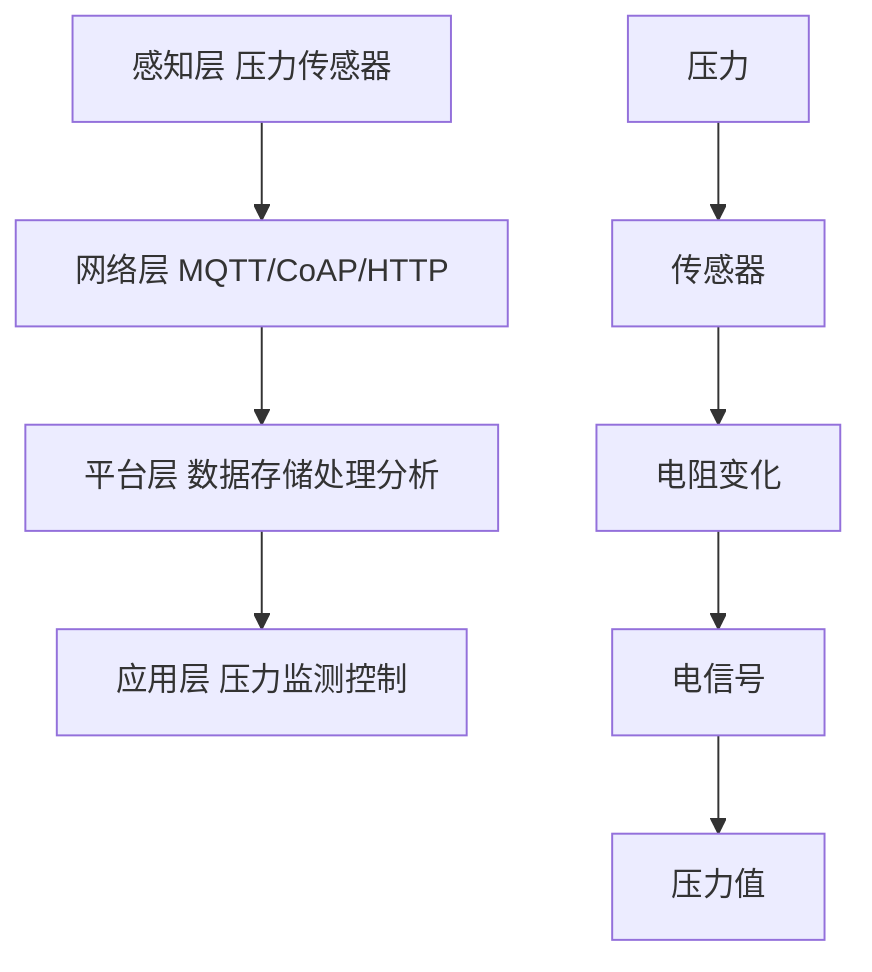

# 物联网(IoT)技术和各种传感器设备的集成：压力传感器的物联网实践

## 1. 背景介绍

### 1.1 物联网(IoT)概述
物联网(Internet of Things, IoT)是一个快速发展的技术领域,它将各种物理设备、传感器和执行器连接到互联网,实现设备之间的通信和数据交换。物联网技术使得我们能够收集、处理和分析来自各种设备的数据,从而实现智能化的决策和控制。

### 1.2 传感器在物联网中的作用
传感器是物联网系统的重要组成部分,它们负责采集物理世界的各种数据,如温度、湿度、压力、光照等。这些数据经过处理和分析后,可以用于监测环境、优化资源利用、预测设备故障等应用场景。

### 1.3 压力传感器简介
压力传感器是一种常见的传感器类型,它可以测量气体或液体的压力。压力传感器在工业控制、医疗设备、汽车电子等领域有广泛的应用。将压力传感器与物联网技术相结合,可以实现远程压力监测和控制,提高系统的自动化水平和效率。

## 2. 核心概念与联系

### 2.1 物联网架构
物联网系统通常采用分层架构,包括感知层、网络层、平台层和应用层。感知层由各种传感器和执行器组成,负责数据采集和控制;网络层负责将感知层的数据传输到平台层;平台层提供数据存储、处理和分析服务;应用层基于平台层的数据和服务,实现各种物联网应用。

### 2.2 压力传感器工作原理
压力传感器的工作原理是将压力转换为电信号。常见的压力传感器类型包括电阻式、电容式、压电式和光纤式等。以电阻式压力传感器为例,当压力作用在传感器上时,会引起电阻值的变化,通过测量电阻值的变化,可以计算出压力的大小。

### 2.3 物联网协议
物联网设备之间的通信需要遵循一定的协议。常用的物联网协议包括MQTT、CoAP、HTTP等。MQTT是一种轻量级的发布/订阅消息传输协议,适用于资源受限的设备;CoAP是一种类似于HTTP的应用层协议,支持RESTful架构;HTTP是互联网上最常用的应用层协议,也可以用于物联网设备的通信。

以下是物联网架构和压力传感器工作原理的Mermaid流程图:



## 3. 核心算法原理具体操作步骤

### 3.1 数据采集
压力传感器将压力转换为电信号后,需要使用ADC(模数转换器)将模拟电信号转换为数字信号。常见的ADC芯片有ADS1115、ADS1118等。数据采集的具体步骤如下:

1. 连接压力传感器和ADC芯片
2. 配置ADC芯片的参数,如采样率、增益等
3. 读取ADC芯片的转换结果
4. 根据压力传感器的特性,将ADC转换结果转换为压力值

### 3.2 数据传输
采集到的压力数据需要通过网络传输到物联网平台。以MQTT协议为例,数据传输的具体步骤如下:

1. 建立MQTT客户端,连接到MQTT服务器
2. 以一定的频率采集压力数据
3. 将压力数据打包成MQTT消息,发布到指定的主题
4. MQTT服务器将消息转发给订阅该主题的客户端

### 3.3 数据存储和处理
物联网平台接收到压力数据后,需要将数据存储到数据库中,并对数据进行处理和分析。常用的时序数据库有InfluxDB、OpenTSDB等。数据处理的具体步骤如下:

1. 从MQTT消息中解析出压力数据
2. 将压力数据写入时序数据库
3. 对压力数据进行聚合、降采样等处理
4. 根据压力数据生成统计报表、告警信息等

## 4. 数学模型和公式详细讲解举例说明

### 4.1 压力传感器数学模型
以电阻式压力传感器为例,其数学模型可以表示为:

$$R = R_0(1 + \alpha \Delta P)$$

其中,$R$为压力作用下的电阻值,$R_0$为初始电阻值,$\alpha$为压力灵敏系数,$\Delta P$为压力变化量。

假设一个压力传感器的初始电阻值为1000欧姆,压力灵敏系数为0.1,当压力增加100kPa时,电阻值的变化为:

$$\Delta R = R_0 \alpha \Delta P = 1000 \times 0.1 \times 100 = 10000(\Omega)$$

因此,压力作用下的电阻值为:

$$R = R_0 + \Delta R = 1000 + 10000 = 11000(\Omega)$$

### 4.2 ADC转换公式
ADC芯片将模拟电压转换为数字值,转换公式为:

$$D = \frac{V_{in}}{V_{ref}} \times 2^n$$

其中,$D$为ADC转换结果,$V_{in}$为输入电压,$V_{ref}$为参考电压,$n$为ADC位数。

假设使用一个12位的ADC芯片,参考电压为3.3V,当输入电压为1.65V时,ADC转换结果为:

$$D = \frac{1.65}{3.3} \times 2^{12} = 2048$$

## 5. 项目实践：代码实例和详细解释说明

下面是一个使用Python语言和MQTT协议,实现压力传感器数据采集和传输的代码示例:

```python
import time
import Adafruit_ADS1x15
import paho.mqtt.client as mqtt

# 创建ADC对象
adc = Adafruit_ADS1x15.ADS1115()
GAIN = 1

# MQTT配置
MQTT_SERVER = "mqtt.example.com"
MQTT_PORT = 1883
MQTT_TOPIC = "sensor/pressure"

# 连接MQTT服务器
def on_connect(client, userdata, flags, rc):
    print("Connected with result code "+str(rc))

client = mqtt.Client()
client.on_connect = on_connect
client.connect(MQTT_SERVER, MQTT_PORT, 60)

# 循环采集压力数据并发送到MQTT服务器
while True:
    # 读取ADC值
    value = adc.read_adc(0, gain=GAIN)

    # 将ADC值转换为压力值(假设转换公式为: pressure = value / 100)
    pressure = value / 100.0

    # 发送压力数据到MQTT服务器
    client.publish(MQTT_TOPIC, pressure)

    print("Pressure: %.2f kPa" % pressure)

    time.sleep(1)
```

代码解释:

1. 首先创建一个ADS1115的ADC对象,设置增益为1。
2. 配置MQTT服务器的地址、端口和主题。
3. 定义MQTT连接成功的回调函数。
4. 创建MQTT客户端,并连接到MQTT服务器。
5. 在循环中,读取ADC通道0的值,并将其转换为压力值。
6. 将压力值发送到MQTT服务器的指定主题。
7. 打印压力值,并等待1秒钟。

## 6. 实际应用场景

压力传感器与物联网技术的结合,在以下应用场景中有广泛的应用:

### 6.1 工业控制
在工业生产中,压力是一个重要的参数。通过在设备上安装压力传感器,并将压力数据上传到物联网平台,可以实现对设备的远程监测和控制。例如,在化工生产中,可以通过监测反应釜的压力,及时发现异常情况并采取措施,保证生产安全。

### 6.2 智慧农业
在现代农业中,压力传感器可以用于监测土壤湿度、水压等参数。通过分析压力数据,可以优化灌溉策略,提高农作物产量和质量。例如,在大棚蔬菜种植中,可以根据土壤湿度的变化,自动控制滴灌系统,实现精准灌溉。

### 6.3 智能家居
在智能家居中,压力传感器可以用于监测水压、燃气压力等参数。通过分析压力数据,可以及时发现管道泄漏等问题,保障家庭安全。例如,在燃气管道上安装压力传感器,当压力异常变化时,可以自动关闭阀门并发出警报,防止燃气泄漏。

## 7. 工具和资源推荐

以下是一些常用的物联网开发工具和资源:

### 7.1 硬件平台
- Arduino: 开源的电子原型平台,适合快速开发物联网设备原型。
- Raspberry Pi: 基于Linux的单板计算机,性能较高,适合开发复杂的物联网应用。
- ESP8266/ESP32: 低成本的WiFi/蓝牙模组,适合开发小型物联网设备。

### 7.2 软件平台
- Node-RED: 基于流的可视化编程工具,适合快速开发物联网应用。
- ThingsBoard: 开源的物联网平台,提供设备管理、数据收集、可视化等功能。
- AWS IoT: 亚马逊的物联网平台,提供设备管理、数据分析、机器学习等服务。

### 7.3 学习资源
- 物联网学习指南: https://github.com/phodal/awesome-iot-cn
- 物联网开发实战: https://www.ituring.com.cn/book/2631
- 物联网安全指南: https://www.owasp.org/index.php/IoT_Security_Guidance

## 8. 总结：未来发展趋势与挑战

物联网技术和传感器的集成,为各行各业带来了新的发展机遇。未来,物联网技术将向着以下方向发展:

### 8.1 边缘计算
随着物联网设备数量的增加,云计算面临着延迟、带宽等挑战。边缘计算将数据处理和分析任务下沉到网络边缘,可以提高响应速度,减轻云端压力。

### 8.2 人工智能
物联网设备产生的海量数据,为人工智能技术的应用提供了基础。通过将人工智能算法部署到物联网设备上,可以实现本地智能化决策,提高系统自动化水平。

### 8.3 区块链
区块链技术可以为物联网设备提供安全可信的数据共享和交易机制。通过将设备数据上链,可以实现数据的不可篡改和可追溯,提高系统的安全性和可信度。

物联网技术的发展也面临着一些挑战,主要包括:

### 8.4 安全与隐私
物联网设备数量众多,安全防护能力较弱,容易成为黑客攻击的目标。如何保障物联网系统的安全性和用户隐私,是一个亟待解决的问题。

### 8.5 标准与互操作
物联网设备种类繁多,缺乏统一的标准和协议,导致设备之间的互操作性较差。建立统一的物联网标准体系,是推动物联网技术发展的重要任务。

### 8.6 人才短缺
物联网技术涉及多个学科领域,对人才的综合能力要求较高。当前,物联网领域的人才供给不足,制约了物联网产业的发展。加强物联网人才的培养,是推动物联网技术应用的关键。

## 9. 附录：常见问题与解答

### 9.1 问题1: 压力传感器的选型依据是什么?
答: 选择压力传感器需要考虑以下因素:
- 压力测量范围
- 精度和分辨率
- 工作环境(温度、湿度等)
- 输出信号类型(模拟、数字)
- 成本和可靠性

### 9.2 问题2: MQTT和CoAP协议有什么区别?
答: MQTT和CoAP都是物联网常用的应用层协议,但有以下区别:
- MQTT基于TCP,CoAP基于UDP
- MQTT使用发布/订阅模式,CoAP使用请求/响应模式
- MQTT消息头部较大,CoAP消息头部较小
- MQTT支持QoS