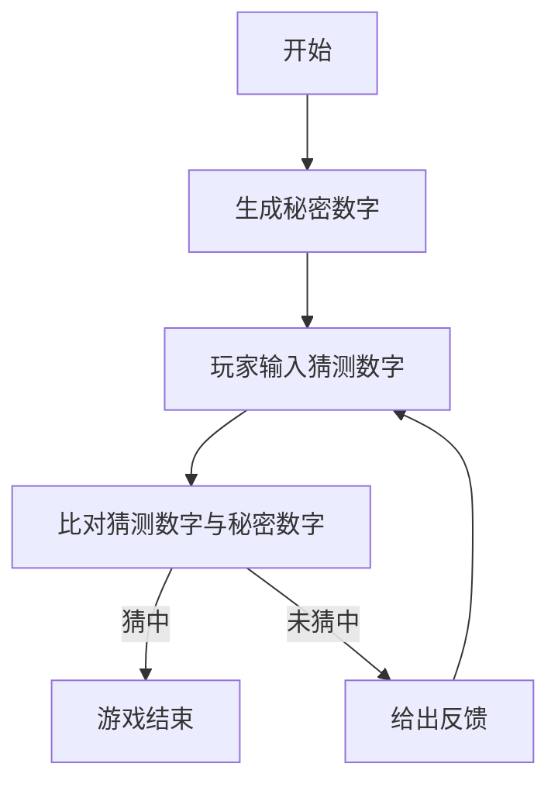

# 猜数字游戏系统详细设计与具体代码实现

## 1.背景介绍

猜数字游戏是一种经典的数字游戏,通过程序随机生成一个秘密数字,玩家需要通过不断地猜测和获取反馈来最终猜出这个数字。这种游戏不仅有趣好玩,而且能锻炼逻辑思维能力和编程技巧。本文将详细介绍猜数字游戏系统的设计和实现,包括核心概念、算法原理、数学模型、代码实例、应用场景、工具推荐以及未来发展趋势等内容。

## 2.核心概念与联系

### 2.1 游戏规则

猜数字游戏的基本规则如下:

1. 程序随机生成一个秘密数字(通常为4位数字)
2. 玩家输入一个猜测数字
3. 程序根据猜测数字与秘密数字的比对,给出反馈
4. 玩家根据反馈继续猜测,直到猜中为止

### 2.2 反馈规则

反馈规则是游戏的核心,通常有以下两种:

1. **位置和数字都正确**: 用"X"表示
2. **数字正确但位置不正确**: 用"O"表示

例如,秘密数字为"5678",猜测数字为"5791",反馈为"2O"。

### 2.3 游戏流程

游戏流程可以用下面的流程图表示:



## 3.核心算法原理具体操作步骤

### 3.1 生成秘密数字

生成不重复的4位随机数字作为秘密数字,可以使用随机数生成算法和集合运算。

1. 生成4个0-9的随机数字
2. 将这4个数字存入集合中
3. 如果集合大小小于4,说明有重复数字,重新生成
4. 将不重复的4个数字拼接为秘密数字字符串

### 3.2 比对猜测数字

将猜测数字与秘密数字逐位比对,统计位置和数字都正确的个数(X)和只有数字正确的个数(O)。

1. 将秘密数字和猜测数字拆分为单个字符数组
2. 遍历数组,逐位比对
3. 如果相同位置的数字相同,X计数加1
4. 如果不同位置但数字相同,O计数加1
5. 将X和O的值拼接为反馈字符串

### 3.3 游戏循环

游戏进入循环,直到玩家猜中或选择退出。

1. 玩家输入猜测数字
2. 比对猜测数字并给出反馈
3. 如果猜中,游戏结束
4. 如果未猜中,继续循环

## 4.数学模型和公式详细讲解举例说明

猜数字游戏中涉及到一些数学知识,如概率、组合等。

### 4.1 生成秘密数字的概率

生成4位不重复数字的概率为:

$$P(4位不重复数字) = \frac{9\times8\times7\times6}{10^4} = 0.5184$$

即51.84%的概率会生成4位不重复的秘密数字。

### 4.2 猜中数字的概率

假设每次猜测都是随机的,那么猜中4位数字的概率为:

$$P(猜中) = \frac{1}{10^4} = 0.0001$$

即万分之一的概率能一次猜中。

### 4.3 根据反馈缩小范围

每次得到反馈后,可以根据反馈缩小待猜测的数字范围,从而提高下次猜中的概率。

设有k个数字位置正确,m个数字正确但位置不正确,那么剩余待猜测的数字个数为:

$$剩余数字个数 = 10^{4-k} \times \binom{10-m}{4-k}$$

例如,反馈为"2X1O",则k=2,m=3,剩余待猜测数字个数为:

$$剩余数字个数 = 10^2 \times \binom{7}{2} = 2100$$

因此,根据反馈可以极大地缩小猜测范围,从而提高猜中的概率。

## 5.项目实践:代码实例和详细解释说明

下面是用Python实现猜数字游戏的代码,并对关键部分进行了详细注释说明。

```python
import random

def generate_secret():
    """生成4位不重复的秘密数字字符串"""
    digits = list(range(10))  # 生成0-9的数字列表
    random.shuffle(digits)  # 打乱数字顺序
    secret = ''.join(map(str, digits[:4]))  # 取前4位拼接为字符串
    return secret

def get_clues(guess, secret):
    """
    比对猜测数字和秘密数字,返回反馈字符串
    X 表示位置和数字都正确
    O 表示数字正确但位置不正确
    """
    clues = []
    remaining_digits = list(secret)  # 剩余未匹配的秘密数字

    # 统计位置和数字都正确的个数
    for i in range(len(guess)):
        if guess[i] == secret[i]:
            clues.append('X')
            remaining_digits.remove(guess[i])

    # 统计只有数字正确的个数
    for digit in guess:
        if digit in remaining_digits:
            clues.append('O')
            remaining_digits.remove(digit)

    return ''.join(clues)

def play_game():
    """游戏主循环"""
    secret = generate_secret()
    attempts = 0

    while True:
        guess = input("请输入4位数字: ")
        attempts += 1

        if len(guess) != 4 or not guess.isdigit():
            print("无效输入,请重新输入4位数字")
            continue

        clues = get_clues(guess, secret)
        print(clues)

        if clues == '4X':
            print(f"恭喜你猜对了!你总共用了{attempts}次尝试。")
            break

        if attempts == 10:
            print(f"很遗憾,你已经用尽所有机会。秘密数字是{secret}。")
            break

if __name__ == '__main__':
    play_game()
```

代码解释:

1. `generate_secret()`函数用于生成4位不重复的秘密数字字符串。它首先生成0-9的数字列表,然后打乱顺序,取前4位拼接为字符串返回。

2. `get_clues()`函数用于比对猜测数字和秘密数字,返回反馈字符串。它首先统计位置和数字都正确的个数(X),然后统计只有数字正确的个数(O),最后将X和O拼接为反馈字符串返回。

3. `play_game()`函数是游戏的主循环。它首先调用`generate_secret()`生成秘密数字,然后进入循环等待玩家输入猜测数字。每次输入后,调用`get_clues()`获取反馈并打印出来。如果猜中(4X),游戏结束并打印尝试次数;如果用尽10次机会还未猜中,游戏结束并打印秘密数字。

4. 代码使用了输入验证,确保玩家输入的是4位数字。

5. 代码的核心算法是`get_clues()`函数,它通过两次遍历来分别统计X和O的个数,时间复杂度为O(n),n为猜测数字的位数。

## 6.实际应用场景

猜数字游戏虽然规则简单,但具有一定的应用价值:

1. **教学工具**: 可用于教授算法思维、数据结构、随机数生成等编程概念。

2. **脑力训练**: 锻炼逻辑思维能力、推理能力和数字运算能力。

3. **娱乐消遣**: 作为一种休闲游戏,可以在课余时间玩耍放松。

4. **密码学**: 猜数字游戏的原理也被应用于密码学中的密码破解算法。

5. **人机交互**: 可以集成到智能助手或聊天机器人中,增强人机交互的趣味性。

## 7.工具和资源推荐

在实现猜数字游戏时,可以使用以下工具和资源:

1. **Python**: 一种简单易学的编程语言,非常适合初学者入门。

2. **Visual Studio Code**: 一个功能强大且免费的代码编辑器,支持多种语言。

3. **GitHub**: 一个代码托管和协作平台,可以方便地分享和管理代码。

4. **StackOverflow**: 一个著名的技术问答社区,可以在遇到问题时寻求帮助。

5. **算法可视化工具**: 如Python的Matplotlib库或在线工具,可以帮助可视化算法执行过程。

6. **编程教程和书籍**: 如《Python编程:从入门到实践》、《算法图解》等,可以系统学习相关知识。

## 8.总结:未来发展趋势与挑战

猜数字游戏虽然规则简单,但仍有一些值得探讨和改进的地方:

1. **提高游戏难度**: 可以增加更多的约束条件,如限制猜测次数、增加数字位数等,提高游戏难度和挑战性。

2. **智能提示系统**: 根据玩家的猜测情况,给出智能化的提示和建议,帮助玩家更快地猜中数字。

3. **多人对战模式**: 支持多人实时在线对战,增加社交和竞争元素,提高游戏的趣味性。

4. **可视化界面**: 开发图形用户界面(GUI),提供更直观和友好的用户体验。

5. **游戏数据分析**: 收集和分析玩家的游戏数据,优化游戏策略和难度设置。

6. **人工智能对手**: 集成人工智能算法,开发出具有一定水平的AI对手,给玩家带来新的挑战。

7. **跨平台支持**: 使游戏能够运行在不同的操作系统和设备上,扩大用户群体。

总之,猜数字游戏虽然简单,但仍有许多值得探索和改进的空间,未来将会有更多创新和发展。

## 9.附录:常见问题与解答

1. **为什么要生成不重复的秘密数字?**

    生成不重复的秘密数字可以增加游戏的难度和挑战性。如果秘密数字中包含重复数字,玩家只需要猜测几次就能排除重复数字,从而极大地缩小猜测范围,降低了游戏的乐趣。

2. **为什么要给出反馈?**

    给出反馈是为了让玩家能够根据反馈信息调整猜测策略,从而逐步缩小猜测范围,提高猜中的概率。如果不给出反馈,玩家只能盲目猜测,游戏将变得无趣且困难。

3. **如何优化游戏策略?**

    优化游戏策略的一个方法是根据反馈信息,计算出剩余待猜测的数字范围,然后采用一些启发式策略进行猜测。例如,可以优先猜测那些包含更多未匹配数字的数字,以尽快排除更多的可能性。另外,也可以记录历史猜测情况,避免重复猜测相同的数字。

4. **如何扩展游戏功能?**

    可以考虑添加以下功能来扩展游戏:

    - 难度选择:允许玩家选择不同的数字位数或猜测次数限制
    - 排行榜:记录玩家的最佳成绩,增加竞争元素
    - 提示系统:根据玩家的猜测情况,给出一些提示和建议
    - 多人对战:支持多人实时在线对战
    - 人工智能对手:集成人工智能算法,开发出具有一定水平的AI对手

5. **如何将游戏移植到其他平台?**

    要将游戏移植到其他平台(如Web、移动端等),需要使用相应的开发框架和工具。例如,对于Web端,可以使用JavaScript重写游戏逻辑,并使用HTML和CSS构建用户界面;对于移动端,可以使用React Native或Flutter等跨平台框架开发。此外,还需要考虑平台之间的交互方式、界面布局等差异,进行相应的适配和优化。

作者: 禅与计算机程序设