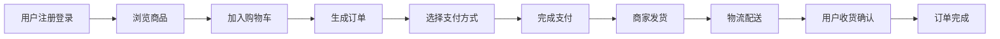

# 网上商品销售系统详细设计与具体代码实现

## 1. 背景介绍

随着互联网技术的快速发展,电子商务已经成为现代商业的重要组成部分。网上商品销售系统作为电子商务的核心系统之一,在实际应用中发挥着越来越重要的作用。本文将从需求分析、系统架构设计、数据库设计、核心算法、代码实现等方面,对网上商品销售系统进行深入探讨。

### 1.1 电子商务发展现状
#### 1.1.1 电商交易规模持续增长
#### 1.1.2 移动电商占比不断提升
#### 1.1.3 跨境电商蓬勃发展

### 1.2 网上商品销售系统的重要性
#### 1.2.1 提升企业竞争力
#### 1.2.2 拓展销售渠道
#### 1.2.3 优化用户体验

### 1.3 系统开发目标
#### 1.3.1 功能完善性
#### 1.3.2 性能与可扩展性
#### 1.3.3 安全与可靠性

## 2. 核心概念与联系

在网上商品销售系统中,涉及到一些核心概念,包括用户、商品、订单、支付、物流等。它们之间存在着紧密的联系,共同构成了系统的基本业务流程。

### 2.1 用户
#### 2.1.1 用户角色划分
#### 2.1.2 用户属性信息
#### 2.1.3 用户行为分析

### 2.2 商品
#### 2.2.1 商品分类管理
#### 2.2.2 商品属性与规格
#### 2.2.3 商品搜索与推荐

### 2.3 订单
#### 2.3.1 订单状态流转
#### 2.3.2 订单生成与管理
#### 2.3.3 订单配送与跟踪

### 2.4 支付
#### 2.4.1 支付方式集成
#### 2.4.2 支付流程与安全
#### 2.4.3 退款与售后

### 2.5 物流
#### 2.5.1 物流信息管理
#### 2.5.2 物流费用计算
#### 2.5.3 物流公司对接

下面是网上商品销售系统的核心业务流程图:



## 3. 核心算法原理具体操作步骤

网上商品销售系统涉及到一些核心算法,如商品搜索、商品推荐、订单拆分等。下面以商品搜索为例,详细介绍其原理和实现步骤。

### 3.1 商品搜索算法
#### 3.1.1 全文检索
利用倒排索引实现商品的全文搜索,具体步骤如下:

1. 对商品信息进行分词,提取关键词
2. 构建倒排索引,记录关键词到商品的映射关系
3. 用户输入搜索词,对搜索词进行分词
4. 在倒排索引中查找包含搜索词的商品
5. 根据相关性算法计算商品的相关度得分
6. 按照相关度得分排序,返回 Top N 商品

#### 3.1.2 语义检索
利用 word2vec 等词向量技术,实现商品的语义搜索:

1. 利用大规模商品语料,训练词向量模型
2. 将商品信息映射为向量表示
3. 用户输入搜索词,同样映射为向量
4. 计算搜索词向量与商品向量的相似度
5. 根据相似度排序,返回 Top N 商品

### 3.2 商品推荐算法
#### 3.2.1 协同过滤推荐
基于用户行为历史数据,利用协同过滤算法给用户做个性化商品推荐:

1. 收集用户的历史评分、购买、浏览等行为数据
2. 计算用户之间或商品之间的相似度
3. 根据相似用户的偏好,给目标用户生成推荐列表
4. 根据目标用户的历史偏好,从相似商品中筛选推荐结果

#### 3.2.2 基于内容的推荐
利用商品的内容属性特征,给用户做个性化推荐:

1. 提取商品的内容特征,如类别、关键词等
2. 根据用户的历史偏好,构建用户画像
3. 计算候选商品与用户画像的相似度
4. 根据相似度生成个性化的商品推荐列表

## 4. 数学模型和公式详细讲解举例说明

在网上商品销售系统中,一些核心功能的实现依赖于数学模型和公式。下面以协同过滤推荐算法为例,详细讲解其中的数学原理。

### 4.1 用户-商品评分矩阵
协同过滤的基础是用户对商品的评分数据,可以用一个矩阵 $R$ 来表示:

$$
R=\begin{bmatrix}
r_{11} & r_{12} & \cdots & r_{1n}\\
r_{21} & r_{22} & \cdots & r_{2n}\\
\vdots & \vdots & \ddots & \vdots\\
r_{m1} & r_{m2} & \cdots & r_{mn}\\
\end{bmatrix}
$$

其中 $r_{ij}$ 表示用户 $i$ 对商品 $j$ 的评分。

### 4.2 相似度计算
协同过滤的关键是计算用户之间或商品之间的相似度。常用的相似度计算方法有:

1. 余弦相似度:

$$
\text{sim}(i,j)=\frac{\sum_{k=1}^{n}r_{ik}r_{jk}}{\sqrt{\sum_{k=1}^{n}r_{ik}^2}\sqrt{\sum_{k=1}^{n}r_{jk}^2}}
$$

2. 皮尔逊相关系数:

$$
\text{sim}(i,j)=\frac{\sum_{k=1}^{n}(r_{ik}-\bar{r}_i)(r_{jk}-\bar{r}_j)}{\sqrt{\sum_{k=1}^{n}(r_{ik}-\bar{r}_i)^2}\sqrt{\sum_{k=1}^{n}(r_{jk}-\bar{r}_j)^2}}
$$

其中 $\bar{r}_i$ 和 $\bar{r}_j$ 分别表示用户 $i$ 和用户 $j$ 的平均评分。

### 4.3 预测与推荐
根据用户之间或商品之间的相似度,可以预测用户对未评分商品的评分,并生成推荐列表。

1. 基于用户的协同过滤预测公式:

$$
\hat{r}_{ij}=\bar{r}_i+\frac{\sum_{k=1}^{m}\text{sim}(i,k)(r_{kj}-\bar{r}_k)}{\sum_{k=1}^{m}|\text{sim}(i,k)|}
$$

2. 基于商品的协同过滤预测公式:

$$
\hat{r}_{ij}=\frac{\sum_{k=1}^{n}\text{sim}(j,k)r_{ik}}{\sum_{k=1}^{n}|\text{sim}(j,k)|}
$$

其中 $\hat{r}_{ij}$ 表示预测用户 $i$ 对商品 $j$ 的评分。

## 5. 项目实践：代码实例和详细解释说明

下面以一个简单的电商系统后端为例,展示网上商品销售系统的部分代码实现。项目使用 Spring Boot 框架,MySQL 数据库。

### 5.1 商品管理模块
#### 5.1.1 商品实体类

```java
@Entity
@Table(name = "product")
public class Product {
    @Id
    @GeneratedValue(strategy = GenerationType.IDENTITY)
    private Long id;

    private String name;

    private String description;

    private BigDecimal price;

    private Integer stock;

    // getters and setters
}
```

#### 5.1.2 商品 Repository

```java
public interface ProductRepository extends JpaRepository<Product, Long> {
    List<Product> findByNameContaining(String keyword);
}
```

#### 5.1.3 商品 Service

```java
@Service
public class ProductService {

    @Autowired
    private ProductRepository productRepository;

    public List<Product> searchProducts(String keyword) {
        return productRepository.findByNameContaining(keyword);
    }

    // other methods
}
```

### 5.2 订单管理模块
#### 5.2.1 订单实体类

```java
@Entity
@Table(name = "order")
public class Order {
    @Id
    @GeneratedValue(strategy = GenerationType.IDENTITY)
    private Long id;

    private String orderNo;

    private BigDecimal totalAmount;

    @Enumerated(EnumType.STRING)
    private OrderStatus status;

    @ManyToOne
    private User user;

    @OneToMany(mappedBy = "order", cascade = CascadeType.ALL)
    private List<OrderItem> items = new ArrayList<>();

    // getters and setters
}
```

#### 5.2.2 订单 Repository

```java
public interface OrderRepository extends JpaRepository<Order, Long> {
    List<Order> findByUser(User user);
}
```

#### 5.2.3 订单 Service

```java
@Service
public class OrderService {

    @Autowired
    private OrderRepository orderRepository;

    public Order createOrder(User user, List<OrderItem> items) {
        Order order = new Order();
        order.setUser(user);
        order.setItems(items);
        // set other fields
        return orderRepository.save(order);
    }

    // other methods
}
```

### 5.3 支付模块
#### 5.3.1 支付请求

```java
@PostMapping("/payment")
public String pay(@RequestBody PaymentRequest request) {
    // 调用支付接口,发起支付请求
    PaymentResponse response = paymentService.pay(request);

    if (response.getStatus().equals("success")) {
        // 支付成功,更新订单状态
        Order order = orderService.getOrder(request.getOrderNo());
        order.setStatus(OrderStatus.PAID);
        orderService.updateOrder(order);
    }

    return response.getStatus();
}
```

#### 5.3.2 退款请求

```java
@PostMapping("/refund")
public String refund(@RequestBody RefundRequest request) {
    // 调用支付接口,发起退款请求
    RefundResponse response = paymentService.refund(request);

    if (response.getStatus().equals("success")) {
        // 退款成功,更新订单状态
        Order order = orderService.getOrder(request.getOrderNo());
        order.setStatus(OrderStatus.REFUNDED);
        orderService.updateOrder(order);
    }

    return response.getStatus();
}
```

## 6. 实际应用场景

网上商品销售系统在各种电商平台中得到了广泛应用,如淘宝、京东、亚马逊等。不同类型和规模的企业,可以根据自身需求搭建适合的销售系统。

### 6.1 B2C 模式
商家入驻平台,消费者在平台上购买商品,典型代表如天猫、京东自营等。对商家的资质审核、商品质量把控要求较高。

### 6.2 C2C 模式
个人用户在平台上发布商品,其他用户购买,平台提供交易保障服务,如淘宝、闲鱼等。对用户身份认证、交易安全保障等方面要求较高。

### 6.3 O2O 模式
线上平台与线下门店结合,消费者在线上平台浏览、购买商品,线下体验、取货,如饿了么、美团外卖等。需要平台与商家的紧密协作,提供配送、售后等服务。

### 6.4 跨境电商
销售系统需要支持多语言、多币种、海关申报、国际物流等功能,如考拉海购、网易考拉等。合规性要求高,与海外仓、物流商等有更多合作。

## 7. 工具和资源推荐

### 7.1 开发框架
- Spring Boot: Java Web 开发首选框架
- Express/Koa: Node.js Web 框架
- Flask/Django: Python Web 框架
- Laravel/Symfony: PHP Web 框架

### 7.2 数据库
- MySQL: 关系型数据库常用选择
- MongoDB: 文档型 NoSQL 数据库
- Redis: 高性能缓存数据库

### 7.3 搜索引擎
- Elasticsearch: 分布式搜索和分析引擎
- Solr: 基于 Lucene 的企业级搜索服务器
- Algolia: 托管的搜索即服务平台

### 7.4 推荐系统
- Apache Mahout: 分布式机器学习库
- Surprise: Python 推荐系统库
- LibRec: Java 推荐系统库

### 7.5 文档与教程
- 各框架官方文档
- Spring Boot 实战
- 推荐