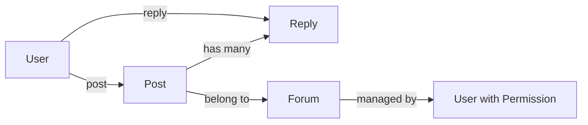

# 网上贴吧系统详细设计与具体代码实现

## 1. 背景介绍

在当今互联网时代,网上社区已成为人们交流、分享信息和观点的重要平台。其中,贴吧是一种非常流行的网上社区形式。贴吧为用户提供了一个基于共同兴趣爱好的交流空间,用户可以在贴吧中发布帖子、回复帖子、分享资源等。

本文将详细介绍如何从零开始设计和实现一个完整的网上贴吧系统。我们将从需求分析入手,系统地阐述贴吧系统的架构设计、数据库设计、核心功能模块设计与实现、性能优化等方面。同时,文章还将给出贴吧系统的关键代码实现,并分析系统在实际应用场景中的优势和挑战。

## 2. 核心概念与联系

在贴吧系统中,有几个核心概念需要理解:

- 用户(User):贴吧的参与者,可以浏览帖子、发布帖子、回复帖子等。
- 帖子(Post):用户在贴吧发布的内容,包括标题、正文、图片、附件等。
- 回复(Reply):用户对帖子的回应,可以是纯文本,也可以包含图片等多媒体内容。
- 版块(Forum):贴吧的子板块,通常按照不同的主题分类。每个版块可以包含多个帖子。
- 权限(Permission):不同用户在贴吧中的权限不同,如普通用户、版主、管理员等。

下面是贴吧系统核心概念的 Mermaid 关系图:



## 3. 核心算法原理具体操作步骤

贴吧系统涉及的核心算法主要包括:

### 3.1 帖子排序算法

帖子排序直接影响用户的浏览体验。常见的帖子排序算法有:

1. 按发帖时间排序:最新发布的帖子排在最前面。
2. 按回复时间排序:最近回复的帖子排在最前面。
3. 按热度排序:根据帖子的浏览量、回复量、点赞量等指标计算帖子的热度,热度高的帖子排在前面。

以按热度排序为例,具体算法步骤如下:

1. 对每个帖子,根据其浏览量 v、回复量 r、点赞量 l,计算热度得分 H:
$$ H = w_1 * v + w_2 * r + w_3 * l $$
其中 $w_1, w_2, w_3$ 为各指标的权重系数。

2. 对所有帖子的热度得分 H 进行排序,H值大的帖子排在前面。
3. 在展示时,可以选取热度前 N 的帖子,或者热度大于某个阈值的帖子。

### 3.2 内容过滤算法

为营造良好的社区氛围,贴吧需要对用户发布的内容进行审核过滤。内容过滤算法可以采用如下策略:

1. 关键词过滤:设置敏感词库,对帖子标题和内容进行匹配,如果包含敏感词则进行屏蔽或替换。
2. 机器学习文本分类:训练文本分类模型,对帖子内容进行分类,判断其是否属于违规内容。
3. 用户举报:允许用户对违规帖子进行举报,再由管理员进行人工复核。

以关键词过滤为例,具体步骤如下:

1. 建立敏感词库,将各类敏感词(如色情、暴力、政治等)录入到词库中。
2. 对词库中的词进行预处理,如去重、添加变形、添加同义词等,提高匹配的覆盖率。
3. 对帖子内容进行分词,得到词序列。
4. 对词序列中的每个词在敏感词库中进行匹配,如果匹配到则将对应内容进行屏蔽或替换。
5. 返回过滤后的帖子内容。

## 4. 数学模型和公式详细讲解举例说明

在贴吧系统中,可以用数学模型来刻画用户行为、帖子热度等特征。下面以用户影响力模型为例进行说明。

用户影响力指用户在贴吧中的活跃度和贡献度,可以用于用户等级、排名等功能。假设用户影响力由以下几个指标决定:

- 发帖数:用户发布的主题帖数量,记为 $P$。
- 回复数:用户回复其他帖子的数量,记为 $R$。
- 被回复数:用户的帖子被其他用户回复的数量,记为 $B$。
- 点赞数:用户获得的点赞数,记为 $L$。

我们可以定义用户影响力得分 $I$ 为:

$$I = w_1 * \log(1+P) + w_2 * \log(1+R) + w_3 * \log(1+B) + w_4 * \log(1+L)$$

其中 $w_1, w_2, w_3, w_4$ 为各指标的权重系数,可以根据实际情况进行调整。取对数是为了平滑各指标的数值差异。

举例说明:假设用户 A 的发帖数为10,回复数为20,被回复数为5,点赞数为100;用户 B 的发帖数为5,回复数为50,被回复数为10,点赞数为200。权重系数取 $w_1=1, w_2=0.5, w_3=2, w_4=0.2$。则:

- 用户 A 的影响力得分为:
$$ I_A = 1*\log(1+10) + 0.5*\log(1+20) + 2*\log(1+5) + 0.2*\log(1+100) = 6.19 $$

- 用户 B 的影响力得分为:
$$ I_B = 1*\log(1+5) + 0.5*\log(1+50) + 2*\log(1+10) + 0.2*\log(1+200) = 7.17 $$

可见用户 B 的影响力得分更高。这个模型可以根据贴吧的实际需求进行改进,如加入时间衰减因子等。

## 5. 项目实践:代码实例和详细解释说明

下面给出贴吧系统的一些关键功能的代码实现(以Java为例)。

### 5.1 发布帖子

```java
@PostMapping("/post")
public Result createPost(@RequestBody Post post, HttpSession session) {
    User user = (User) session.getAttribute("user");
    post.setAuthor(user);
    post.setCreateTime(new Date());
    post.setUpdateTime(new Date());
    postService.addPost(post);
    return Result.success();
}
```

说明:
- 通过 `@PostMapping` 注解将方法映射到 `/post` 路径的 POST 请求。
- 从 `@RequestBody` 中获取前端传来的帖子数据,从 `HttpSession` 中获取当前登录用户。
- 设置帖子的作者、创建时间、更新时间等属性。
- 调用 `postService` 的 `addPost` 方法将帖子插入数据库。
- 返回成功的响应结果。

### 5.2 删除帖子

```java
@DeleteMapping("/post/{postId}")
public Result deletePost(@PathVariable Long postId, HttpSession session) {
    User user = (User) session.getAttribute("user");
    Post post = postService.getPostById(postId);
    if (post.getAuthor().getId().equals(user.getId())) {
        postService.deletePost(postId);
        return Result.success();
    } else {
        return Result.failure("无权限删除");
    }
}
```

说明:
- 通过 `@DeleteMapping` 注解将方法映射到 `/post/{postId}` 路径的 DELETE 请求。
- 从路径变量中获取要删除的帖子 ID,从 `HttpSession` 中获取当前登录用户。
- 检查当前用户是否是帖子的作者,如果是则允许删除,否则返回无权限的错误。
- 调用 `postService` 的 `deletePost` 方法将帖子从数据库中删除。

### 5.3 查看帖子列表

```java
@GetMapping("/forum/{forumId}")
public Result listPostsByForum(@PathVariable Long forumId, @RequestParam(defaultValue = "1") Integer pageNum) {
    PageHelper.startPage(pageNum, 20);
    List<Post> posts = postService.listPostsByForum(forumId);
    return Result.success(posts);
}
```

说明:
- 通过 `@GetMapping` 注解将方法映射到 `/forum/{forumId}` 路径的 GET 请求。
- 从路径变量中获取版块 ID,从请求参数中获取分页页码,默认为第1页。
- 调用 `PageHelper` 进行分页查询,每页20条记录。
- 调用 `postService` 的 `listPostsByForum` 方法根据版块 ID 查询其下的帖子列表。
- 将帖子列表封装到 `Result` 中返回。

## 6. 实际应用场景

贴吧系统可以应用于多种实际场景,例如:

- 企业内部论坛:供员工交流、分享工作经验、讨论问题的平台。
- 校园BBS:供学生交流学习、生活、娱乐等信息的平台。
- 游戏论坛:供游戏玩家交流心得、攻略、找队友的平台。
- 垂直社区:如育儿社区、汽车社区等,供志同道合的人交流分享的平台。

不同场景下,贴吧系统需要根据实际需求进行定制化设计,如权限机制、内容审核标准、版块分类等。

## 7. 工具和资源推荐

开发贴吧系统可以使用的一些工具和资源:

- 后端框架:Spring Boot、Django、Express.js等。
- 前端框架:React、Vue.js、Angular等。
- 数据库:MySQL、PostgreSQL、MongoDB等。
- 缓存:Redis、Memcached等。
- 全文检索:Elasticsearch、Solr等。
- 消息队列:Kafka、RabbitMQ等。
- 云平台:阿里云、腾讯云、AWS等。

选择合适的技术栈可以大大提升开发效率和系统性能。

## 8. 总结:未来发展趋势与挑战

贴吧系统经过多年发展,已经相对成熟,但仍然存在一些挑战和机遇:

- 智能化:利用人工智能技术,实现智能推荐、智能审核、智能问答等功能,提升用户体验。
- 个性化:根据用户画像、行为数据进行个性化推荐和服务,满足用户的差异化需求。
- 移动化:随着移动互联网的普及,贴吧系统需要提供良好的移动端用户体验,如移动APP、小程序等。
- 社交化:加强用户之间的互动和链接,如好友系统、消息系统、话题系统等,提升用户粘性。
- 商业化:合理的商业模式对贴吧系统的长远发展至关重要,如广告、会员、电商等。
- 内容质量:提高内容质量是贴吧持续发展的核心,需要从内容生产、分发、消费等环节入手进行把控和激励。

未来,贴吧系统在巩固现有优势的同时,还需要积极拥抱新技术,探索创新模式,以满足用户日益增长的需求。

## 9. 附录:常见问题与解答

### 9.1 如何提高贴吧的活跃度?

可以采取以下措施:
- 发掘和培养核心用户,给予更多权限和激励。
- 举办有趣的活动,如投票、竞赛、热点讨论等。
- 优化推荐和搜索功能,让用户更容易找到感兴趣的内容。
- 提供实时互动功能,如在线聊天、语音/视频聊天等。

### 9.2 如何处理贴吧中的违规内容?

处理违规内容需要建立完善的内容审核机制:
- 制定明确的社区规范,对各类违规行为进行定义和说明。
- 完善违规内容的识别手段,如文本过滤、图片鉴黄、视频审核等。
- 建立违规内容的处理流程,如删帖、封号、人工复核等。
- 加强对版主和管理员的培训和监督,提高管理效率和水平。

### 9.3 贴吧系统如何进行性能优化?

可以从以下方